# ONNX车辆牌照识别系统

## 变更日志 (Changelog)

**2025-09-15 当前** - 正在进行supervision库可视化集成
- 分支: `001-supervision-plate-box`
- 状态: Phase 1设计阶段
- 目标: 使用supervision库替换utils/drawing.py自定义可视化功能
- 进展: 完成技术调研，正在设计API合约和数据模型

**2025-09-15 20:01:23 CST** - 初始化AI上下文架构，生成项目结构图和模块索引

---

## 项目愿景

基于ONNX模型的车辆和车牌识别系统，支持多种输入源（图像、视频、摄像头），提供高精度的车辆检测、车牌识别、字符OCR和颜色/层级分类功能。

## 架构概览

该项目采用模块化设计，分为推理引擎、工具集、第三方库和MCP集成四个主要层次：

- **核心推理引擎** (`infer_onnx/`): 多模型架构支持（YOLO、RT-DETR、RF-DETR）
- **工具与实用程序** (`utils/`, `tools/`): 图像处理、模型评估、调试工具
- **第三方集成** (`third_party/`): Ultralytics、Polygraphy、TensorRT优化
- **MCP扩展** (`mcp_vehicle_detection/`): 模型上下文协议集成

## 模块结构图

```mermaid
graph TD
    A["(根目录) ONNX车辆牌照识别系统"] --> B["infer_onnx"];
    A --> C["utils"];
    A --> D["tools"];
    A --> E["models"];
    A --> F["third_party"];
    A --> G["mcp_vehicle_detection"];
    A --> H["docs"];

    B --> B1["base_onnx.py - 基础推理引擎"];
    B --> B2["yolo_onnx.py - YOLO模型推理"];
    B --> B3["rtdetr_onnx.py - RT-DETR推理"];
    B --> B4["rfdetr_onnx.py - RF-DETR推理"];
    B --> B5["ocr_onnx.py - OCR与颜色分类"];

    C --> C1["pipeline.py - 处理管道"];
    C --> C2["drawing.py - 结果可视化"];
    C --> C3["image_processing.py - 图像预处理"];
    C --> C4["ocr_post_processing.py - OCR后处理"];

    D --> D1["eval.py - 模型评估"];
    D --> D2["build_engine.py - TensorRT构建"];
    D --> D3["compare_onnx_engine.py - 模型比较"];

    E --> E1["*.onnx - ONNX模型文件"];
    E --> E2["*.yaml - 配置文件"];
    E --> E3["*.engine - TensorRT引擎"];

    F --> F1["ultralytics - YOLO实现"];
    F --> F2["Polygraphy - NVIDIA调试工具"];
    F --> F3["rfdetr - RF-DETR实现"];

    G --> G1["server.py - MCP服务器"];
    G --> G2["main.py - 车辆检测服务"];

    click B "./infer_onnx/CLAUDE.md" "查看推理引擎模块文档"
    click C "./utils/CLAUDE.md" "查看工具模块文档"
    click D "./tools/CLAUDE.md" "查看调试工具文档"
    click E "./models/CLAUDE.md" "查看模型配置文档"
    click G "./mcp_vehicle_detection/CLAUDE.md" "查看MCP模块文档"
```



## 模块索引

| 模块路径 | 职责 | 入口文件 | 状态 |
|---------|------|----------|------|
| `infer_onnx/` | 核心推理引擎，多模型架构支持 | `__init__.py`, `infer_models.py` | ✅ 活跃 |
| `utils/` | 通用工具库，图像处理和可视化 | `__init__.py`, `pipeline.py` | ✅ 活跃 |
| `tools/` | 模型评估、调试和TensorRT工具 | `eval.py`, `build_engine.py` | ✅ 活跃 |
| `models/` | 模型文件和配置存储 | `det_config.yaml`, `plate.yaml` | ✅ 活跃 |
| `mcp_vehicle_detection/` | MCP协议集成车辆检测服务 | `server.py`, `main.py` | ✅ 活跃 |
| `third_party/` | 第三方库集成 | 各子模块独立 | ✅ 稳定 |
| `docs/` | 项目文档和使用指南 | `evaluation_guide.md` | ✅ 维护中 |

## 运行和开发

### 环境要求
- Python >= 3.10
- CUDA支持的GPU（推荐）
- TensorRT 8.6.x（可选，用于加速）
- supervision库（用于增强可视化，正在集成中）

### 安装依赖
```bash
# 使用pip（推荐uv包管理器）
pip install -r requirements.txt

# 或使用uv（推荐）
uv sync
```

### 基本使用
```bash
# 图像推理示例
python main.py --model-path models/rtdetr-2024080100.onnx --input data/sample.jpg --output-mode show

# 视频推理示例
bash run.sh  # 使用预配置的RF-DETR模型

# 摄像头实时推理
python main.py --model-path models/yolo11n.onnx --input 0 --output-mode show
```

### 模型类型支持
- **RT-DETR**: 实时DETR架构，平衡精度和速度
- **RF-DETR**: 增强RF-DETR，高精度检测
- **YOLO**: YOLOv8/v11系列，快速检测

## 测试策略

### 单元测试
- 推理引擎模块测试 (`infer_onnx/`)
- 图像处理工具测试 (`utils/`)
- OCR后处理逻辑测试

### 集成测试
- 端到端推理管道测试
- 多模型架构兼容性测试
- TensorRT引擎构建和推理测试

### 性能测试
- 模型推理延迟基准测试 (`tools/eval.py`)
- GPU内存使用率监控
- 批处理性能评估

## 编码标准

### Python代码规范
- 遵循PEP 8编码风格
- 使用类型提示 (Type Hints)
- 文档字符串采用Google风格

### 模型集成规范
- 所有模型推理类继承自 `BaseOnnx`
- 统一的配置文件格式（YAML）
- 标准化的后处理接口

### 错误处理
- 使用Python logging模块记录日志
- 关键路径添加异常处理
- 优雅的模型加载失败处理

## AI使用指南

### 代码分析
- 专注于推理引擎优化和多模型架构设计
- 重点关注 `infer_onnx/` 和 `utils/` 模块
- 理解ONNX模型加载和TensorRT优化流程

### 调试辅助
- 使用 `tools/` 目录下的调试工具
- 参考 `docs/polygraphy使用指南/` 进行深度调试
- 利用TensorRT Engine Explorer分析性能

### 功能扩展
- 新模型架构添加到 `infer_onnx/` 模块
- 图像处理功能扩展到 `utils/` 模块
- MCP协议扩展到 `mcp_vehicle_detection/` 模块

---

*最后更新: 2025-09-15 20:01:23 CST*