# ONNX车辆牌照识别系统

## 变更日志 (Changelog)

**2025-09-30 11:05:14 CST** - 完整初始化AI上下文架构
- 全面扫描项目结构，识别8个主要模块
- 生成完整的模块结构图和索引
- 创建/更新所有模块级CLAUDE.md文档
- 建立测试和规范(specs)文档体系
- 统计项目规模：100+ Python文件，覆盖核心推理、工具、测试和MCP集成

**2025-09-15 当前** - 正在进行supervision库可视化集成
- 分支: `001-supervision-plate-box`
- 状态: Phase 1设计阶段，已完成002-delete-old-draw重构
- 目标: 使用supervision库替换utils/drawing.py自定义可视化功能
- 进展: 完成技术调研，正在设计API合约和数据模型

**2025-09-15 20:01:23 CST** - 初始化AI上下文架构，生成项目结构图和模块索引

---

## 项目愿景

基于ONNX模型的车辆和车牌识别系统，支持多种输入源（图像、视频、摄像头），提供高精度的车辆检测、车牌识别、字符OCR和颜色/层级分类功能。该项目采用模块化架构设计，支持多种模型架构（YOLO、RT-DETR、RF-DETR），提供TensorRT加速优化，并通过MCP协议实现标准化服务集成。

## 架构概览

该项目采用模块化设计，分为推理引擎、工具集、第三方库、MCP集成和测试规范五个主要层次：

- **核心推理引擎** (`infer_onnx/`): 多模型架构支持（YOLO、RT-DETR、RF-DETR），基于Polygraphy懒加载
- **工具与实用程序** (`utils/`): 图像处理、模型评估、可视化工具
- **调试和优化工具** (`tools/`): TensorRT引擎构建、性能评估、精度调试
- **模型资源管理** (`models/`): ONNX模型文件、配置文件、TensorRT引擎
- **MCP服务扩展** (`mcp_vehicle_detection/`): 模型上下文协议标准化服务接口
- **第三方集成** (`third_party/`): Ultralytics、Polygraphy、RF-DETR、TRT Engine Explorer
- **测试和规范** (`tests/`, `specs/`): 单元测试、集成测试、性能测试、功能规范

## 模块结构图

```mermaid
graph TD
    A["(根目录) ONNX车辆牌照识别系统"] --> B["infer_onnx"];
    A --> C["utils"];
    A --> D["tools"];
    A --> E["models"];
    A --> F["third_party"];
    A --> G["mcp_vehicle_detection"];
    A --> H["docs"];
    A --> I["tests"];
    A --> J["specs"];
    A --> K["runs"];
    A --> L["data"];

    B --> B1["base_onnx.py - 基础推理引擎"];
    B --> B2["yolo_onnx.py - YOLO模型推理"];
    B --> B3["rtdetr_onnx.py - RT-DETR推理"];
    B --> B4["rfdetr_onnx.py - RF-DETR推理"];
    B --> B5["ocr_onnx.py - OCR与颜色分类"];
    B --> B6["infer_models.py - 模型工厂"];
    B --> B7["eval_coco.py - 数据集评估"];

    C --> C1["pipeline.py - 处理管道"];
    C --> C2["image_processing.py - 图像预处理"];
    C --> C3["ocr_post_processing.py - OCR后处理"];
    C --> C4["logging_config.py - 日志配置"];
    C --> C5["detection_metrics.py - 检测指标"];
    C --> C6["nms.py - 非极大值抑制"];

    D --> D1["eval.py - 模型评估"];
    D --> D2["build_engine.py - TensorRT构建"];
    D --> D3["compare_onnx_engine.py - 模型比较"];
    D --> D4["draw_engine.py - 引擎可视化"];
    D --> D5["layer_statistics.py - 层统计"];
    D --> D6["debug/ - 调试脚本集"];

    E --> E1["*.onnx - ONNX模型文件"];
    E --> E2["det_config.yaml - 检测配置"];
    E --> E3["plate.yaml - OCR配置"];
    E --> E4["*.engine - TensorRT引擎"];

    F --> F1["ultralytics - YOLO实现"];
    F --> F2["Polygraphy - NVIDIA调试工具"];
    F --> F3["rfdetr - RF-DETR实现"];
    F --> F4["trt-engine-explorer - 引擎分析"];

    G --> G1["server.py - MCP服务器"];
    G --> G2["main.py - 检测服务"];
    G --> G3["models/ - 数据模型"];
    G --> G4["services/ - 服务层"];
    G --> G5["mcp_utils/ - MCP工具"];

    H --> H1["evaluation_guide.md - 评估指南"];
    H --> H2["polygraphy使用指南/ - Polygraphy文档"];

    I --> I1["integration/ - 集成测试"];
    I --> I2["contract/ - 合约测试"];
    I --> I3["unit/ - 单元测试"];
    I --> I4["performance/ - 性能测试"];
    I --> I5["conftest.py - 测试配置"];

    J --> J1["001-supervision-plate-box/ - 可视化规范"];
    J --> J2["002-delete-old-draw/ - 重构规范"];

    K --> K1["rfdetr-*/  - 评估结果目录"];
    K --> K2["rtdetr-*/  - 评估结果目录"];
    K --> K3["*.json - 检测结果JSON"];

    L --> L1["sample.jpg - 示例数据"];

    click B "./infer_onnx/CLAUDE.md" "查看推理引擎模块文档"
    click C "./utils/CLAUDE.md" "查看工具模块文档"
    click D "./tools/CLAUDE.md" "查看调试工具文档"
    click E "./models/CLAUDE.md" "查看模型配置文档"
    click G "./mcp_vehicle_detection/CLAUDE.md" "查看MCP模块文档"
    click I "./tests/CLAUDE.md" "查看测试模块文档"
    click J "./specs/CLAUDE.md" "查看规范文档"
```



## 模块索引

| 模块路径 | 职责 | 入口文件 | 主要功能 | 状态 |
|---------|------|----------|---------|------|
| [`infer_onnx/`](./infer_onnx/CLAUDE.md) | 核心推理引擎 | `infer_models.py::create_detector()` | 多模型架构支持、OCR识别、颜色分类 | ✅ 活跃 |
| [`utils/`](./utils/CLAUDE.md) | 通用工具库 | `pipeline.py::process_frame()` | 图像处理、可视化、OCR后处理 | ✅ 活跃 |
| [`tools/`](./tools/CLAUDE.md) | 调试和优化 | `eval.py`, `build_engine.py` | 模型评估、TensorRT构建、性能分析 | ✅ 活跃 |
| [`models/`](./models/CLAUDE.md) | 模型资源 | `det_config.yaml`, `plate.yaml` | 模型文件、配置文件存储 | ✅ 活跃 |
| [`mcp_vehicle_detection/`](./mcp_vehicle_detection/CLAUDE.md) | MCP服务集成 | `server.py`, `main.py` | MCP协议车辆检测服务 | ✅ 活跃 |
| [`third_party/`](./third_party/CLAUDE.md) | 第三方集成 | 各子模块独立 | Ultralytics、Polygraphy、RF-DETR | ✅ 稳定 |
| [`docs/`](./docs/CLAUDE.md) | 项目文档 | `evaluation_guide.md` | 使用指南、Polygraphy文档 | ✅ 维护中 |
| [`tests/`](./tests/CLAUDE.md) | 测试体系 | `conftest.py` | 单元、集成、性能、合约测试 | ✅ 活跃 |
| [`specs/`](./specs/CLAUDE.md) | 功能规范 | 各规范独立 | 设计文档、API合约、任务计划 | ✅ 活跃 |
| `runs/` | 运行结果 | - | 评估结果、检测输出存储 | ✅ 自动生成 |
| `data/` | 数据资源 | - | 示例图像、测试数据 | ✅ 稳定 |

## 运行和开发

### 环境要求
```yaml
基础环境:
  - Python: ">= 3.10"
  - CUDA: "11.8+"
  - TensorRT: "8.6.1"

依赖管理:
  - uv: "推荐包管理器"
  - pip: "备用包管理器"
```

### 安装依赖
```bash
# 使用uv（推荐）
uv sync

# 或使用pip
pip install -r requirements.txt

# 安装MCP子项目依赖
cd mcp_vehicle_detection
uv sync
# 或
pip install -r requirements.txt
```

### 基本使用
```bash
# 图像推理示例
python main.py --model-path models/rtdetr-2024080100.onnx \
    --model-type rtdetr \
    --input data/sample.jpg \
    --output-mode show

# 视频推理示例（使用RF-DETR）
python main.py --model-path models/rfdetr-20250811.onnx \
    --model-type rfdetr \
    --input /path/to/video.mp4 \
    --output-mode save

# 摄像头实时推理
python main.py --model-path models/yolo11n.onnx \
    --model-type yolo \
    --input 0 \
    --output-mode show
```

### 模型评估
```bash
# COCO数据集评估
python tools/eval.py \
    --model-type rtdetr \
    --model-path models/rtdetr-2024080100.onnx \
    --dataset-path /path/to/coco \
    --conf-threshold 0.25 \
    --iou-threshold 0.7
```

### TensorRT引擎构建
```bash
# 构建FP16引擎
python tools/build_engine.py \
    --onnx-path models/rtdetr-2024080100.onnx \
    --engine-path models/rtdetr-2024080100.engine \
    --fp16

# 构建并对比精度
python tools/build_engine.py \
    --onnx-path models/rtdetr-2024080100.onnx \
    --compare
```

### MCP服务启动
```bash
# 启动MCP服务器
cd mcp_vehicle_detection
python server.py

# 快速测试
python quick_test.py
```

### 模型类型支持
| 模型架构 | 特点 | 输入尺寸 | 推荐场景 |
|---------|------|---------|---------|
| **RT-DETR** | 实时DETR，平衡精度和速度 | 640x640 | 通用检测 |
| **RF-DETR** | 增强RF-DETR，高精度检测 | 640x640 | 高精度需求 |
| **YOLO** | YOLOv8/v11系列，快速检测 | 640x640 | 实时性要求高 |

## 测试策略

### 测试体系架构
```
tests/
├── unit/          # 单元测试 - 功能组件测试
├── integration/   # 集成测试 - 端到端流程测试
├── contract/      # 合约测试 - API接口验证
├── performance/   # 性能测试 - 基准测试和性能分析
└── conftest.py    # 测试配置和fixtures
```

### 单元测试
- 推理引擎模块测试 (`infer_onnx/`)
- 图像处理工具测试 (`utils/`)
- OCR后处理逻辑测试
- 模型工厂函数测试

### 集成测试
```bash
# 运行集成测试
pytest tests/integration/ -v

# 测试覆盖:
# - test_pipeline_integration.py: 端到端推理管道
# - test_ocr_integration.py: OCR识别流程
# - test_supervision_only.py: Supervision库集成
```

### 合约测试
```bash
# 运行合约测试
pytest tests/contract/ -v

# 测试覆盖:
# - test_convert_detections_contract.py: 数据转换合约
# - test_draw_detections_contract.py: 可视化API合约
# - test_benchmark_contract.py: 性能基准合约
```

### 性能测试
```bash
# 运行性能基准测试
pytest tests/performance/ -v --benchmark-only

# 性能指标:
# - 模型推理延迟 (< 50ms for 640x640)
# - GPU内存使用 (< 2GB for batch_size=1)
# - 可视化渲染性能 (< 30ms for 20 objects)
```

## 编码标准

### Python代码规范
- **PEP 8**: 遵循PEP 8编码风格
- **类型提示**: 使用Python 3.10+类型提示
- **文档字符串**: Google风格docstring
- **命名约定**:
  - 类名: PascalCase (如 `BaseOnnx`)
  - 函数名: snake_case (如 `create_detector`)
  - 常量: UPPER_CASE (如 `RUN`)

### 模型集成规范
- 所有模型推理类继承自 `BaseOnnx`
- 实现 `predict()` 和 `postprocess()` 抽象方法
- 统一的配置文件格式（YAML）
- 标准化的后处理接口

### 错误处理
- 使用Python `logging` 模块记录日志
- 关键路径添加异常处理
- 优雅的模型加载失败处理
- 提供有意义的错误信息

### 日志规范
```python
# 使用colorlog彩色日志
from utils.logging_config import setup_logger
setup_logger(log_level='INFO')

# 日志级别:
# DEBUG - 详细调试信息
# INFO - 一般信息（默认）
# WARNING - 警告信息
# ERROR - 错误信息
# CRITICAL - 严重错误
```

## AI使用指南

### 代码分析
- **推理引擎优化**: 专注于 `infer_onnx/` 模块的多模型架构设计
- **图像处理**: 重点关注 `utils/` 模块的预处理和后处理流程
- **TensorRT优化**: 理解 `tools/build_engine.py` 的引擎构建流程
- **MCP集成**: 研究 `mcp_vehicle_detection/` 的服务化实现

### 调试辅助
- **Polygraphy工具**: 使用 `docs/polygraphy使用指南/` 进行深度调试
- **精度问题**: 利用 `tools/compare_onnx_engine.py` 对比ONNX和TensorRT
- **性能分析**: 使用 `tools/layer_statistics.py` 分析模型层性能
- **引擎检查**: 通过 `third_party/trt-engine-explorer/` 分析引擎结构

### 功能扩展
- **新模型架构**: 在 `infer_onnx/` 添加新的推理类
- **图像处理**: 扩展 `utils/` 模块的处理功能
- **MCP工具**: 在 `mcp_vehicle_detection/` 添加新的MCP工具
- **测试覆盖**: 在 `tests/` 添加对应的测试用例

### 规范驱动开发
- **功能设计**: 在 `specs/` 创建规范文档（参考001和002示例）
- **合约测试**: 在 `tests/contract/` 编写合约测试验证API
- **渐进实现**: 按照规范的Phase划分逐步实现功能

## 项目统计

### 代码规模
```
核心代码:
  - Python文件: 100+ 个
  - ONNX模型: 10+ 个
  - TensorRT引擎: 5+ 个
  - 配置文件: 100+ 个

测试覆盖:
  - 集成测试: 4个测试套件
  - 合约测试: 3个测试套件
  - 单元测试: 待扩展
  - 性能测试: 待扩展

文档体系:
  - 模块文档: 8个CLAUDE.md
  - 功能规范: 2个specs
  - 使用指南: 多个markdown文档
```

### 第三方依赖
```
核心库:
  - onnxruntime-gpu: 1.22.0
  - tensorrt: 8.6.1.post1
  - opencv-contrib-python: 4.12.0+
  - numpy: 2.2.6+
  - supervision: 0.26.1

工具库:
  - polygraphy: 0.49.26+
  - onnxslim: 0.1.65+
  - pyyaml: 6.0.2+
  - colorlog: 6.9.0+
```

## 常见问题

### Q: 如何选择合适的模型架构？
**A**:
- **实时性优先**: 选择YOLO系列（yolo11n.onnx）
- **精度优先**: 选择RF-DETR（rfdetr-20250811.onnx）
- **平衡需求**: 选择RT-DETR（rtdetr-2024080100.onnx）

### Q: TensorRT引擎构建失败怎么办？
**A**:
1. 检查ONNX模型兼容性（opset版本）
2. 验证TensorRT版本匹配（8.6.1）
3. 使用 `tools/build_engine.py --compare` 进行精度对比
4. 查看Polygraphy调试指南

### Q: 如何提高推理速度？
**A**:
1. 使用TensorRT引擎替代ONNX模型
2. 启用FP16精度 (`--fp16`)
3. 调整输入分辨率
4. 使用批处理推理
5. 确保GPU资源充足

### Q: OCR识别准确率低怎么改善？
**A**:
1. 检查车牌图像预处理质量
2. 调整OCR模型置信度阈值
3. 使用更大的OCR模型
4. 验证OCR字典完整性
5. 增加训练数据覆盖

### Q: 如何添加新的检测类别？
**A**:
1. 在 `models/det_config.yaml` 添加类别名称
2. 在 `visual_colors` 分配对应颜色
3. 重新训练或更新模型
4. 更新测试用例

---

*最后更新: 2025-09-30 11:05:14 CST*
*项目路径: `/home/tyjt/桌面/onnx_vehicle_plate_recognition/`*
