# CLAUDE.md

This file provides guidance to Claude Code (claude.ai/code) when working with code in this repository.

<!-- OPENSPEC:START -->
# OpenSpec Instructions

These instructions are for AI assistants working in this project.

Always open `@/openspec/AGENTS.md` when the request:
- Mentions planning or proposals (words like proposal, spec, change, plan)
- Introduces new capabilities, breaking changes, architecture shifts, or big performance/security work
- Sounds ambiguous and you need the authoritative spec before coding

Use `@/openspec/AGENTS.md` to learn:
- How to create and apply change proposals
- Spec format and conventions
- Project structure and guidelines

Keep this managed block so 'openspec update' can refresh the instructions.

<!-- OPENSPEC:END -->

## Project Overview

ONNX-based vehicle and license plate recognition system supporting multiple detection architectures (YOLO, RT-DETR, RF-DETR), OCR recognition, and color/layer classification. The project uses spec-driven development with OpenSpec and emphasizes modular design with strong abstraction patterns.

## Essential Commands

### Setup and Installation
```bash
# Install core dependencies (recommended: uv)
uv sync

# Install with TensorRT support (optional, 2-5x speedup)
# Requires NVIDIA PyPI source and local GPU environment
# 1. Uncomment pypi.nvidia.com in pyproject.toml [tool.uv] extra-index-url
# 2. Uncomment tensorrt packages in [project.optional-dependencies] trt
uv pip install pip setuptools wheel
uv pip install -e ".[trt]"

# Verify installation
python -c "import onnxtools; print('OK')"
```

### Running Inference
```bash
# Quick start with default model
./run.sh

# Image inference
python main.py \
    --model-path models/rtdetr-2024080100.onnx \
    --model-type rtdetr \
    --input data/sample.jpg \
    --output-mode show

# Video inference with frame skip
python main.py \
    --model-path models/yolo11n.onnx \
    --model-type yolo \
    --input video.mp4 \
    --source-type video \
    --output-mode save \
    --frame-skip 2

# Camera inference
python main.py \
    --model-path models/rtdetr.onnx \
    --model-type rtdetr \
    --input 0 \
    --source-type camera \
    --output-mode show
```

### Testing
```bash
# Run all tests
pytest

# Run specific test categories
pytest tests/unit/ -v                    # Unit tests
pytest tests/integration/ -v             # Integration tests
pytest tests/contract/ -v                # Contract tests
pytest tests/performance/ -v --benchmark-only  # Performance tests

# Run tests with coverage
pytest --cov=onnxtools --cov-report=html

# Run single test file
pytest tests/unit/test_ocr_metrics.py -v
```

### TensorRT Engine Building
```bash
# Build FP16 engine
python tools/build_engine.py \
    --onnx-path models/rtdetr.onnx \
    --engine-path models/rtdetr_fp16.engine \
    --fp16

# Build with accuracy comparison
python tools/build_engine.py \
    --onnx-path models/yolov8s_640.onnx \
    --compare

# Compare ONNX and TensorRT outputs
python tools/compare_onnx_engine.py \
    --onnx models/yolov8s_640.onnx \
    --engine models/yolov8s_640.engine
```

### Model Evaluation
```bash
# COCO dataset evaluation
python tools/eval.py \
    --model-type rtdetr \
    --model-path models/rtdetr.onnx \
    --dataset-path /path/to/coco \
    --conf-threshold 0.25 \
    --iou-threshold 0.7

# OCR dataset evaluation
python -m onnxtools.eval.eval_ocr \
    --label-file data/val.txt \
    --dataset-base data/ \
    --ocr-model models/ocr.onnx \
    --config configs/plate.yaml \
    --conf-threshold 0.5
```

### Polygraphy Debugging
```bash
# Inspect model structure
polygraphy inspect model models/yolov8s_640.onnx

# Run inference and save outputs
polygraphy run models/yolov8s_640.onnx \
    --onnxrt --save-outputs results.json

# Compare ONNX and TensorRT
polygraphy run models/yolov8s_640.onnx \
    --onnxrt --trt --compare
```

### MCP Server
```bash
# Install MCP support
uv pip install -e ".[mcp]"

# Start MCP server
onnxtools-mcp
# or
python -m mcp_tools.server
```

Claude Code 配置 (`~/.claude/settings.json`):
```json
{
  "mcpServers": {
    "onnxtools": {
      "command": "python",
      "args": ["-m", "mcp_tools.server"],
      "cwd": "/path/to/onnx_vehicle_plate_recognition"
    }
  }
}
```

### OpenSpec Workflow
```bash
# List active changes and specs
openspec list                  # Active changes
openspec list --specs          # Existing specs

# Show details
openspec show <change-id>      # Show change
openspec show <spec-id> --type spec  # Show spec

# Validate changes
openspec validate <change-id> --strict

# Archive after deployment
openspec archive <change-id> --yes
```

## Architecture

### Core Design Patterns

**Template Method Pattern (BaseORT)**
```python
# All inference classes inherit from BaseORT and implement:
class BaseORT(ABC):
    def __call__(self, img, **kwargs):
        # Template method orchestrating inference pipeline
        prepared = self._prepare_inference(img, **kwargs)
        outputs = self._execute_inference(prepared)
        return self._finalize_inference(outputs, **kwargs)

    @abstractmethod
    def _preprocess_static(img, **kwargs):
        # Must be implemented by subclasses
        pass

    @abstractmethod
    def _postprocess(outputs, **kwargs):
        # Must be implemented by subclasses
        pass
```

**Factory Pattern (Model Creation)**
```python
# Centralized model creation through factory function
from onnxtools import create_detector

detector = create_detector(
    model_type='rtdetr',  # 'yolo', 'rtdetr', 'rfdetr'
    onnx_path='models/rtdetr.onnx',
    conf_thres=0.5,
    iou_thres=0.5
)
```

**Lazy Loading (Polygraphy Integration)**
- ONNX Runtime sessions created on-demand
- TensorRT engines loaded lazily
- Reduces initialization time by 93% (800ms → 50ms)

### Module Structure Diagram

```mermaid
graph TD
    A["项目根目录"] --> B["onnxtools/"];
    A --> C["tools/"];
    A --> D["tests/"];
    A --> E["configs/"];
    A --> F["specs/"];
    A --> G["docs/"];
    A --> H["openspec/"];
    A --> I["models/"];
    A --> J["mcp_tools/"];

    B --> B1["infer_onnx/"];
    B --> B2["utils/"];
    B --> B3["eval/"];
    B --> B4["pipeline.py"];

    B1 --> B1A["onnx_base.py - BaseORT"];
    B1 --> B1B["onnx_yolo.py - YoloORT"];
    B1 --> B1C["onnx_rtdetr.py - RtdetrORT"];
    B1 --> B1D["onnx_rfdetr.py - RfdetrORT"];
    B1 --> B1E["onnx_ocr.py - OcrORT/ColorLayerORT"];
    B1 --> B1F["result.py - Result类"];

    B2 --> B2A["drawing.py - 可视化"];
    B2 --> B2B["supervision_annotator.py - 13种Annotators"];
    B2 --> B2C["supervision_preset.py - 5种预设"];
    B2 --> B2D["ocr_metrics.py - OCR评估指标"];

    B3 --> B3A["eval_coco.py - COCO评估"];
    B3 --> B3B["eval_ocr.py - OCR评估"];

    C --> C1["eval.py"];
    C --> C2["build_engine.py"];
    C --> C3["compare_onnx_engine.py"];
    C --> C4["eval_ocr.py"];

    D --> D1["unit/"];
    D --> D2["integration/"];
    D --> D3["contract/"];
    D --> D4["performance/"];

    E --> E1["det_config.yaml"];
    E --> E2["plate.yaml"];
    E --> E3["visualization_presets.yaml"];

    F --> F1["001-supervision-plate-box/"];
    F --> F2["002-delete-old-draw/"];
    F --> F3["003-add-more-annotators/"];
    F --> F4["004-refactor-colorlayeronnx-ocronnx/"];
    F --> F5["005-baseonnx-postprocess-call/"];
    F --> F6["006-make-ocr-metrics/"];

    G --> G1["polygraphy使用指南/"];
    G --> G2["evaluation_guide.md"];
    G --> G3["annotator_usage.md"];

    H --> H1["AGENTS.md"];
    H --> H2["project.md"];

    I --> I1["*.onnx模型"];
    I --> I2["*.engine引擎"];

    J --> J1["server.py - FastMCP服务器"];
    J --> J2["tools/ - MCP工具定义"];
    J --> J3["utils/ - 图像加载/模型管理"];

    click B "onnxtools/CLAUDE.md" "查看onnxtools模块文档"
    click B1 "onnxtools/infer_onnx/CLAUDE.md" "查看推理引擎文档"
    click B2 "onnxtools/utils/CLAUDE.md" "查看工具模块文档"
    click B3 "onnxtools/eval/CLAUDE.md" "查看评估模块文档"
    click D "tests/CLAUDE.md" "查看测试体系文档"
    click E "configs/CLAUDE.md" "查看配置文件文档"
    click F "specs/CLAUDE.md" "查看功能规范文档"
    click G "docs/CLAUDE.md" "查看项目文档"
    click H "openspec/CLAUDE.md" "查看OpenSpec系统文档"
    click I "models/CLAUDE.md" "查看模型资源文档"
    click J "mcp_tools/CLAUDE.md" "查看MCP服务器文档"
```



### Module Index

| 模块路径 | 名称 | 职责概述 | 文档 |
|---------|------|---------|------|
| `onnxtools/` | 核心Python包 | ONNX推理工具包,提供统一模型推理接口 | [CLAUDE.md](onnxtools/CLAUDE.md) |
| `onnxtools/infer_onnx/` | 推理引擎子模块 | YOLO/RT-DETR/RF-DETR推理、OCR识别、数据集评估 | [CLAUDE.md](onnxtools/infer_onnx/CLAUDE.md) |
| `onnxtools/utils/` | 工具函数子模块 | 图像处理、可视化、Supervision集成、OCR指标 | [CLAUDE.md](onnxtools/utils/CLAUDE.md) |
| `onnxtools/eval/` | 评估子模块 | COCO检测评估、OCR数据集评估 | [CLAUDE.md](onnxtools/eval/CLAUDE.md) |
| `tools/` | 调试优化工具 | 模型评估、TensorRT构建、性能分析 | [README.md](tools/README.md) |
| `tests/` | 测试体系 | 单元测试、集成测试、合约测试、性能测试 | [CLAUDE.md](tests/CLAUDE.md) |
| `configs/` | 配置文件 | 检测配置、OCR字典、可视化预设 | [CLAUDE.md](configs/CLAUDE.md) |
| `models/` | 模型资源 | ONNX模型、TensorRT引擎存储和管理 | [CLAUDE.md](models/CLAUDE.md) |
| `specs/` | 功能规范 | 规范驱动开发,功能设计和API合约 | [CLAUDE.md](specs/CLAUDE.md) |
| `openspec/` | 规范管理系统 | OpenSpec变更提案和规范归档 | [CLAUDE.md](openspec/CLAUDE.md) |
| `docs/` | 项目文档 | 使用指南、Polygraphy文档、API文档 | [CLAUDE.md](docs/CLAUDE.md) |
| `third_party/` | 第三方集成 | Ultralytics、Polygraphy、RF-DETR、TRT Explorer | [CLAUDE.md](third_party/CLAUDE.md) |
| `mcp_tools/` | MCP服务器 | Model Context Protocol服务器,LLM工具接口 | [CLAUDE.md](mcp_tools/CLAUDE.md) |

### Detailed Module Structure

```
onnxtools/                      # Core Python package
├── infer_onnx/                 # Inference engines
│   ├── onnx_base.py            # BaseORT abstract class (KEY)
│   ├── result.py               # Result检测结果类
│   ├── onnx_yolo.py            # YOLO implementation
│   ├── onnx_rtdetr.py          # RT-DETR implementation
│   ├── onnx_rfdetr.py          # RF-DETR implementation
│   ├── onnx_ocr.py             # OCR + Color/Layer classifier
│   └── infer_utils.py          # Inference utilities
│
├── eval/                       # Evaluation submodule
│   ├── eval_coco.py            # COCO dataset evaluator
│   └── eval_ocr.py             # OCR dataset evaluator
│
├── utils/                      # Utilities
│   ├── drawing.py              # Supervision-based visualization
│   ├── supervision_annotator.py # 13 annotator types (Factory)
│   ├── supervision_preset.py   # 5 visualization presets
│   ├── ocr_metrics.py          # OCR evaluation metrics
│   ├── image_processing.py     # Image preprocessing
│   ├── nms.py                  # Non-maximum suppression
│   └── logger.py               # Logging configuration
│
├── pipeline.py                 # Full inference pipeline
├── config.py                   # Configuration management
└── __init__.py                 # Public API exports

tools/                          # Debugging and optimization
├── eval.py                     # Model evaluation
├── eval_ocr.py                 # OCR evaluation
├── build_engine.py             # TensorRT engine builder
├── compare_onnx_engine.py      # ONNX vs TensorRT comparison
├── draw_engine.py              # Engine visualization
├── layer_statistics.py         # Layer statistics analysis
└── README.md                   # Tools documentation

tests/                          # Test suite
├── unit/                       # Component-level tests (62 tests)
├── integration/                # End-to-end tests (30 tests)
├── contract/                   # API contract tests (15 tests)
├── performance/                # Benchmark tests (2 tests)
├── fixtures/                   # Test data and fixtures
└── conftest.py                 # pytest configuration

specs/                          # Feature specifications (OpenSpec)
├── 001-supervision-plate-box/  # Supervision可视化集成 (In Progress)
├── 002-delete-old-draw/        # 旧版代码重构 (Completed)
├── 003-add-more-annotators/    # Annotators扩展 (Completed)
├── 004-refactor-colorlayeronnx-ocronnx/ # OCR重构 (Completed)
├── 005-baseonnx-postprocess-call/ # BaseORT优化 (Completed)
├── 006-make-ocr-metrics/       # OCR评估功能 (Completed)
└── CLAUDE.md                   # 规范模块文档

openspec/                       # OpenSpec system
├── AGENTS.md                   # AI助手指南
├── project.md                  # 项目约定
└── CLAUDE.md                   # OpenSpec系统文档

configs/                        # YAML configurations
├── det_config.yaml             # Detection classes and colors
├── plate.yaml                  # OCR dictionary and mappings
├── visualization_presets.yaml  # Supervision presets
└── CLAUDE.md                   # 配置文件文档

docs/                           # Project documentation
├── polygraphy使用指南/          # Polygraphy complete guide
├── evaluation_guide.md         # Model evaluation guide
├── annotator_usage.md          # Annotator usage guide
└── CLAUDE.md                   # Documentation module doc

models/                         # ONNX models and TensorRT engines (.gitignore)
└── CLAUDE.md                   # 模型资源文档

mcp_tools/                      # MCP Server for LLM integration
├── server.py                   # FastMCP server definition
├── models.py                   # Pydantic input/output models
├── config.py                   # Configuration constants
├── tools/                      # MCP tool implementations
│   ├── detection.py            # Detection tools
│   ├── ocr.py                  # OCR recognition tools
│   ├── classification.py       # Classification tools
│   └── visualization.py        # Visualization tools
├── utils/                      # Utility functions
│   ├── image_loader.py         # Image loading (file/URL/base64)
│   ├── model_manager.py        # Model lazy loading and caching
│   └── response_formatter.py   # Response formatting
└── CLAUDE.md                   # MCP module documentation
```

### Key Data Flows

**Detection Pipeline**
```
Input Image → BaseORT.__call__() → _preprocess_static()
    → ONNX/TensorRT Inference → _postprocess()
    → Result{boxes, scores, class_ids} → Supervision Converter
    → Annotator Pipeline → Rendered Image
```

**OCR Pipeline**
```
Detected Plate → OcrORT.__call__() → _process_plate_image_static()
    → ONNX Inference → CTC Decode → (text, confidence, char_scores)

Detected Plate → ColorLayerORT.__call__() → _preprocess_static()
    → ONNX Inference → Argmax → (color, layer, confidence)
```

## Critical Conventions

### Adding New Model Architecture

1. **Create inference class** in `onnxtools/infer_onnx/`:
```python
from onnxtools.infer_onnx.onnx_base import BaseORT

class NewModelORT(BaseORT):
    @staticmethod
    def _preprocess_static(img, input_shape, **kwargs):
        # Implement preprocessing
        return preprocessed_img

    def _postprocess(self, outputs, **kwargs):
        # Implement postprocessing
        return Result(boxes=..., scores=..., class_ids=...)
```

2. **Register in factory** (`onnxtools/__init__.py`):
```python
def create_detector(model_type, onnx_path, **kwargs):
    if model_type == 'newmodel':
        return NewModelORT(onnx_path, **kwargs)
```

3. **Add tests** in `tests/unit/` and `tests/integration/`

### OpenSpec Workflow for New Features

When adding features, architecture changes, or breaking changes:

1. **Search existing work**: `openspec list --specs`
2. **Create proposal**: Scaffold under `openspec/changes/<change-id>/`
   - `proposal.md` - What and why
   - `tasks.md` - Implementation checklist
   - `design.md` - Technical decisions (if needed)
   - Delta specs for affected capabilities
3. **Validate**: `openspec validate <change-id> --strict`
4. **Get approval** before implementation
5. **Implement** tasks sequentially, marking off in `tasks.md`
6. **Archive**: `openspec archive <change-id> --yes` after deployment

Skip proposals for: bug fixes, typos, dependency updates, configuration changes.

### Visualization Customization

**Using presets** (5 built-in):
```bash
# Standard: box corners + simple labels
--annotator-preset standard

# Debug: round box + confidence bar + detailed labels (OCR text visible)
--annotator-preset debug

# Lightweight: dot markers + small labels
--annotator-preset lightweight

# Privacy: boxes + blur plates
--annotator-preset privacy

# High contrast: filled regions + background dimming
--annotator-preset high_contrast
```

**Custom annotator combination**:
```python
from onnxtools.utils import AnnotatorFactory

factory = AnnotatorFactory()
annotators = [
    factory.create('round_box', roundness=0.4, thickness=3),
    factory.create('percentage_bar'),
    factory.create('rich_label')
]
```

Supported types: `box`, `round_box`, `box_corner`, `circle`, `triangle`, `ellipse`, `dot`, `color`, `background_overlay`, `halo`, `percentage_bar`, `blur`, `pixelate`

### Code Style and Testing

- **PEP 8** compliance
- **Type hints** required for all functions
- **Google-style docstrings**
- **Naming conventions**:
  - Classes: `PascalCase` (e.g., `BaseORT`)
  - Functions: `snake_case` (e.g., `create_detector`)
  - Constants: `UPPER_CASE`
- **Test requirements**:
  - Unit tests for new utilities/functions
  - Integration tests for new inference classes
  - Contract tests for API changes
  - Performance benchmarks for optimization claims

### Model Configuration

Detection models require `configs/det_config.yaml`:
```yaml
names:
  0: vehicle
  1: plate

visual_colors:
  0: [255, 0, 0]    # red for vehicle
  1: [0, 255, 0]    # green for plate
```

OCR models require `configs/plate.yaml`:
```yaml
plate_dict:
  character: "京沪津渝冀晋蒙辽吉黑苏浙皖闽赣鲁豫鄂湘粤桂琼川贵云藏陕甘青宁新0123456789ABCDEFGHJKLMNPQRSTUVWXYZ"

color_map:
  0: blue
  1: yellow
  2: white
  3: black
  4: green

layer_map:
  0: single
  1: double
```

## Important Implementation Details

### BaseORT Lifecycle
```python
# Initialization
detector = create_detector(...)  # Creates ONNX Runtime session immediately

# Inference (lazy TensorRT loading)
result = detector(image)         # Returns Result object, loads TensorRT if .engine file

# Cleanup (automatic)
del detector                     # ONNX Runtime session auto-cleanup
```

### Error Handling for Missing Abstractions
```python
# If subclass doesn't implement required methods:
raise NotImplementedError(
    f"{self.__class__.__name__} must implement _postprocess(). "
    f"See base class docstring for requirements."
)
```

### OCR Double-Layer Detection
```python
# Single-layer: 7-8 characters (e.g., "京A12345")
# Double-layer: 7-8 chars + separator (e.g., "京AF1234学")
result = ocr_model(plate_image, is_double_layer=True)
if result:
    text, conf, char_confs = result
```

### Polygraphy Lazy Loading
```python
# Import at class level (fast)
from polygraphy.backend.onnxrt import SessionFromOnnx

# Create session immediately in __init__ (cached for reuse)
self._onnx_session = onnxruntime.InferenceSession(
    onnx_path,
    providers=['CUDAExecutionProvider', 'CPUExecutionProvider']
)
```

## Performance Targets

- **Inference latency**: < 50ms (640x640, ONNX)
- **TensorRT speedup**: 2-5x vs ONNX
- **GPU memory**: < 2GB (batch_size=1)
- **Annotator rendering**: < 30ms (20 objects)
- **Test passing rate**: > 95%

## Documentation Structure

Each module has a `CLAUDE.md` with:
- Breadcrumb navigation (`[Root] > [onnxtools] > [module]`)
- Entry points and quick start
- External API documentation
- Data models
- Test coverage
- FAQ

Key docs:
- `onnxtools/CLAUDE.md` - Package overview
- `onnxtools/infer_onnx/CLAUDE.md` - Inference engines
- `onnxtools/utils/CLAUDE.md` - Utilities
- `onnxtools/eval/CLAUDE.md` - Evaluation tools
- `tests/CLAUDE.md` - Test system
- `configs/CLAUDE.md` - Configuration files
- `models/CLAUDE.md` - Model resources
- `specs/CLAUDE.md` - Feature specifications
- `docs/CLAUDE.md` - Project documentation
- `openspec/CLAUDE.md` - OpenSpec system
- `third_party/CLAUDE.md` - Third-party integrations
- `mcp_tools/CLAUDE.md` - MCP server integration
- `docs/polygraphy使用指南/` - Polygraphy debugging
- `README.md` - User-facing documentation

## Change Log

**2026-02-03** - MCP Server Documentation
- 添加 `mcp_tools/` 模块到 Module Index 和结构图
- 添加 MCP 服务器快速启动命令到 Essential Commands
- 文档覆盖率: 12/12个模块已有文档

**2025-11-07** - 模块文档完善更新
- 新增5个模块的完整CLAUDE.md文档:
  - `onnxtools/eval/CLAUDE.md` - 评估子模块文档
  - `configs/CLAUDE.md` - 配置文件模块文档
  - `models/CLAUDE.md` - 模型资源模块文档
  - `tests/CLAUDE.md` - 测试体系文档(大幅更新)
  - `openspec/CLAUDE.md` - OpenSpec系统文档
- 更新模块结构图,添加新文档链接
- 更新模块索引表,补齐所有模块文档链接
- 文档覆盖率提升至100% (11/11个模块已有文档)

**2025-11-07** - AI Context Initialization Update
- 更新 `.claude/index.json` 时间戳至 2025-11-07T16:22:31+08:00
- 添加 Mermaid 模块结构图,包含可点击链接导航
- 添加模块索引表(Module Index),清晰展示各模块职责和文档链接
- 识别缺失文档:onnxtools/eval/、configs/、models/、tests/、openspec/ 需要创建 CLAUDE.md
- 文档覆盖率:73% (8/11个模块已有文档)
- 测试覆盖:109个测试用例,96.6%通过率

**2025-11-05** - Major Architecture Update
- 核心代码迁移到 `onnxtools/` Python包,统一API接口
- 推理类重命名:`BaseOnnx` → `BaseORT`,`YoloOnnx` → `YoloORT` 等
- 新增 `Result` 类作为统一检测结果对象
- 新增 `create_detector()` 工厂函数,简化模型创建
- 完整的 `CLAUDE.md` 文档体系,包含模块级文档和面包屑导航
- 集成 OpenSpec 规范驱动开发流程

**2025-10-11** - Bug Fixes and Configuration
- TensorRT改为可选依赖组 `[trt]`,简化安装流程
- 修复OCR评估器JSON数组格式支持
- 新增12个单元测试用例,覆盖JSON数组边界情况

**2025-10-10** - OCR Evaluation Complete
- OCRDatasetEvaluator提供完整OCR性能评估
- 三大指标:完全准确率、归一化编辑距离、编辑距离相似度
- 表格对齐终端输出 + JSON导出格式
- 42个测试用例(11个合约 + 8个集成 + 23个单元)

**2025-10-09** - Core Refactoring Complete
- BaseORT抽象方法强制实现,`__call__`方法重构(代码减少83.3%)
- ColorLayerORT和OcrORT重构继承BaseORT,统一推理接口
- Polygraphy懒加载,初始化时间减少93% (800ms → 50ms)
- 单元测试100%通过,集成测试96.6%通过率

**2025-09-30** - Supervision Integration
- 13种annotator类型支持(边框、几何、填充、特效、隐私)
- 5种可视化预设场景(standard、debug、lightweight、privacy、high_contrast)
- AnnotatorFactory和AnnotatorPipeline组合模式
- 性能基准测试完成(75μs ~ 1.5ms)
- 移除旧版PIL绘图实现,完全迁移到Supervision库

---

Last updated: 2026-02-03

## Active Technologies
- Python 3.10+ + numpy>=2.2.6, opencv-contrib-python>=4.12.0, supervision==0.26.1
- ONNX Runtime GPU 1.22.0 + TensorRT 8.6.1 (optional, requires NVIDIA PyPI source)
- Polygraphy 0.49.26+ for debugging and optimization

## Recent Changes
- **MCP Server Integration**: Added `mcp_tools/` module for LLM tool interface via Model Context Protocol
- 001-baseort-result-third: Added Result class as unified detection result object
- Mermaid module structure diagram with clickable navigation
- Module Index table for clear module overview
- **Complete documentation coverage**: All 12 modules now have CLAUDE.md files
