# onnxtools - ONNX 车辆和车牌识别工具集

> 基于ONNX模型的高性能车辆和车牌识别系统，支持多种输入源（图像、视频、摄像头），提供高精度的车辆检测、车牌识别、字符OCR和颜色/层级分类功能。

[](https://www.python.org/)
[](https://onnxruntime.ai/)
[](https://developer.nvidia.com/tensorrt)
[](https://supervision.roboflow.com/)

本项目提供了一个使用ONNX模型的完整车辆和车牌识别流程。它可以在图像中检测车辆和车牌，并对每个检测到的车牌进行号码、颜色以及单双层属性的识别。

## 🎯 核心特性

### 多模型架构支持
- **RT-DETR**: 实时DETR架构，平衡精度和速度
- **RF-DETR**: 增强RF-DETR架构，高精度检测
- **YOLO v8/v11**: 快速检测，实时性能优异

### 全流程识别能力
- **多源输入**: 支持图像、视频文件和实时摄像头输入
- **车辆与车牌检测**: 使用ONNX模型高精度检测
- **车牌号码识别 (OCR)**: 深度学习OCR引擎，识别车牌字符
- **车牌属性识别**: 颜色分类（蓝/黄/绿等）+ 层级识别（单/双层）
- **专业可视化**: 集成Supervision库，提供工业级可视化效果（v0.26.1+）

### 性能与优化
- **TensorRT加速**: 支持TensorRT引擎构建，推理速度提升2-5倍
- **跳帧处理**: 实时视频流性能优化，支持自定义跳帧策略
- **ROI裁剪**: 感兴趣区域裁剪，减少无效计算
- **灵活独立**: 使用ONNX Runtime在本地运行，不依赖特定深度学习框架

### 开发工具链
- **Polygraphy调试**: NVIDIA官方调试工具集成，支持模型对比和优化
- **模型评估**: 完整的评估和基准测试工具（`tools/eval.py`）
- **规范驱动开发**: 基于Spec-Kit的功能规范管理（`specs/`）
- **详细输出**: 保存带边界框和识别结果的标注图像/视频，并提供结构化JSON文件

## 处理流程

```mermaid
graph TD
    A[开始] --> B{输入源是什么?};
    B -- 图片 --> C[读取图片];
    B -- 视频文件 --> D[打开视频文件];
    B -- 摄像头 --> E[打开摄像头];

    C --> F[处理帧];
    D --> G[循环读取视频帧];
    E --> G;

    G -- 有帧 --> H[处理帧];
    G -- 无帧 --> I[结束];

    H --> J{输出模式是什么?};
    F --> J;

    J -- 保存 --> K[写入结果图片/视频帧];
    J -- 显示 --> L[显示结果图片/视频帧];

    K --> M{还有更多帧?};
    L --> M;

    M -- 是 --> G;
    M -- 否 --> I;
```



## 安装指南

### 1. 克隆仓库
```bash
git clone https://github.com/your-username/onnxtools.git
cd onnxtools
```

### 2. 安装核心依赖

**方法1: 使用uv包管理器（推荐，更快）**
```bash
# 创建虚拟环境并安装核心依赖
uv sync

# 或使用pip安装
uv pip install -e .
```

**方法2: 使用pip**
```bash
# 创建虚拟环境（推荐）
python -m venv .venv
source .venv/bin/activate  # Linux/macOS
# 或 .venv\Scripts\activate  # Windows

# 安装依赖
pip install -r requirements.txt
```

### 3. 安装TensorRT支持（可选）

TensorRT可以将推理速度提升2-5倍，但安装较为复杂。如果不需要极致性能，可以跳过此步骤。

**使用uv安装TensorRT:**
```bash
# 步骤1: 安装构建依赖
uv pip install pip setuptools wheel

# 步骤2: 安装TensorRT可选依赖组
uv pip install -e ".[trt]"
```

**使用pip安装TensorRT:**
```bash
# 先确保pip是最新版本
pip install --upgrade pip setuptools wheel

# 安装TensorRT包
pip install tensorrt==8.6.1.post1 tensorrt-bindings==8.6.1 tensorrt-libs==8.6.1 \
    --extra-index-url https://pypi.nvidia.com
```

> **注意**: TensorRT需要CUDA 11.x+支持，且安装过程依赖特殊的构建配置。如果遇到安装问题，请参考[TensorRT官方安装指南](https://docs.nvidia.com/deeplearning/tensorrt/install-guide/index.html)。

### 环境要求

**必需:**
- Python >= 3.10
- 主要依赖:
  - `onnxruntime-gpu==1.22.0`
  - `supervision==0.26.1`
  - `opencv-contrib-python>=4.12.0`
  - `numpy>=2.2.6`
  - `pyyaml>=6.0.2`

**可选（TensorRT加速）:**
- CUDA 11.8+
- TensorRT 8.6.1
- NVIDIA GPU（算力 >= 6.0推荐）

## 使用方法

使用必要的参数运行主脚本。

### 命令行参数

-   `--model-path` (必需): 指向主 ONNX 检测模型文件的路径。
-   `--input`: 输入源的路径（图片/视频文件）或摄像头ID（例如 '0'）。 (默认: `data/sample.jpg`)
-   `--source-type`: 输入源的类型。可选值: `image`, `video`, `camera`。 (默认: `image`)
-   `--output-mode`: 输出模式。可选值: `save` (保存到文件), `show` (在窗口中显示)。 (默认: `save`)
-   `--frame-skip`: 在视频处理中跳过的帧数，用于性能优化。 (默认: `0`)
-   `--conf-thres`: 通用检测置信度阈值。 (默认: `0.5`)
-   `--iou-thres`: NMS的IoU阈值。 (默认: `0.5`)
-   `--roi-top-ratio`: 检测感兴趣区域（ROI）的顶部比例，范围 [0.0, 1.0]。默认值为 0.5，表示只检测图像的下半部分。
-   `--plate-conf-thres`: 专门用于车牌的置信度阈值 (如果未设置，则使用通用阈值)。
-   `--output-dir`: 保存输出结果（图像和 JSON）的目录。 (默认: `runs`)
-   `--color-layer-model`: 指向颜色和层分类 ONNX 模型的路径。 (默认: `models/color_layer.onnx`)
-   `--ocr-model`: 指向车牌 OCR ONNX 模型的路径。 (默认: `models/ocr.onnx`)
-   `--ocr-dict-yaml`: 指向 OCR 字符字典文件的路径。 (默认: `models/ocr_dict.yaml`)
-   `--save-frame`: (仅视频) 激活此选项可将每个处理过的原始帧保存为图像文件。
-   `--save-json`: (仅视频) 激活此选项可为每个处理过的帧保存一个包含检测结果的 JSON 文件。

### Python API 使用

项目提供了简洁的Python API，可以直接在代码中使用：

```python
from onnxtools import create_detector, setup_logger
import cv2

# 设置日志
setup_logger('INFO')

# 创建检测器（使用工厂函数）
detector = create_detector(
    model_type='rtdetr',  # 'yolo', 'rtdetr', 'rfdetr'
    onnx_path='models/rtdetr-2024080100.onnx',
    conf_thres=0.5,
    iou_thres=0.5
)

# 读取图像
image = cv2.imread('data/sample.jpg')

# 执行推理
results = detector(image)
boxes = results['boxes']      # [N, 4] xyxy格式
scores = results['scores']    # [N] 置信度
class_ids = results['class_ids']  # [N] 类别ID

# OCR识别示例
from onnxtools import OcrORT, ColorLayerORT
import yaml

# 加载配置
with open('configs/plate.yaml') as f:
    config = yaml.safe_load(f)

# 创建OCR模型
ocr_model = OcrORT(
    onnx_path='models/ocr.onnx',
    character=config['plate_dict']['character'],
    conf_thres=0.7
)

# 对检测到的车牌进行OCR
plate_image = image[int(boxes[0][1]):int(boxes[0][3]),
                    int(boxes[0][0]):int(boxes[0][2])]
result = ocr_model(plate_image)
if result:
    text, confidence, char_scores = result
    print(f"识别结果: {text}, 置信度: {confidence:.2f}")
```

### 快速开始示例

#### 处理单张图片并保存结果
```bash
# 使用YOLO模型
python main.py --model-path models/yolov8s_640.onnx --input data/sample.jpg --source-type image --output-mode save

# 使用RT-DETR模型（推荐）
python main.py --model-path models/rtdetr-2024080100.onnx --input data/sample.jpg --output-mode show
```

#### 处理本地视频并实时显示结果
```bash
# 使用RF-DETR模型（高精度）
bash run.sh  # 使用预配置的RF-DETR模型

# 自定义参数
python main.py --model-path models/rfdetr-2024072800.onnx --input /path/to/your/video.mp4 --source-type video --output-mode show
```

#### 使用摄像头进行实时识别
```bash
# 使用YOLO11（最快）
python main.py --model-path models/yolo11n.onnx --input 0 --source-type camera --output-mode show --frame-skip 2
```

#### 处理视频并保存完整结果
```bash
python main.py --model-path models/rtdetr-2024080100.onnx --input /path/to/your/video.mp4 --source-type video --output-mode save --save-frame --save-json
```

#### 使用TensorRT加速（需要先构建引擎）
```bash
# 构建TensorRT引擎
python tools/build_engine.py --onnx models/yolov8s_640.onnx --output models/yolov8s_640.engine

# 使用引擎推理（速度提升2-5倍）
python main.py --model-path models/yolov8s_640.engine --input data/sample.jpg --output-mode show
```

## 模型说明

本项目需要三种类型的 ONNX 模型，应放置在 `models/` 目录下：

1.  **检测模型**: 用于检测车辆和车牌的通用目标检测模型
    - 支持架构: YOLO v8/v11、RT-DETR、RF-DETR
    - 输入尺寸: 640x640（默认）
    - 输出格式: 边界框 + 置信度 + 类别ID

2.  **颜色与层模型 (`color_layer.onnx`)**: 分类模型，预测车牌颜色和单/双层属性
    - 输入尺寸: 48x168
    - 输出: 颜色类别（蓝/黄/白/黑/绿）+ 层级（单层/双层）

3.  **OCR 模型 (`ocr.onnx`)**: 光学字符识别模型，读取车牌号码
    - 输入尺寸: 48x320
    - 输出: 字符序列 + 置信度

### 配置文件

项目需要以下配置文件（位于 `configs/` 目录）：

- **`det_config.yaml`**: 检测模型配置
  ```yaml
  names:
    0: vehicle
    1: plate
  visual_colors:
    0: [255, 0, 0]  # 红色 - 车辆
    1: [0, 255, 0]  # 绿色 - 车牌
  ```

- **`plate.yaml`**: OCR字典和颜色/层级映射
  ```yaml
  plate_dict:
    character: "京沪津渝冀晋蒙辽吉黑苏浙皖闽赣鲁豫鄂湘粤桂琼川贵云藏陕甘青宁新0123456789ABCDEFGHJKLMNPQRSTUVWXYZ"

  color_map:
    0: blue
    1: yellow
    2: white
    3: black
    4: green

  layer_map:
    0: single
    1: double
  ```

- **`visualization_presets.yaml`**: Supervision可视化预设（可选）

## 📁 项目结构

```
onnx_vehicle_plate_recognition/
├── onnxtools/                      # 核心Python包
│   ├── __init__.py                 # 包入口，导出公共API
│   ├── pipeline.py                 # 完整推理管道
│   │
│   ├── infer_onnx/                 # 推理引擎子模块
│   │   ├── __init__.py
│   │   ├── onnx_base.py            # BaseORT抽象基类
│   │   ├── onnx_yolo.py            # YOLO模型推理 (YoloORT)
│   │   ├── onnx_rtdetr.py          # RT-DETR推理 (RtdetrORT)
│   │   ├── onnx_rfdetr.py          # RF-DETR推理 (RfdetrORT)
│   │   ├── onnx_ocr.py             # OCR和颜色分类 (OcrORT, ColorLayerORT)
│   │   ├── eval_coco.py            # COCO数据集评估器
│   │   ├── eval_ocr.py             # OCR数据集评估器
│   │   ├── infer_utils.py          # 推理辅助工具
│   │   ├── engine_dataloader.py   # TensorRT数据加载器
│   │   └── CLAUDE.md               # 推理引擎模块文档
│   │
│   └── utils/                      # 工具函数子模块
│       ├── __init__.py
│       ├── drawing.py              # Supervision可视化绘制
│       ├── annotator_factory.py   # Annotator工厂（13种类型）
│       ├── visualization_preset.py # 可视化预设（5种场景）
│       ├── supervision_converter.py # Supervision数据转换
│       ├── supervision_config.py   # Supervision配置
│       ├── supervision_labels.py   # 标签创建
│       ├── ocr_metrics.py          # OCR评估指标
│       ├── detection_metrics.py    # 检测指标计算
│       ├── nms.py                  # 非极大值抑制
│       ├── logging_config.py       # 日志配置
│       ├── font_utils.py           # 字体工具
│       ├── output_transforms.py    # 输出转换
│       └── CLAUDE.md               # 工具模块文档
│
├── configs/                        # 配置文件
│   ├── det_config.yaml             # 检测类别和颜色配置
│   ├── plate.yaml                  # OCR字典和映射配置
│   └── visualization_presets.yaml # 可视化预设配置
│
├── models/                         # 模型文件
│   ├── *.onnx                      # ONNX模型文件
│   └── *.engine                    # TensorRT引擎（可选）
│
├── tools/                          # 调试和优化工具
│   ├── eval.py                     # 模型评估脚本
│   ├── eval.sh                     # 评估快捷脚本
│   ├── build_engine.py             # TensorRT引擎构建
│   ├── build.sh                    # 构建快捷脚本
│   ├── compare_onnx_engine.py      # ONNX vs TensorRT对比
│   ├── draw_engine.py              # 引擎可视化
│   ├── layer_statistics.py         # 层统计分析
│   └── debug/                      # 调试脚本集
│
├── tests/                          # 测试体系
│   ├── unit/                       # 单元测试（62+用例）
│   ├── integration/                # 集成测试（30+套件）
│   ├── contract/                   # 合约测试（15+套件）
│   ├── performance/                # 性能测试（基准测试）
│   └── conftest.py                 # pytest配置和fixtures
│
├── specs/                          # 功能规范（OpenSpec）
│   ├── 001-supervision-plate-box/  # Supervision可视化集成
│   ├── 002-delete-old-draw/        # 旧版代码重构
│   ├── 003-add-more-annotators/    # 13种Annotators扩展
│   ├── 004-refactor-colorlayeronnx-ocronnx/ # OCR重构
│   ├── 005-baseonnx-postprocess-call/       # BaseORT优化
│   └── 006-make-ocr-metrics/       # OCR评估功能
│
├── openspec/                       # OpenSpec规范管理系统
│   ├── AGENTS.md                   # OpenSpec工作流指南
│   ├── project.md                  # 项目约定
│   ├── changes/                    # 活跃的变更提案
│   └── specs/                      # 能力规范定义
│
├── mcp_vehicle_detection/          # MCP协议服务（子项目）
│   ├── server.py                   # MCP服务器
│   ├── main.py                     # 检测服务入口
│   ├── models/                     # 数据模型
│   ├── services/                   # 服务层
│   └── mcp_utils/                  # MCP工具
│
├── third_party/                    # 第三方库集成
│   ├── ultralytics/                # YOLO参考实现
│   ├── Polygraphy/                 # NVIDIA调试工具
│   ├── rfdetr/                     # RF-DETR参考实现
│   └── trt-engine-explorer/        # TensorRT性能分析
│
├── docs/                           # 项目文档
│   ├── polygraphy使用指南/          # Polygraphy深度指南
│   ├── evaluation_guide.md         # 评估指南
│   └── annotator_usage.md          # Annotator使用文档
│
├── data/                           # 数据资源
│   └── sample.jpg                  # 示例图片
│
├── runs/                           # 运行输出（自动生成）
│   ├── result.jpg                  # 标注结果图片
│   └── result.json                 # 检测结果JSON
│
├── main.py                         # 主程序入口
├── run.sh                          # 快速运行脚本
├── pyproject.toml                  # 项目配置（uv）
├── requirements.txt                # Python依赖列表
├── CLAUDE.md                       # AI助手开发指南
└── README.md                       # 用户文档（本文件）
```

**关键变更说明**：
- 核心代码已迁移到 `onnxtools/` Python包，提供统一的API接口
- 推理类重命名：`BaseOnnx` → `BaseORT`，`YoloOnnx` → `YoloORT` 等
- 使用工厂函数 `create_detector()` 创建检测器实例
- 集成13种Supervision Annotators和5种可视化预设
- 完整的OpenSpec规范驱动开发流程
- 详细的模块文档系统（`CLAUDE.md` 文件）

详细的模块文档请参阅各目录下的 `CLAUDE.md` 文件。

## 输出结果

脚本会在指定的输出目录（默认为 `runs/`）中生成两个文件：

1.  **`result.jpg`**: 标注了所有检测对象边界框的输入图像。对于车牌，会显示识别出的车牌号码、颜色和层数。
2.  **`result.json`**: 一个 JSON 文件，包含每个检测目标的详细信息，包括：
    -   `box`: 边界框的坐标 `[x1, y1, x2, y2]`。
    -   `width`: 边界框的宽度。
    -   `height`: 边界框的高度。
    -   `confidence`: 检测置信度分数。
    -   `class_name`: 检测到的类别名称（例如 'plate'）。
    -   `plate_text`: 识别出的车牌号码。
    -   `plate_conf`: OCR 结果的置信度分数。
    -   `color`: 识别出的车牌颜色。
    -   `layer`: 识别出的车牌层类型。

### JSON 输出示例

```json
{
    "detections": [
        {
            "box": [420, 529, 509, 562],
            "width": 89,
            "height": 33,
            "confidence": 0.93,
            "class_id": 0,
            "class_name": "plate",
            "plate_text": "苏A88888",
            "plate_conf": 0.95,
            "color": "blue",
            "layer": "single"
        }
    ]
}
```

## 🚀 高级功能

### TensorRT优化
使用TensorRT可以显著提升推理性能（2-5倍加速）：

```bash
# 构建FP16精度引擎
python tools/build_engine.py --onnx models/yolov8s_640.onnx --output models/yolov8s_640_fp16.engine --precision fp16

# 构建INT8精度引擎（需要校准数据）
python tools/build_engine.py --onnx models/yolov8s_640.onnx --output models/yolov8s_640_int8.engine --precision int8 --calib-dir data/calibration/
```

### 模型评估与基准测试
使用内置评估工具进行性能分析：

```bash
# 运行评估脚本
python tools/eval.py --model-path models/rtdetr-2024080100.onnx --test-dir data/test/ --conf-thres 0.5

# 对比ONNX和TensorRT性能
python tools/compare_onnx_engine.py --onnx models/yolov8s_640.onnx --engine models/yolov8s_640.engine
```

### Polygraphy调试
使用NVIDIA Polygraphy工具进行深度调试：

```bash
# 检查模型结构
polygraphy inspect model models/yolov8s_640.onnx

# 运行推理并保存输出
polygraphy run models/yolov8s_640.onnx --onnxrt --save-outputs results.json

# 对比两个模型输出
polygraphy run models/yolov8s_640.onnx --onnxrt --trt --compare
```

详细的Polygraphy使用指南请参阅 `docs/polygraphy使用指南/`。

### MCP协议集成
启动MCP服务进行远程推理：

```bash
# 启动MCP服务器
cd mcp_vehicle_detection
python server.py --port 8080

# 使用服务进行推理
curl -X POST http://localhost:8080/detect -F "image=@data/sample.jpg"
```

## 📊 性能指标

基于NVIDIA RTX 4090 GPU的性能基准测试：

| 模型架构 | 输入尺寸 | ONNX推理 | TensorRT FP16 | TensorRT INT8 | 准确率(mAP) |
|---------|---------|---------|---------------|---------------|------------|
| YOLO11n | 640x640 | 3.2ms   | 1.8ms         | 1.2ms         | 0.85       |
| YOLOv8s | 640x640 | 4.5ms   | 2.1ms         | 1.5ms         | 0.88       |
| RT-DETR | 640x640 | 6.8ms   | 3.2ms         | 2.3ms         | 0.91       |
| RF-DETR | 640x640 | 8.1ms   | 3.8ms         | 2.7ms         | 0.93       |

*注：性能数据仅供参考，实际性能取决于硬件配置和输入数据。*

## 📝 变更日志

### [2025-11-05] - 架构重构和文档更新
- **架构**: 核心代码迁移到 `onnxtools/` Python包，统一API接口
- **重命名**: 推理类 `BaseOnnx` → `BaseORT`，`YoloOnnx` → `YoloORT` 等
- **工厂模式**: 新增 `create_detector()` 工厂函数，简化模型创建
- **文档**: 完整的 `CLAUDE.md` 文档体系，包含模块级文档和面包屑导航
- **OpenSpec**: 集成OpenSpec规范驱动开发流程

### [2025-10-11] - Bug修复和配置优化
- **修复**: OCR评估器支持JSON数组格式label文件
- **配置**: TensorRT改为可选依赖 `[trt]`，简化安装流程
- **安装**: 创建便捷安装脚本和验证脚本
- **测试**: 新增12个单元测试用例，覆盖JSON数组边界情况

### [2025-10-10] - OCR评估功能完成
- **评估器**: OCRDatasetEvaluator提供完整OCR性能评估
- **指标**: 完全准确率、归一化编辑距离、编辑距离相似度
- **输出**: 表格对齐终端输出 + JSON导出格式
- **测试**: 42个测试用例（11个合约 + 8个集成 + 23个单元）

### [2025-10-09] - 核心重构完成
- **BaseORT**: 抽象方法强制实现，`__call__`方法重构（代码减少83.3%）
- **OCR重构**: ColorLayerORT和OcrORT继承BaseORT，统一推理接口
- **性能**: Polygraphy懒加载，初始化时间减少93% (800ms → 50ms)
- **测试**: 单元测试100%通过，集成测试96.6%通过率

### [2025-09-30] - Supervision集成和Annotators扩展
- **Annotators**: 13种annotator类型支持（边框、几何、填充、特效、隐私）
- **预设**: 5种可视化预设场景（standard、debug、lightweight、privacy、high_contrast）
- **工厂**: AnnotatorFactory和AnnotatorPipeline组合模式
- **性能**: 完成性能基准测试（75μs ~ 1.5ms）
- **重构**: 移除旧版PIL绘图实现，完全迁移到Supervision库

### [2025-09-16]
- **新增**: Supervision库集成车辆牌照识别可视化系统
- **文档**: 完成功能规范、任务生成和各模块的完整文档

### [2025-09-15]
- **优化**: 更新工具链和对比策略
- **文档**: 更新Polygraphy API指南和调试工具文档

### [2025-09-10]
- **更新**: 调试工具和ONNX图分析工具增强

### [2025-09-08]
- **优化**: RT-DETR模型智能后处理
- **文档**: Polygraphy开发示例和Python API指南

### [2025-09-04]
- **修复**: TensorRT RTX处理逻辑优化

### [2025-09-01]
- **新增**: Polygraphy使用指南，包括API文档和FAQ
- **优化**: ONNX推理器和数据加载器，增强输入形状处理
- **重构**: 引擎构建和对比功能，增加参数配置和可视化支持

### [2025-08-29]
- **重构**: 仓库核心文件拆分和模块化

### [2025-08-28]
- **更新**: 使用Polygraphy（懒加载）重写ONNX Runtime会话部分

### [2025-08-27]
- **新增**: Claude Code Review工作流和PR助手工作流

### [2025-08-26]
- **文档**: 新增Polygraphy子命令使用指南
- **新增**: TensorRT工具集成和完善文档

## 🤝 贡献指南

欢迎提交Issue和Pull Request！在提交PR前，请确保：

1. **代码风格**: 遵循PEP 8编码规范
2. **类型提示**: 所有函数都包含类型提示
3. **文档字符串**: 使用Google风格的文档字符串
4. **测试**: 添加相应的单元测试和集成测试
5. **OpenSpec规范**: 对于新功能或架构变更，请先创建OpenSpec提案
   - 查看现有规范: `openspec list --specs`
   - 创建新提案: 在 `openspec/changes/<change-id>/` 下创建
   - 验证提案: `openspec validate <change-id> --strict`

### 开发文档

- **[CLAUDE.md](./CLAUDE.md)** - AI助手开发指南，包含架构设计、核心约定和常用命令
- **[onnxtools/CLAUDE.md](./onnxtools/CLAUDE.md)** - 核心Python包文档
- **[onnxtools/infer_onnx/CLAUDE.md](./onnxtools/infer_onnx/CLAUDE.md)** - 推理引擎模块文档
- **[onnxtools/utils/CLAUDE.md](./onnxtools/utils/CLAUDE.md)** - 工具函数模块文档
- **[openspec/AGENTS.md](./openspec/AGENTS.md)** - OpenSpec工作流指南

## 📄 许可证

本项目采用 MIT 许可证。详见 [LICENSE](LICENSE) 文件。

## 🔗 相关资源

- [ONNX Runtime 文档](https://onnxruntime.ai/docs/)
- [TensorRT 开发者指南](https://docs.nvidia.com/deeplearning/tensorrt/developer-guide/)
- [Supervision 库文档](https://supervision.roboflow.com/)
- [Polygraphy 工具指南](https://github.com/NVIDIA/TensorRT/tree/main/tools/Polygraphy)
- [项目详细文档](./docs/)

## 💬 支持与反馈

如果您在使用过程中遇到任何问题，请：

1. 查看 [FAQ文档](./docs/FAQ.md)
2. 搜索 [Issues](https://github.com/your-username/onnx_vehicle_plate_recognition/issues)
3. 提交新的Issue并附上详细的错误信息和复现步骤

---

**最后更新**: 2025-09-30 | **版本**: v2.0.0 | **作者**: yyq19990828