# onnxtools - ONNX 车辆和车牌识别工具集

> 基于ONNX模型的高性能车辆和车牌识别系统，支持多种输入源（图像、视频、摄像头），提供高精度的车辆检测、车牌识别、字符OCR和颜色/层级分类功能。

[](https://www.python.org/)
[](https://onnxruntime.ai/)
[](https://developer.nvidia.com/tensorrt)
[](https://supervision.roboflow.com/)

本项目提供了一个使用ONNX模型的完整车辆和车牌识别流程。它可以在图像中检测车辆和车牌，并对每个检测到的车牌进行号码、颜色以及单双层属性的识别。

## 🎯 核心特性

### 多模型架构支持
- **RT-DETR**: 实时DETR架构，平衡精度和速度
- **RF-DETR**: 增强RF-DETR架构，高精度检测
- **YOLO v8/v11**: 快速检测，实时性能优异

### 全流程识别能力
- **多源输入**: 支持图像、视频文件和实时摄像头输入
- **车辆与车牌检测**: 使用ONNX模型高精度检测
- **车牌号码识别 (OCR)**: 深度学习OCR引擎，识别车牌字符
- **车牌属性识别**: 颜色分类（蓝/黄/绿等）+ 层级识别（单/双层）
- **专业可视化**: 集成Supervision库，提供工业级可视化效果（v0.26.1+）

### 性能与优化
- **TensorRT加速**: 支持TensorRT引擎构建，推理速度提升2-5倍
- **跳帧处理**: 实时视频流性能优化，支持自定义跳帧策略
- **ROI裁剪**: 感兴趣区域裁剪，减少无效计算
- **灵活独立**: 使用ONNX Runtime在本地运行，不依赖特定深度学习框架

### 开发工具链
- **Polygraphy调试**: NVIDIA官方调试工具集成，支持模型对比和优化
- **模型评估**: 完整的评估和基准测试工具（`tools/eval.py`）
- **规范驱动开发**: 基于Spec-Kit的功能规范管理（`specs/`）
- **详细输出**: 保存带边界框和识别结果的标注图像/视频，并提供结构化JSON文件

## 处理流程

```mermaid
graph TD
    A[开始] --> B{输入源是什么?};
    B -- 图片 --> C[读取图片];
    B -- 视频文件 --> D[打开视频文件];
    B -- 摄像头 --> E[打开摄像头];

    C --> F[处理帧];
    D --> G[循环读取视频帧];
    E --> G;

    G -- 有帧 --> H[处理帧];
    G -- 无帧 --> I[结束];

    H --> J{输出模式是什么?};
    F --> J;

    J -- 保存 --> K[写入结果图片/视频帧];
    J -- 显示 --> L[显示结果图片/视频帧];

    K --> M{还有更多帧?};
    L --> M;

    M -- 是 --> G;
    M -- 否 --> I;
```



## 安装指南

### 1. 克隆仓库
```bash
git clone https://github.com/your-username/onnxtools.git
cd onnxtools
```

### 2. 安装核心依赖

**方法1: 使用uv包管理器（推荐，更快）**
```bash
# 创建虚拟环境并安装核心依赖
uv sync

# 或使用pip安装
uv pip install -e .
```

**方法2: 使用pip**
```bash
# 创建虚拟环境（推荐）
python -m venv .venv
source .venv/bin/activate  # Linux/macOS
# 或 .venv\Scripts\activate  # Windows

# 安装依赖
pip install -r requirements.txt
```

### 3. 安装TensorRT支持（可选）

TensorRT可以将推理速度提升2-5倍，但安装较为复杂。如果不需要极致性能，可以跳过此步骤。

**使用uv安装TensorRT:**
```bash
# 步骤1: 安装构建依赖
uv pip install pip setuptools wheel

# 步骤2: 安装TensorRT可选依赖组
uv pip install -e ".[trt]"
```

**使用pip安装TensorRT:**
```bash
# 先确保pip是最新版本
pip install --upgrade pip setuptools wheel

# 安装TensorRT包
pip install tensorrt==8.6.1.post1 tensorrt-bindings==8.6.1 tensorrt-libs==8.6.1 \
    --extra-index-url https://pypi.nvidia.com
```

> **注意**: TensorRT需要CUDA 11.x+支持，且安装过程依赖特殊的构建配置。如果遇到安装问题，请参考[TensorRT官方安装指南](https://docs.nvidia.com/deeplearning/tensorrt/install-guide/index.html)。

### 环境要求

**必需:**
- Python >= 3.10
- 主要依赖:
  - `onnxruntime-gpu==1.22.0`
  - `supervision==0.26.1`
  - `opencv-contrib-python>=4.12.0`
  - `numpy>=2.2.6`
  - `pyyaml>=6.0.2`

**可选（TensorRT加速）:**
- CUDA 11.8+
- TensorRT 8.6.1
- NVIDIA GPU（算力 >= 6.0推荐）

## 使用方法

使用必要的参数运行主脚本。

### 命令行参数

-   `--model-path` (必需): 指向主 ONNX 检测模型文件的路径。
-   `--input`: 输入源的路径（图片/视频文件）或摄像头ID（例如 '0'）。 (默认: `data/sample.jpg`)
-   `--source-type`: 输入源的类型。可选值: `image`, `video`, `camera`。 (默认: `image`)
-   `--output-mode`: 输出模式。可选值: `save` (保存到文件), `show` (在窗口中显示)。 (默认: `save`)
-   `--frame-skip`: 在视频处理中跳过的帧数，用于性能优化。 (默认: `0`)
-   `--conf-thres`: 通用检测置信度阈值。 (默认: `0.5`)
-   `--iou-thres`: NMS的IoU阈值。 (默认: `0.5`)
-   `--roi-top-ratio`: 检测感兴趣区域（ROI）的顶部比例，范围 [0.0, 1.0]。默认值为 0.5，表示只检测图像的下半部分。
-   `--plate-conf-thres`: 专门用于车牌的置信度阈值 (如果未设置，则使用通用阈值)。
-   `--output-dir`: 保存输出结果（图像和 JSON）的目录。 (默认: `runs`)
-   `--color-layer-model`: 指向颜色和层分类 ONNX 模型的路径。 (默认: `models/color_layer.onnx`)
-   `--ocr-model`: 指向车牌 OCR ONNX 模型的路径。 (默认: `models/ocr.onnx`)
-   `--ocr-dict-yaml`: 指向 OCR 字符字典文件的路径。 (默认: `models/ocr_dict.yaml`)
-   `--save-frame`: (仅视频) 激活此选项可将每个处理过的原始帧保存为图像文件。
-   `--save-json`: (仅视频) 激活此选项可为每个处理过的帧保存一个包含检测结果的 JSON 文件。

### 快速开始示例

#### 处理单张图片并保存结果
```bash
# 使用YOLO模型
python main.py --model-path models/yolov8s_640.onnx --input data/sample.jpg --source-type image --output-mode save

# 使用RT-DETR模型（推荐）
python main.py --model-path models/rtdetr-2024080100.onnx --input data/sample.jpg --output-mode show
```

#### 处理本地视频并实时显示结果
```bash
# 使用RF-DETR模型（高精度）
bash run.sh  # 使用预配置的RF-DETR模型

# 自定义参数
python main.py --model-path models/rfdetr-2024072800.onnx --input /path/to/your/video.mp4 --source-type video --output-mode show
```

#### 使用摄像头进行实时识别
```bash
# 使用YOLO11（最快）
python main.py --model-path models/yolo11n.onnx --input 0 --source-type camera --output-mode show --frame-skip 2
```

#### 处理视频并保存完整结果
```bash
python main.py --model-path models/rtdetr-2024080100.onnx --input /path/to/your/video.mp4 --source-type video --output-mode save --save-frame --save-json
```

#### 使用TensorRT加速（需要先构建引擎）
```bash
# 构建TensorRT引擎
python tools/build_engine.py --onnx models/yolov8s_640.onnx --output models/yolov8s_640.engine

# 使用引擎推理（速度提升2-5倍）
python main.py --model-path models/yolov8s_640.engine --input data/sample.jpg --output-mode show
```

## 模型说明

本项目需要三种类型的 ONNX 模型，应放置在 `models/` 目录下：

1.  **检测模型**: 用于检测车辆和车牌的通用目标检测模型（例如 YOLO）。
2.  **颜色与层模型 (`color_layer.onnx`)**: 一个分类模型，接收裁剪后的车牌图像，并预测其颜色和单/双层属性。
3.  **OCR 模型 (`ocr.onnx`)**: 在处理后的车牌图像上执行光学字符识别（OCR）以读取车牌号码的模型。

您还需要在 `models/` 目录中提供相应的配置文件（`det_config.yaml`, `plate_color_layer.yaml`, `ocr_dict.yaml`）。

## 📁 项目结构

```
onnx_vehicle_plate_recognition/
├── infer_onnx/              # 核心推理引擎模块
│   ├── base_onnx.py         # 基础推理引擎抽象类
│   ├── yolo_onnx.py         # YOLO模型推理实现
│   ├── rtdetr_onnx.py       # RT-DETR模型推理实现
│   ├── rfdetr_onnx.py       # RF-DETR模型推理实现
│   ├── ocr_onnx.py          # OCR与颜色分类模型
│   └── infer_models.py      # 模型加载和管理
│
├── utils/                   # 工具库
│   ├── pipeline.py          # 处理管道协调器
│   ├── drawing.py           # Supervision库可视化（v0.26.1+）
│   ├── image_processing.py  # 图像预处理工具
│   └── ocr_post_processing.py # OCR后处理逻辑
│
├── tools/                   # 调试和评估工具
│   ├── eval.py              # 模型评估和基准测试
│   ├── build_engine.py      # TensorRT引擎构建工具
│   └── compare_onnx_engine.py # ONNX与TensorRT对比工具
│
├── models/                  # 模型文件和配置
│   ├── *.onnx               # ONNX模型文件
│   ├── *.engine             # TensorRT引擎文件（可选）
│   ├── det_config.yaml      # 检测模型配置
│   ├── plate.yaml           # 车牌配置
│   └── ocr_dict.yaml        # OCR字典
│
├── tests/                   # 测试体系
│   ├── integration/         # 集成测试
│   ├── contract/            # 合约测试
│   ├── unit/                # 单元测试
│   └── performance/         # 性能测试
│
├── specs/                   # 功能规范（Spec-Kit）
│   ├── 001-supervision-plate-box/  # Supervision库集成规范
│   └── 002-delete-old-draw/       # 旧版代码重构规范
│
├── mcp_vehicle_detection/   # MCP协议服务
│   ├── server.py            # MCP服务器实现
│   └── main.py              # 车辆检测服务入口
│
├── third_party/             # 第三方库集成
│   ├── ultralytics/         # YOLO实现
│   ├── Polygraphy/          # NVIDIA调试工具
│   ├── rfdetr/              # RF-DETR实现
│   └── trt-engine-explorer/ # TensorRT性能分析
│
├── docs/                    # 项目文档
│   ├── polygraphy使用指南/   # Polygraphy工具文档
│   └── evaluation_guide.md  # 模型评估指南
│
├── data/                    # 示例数据
│   └── sample.jpg           # 示例图片
│
├── runs/                    # 运行输出
│   ├── result.jpg           # 标注结果图片
│   └── result.json          # 结构化检测结果
│
├── main.py                  # 主程序入口
├── run.sh                   # 快速运行脚本
├── requirements.txt         # Python依赖
├── pyproject.toml           # 项目配置（uv包管理器）
└── README.md                # 项目文档
```

详细的模块文档请参阅各目录下的 `CLAUDE.md` 文件。

## 输出结果

脚本会在指定的输出目录（默认为 `runs/`）中生成两个文件：

1.  **`result.jpg`**: 标注了所有检测对象边界框的输入图像。对于车牌，会显示识别出的车牌号码、颜色和层数。
2.  **`result.json`**: 一个 JSON 文件，包含每个检测目标的详细信息，包括：
    -   `box`: 边界框的坐标 `[x1, y1, x2, y2]`。
    -   `width`: 边界框的宽度。
    -   `height`: 边界框的高度。
    -   `confidence`: 检测置信度分数。
    -   `class_name`: 检测到的类别名称（例如 'plate'）。
    -   `plate_text`: 识别出的车牌号码。
    -   `plate_conf`: OCR 结果的置信度分数。
    -   `color`: 识别出的车牌颜色。
    -   `layer`: 识别出的车牌层类型。

### JSON 输出示例

```json
{
    "detections": [
        {
            "box": [420, 529, 509, 562],
            "width": 89,
            "height": 33,
            "confidence": 0.93,
            "class_id": 0,
            "class_name": "plate",
            "plate_text": "苏A88888",
            "plate_conf": 0.95,
            "color": "blue",
            "layer": "single"
        }
    ]
}
```

## 🚀 高级功能

### TensorRT优化
使用TensorRT可以显著提升推理性能（2-5倍加速）：

```bash
# 构建FP16精度引擎
python tools/build_engine.py --onnx models/yolov8s_640.onnx --output models/yolov8s_640_fp16.engine --precision fp16

# 构建INT8精度引擎（需要校准数据）
python tools/build_engine.py --onnx models/yolov8s_640.onnx --output models/yolov8s_640_int8.engine --precision int8 --calib-dir data/calibration/
```

### 模型评估与基准测试
使用内置评估工具进行性能分析：

```bash
# 运行评估脚本
python tools/eval.py --model-path models/rtdetr-2024080100.onnx --test-dir data/test/ --conf-thres 0.5

# 对比ONNX和TensorRT性能
python tools/compare_onnx_engine.py --onnx models/yolov8s_640.onnx --engine models/yolov8s_640.engine
```

### Polygraphy调试
使用NVIDIA Polygraphy工具进行深度调试：

```bash
# 检查模型结构
polygraphy inspect model models/yolov8s_640.onnx

# 运行推理并保存输出
polygraphy run models/yolov8s_640.onnx --onnxrt --save-outputs results.json

# 对比两个模型输出
polygraphy run models/yolov8s_640.onnx --onnxrt --trt --compare
```

详细的Polygraphy使用指南请参阅 `docs/polygraphy使用指南/`。

### MCP协议集成
启动MCP服务进行远程推理：

```bash
# 启动MCP服务器
cd mcp_vehicle_detection
python server.py --port 8080

# 使用服务进行推理
curl -X POST http://localhost:8080/detect -F "image=@data/sample.jpg"
```

## 📊 性能指标

基于NVIDIA RTX 4090 GPU的性能基准测试：

| 模型架构 | 输入尺寸 | ONNX推理 | TensorRT FP16 | TensorRT INT8 | 准确率(mAP) |
|---------|---------|---------|---------------|---------------|------------|
| YOLO11n | 640x640 | 3.2ms   | 1.8ms         | 1.2ms         | 0.85       |
| YOLOv8s | 640x640 | 4.5ms   | 2.1ms         | 1.5ms         | 0.88       |
| RT-DETR | 640x640 | 6.8ms   | 3.2ms         | 2.3ms         | 0.91       |
| RF-DETR | 640x640 | 8.1ms   | 3.8ms         | 2.7ms         | 0.93       |

*注：性能数据仅供参考，实际性能取决于硬件配置和输入数据。*

## 📝 变更日志

### [2025-09-30] - 最新更新
- **重构**: 移除旧版PIL绘图实现，完全迁移到Supervision库 (#4)
- **完成**: Spec 001 - Supervision库可视化集成 (#3)
- **增强**: 更新规范工具链（Spec-Kit）研究和工具

### [2025-09-16]
- **新增**: Supervision库集成车辆牌照识别可视化系统
- **文档**: 完成功能规范、任务生成和各模块的完整文档

### [2025-09-15]
- **优化**: 更新工具链和对比策略
- **文档**: 更新Polygraphy API指南和调试工具文档

### [2025-09-10]
- **更新**: 调试工具和ONNX图分析工具增强

### [2025-09-08]
- **优化**: RT-DETR模型智能后处理
- **文档**: Polygraphy开发示例和Python API指南

### [2025-09-04]
- **修复**: TensorRT RTX处理逻辑优化

### [2025-09-01]
- **新增**: Polygraphy使用指南，包括API文档和FAQ
- **优化**: ONNX推理器和数据加载器，增强输入形状处理
- **重构**: 引擎构建和对比功能，增加参数配置和可视化支持

### [2025-08-29]
- **重构**: 仓库核心文件拆分和模块化

### [2025-08-28]
- **更新**: 使用Polygraphy（懒加载）重写ONNX Runtime会话部分

### [2025-08-27]
- **新增**: Claude Code Review工作流和PR助手工作流

### [2025-08-26]
- **文档**: 新增Polygraphy子命令使用指南
- **新增**: TensorRT工具集成和完善文档

## 🤝 贡献指南

欢迎提交Issue和Pull Request！在提交PR前，请确保：

1. **代码风格**: 遵循PEP 8编码规范
2. **类型提示**: 所有函数都包含类型提示
3. **文档字符串**: 使用Google风格的文档字符串
4. **测试**: 添加相应的单元测试和集成测试
5. **规范**: 对于新功能，请在`specs/`目录创建功能规范

详细的开发指南请参阅 `CLAUDE.md`。

## 📄 许可证

本项目采用 MIT 许可证。详见 [LICENSE](LICENSE) 文件。

## 🔗 相关资源

- [ONNX Runtime 文档](https://onnxruntime.ai/docs/)
- [TensorRT 开发者指南](https://docs.nvidia.com/deeplearning/tensorrt/developer-guide/)
- [Supervision 库文档](https://supervision.roboflow.com/)
- [Polygraphy 工具指南](https://github.com/NVIDIA/TensorRT/tree/main/tools/Polygraphy)
- [项目详细文档](./docs/)

## 💬 支持与反馈

如果您在使用过程中遇到任何问题，请：

1. 查看 [FAQ文档](./docs/FAQ.md)
2. 搜索 [Issues](https://github.com/your-username/onnx_vehicle_plate_recognition/issues)
3. 提交新的Issue并附上详细的错误信息和复现步骤

---

**最后更新**: 2025-09-30 | **版本**: v2.0.0 | **作者**: yyq19990828