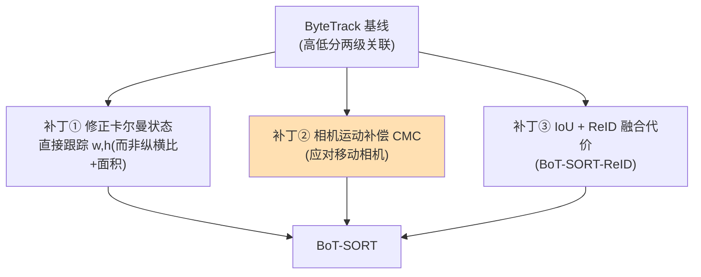
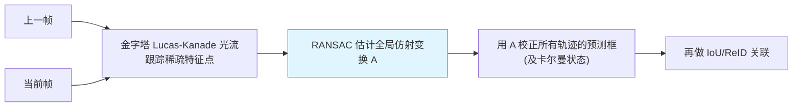
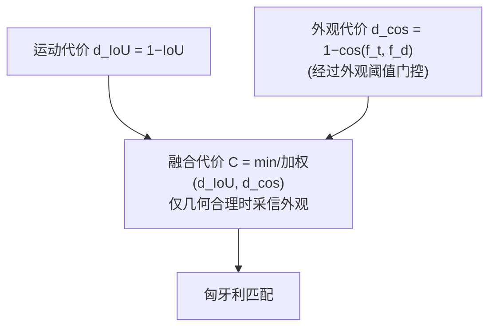
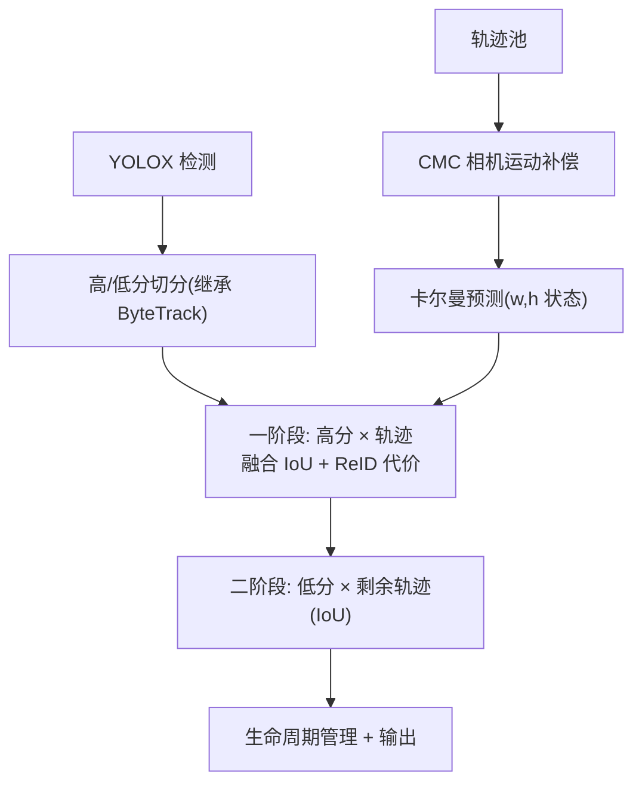

# BoT-SORT:相机运动补偿 + ReID 融合

> Aharon et al. *BoT-SORT: Robust Associations Multi-Pedestrian Tracking*. 2022. arXiv:[2206.14651](https://arxiv.org/abs/2206.14651) · 代码 [NirAharon/BoT-SORT](https://github.com/NirAharon/BoT-SORT)
>
> 📚 本方法仓库未实现,属进阶方向。可基于本仓库 [`bytetrack.py`](https://github.com/yyq19990828/onnxtools/blob/main/onnxtools/tracking/bytetrack.py) 扩展。

## 1. 定位:站在 ByteTrack 肩膀上的"三连补丁"

BoT-SORT 以 ByteTrack 为基线,针对它的三个短板各打一个补丁,发布时同时登顶 MOT17 与 MOT20 榜首:

## 2. 补丁①:更好的卡尔曼状态向量

SORT/ByteTrack 的状态用纵横比 $a$ + 高 $h$,纵横比变化会被错误建模。BoT-SORT 改为**直接跟踪宽 $w$ 和高 $h$**:

$$x = [c_x, c_y, w, h, \dot c_x, \dot c_y, \dot w, \dot h]^\top$$

实测能更准确地估计框尺寸变化,降低定位误差。

## 3. 补丁②:相机运动补偿 (CMC) —— 核心贡献

ByteTrack/OC-SORT 默认相机静止。但手持、车载、无人机视角下,**整幅画面都在动**,卡尔曼基于"上一帧框位置"的预测会系统性偏移。CMC 先估计**全局相机运动**,把上一帧的轨迹框"搬"到当前帧坐标系,再做关联。

具体:用金字塔 Lucas-Kanade 光流跟踪背景特征点,RANSAC 拟合全局仿射矩阵,作用到每条轨迹的预测均值与协方差上。这一步对车载/无人机场景几乎是必需的。

## 4. 补丁③:IoU 与 ReID 的融合代价(BoT-SORT-ReID)

DeepSORT 把外观和运动**简单加权**;BoT-SORT-ReID 提出更稳健的融合:取 IoU 代价与余弦外观代价的**逐元素最小值**思路,并对外观距离做阈值门控(只在外观足够近时才采信),避免相似外观误导。

## 5. 完整流程

## 6. 性能与局限

- **指标(MOT17 test)**:MOTA 80.5 / IDF1 80.2 / HOTA 65.0,发布时 MOT17、MOT20 双榜第一。
- **局限**:CMC 的光流估计带来额外开销;ReID 在 DanceTrack 这类**外观相同**场景仍难奏效;整体面向行人调参。

!!! tip "若要在本仓库复现 CMC"
    可在 `ByteTrackNative.update` 的 `STrack.multi_predict` 之后,插入一个仿射矩阵 warp 步骤作用到 `mean[:4]`,即可获得 BoT-SORT 的相机补偿能力,而无需改动关联主体。

## 参考文献

- Aharon et al. *BoT-SORT: Robust Associations Multi-Pedestrian Tracking*. arXiv:[2206.14651](https://arxiv.org/abs/2206.14651) · [代码](https://github.com/NirAharon/BoT-SORT)
- (基线)Zhang et al. *ByteTrack*. arXiv:[2110.06864](https://arxiv.org/abs/2110.06864)

→ 上一篇:[OC-SORT](ocsort.md) · 下一篇:[StrongSORT:让 DeepSORT 再次伟大](strongsort.md)
