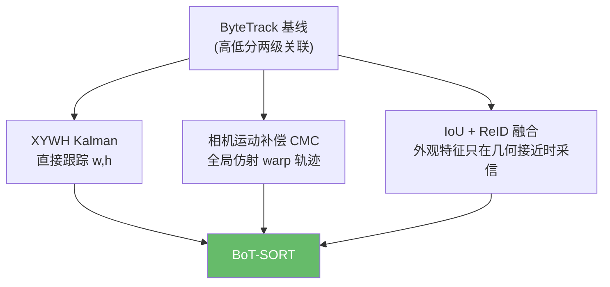

# BoT-SORT:相机运动补偿 + ReID 融合

> Aharon et al. *BoT-SORT: Robust Associations Multi-Pedestrian Tracking*. 2022. arXiv:[2206.14651](https://arxiv.org/abs/2206.14651) · 代码:[NirAharon/BoT-SORT](https://github.com/NirAharon/BoT-SORT)
>
> ✅ **本仓库原生实现**:[`onnxtools/tracking/botsort.py`](https://github.com/yyq19990828/onnxtools/blob/main/onnxtools/tracking/botsort.py) 的 `BoTSORT` + `BOTrack` + `CameraMotionCompensator`。

## 1. 定位:ByteTrack + CMC + ReID

BoT-SORT 以 ByteTrack 的高/低分两级关联为基线,针对移动相机和长遮挡加了两个工程上很实用的分支:



本仓库实现保留了检测器/跟踪器解耦:tracker 仍只吃 `supervision.Detections`。ReID 模型不内置,只接收外部 embedding,这样纯 tracking 安装不会强依赖 PyTorch、FastReID 或 ONNX Runtime。

## 2. 快速使用

纯运动版,不启用 CMC/ReID:

```python
from onnxtools.tracking import create_tracker

tracker = create_tracker("botsort", track_buffer=60, frame_rate=30)

for frame, detections in stream:
    tracked = tracker.update(detections, frame)
```

启用相机运动补偿:

```bash
uv pip install -e ".[tracking-cmc]"
```

```python
tracker = create_tracker("botsort", camera_motion=True, cmc_method="orb")
```

启用 ReID:

```python
tracker = create_tracker("botsort", with_reid=True)

# 每个检测一条 L2 可归一化的 embedding, shape=[N, D]
detections.data["features"] = reid_features
tracked = tracker.update(detections, frame)
```

也可以直接传编码器:

```python
tracker = create_tracker("botsort", with_reid=True, reid_encoder=my_encoder)
tracked = tracker.update(detections, frame)
```

`my_encoder(frame, xyxy)` 需要返回 `[N, D]` float embedding。本仓库会做 L2 normalize 和 track 级 EMA 平滑。

## 3. 相机运动补偿

`camera_motion=True` 时,`CameraMotionCompensator` 会用 OpenCV ORB 特征匹配 + RANSAC 估计上一帧到当前帧的全局仿射变换,并在一阶段关联前 warp 所有已预测轨迹框。第一帧、空特征或匹配不足时退化为 identity,不会影响静态相机场景。

适用:

- 车载、手持、无人机、云台抖动。
- 摄像头轻微晃动导致所有目标一起偏移。

不适用:

- 前景目标占满画面,背景特征很少。
- 滚动快门/强透视变化;这类最好在视频稳像或标定坐标系里解决。

## 4. ReID 融合逻辑

BoT-SORT-ReID 的一阶段代价是 IoU/fuse-score 与外观余弦距离的融合。本仓库采用保守门控:

- `proximity_thresh`:只有 IoU 足够近时才允许外观覆盖几何。
- `appearance_thresh`:余弦相似度过低时不采信外观。
- `class_aware=True`:行人/骑行者等类别不同则屏蔽匹配。

这避免了 ReID 在外观相似、检测框很远时强行拉错 ID。对你关注的行人、骑行者场景,建议先用 `botsort(camera_motion=True)` 跑一版,再叠加 ReID 对比 IDF1 / ID switches。

## 5. ReID 模型选型

你的目标主要是**行人、骑行者**。优先级建议如下:

| 选择 | 推荐模型 | 适合场景 | 取舍 |
|------|----------|----------|------|
| 首选工程基线 | Torchreid `osnet_ain_x1_0` 多源预训练 | 行人/骑行者通用起步,跨摄像头泛化更稳 | 轻量、易导出；骑行者含自行车时仍建议微调 |
| 轻量边缘版 | Torchreid `osnet_x0_25` / `osnet_x0_5` | CPU/Jetson 预算紧,只想降低 ID 碎片 | 精度低于 x1.0,但延迟和显存友好 |
| BoT-SORT 同源版 | FastReID / BoT-SORT `MOT17-SBS-S50` 或 `MOT20-SBS-S50` | 行人 MOT17/MOT20 风格数据,想贴近论文配置 | 依赖 FastReID/PyTorch 配置链,部署比 OSNet 重 |
| 精度优先 | FastReID `SBS(S50)` / `SBS(R50-ibn)` | 服务器侧、多人密集、可接受较重模型 | 特征质量强,但不是最轻部署路线 |
| 研究/高精度备选 | TransReID ViT-S/ViT-B | 遮挡、跨视角、追求榜单精度 | ViT 延迟和显存明显更高,边缘端不优先 |

资料入口:

- BoT-SORT 原仓库提供 MOT17/MOT20 的 SBS-S50 ReID 权重和训练入口:[NirAharon/BoT-SORT](https://github.com/NirAharon/BoT-SORT#model-zoo)。
- FastReID model zoo 提供 BoT/AGW/SBS 等 person ReID baseline 与下载链接:[JDAI-CV/fast-reid MODEL_ZOO](https://github.com/JDAI-CV/fast-reid/blob/master/MODEL_ZOO.md)。
- Torchreid OSNet model zoo 提供多源域泛化模型和小模型:[deep-person-reid MODEL_ZOO](https://github.com/KaiyangZhou/deep-person-reid/blob/master/docs/MODEL_ZOO.md)。
- TransReID 提供 person/vehicle ReID 训练配置和 ViT 系列路线:[damo-cv/TransReID](https://github.com/damo-cv/TransReID)。

工程建议:

1. 先用 `osnet_ain_x1_0` 多源预训练做基线,输入 crop resize 到 `256x128`,输出 embedding 后写入 `detections.data["features"]`。
2. 如果部署端吃不住,降到 `osnet_x0_25` 或 `osnet_x0_5`。
3. 如果视频主要是 MOT17/MOT20 式固定监控行人,试 `MOT17-SBS-S50`。
4. 如果“骑行者”检测框包含人+车,纯 person ReID 可能不稳定;收集本项目 crop 做少量微调通常比继续换大模型更有效。

## 6. 超参数搜索脚本

仓库提供了 BoT-SORT 的 MOT + 3Hz 代理视频搜索脚本:

```bash
.venv/bin/python tools/tracking/sweep_botsort_mot.py --skip-viz
```

默认行为:

- 检测模型沿用 RT-DETR 车辆/VRU 检测链路；如果默认 `vehicle_det_detr_batch4.onnx` 不在本机,会回退到 `vehicle_det_detr_batch1.onnx`。
- ReID 默认启用,使用小型 person OSNet ONNX: `models/reid/person/osnet/msmt17/osnet_x0_25_msmt17_combineall_256x128_amsgrad_ep150_stp60_lr0_Nx3x256x128.onnx`。
- 搜索 `track_high_thresh/new_track_thresh/match_thresh/track_buffer/appearance_thresh`，输出 `runs/botsort_sweep/result.json` 和 `REPORT.md`。
- 默认启用磁盘缓存,目录是 `runs/botsort_sweep/cache`；缓存内容是每帧检测框、置信度、ReID embedding 和图片路径,不保存原图。中途崩溃后重跑会复用已完成序列/视频的缓存。
- `--disable-reid` 可关闭 ReID 做运动版对照；`--camera-motion` 或 `--sweep-camera-motion` 可打开/搜索 CMC。

缓存控制:

```bash
.venv/bin/python tools/tracking/sweep_botsort_mot.py \
  --cache-dir runs/botsort_sweep/cache

.venv/bin/python tools/tracking/sweep_botsort_mot.py \
  --no-disk-cache
```

快速调试:

```bash
.venv/bin/python tools/tracking/sweep_botsort_mot.py \
  --skip-viz \
  --max-mot-frames 30 \
  --max-proxy 2
```

## 7. 参数建议

```python
tracker = create_tracker(
    "botsort",
    track_high_thresh=0.5,
    track_low_thresh=0.1,
    new_track_thresh=0.6,
    match_thresh=0.8,
    track_buffer=60,
    frame_rate=30,
    camera_motion=True,
    with_reid=True,
    appearance_thresh=0.25,
    proximity_thresh=0.5,
    class_aware=True,
)
```

调参顺序:

1. 检测置信度稳定后再调 tracker。
2. 移动相机先开 `camera_motion=True`。
3. 遮挡/交叉多时再加 ReID。
4. ID 断裂多:增大 `track_buffer`,适当放宽 `match_thresh`。
5. ID 交换多:收紧 `match_thresh` / 提高 `appearance_thresh` / 打开 `class_aware`。

## 参考文献

- Aharon et al. *BoT-SORT: Robust Associations Multi-Pedestrian Tracking*. arXiv:[2206.14651](https://arxiv.org/abs/2206.14651) · [代码](https://github.com/NirAharon/BoT-SORT)
- Zhang et al. *ByteTrack*. arXiv:[2110.06864](https://arxiv.org/abs/2110.06864)
- Zhou et al. *Omni-Scale Feature Learning for Person Re-Identification*. ICCV 2019 · [Torchreid](https://github.com/KaiyangZhou/deep-person-reid)

→ 上一篇:[OC-SORT](ocsort.md) · 下一篇:[StrongSORT:让 DeepSORT 再次伟大](strongsort.md)
