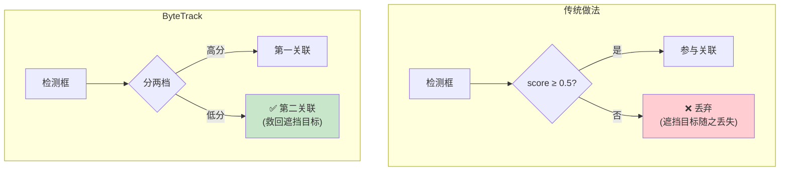
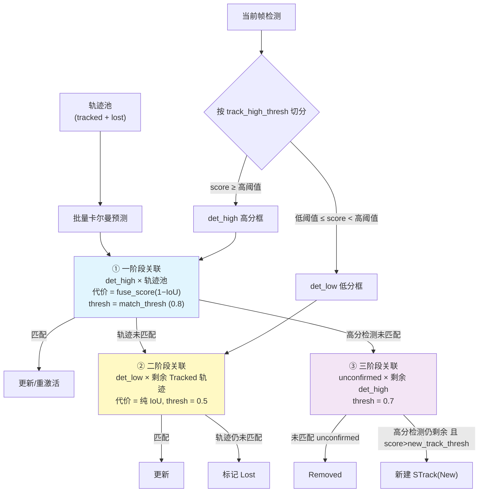
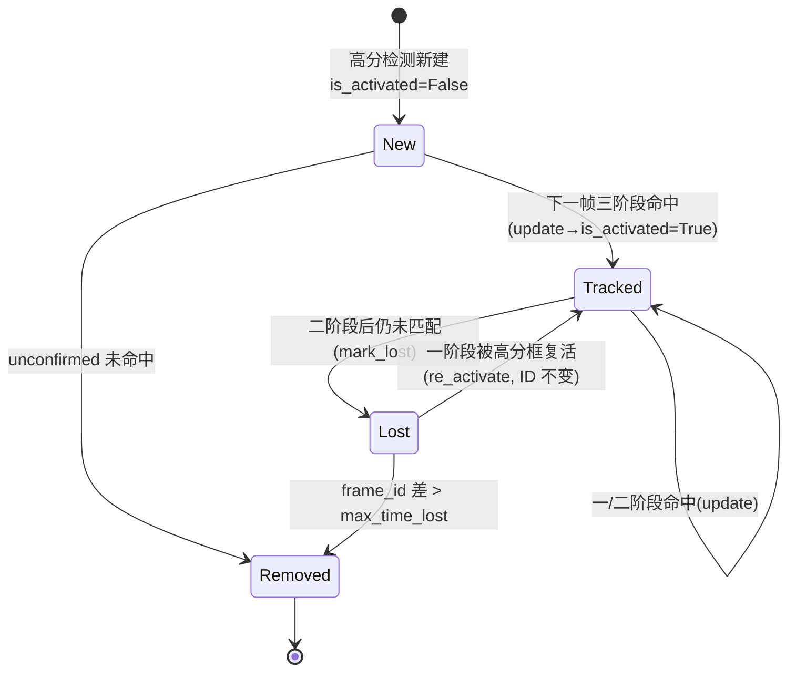

# ByteTrack:关联每一个检测框

> Zhang et al. *ByteTrack: Multi-Object Tracking by Associating Every Detection Box*. ECCV 2022. arXiv:[2110.06864](https://arxiv.org/abs/2110.06864) · 代码 [FoundationVision/ByteTrack](https://github.com/FoundationVision/ByteTrack)
>
> ✅ **本仓库原生实现**:[`onnxtools/tracking/bytetrack.py`](https://github.com/yyq19990828/onnxtools/blob/main/onnxtools/tracking/bytetrack.py) 的 `ByteTrackNative`,严格对齐官方 `byte_tracker.py` 的 MOT17 SOTA 配置。下文边讲论文边对照代码。

## 1. 一句话核心:别扔掉低分框

绝大多数跟踪器(SORT/DeepSORT)只保留**高置信度**检测,直接丢弃低分框。但低分框往往不是误检,而是**被遮挡、运动模糊的真实目标**。ByteTrack 的洞见极其朴素却有效:

> **关联时使用每一个检测框(BYTE),而不是只用高分框。**

通过把"藏在低分框里的真目标"找回来,ByteTrack 大幅减少漏检和轨迹断裂——而且**完全不用外观特征**,纯靠卡尔曼运动 + IoU。



## 2. BYTE 关联:高低分两级匹配

把检测按阈值切成 `det_high`(高分)和 `det_low`(低分)两档,做**两级关联**:



### 三个阶段的设计动机

| 阶段 | 谁 × 谁 | 代价 / 阈值 | 为什么 |
|------|---------|-------------|--------|
| **① 一阶段** | 高分检测 × (Tracked + Lost) 全池 | `fuse_score(1−IoU)`,thresh `match_thresh=0.8` | 主关联;Lost 轨迹也参与,使遮挡后能用高分框直接复活 |
| **② 二阶段** | 低分检测 × 一阶段未匹配的 Tracked | 纯 IoU,thresh `0.5` | **BYTE 精髓**:用低分框救回被遮挡目标。低分框噪声大,所以**不**用 fuse_score、阈值更宽松 |
| **③ 三阶段** | unconfirmed 轨迹 × 一阶段剩余高分检测 | `fuse_score`,thresh `0.7` | 处理只活了一帧、尚未确认的新轨迹 |

!!! note "为什么二阶段不用 fuse_score?"
    `fuse_score` 把检测置信度乘进相似度(高分框更可信)。但低分框本就置信度低,再乘一次会把所有代价压向"禁止匹配"。所以二阶段**只用几何 IoU**,把"是不是真目标"的判断交给"它能否和一条已有轨迹的运动预测对上"。

## 3. 对照仓库代码:`ByteTrackNative.update`

下面把 [`bytetrack.py`](https://github.com/yyq19990828/onnxtools/blob/main/onnxtools/tracking/bytetrack.py) 的关键片段与论文步骤一一对应。

### 3.1 高低分切分

```python
# 按 track_high_thresh 切分高/低分(对应论文 BYTE 第一步)
remain_inds = scores >= self.track_high_thresh
inds_low = (scores >= self.track_low_thresh) & (scores < self.track_high_thresh)
detections_high = self._build_stracks(xyxy[remain_inds], ...)
detections_low  = self._build_stracks(xyxy[inds_low], ...)
```

### 3.2 批量预测 + 一阶段(fuse_score)

```python
strack_pool = _joint_tracks(tracked_stracks, self.lost_stracks)  # 注意 Lost 也进池
STrack.multi_predict(strack_pool)                                # 向量化卡尔曼批量预测

dists = self._iou_dist(strack_pool, detections_high)
if dists.size:
    dists = fuse_score(dists, dets_high_scores)                  # 分数融合
matches, u_track, u_det = linear_assignment(dists, thresh=self.match_thresh)
```

`fuse_score` 实现于 [`matching.py`](https://github.com/yyq19990828/onnxtools/blob/main/onnxtools/tracking/matching.py):`cost = 1 − (1−cost)·det_score`。检测越自信、IoU 越高,代价越低。

### 3.3 二阶段(低分框,纯 IoU,thresh=0.5)

```python
r_tracked = [strack_pool[i] for i in u_track
             if strack_pool[i].state == TrackState.Tracked]      # 仅 Tracked,不含 Lost
dists2 = self._iou_dist(r_tracked, detections_low)
matches2, u_track2, _ = linear_assignment(dists2, thresh=0.5)
for it in u_track2:                                              # 二阶段还匹配不上
    r_tracked[it].mark_lost()                                    # → Lost
```

### 3.4 三阶段 + 新轨迹双帧确认

```python
# ③ unconfirmed × 剩余高分检测
matches3, u_unc, u_det3 = linear_assignment(dists3, thresh=0.7)
for it in u_unc:
    unconfirmed[it].mark_removed()                               # 未确认就丢 → 删除

# 剩余高分检测里,score > new_track_thresh 的才新建
for inew in u_det3:
    track = detections_remaining[inew]
    if track.score < self.new_track_thresh:
        continue
    track.activate(self.kalman_filter, self.frame_id)            # New 态
```

`STrack.activate` 里 `is_activated = (frame_id == 1)`——**除第一帧外,新轨迹本帧不 emit,必须下一帧再被命中(`update` 里置 `is_activated=True`)才正式输出**。这就是"双帧确认",抑制误检鬼影。

### 3.5 Lost 缓冲区老化

```python
for track in self.lost_stracks:
    if self.frame_id - track.frame_id > self.max_time_lost:      # 超过 buffer
        track.mark_removed()
# buffer_size = int(frame_rate / 30.0 * track_buffer)
```

`track_buffer`(默认 30)结合帧率换算出最大失踪帧数,期间 Lost 轨迹保留 ID,一旦在一阶段被高分框重新命中即"原地复活",ID 不变。

## 4. STrack 状态机(仓库实现)



!!! tip "类别隔离 class_aware"
    本仓库扩展了官方未有的 `class_aware=True`:在 `_iou_dist` 中把跨类别位置的代价置为 `1e6`,实现按类别隔离匹配,适合车/人/牌多类共存场景。
    ```python
    if self.class_aware:
        mask = ca[:, None] != cb[None, :]
        cost = np.where(mask, 1e6, cost)   # 跨类禁止匹配
    ```

## 5. 关键超参数

| 标准参数 | supervision 别名 | 默认 | 含义 |
|----------|------------------|------|------|
| `track_high_thresh` | `track_activation_threshold` | 0.5 | 高/低分切分阈值 |
| `track_low_thresh` | — | 0.1 | 低分下限,更低视为背景 |
| `new_track_thresh` | (派生) | 0.6 | 新建轨迹的分数门槛 |
| `match_thresh` | `minimum_matching_threshold` | 0.8 | 一阶段代价上限 |
| `track_buffer` | `lost_track_buffer` | 30 | Lost 最大保留帧数 |
| `frame_rate` | `frame_rate` | 30 | 用于换算 buffer 帧数 |
| `class_aware` | — | False | 是否按类别隔离匹配(仓库扩展) |

```python
from onnxtools.tracking import create_tracker
tracker = create_tracker("bytetrack_native", track_buffer=60, frame_rate=30, class_aware=True)
```

## 6. 性能与局限

- **指标(MOT17 test, YOLOX 检测)**:MOTA 80.3 / IDF1 77.3 / HOTA 63.1,单 V100 ~30 FPS。MOT20 亦强(MOTA ~77.8)。
- **本仓库性能**:200 持续目标 / 1080p,~7-8 ms/帧(>100 FPS)。
- **局限**:
    - 无外观建模,**强依赖检测器质量**;
    - 低分阈值是敏感超参;
    - **面向行人/近线性运动**——在 DanceTrack 这类非线性、外观相似场景上明显弱于 OC-SORT(下一篇)。


## 参考文献

- Zhang et al. *ByteTrack: Multi-Object Tracking by Associating Every Detection Box*. ECCV 2022. arXiv:[2110.06864](https://arxiv.org/abs/2110.06864) · [代码](https://github.com/FoundationVision/ByteTrack)

→ 上一篇:[传统方法总结](traditional-methods.md) · 下一篇:[OC-SORT:观测中心化](ocsort.md)
