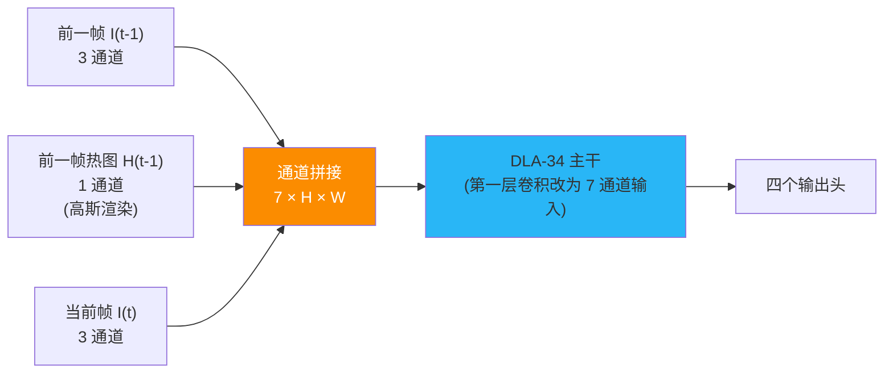
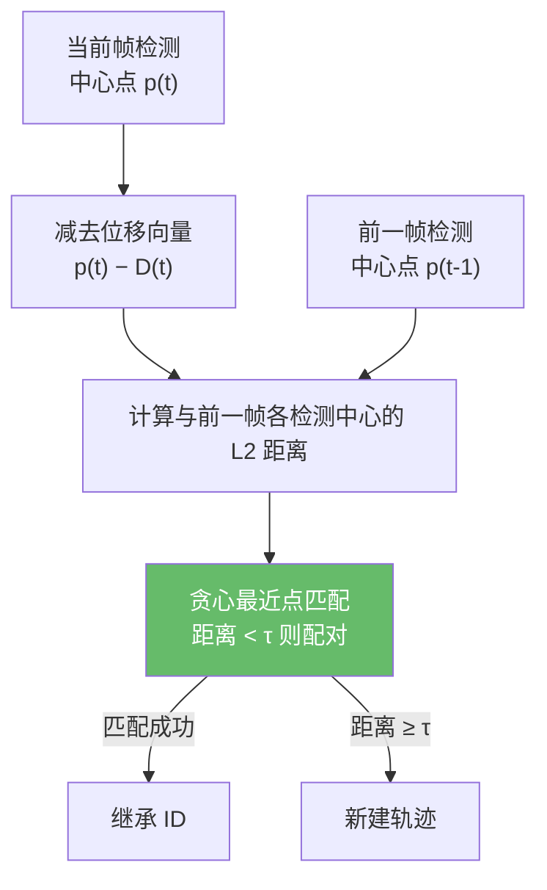
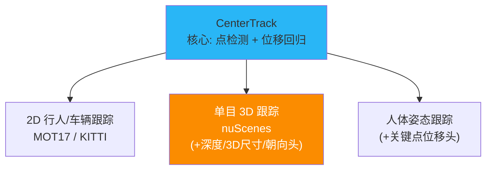

# CenterTrack:把目标当成点来跟踪

> Zhou et al. *Tracking Objects as Points*. ECCV 2020. arXiv:[2004.01177](https://arxiv.org/abs/2004.01177) · 代码 [xingyizhou/CenterTrack](https://github.com/xingyizhou/CenterTrack)
>
> 📚 本方法仓库未实现,属知识体系补全。本仓库走解耦的 tracking-by-detection 范式。

## 1. 一句话核心:不要 ReID,不要匈牙利,用位移向量做贪心关联

JDE/FairMOT 走"检测 + 外观嵌入 + 匈牙利匹配"路线,仍需维护 ReID 分支。CenterTrack 另辟蹊径:网络同时输入**当前帧 + 前一帧 + 前一帧检测热图**,直接回归每个目标中心相对上一帧中心的**位移向量**;关联只需按位移做**贪心最近点匹配**——无外观嵌入、无匈牙利算法。

## 2. 条件化跟踪:三输入架构

### 2.1 输入设计

CenterTrack 的关键创新在于**条件化输入**——网络不仅看当前帧,还看"过去发生了什么":

| 输入通道 | 维度 | 内容 |
|----------|------|------|
| 当前帧 $I^{(t)}$ | $3 \times H \times W$ | 当前 RGB 图像 |
| 前一帧 $I^{(t-1)}$ | $3 \times H \times W$ | 前一帧 RGB 图像 |
| 前一帧检测热图 $H^{(t-1)}$ | $1 \times H \times W$ | 用前一帧检测结果渲染的高斯热图 |

三者沿通道维拼接,形成 $7 \times H \times W$ 的输入张量。热图通道告诉网络"上一帧的目标在哪",让当前帧的检测和位移回归有了时序上下文。

### 2.2 四个输出头

网络在 DLA-34 主干之上接四个并行的预测头:

1. **中心热图** $\hat{Y}^{(t)}$:$C \times H/4 \times W/4$,C 为类别数,预测当前帧目标中心;
2. **框尺寸** $\hat{S}^{(t)}$:$2 \times H/4 \times W/4$,回归宽高 $(w, h)$;
3. **中心偏移** $\hat{O}^{(t)}$:$2 \times H/4 \times W/4$,补偿下采样量化误差;
4. **位移向量** $\hat{D}^{(t)}$:$2 \times H/4 \times W/4$,**核心新增头**——回归当前帧每个中心点到前一帧对应中心点的 2D 偏移 $(\Delta x, \Delta y)$。

$$\hat{D}^{(t)}_p = \hat{p}^{(t)} - p^{(t-1)}$$

其中 $\hat{p}^{(t)}$ 是当前帧检测的中心点,$p^{(t-1)}$ 是同一目标在前一帧的中心点。

## 3. 贪心最近点关联

有了位移向量,关联变得极其简单:

1. 对当前帧检测到的每个中心点 $\hat{p}^{(t)}$,将其"推回"到前一帧位置:$\hat{p}^{(t)} - \hat{D}^{(t)}$;
2. 计算推回位置与前一帧每个检测中心的 L2 距离;
3. **贪心匹配**:按距离从小到大依次分配,距离小于阈值 $\tau$ 的配对成功,否则初始化新轨迹。

$$\text{match}(i) = \arg\min_j \| (\hat{p}_i^{(t)} - \hat{D}_i^{(t)}) - p_j^{(t-1)} \|_2, \quad \text{s.t. } \| \cdot \| < \tau$$

!!! note "为什么贪心匹配就够用"
    位移向量已经把"上一帧位置估计"的大部分工作做了,推回后的距离通常很小且无歧义。论文实验表明贪心匹配与匈牙利算法精度几乎无差,但实现更简单、更快。

## 4. 训练:预渲染热图增强

### 4.1 训练数据构造

训练时从同一视频中采样相邻帧对 $(I^{(t-1)}, I^{(t)})$。前一帧的检测热图 $H^{(t-1)}$ 由 ground-truth 框渲染高斯核得到(而非模型推理),这使得训练无需依赖已有检测模型。

### 4.2 噪声增强(关键)

如果训练时 $H^{(t-1)}$ 总是完美的 GT 热图,推理时模型却收到有漏检/误检的预测热图——分布不匹配。论文引入三种噪声增强:

| 增强类型 | 参数 | 作用 |
|----------|------|------|
| **hm_disturb** | 0.05 | 以概率随机扰动热图中心位置 |
| **lost_disturb** | 0.4 | 以概率随机丢弃某个 GT 目标的热图(模拟漏检) |
| **fp_disturb** | 0.1 | 以概率随机添加假目标热图(模拟误检) |

消融实验显示:**去掉噪声增强,MOTA 从 66 暴跌到 34**——这是训练 CenterTrack 最关键的技巧。

### 4.3 损失函数

$$\mathcal{L} = \mathcal{L}_{\text{hm}} + \lambda_{\text{size}} \mathcal{L}_{\text{size}} + \lambda_{\text{off}} \mathcal{L}_{\text{off}} + \lambda_{\text{disp}} \mathcal{L}_{\text{disp}}$$

- $\mathcal{L}_{\text{hm}}$:Focal Loss(与 CenterNet 一致);
- $\mathcal{L}_{\text{size}}$、$\mathcal{L}_{\text{off}}$:L1 损失;
- $\mathcal{L}_{\text{disp}}$:位移向量的 L1 损失,仅在目标中心像素处监督;
- 权重:$\lambda_{\text{size}} = 0.1$,$\lambda_{\text{off}} = 1$,$\lambda_{\text{disp}} = 1$。

## 5. 扩展:3D 跟踪与姿态跟踪

CenterTrack 的"点表示"天然支持扩展:

- **单目 3D 跟踪**:在 nuScenes 数据集上,额外回归 3D 属性(深度、3D 尺寸、朝向),用相同的位移+贪心匹配完成 3D MOT,达到 28.3% AMOTA@0.2(28 FPS)。
- **人体姿态跟踪**:把关键点作为"点"来跟踪,直接回归关键点位移,实现 pose tracking。

!!! tip "从 CenterTrack 到 Transformer 跟踪"
    CenterTrack 用"条件化输入 + 位移回归"取代了外观嵌入,这种思路启发了后续 Transformer 方法(如 TrackFormer、MOTR):用 query 携带时序信息,让网络自己学关联——不再需要手工设计的匹配算法。

## 6. 关键配置

| 参数 | 值 | 说明 |
|------|----|------|
| 主干 | DLA-34 | 第一层改为 7 通道输入 |
| 输入 | 当前帧 + 前一帧 + 前一帧热图 | 7 通道拼接 |
| 输出头 | 4 个 | 热图、尺寸、偏移、位移 |
| 位移阈值 $\tau$ | 因数据集而异 | MOT17 可参考论文设置 |
| 检测阈值 $\theta$ | 0.5 | 热图峰值过滤 |
| 噪声增强 | hm=0.05, lost=0.4, fp=0.1 | **必须开启** |
| 优化器 | Adam, lr=1.25×10⁻⁴ | batch size 5 |
| 关联算法 | 贪心最近点 | 无匈牙利、无 ReID |

## 7. 性能与局限

| 数据集 | MOTA | IDF1 | FPS |
|--------|------|------|-----|
| MOT17 test | 67.8 | 64.7 | 22 |
| KITTI test | 89.4 | — | 15 |
| nuScenes (3D) | 28.3 AMOTA | — | 28 |

**局限**:

- **仅相邻帧关联**:只看前一帧,无长期记忆。目标被遮挡超过 1 帧后无法找回,必然产生 ID 切换。
- **无长期 ReID**:完全不做外观建模,长遮挡后重现只能分配新 ID。
- **贪心匹配在拥挤场景脆弱**:多个目标距离接近时,贪心策略可能产生错误配对;匈牙利算法的全局最优在这种场景下更稳健。
- **位移回归依赖相邻帧相似性**:快速运动或大帧间隔时位移预测不准确。
- **训练对噪声增强极度敏感**:不加噪声增强性能崩塌,增加了调参复杂度。

!!! note "CenterTrack 与端到端 Transformer 方法的联系"
    CenterTrack 是从 TbD/JDE 到端到端 Transformer 跟踪(TrackFormer, MOTR, MOTRv2)的**关键过渡**。它证明了"让网络直接学关联"比手工设计匹配规则更有潜力。Transformer 方法进一步用 attention 机制替代了位移回归,实现了真正的端到端跟踪。

## 参考文献

- Zhou et al. *Tracking Objects as Points*. ECCV 2020. arXiv:[2004.01177](https://arxiv.org/abs/2004.01177) · [代码](https://github.com/xingyizhou/CenterTrack)
- Zhou et al. *Objects as Points* (CenterNet). arXiv:[1904.07850](https://arxiv.org/abs/1904.07850)
- Lin et al. *Focal Loss for Dense Object Detection*. ICCV 2017.

→ 上一篇:[FairMOT](fairmot.md) · 下一篇:[端到端 Transformer 概览](transformer-mot.md)
