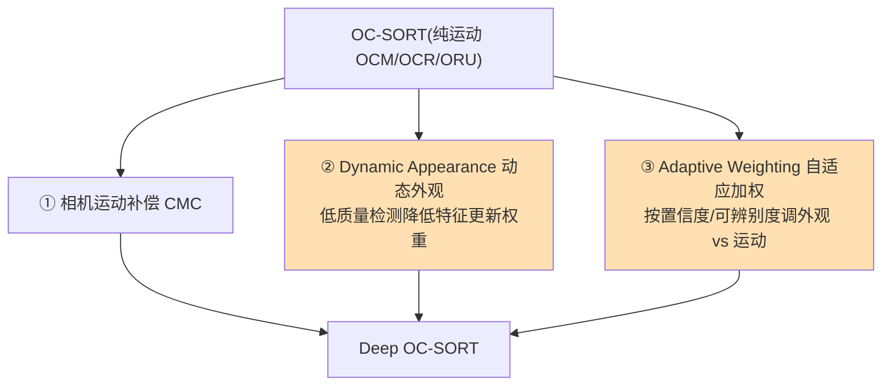
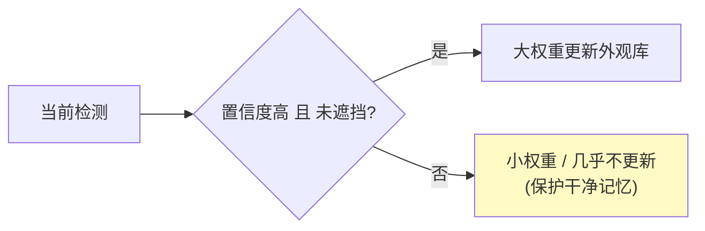
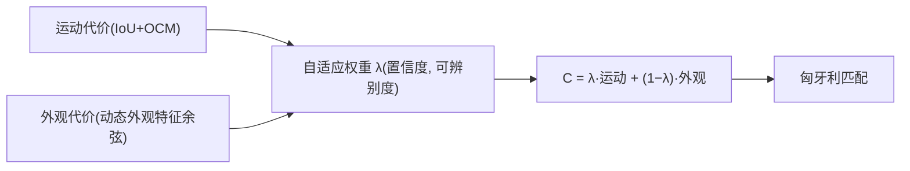
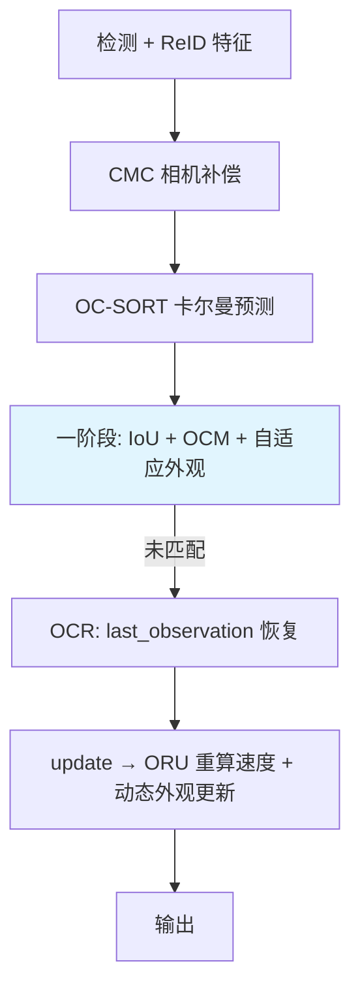

# Deep OC-SORT:自适应外观增强的 OC-SORT

> Maggiolino et al. *Deep OC-SORT: Multi-Pedestrian Tracking by Adaptive Re-Identification*. IEEE ICIP 2023. arXiv:[2302.11813](https://arxiv.org/abs/2302.11813) · 代码 [GerardMaggiolino/Deep-OC-SORT](https://github.com/GerardMaggiolino/Deep-OC-SORT)
>
> 📚 进阶方向。可在本仓库 [`ocsort.py`](https://github.com/yyq19990828/onnxtools/blob/main/onnxtools/tracking/ocsort.py) 基础上叠加外观分支实现。

## 1. 定位:给 OC-SORT 加外观,但要"自适应"

[OC-SORT](ocsort.md) 纯运动、无外观,在密集且外观相似时仍会 ID 切换。最朴素的补法是像 DeepSORT 那样**固定权重**融合外观——但低质量/遮挡帧的外观特征是噪声,固定采信反而有害。Deep OC-SORT 的核心是**自适应地**引入外观:

## 2. 三个改进

### 2.1 相机运动补偿 (CMC)

与 BoT-SORT 同理,估计全局相机运动并校正轨迹预测,使观测中心化的运动建模在移动相机下依然成立。

### 2.2 Dynamic Appearance(动态外观)

不是每帧都全量更新外观特征。检测**置信度低 / 疑似遮挡**时,**降低这次特征对轨迹特征库的更新权重**——避免被脏特征污染记忆。

### 2.3 Adaptive Weighting(自适应加权)

外观代价与运动代价的相对权重**不固定**,而是依据检测置信度和外观的**可辨别度**动态调整:外观可信且有区分度时多采信外观,反之退回运动。这正是它比 DeepSORT 式"恒定融合"更鲁棒的关键。

## 3. 完整流程(相对 OC-SORT 的增量)

底层运动建模(OCM/OCR/ORU)与本仓库 `OCSORT` 一致,Deep OC-SORT 只是在关联代价里叠加了**自适应外观项**,并在 `update` 时按质量更新外观库。

## 4. 性能与局限

- **指标**:MOT17 test HOTA 64.9(MOTA 79.4);MOT20 test HOTA 63.9(发布时第一);**DanceTrack HOTA 61.3 / MOTA 92.3 / IDF1 61.5**,DanceTrack 当时 SOTA。
- **局限**:依赖检测置信度质量;外观在完全同款场景仍有限;多一次 ReID 前向开销。

## 参考文献

- Maggiolino et al. *Deep OC-SORT*. ICIP 2023. arXiv:[2302.11813](https://arxiv.org/abs/2302.11813) · [代码](https://github.com/GerardMaggiolino/Deep-OC-SORT)
- (基线)Cao et al. *OC-SORT*. arXiv:[2203.14360](https://arxiv.org/abs/2203.14360)

→ 上一篇:[StrongSORT](strongsort.md) · 下一篇:[Hybrid-SORT:弱线索也重要](hybrid-sort.md)
