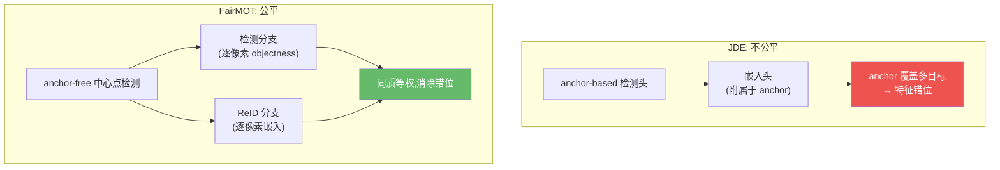
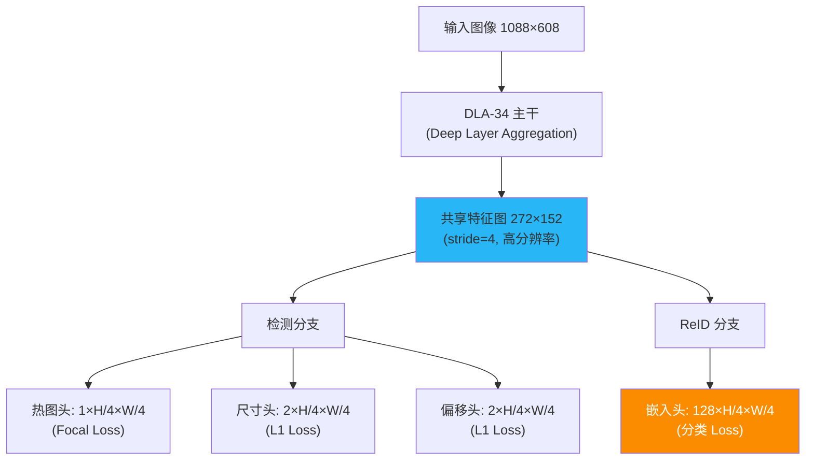
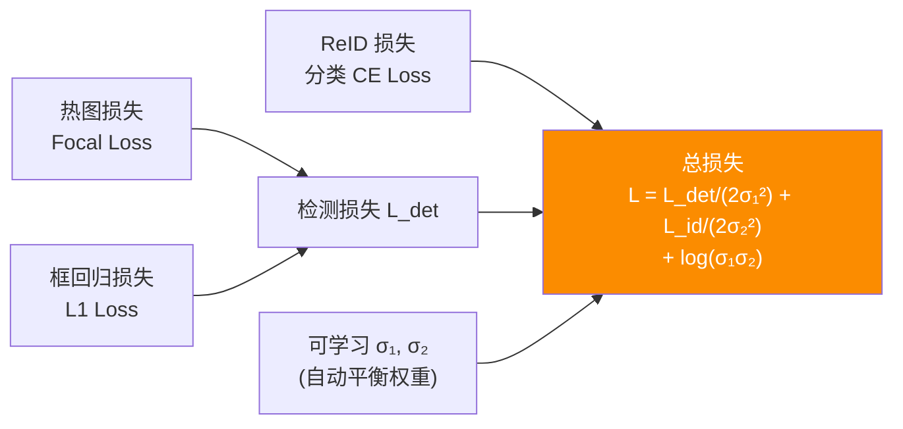

# FairMOT:公平对待检测与 ReID

> Zhang et al. *FairMOT: On the Fairness of Detection and Re-Identification in Multiple Object Tracking*. IJCV 2021. arXiv:[2004.01888](https://arxiv.org/abs/2004.01888) · 代码 [ifzhang/FairMOT](https://github.com/ifzhang/FairMOT)
>
> 📚 本方法仓库未实现,属知识体系补全。本仓库走解耦的 tracking-by-detection 范式。

## 1. 一句话核心:Anchor-Free + 双分支等权 = 公平

JDE 把 ReID 当检测的"附属任务",嵌入特征被 anchor-based 检测头**错位**和**主导**,不公平。FairMOT 的解法:用 anchor-free 的 CenterNet 式检测消除错位,让检测与 ReID 两条分支**同质、等权、并行**。

## 2. 为什么 Anchor-Free 解决了 JDE 的错位

FairMOT 论文的三个核心论点:

1. **Anchor 导致特征错位**:anchor-based 方法中,一个 anchor 可能覆盖多个目标中心,该 anchor 位置提取的 ReID 特征是多个目标的混合——天然就不纯净。
2. **多尺度特征冲突**:FPN 不同层的同一目标产生不同尺度的 anchor,对应不同的嵌入特征,增加学习难度。
3. **ReID 被检测主导**:anchor-based 方法中 ReID 头依附于检测 anchor,检测任务的梯度支配训练。

Anchor-free(CenterNet 式)直接在**目标中心像素**处提取特征,每个像素只对应一个目标中心——**天然对齐**。

## 3. 网络架构:DLA-34 + 双分支

### 3.1 主干:Deep Layer Aggregation (DLA-34)

FairMOT 选用 **DLA-34** 作为主干,它通过**迭代式深层聚合**融合不同深度和分辨率的特征,兼顾语义信息(高层)和空间精度(低层)。输出特征图分辨率为输入的 $1/4$。

### 3.2 检测分支(CenterNet 式)

三个子头并行输出:

- **热图(Heatmap)**:$1 \times H/4 \times W/4$,每个像素表示"该位置是目标中心"的概率,用峰值检测提取中心点。
- **中心偏移(Offset)**:$2 \times H/4 \times W/4$,补偿下采样带来的量化误差。
- **框尺寸(Size)**:$2 \times H/4 \times W/4$,回归宽高 $(w, h)$。

### 3.3 ReID 分支(128 维低维嵌入)

在相同特征图上接一个 $128$ 维的嵌入头。论文实验表明 **128 维远优于 512 维**:低维特征更不容易过拟合小规模 ReID 数据,同时降低计算量。每个目标中心像素处提取的特征即为该目标的外观嵌入。

!!! note "为什么用 128 维而非 512 维"
    FairMOT 消融实验显示:512 维在 MOT 数据集上过拟合(ReID 训练样本有限),128 维是精度-泛化的最佳平衡点。对比 JDE 的 512 维,FairMOT 用更少参数获得了更好的嵌入质量。

## 4. 损失函数:不确定性加权的多任务学习

### 4.1 热图损失(修改版 Focal Loss)

$$\mathcal{L}_{\text{hm}} = \frac{-1}{N} \sum_{xy} \begin{cases} (1-\hat{Y}_{xy})^\alpha \log(\hat{Y}_{xy}), & \text{if } Y_{xy} = 1 \\ (1-Y_{xy})^\beta \hat{Y}_{xy}^\alpha \log(1-\hat{Y}_{xy}), & \text{otherwise} \end{cases}$$

其中 $Y$ 是高斯渲染的 ground-truth 热图,$\hat{Y}$ 是预测热图,$\alpha=2,\beta=4$。高斯核使中心附近的损失权重更大。

### 4.2 框回归损失

框尺寸和中心偏移均使用 **L1 损失**,仅在目标中心像素处计算:

$$\mathcal{L}_{\text{box}} = \frac{1}{N} \sum_{k=1}^{N} \left( |\hat{s}_k - s_k| + |\hat{o}_k - o_k| \right)$$

### 4.3 ReID 分类损失

把 ReID 建模为分类任务——对训练集中的每个行人 ID 分配一个类别,在中心像素处提取 128 维特征后接全连接分类器:

$$\mathcal{L}_{\text{id}} = \frac{-1}{N} \sum_{k=1}^{N} \log p(y_k | \mathbf{f}_k)$$

### 4.4 总损失:不确定性自动加权

借鉴 Kendall et al. 的思路,用可学习参数 $\sigma_1, \sigma_2$ 自动平衡检测和 ReID:

$$\mathcal{L} = \frac{1}{2\sigma_1^2} \mathcal{L}_{\text{det}} + \frac{1}{2\sigma_2^2} \mathcal{L}_{\text{id}} + \log(\sigma_1 \sigma_2)$$

其中 $\mathcal{L}_{\text{det}} = \mathcal{L}_{\text{hm}} + \mathcal{L}_{\text{box}}$。网络自动学习两个任务的相对权重,实现"公平"。

## 5. 训练策略

- **预训练**:在 **CrowdHuman** 数据集上预训练 60 epoch(仅检测头,不含 ReID)。
- **混合训练**:在 **MIX 数据集**(Caltech + CityPersons + CUHK-SYSU + PRW + ETHZ + MOT17)上联合训练 30 epoch。
- **优化器**:Adam,初始学习率 $1 \times 10^{-4}$,余弦退火。
- **数据增强**:随机缩放、裁剪、颜色抖动、水平翻转。

!!! tip "CrowdHuman 预训练的重要性"
    FairMOT 消融实验显示:CrowdHuman 预训练带来约 +5 MOTA 的提升。CrowdHuman 含 15K 训练图/340K 行人标注,密度远超 MOT 数据集,为检测头提供了高质量的初始化。

## 6. 关键配置

| 参数 | 值 | 说明 |
|------|----|------|
| 主干 | DLA-34 | Deep Layer Aggregation,stride=4 输出 |
| 检测范式 | Anchor-free (CenterNet) | 逐像素中心点检测 |
| ReID 维度 | 128 | 低维防过拟合 |
| 输入分辨率 | 1088×608 | 特征图 272×152 |
| 热图损失 | Focal Loss ($\alpha$=2, $\beta$=4) | 高斯渲染 GT |
| 框回归损失 | L1 | 尺寸 + 偏移 |
| ReID 损失 | Cross-Entropy 分类 | 按 ID 类别 |
| 多任务加权 | 不确定性自动学习 | Kendall et al. |
| 预训练 | CrowdHuman 60 epoch | 关键增益来源 |
| 关联后端 | 卡尔曼 + 匈牙利 | 与 JDE 一致 |

## 7. 性能与局限

**MOT17 测试集指标**:

| 方法 | MOTA | IDF1 | FPS | ID Sw. |
|------|------|------|-----|--------|
| FairMOT (DLA-34) | 73.7 | 72.3 | 25.9 | 3303 |
| JDE | 64.4 | 55.8 | ~22 | — |
| CenterTrack | 67.8 | 64.7 | 22 | 3039 |

**MOT20 测试集**:MOTA 61.8 / IDF1 67.3,在密集人群场景下仍保持竞争力。

**局限**:

- **ReID 预训练依赖**:需要大规模人群数据(CrowdHuman)预训练,缺乏预训练数据时性能大幅下降。
- **同款外观/拥挤场景弱**:DanceTrack 等目标外观高度相似的场景下 ReID 分支区分度不足。
- **关联后端仍是启发式**:FairMOT 的贡献在网络端;关联端仍是传统卡尔曼+匈牙利,未深度优化。
- **小目标受限**:stride=4 的特征图对极小目标分辨率仍不够。

## 参考文献

- Zhang et al. *FairMOT: On the Fairness of Detection and Re-Identification in Multiple Object Tracking*. IJCV 2021. arXiv:[2004.01888](https://arxiv.org/abs/2004.01888) · [代码](https://github.com/ifzhang/FairMOT)
- Zhou et al. *Objects as Points* (CenterNet). arXiv:[1904.07850](https://arxiv.org/abs/1904.07850)
- Kendall et al. *Multi-Task Learning Using Uncertainty to Weigh Losses*. CVPR 2018.
- (预训练数据)Shao et al. *CrowdHuman*. arXiv:[1805.00123](https://arxiv.org/abs/1805.00123)

→ 上一篇:[JDE](jde.md) · 下一篇:[CenterTrack](centertrack.md)
