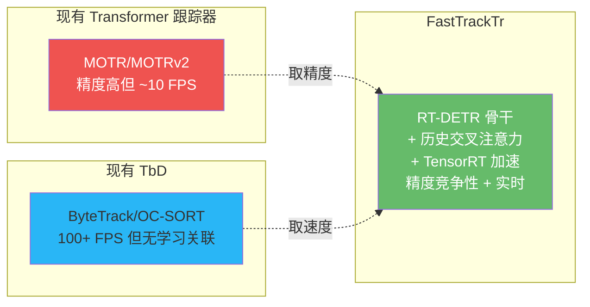
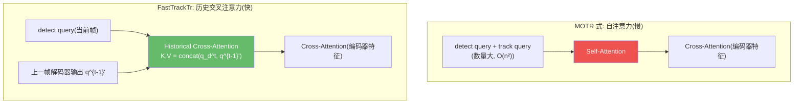

# FastTrackTr:面向实时部署的 Transformer 跟踪器

> Liao et al. *FastTrackTr: Towards Fast Multi-Object Tracking with Transformers*. 2024. arXiv:[2411.15811](https://arxiv.org/abs/2411.15811) · 代码:暂未公开
>
> 📚 本方法仓库未实现,属知识体系补全(2024 前沿)。

## 1. 一句话核心

**Transformer 跟踪器准确但太慢,ByteTrack 快但缺少学习能力——能不能兼得?FastTrackTr 基于 RT-DETR 构建联合检测-跟踪框架,用历史交叉注意力替代自注意力来传递帧间信息,将 query 数量降至最低,并支持 TensorRT 加速——在 640x640 输入下达到 166 FPS(TRT FP16),同时保持 DanceTrack HOTA 62.4 的竞争性精度。**

## 2. 核心设计:用历史交叉注意力替代自注意力

传统 DETR-MOT(如 MOTR)在解码器中让 detect query 和 track query 做**联合自注意力**,计算量随 query 数量二次增长。FastTrackTr 的关键改动:

具体做法:

$$K_T = V_T = \text{Linear}\bigl(\text{concat}(q_d^t,\; q^{(t-1)'})\bigr)$$

- 当前帧的 detect query 作为 Query
- 上一帧的解码器输出与当前 detect query 拼接后作为 Key/Value
- 这避免了 track query 与 detect query 的全对全自注意力,同时保留了帧间信息传递

### 2.1 历史编码器

为了进一步融合多帧信息,FastTrackTr 增加一个轻量历史编码器:

- 用 masked self-attention 聚合多帧解码器输出
- 通过 softmax 掩码抑制低置信度的历史元素,避免错误传播
- 位置编码区分不同帧的历史信息

## 3. 身份学习:Circle Loss + 嵌入平滑

### 3.1 ID 嵌入头

在解码器输出上增加一个全连接层,将 query 投影到 256 维判别特征空间:

$$\mathcal{L}_{\text{reid}} = \log\Bigl[1 + \sum_j e^{\gamma \alpha_n(s_n^j - \Delta_n)} \sum_i e^{-\gamma \alpha_p(s_p^i - \Delta_p)}\Bigr]$$

相比传统的 one-hot 分类损失,Circle Loss 对大规模 ID 集合的扩展性更好(不需要为每个 ID 维护分类头)。

### 3.2 嵌入指数移动平均

推理时用指数移动平均平滑 ID 嵌入,抑制单帧噪声:

$$f_t = \eta \cdot f_{t-1} + (1 - \eta) \cdot \tilde{f}_t, \quad \eta = 0.9$$

### 3.3 总损失

$$\mathcal{L}_{\text{total}} = \lambda_{\text{det}} \cdot \mathcal{L}_{\text{det}} + \lambda_{\text{reid}} \cdot \mathcal{L}_{\text{reid}}, \quad \lambda_{\text{det}} = \lambda_{\text{reid}} = 1.0$$

## 4. 关键配置

| 参数 | 值 | 说明 |
|------|-----|------|
| 骨干 | RT-DETR + ResNet-50 | 300 object queries |
| ID 嵌入维度 | 256 | Circle Loss 优化 |
| EMA 系数 $\eta$ | 0.9 | 嵌入平滑 |
| 输入分辨率 | 1333x800 / 640x640 | 速度-精度可调 |
| 推理精度 | FP16 (TensorRT) | 确定性计算图 |
| 训练数据 | CrowdHuman + 目标数据集 | 联合训练 |

## 5. 性能与局限

### 基准结果

| 数据集 | HOTA | MOTA | IDF1 |
|--------|------|------|------|
| DanceTrack test | 62.4 | 88.8 | 64.8 |
| MOT17 test | 62.4 | 76.7 | 77.2 |
| SportsMOT test | 70.1 | 94.0 | 72.0 |
| BDD100K | 55.1 (TETA) | — | — |

### 速度分析(核心卖点)

| 配置 | 延迟 | FPS | 平台 |
|------|------|-----|------|
| 1333x800 FP16 | 30.9ms | 32.4 | GPU |
| 640x640 FP16 | 19.6ms | 51.0 | GPU |
| 640x640 TRT FP16 | **6.0ms** | **166.4** | GPU + TensorRT |
| 640x640 TRT FP16 | 35.6ms | 28.1 | Jetson AGX Orin |

### 局限

- DanceTrack HOTA 62.4,精度不及 MOTRv2(69.9)和 MATR(71.3)——速度与精度的取舍
- 论文暂无公开代码,复现需依赖作者
- 边缘设备(Jetson)上 28 FPS,对高帧率需求仍有差距
- 历史信息仅保留上一帧,长时序建模能力弱于 MOTR 的全序列 query

!!! note "对本仓库用户的启示"
    FastTrackTr 是目前最接近"实时 Transformer 跟踪器"的尝试。它的 TensorRT 兼容性设计尤其值得关注——与本仓库的 ONNX/TensorRT 推理流水线天然契合。如果未来端到端 Transformer 跟踪器的精度继续提升,FastTrackTr 的工程化思路(确定性计算图、TRT 加速、嵌入 EMA)可以作为部署参考。但就当前精度而言,本仓库的 ByteTrack + YOLO/RT-DETR 组合仍是更优的实时方案。

## 参考文献

- Liao et al. *FastTrackTr: Towards Fast Multi-Object Tracking with Transformers*. arXiv:[2411.15811](https://arxiv.org/abs/2411.15811)
- (骨干) Zhao et al. *RT-DETR*. CVPR 2024. arXiv:[2304.08069](https://arxiv.org/abs/2304.08069)
- (对比) Zeng et al. *MOTR*. ECCV 2022. arXiv:[2105.03247](https://arxiv.org/abs/2105.03247)
- (对比) Zhang et al. *MOTRv2*. CVPR 2023. arXiv:[2211.09791](https://arxiv.org/abs/2211.09791)

→ 上一篇:[PuTR](putr.md) · 下一篇:[评测指标详解](metrics.md)
