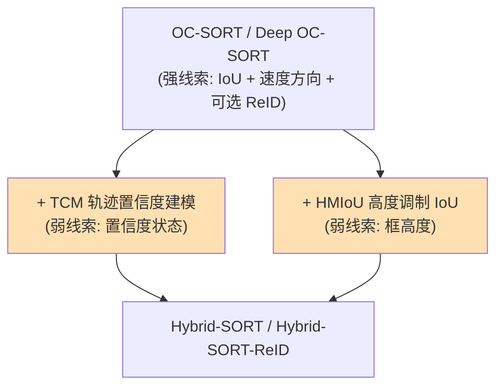
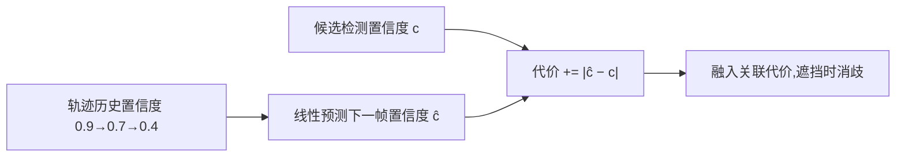
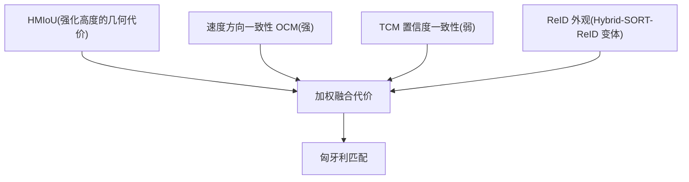

# Hybrid-SORT:弱线索也重要

> Yang et al. *Hybrid-SORT: Weak Cues Matter for Online Multi-Object Tracking*. AAAI 2024. arXiv:[2308.00783](https://arxiv.org/abs/2308.00783) · 代码 [ymzis69/HybridSORT](https://github.com/ymzis69/HybridSORT)
>
> 📚 进阶方向。即插即用可叠加到本仓库 [`ocsort.py`](https://github.com/yyq19990828/onnxtools/blob/main/onnxtools/tracking/ocsort.py)。

## 1. 定位:强线索之外,弱线索能消歧

主流方法关联只用**强线索**:IoU、ReID 外观、速度方向。Hybrid-SORT 指出在**遮挡/拥挤**时这些强线索会同时失效或歧义,而一些被忽视的**弱线索**——目标**置信度的变化规律**、框的**高度**——恰好能帮助消歧。它把两个**免训练**模块插到 OC-SORT / Deep OC-SORT 上:

## 2. 弱线索一:TCM 轨迹置信度建模

直觉:目标即将被遮挡时,检测置信度会**逐渐下降**;遮挡结束重现时又**回升**。这种置信度**轨迹**本身是区分"谁被挡了"的信号。TCM 用卡尔曼/线性预测对每条轨迹的置信度状态建模,把"预测置信度 vs 检测置信度"的差异加进关联代价。

消融:DanceTrack 上 TCM 约 +4.9 HOTA,MOT17 约 +0.9。

## 3. 弱线索二:HMIoU 高度调制 IoU

拥挤场景里两个框水平错开但竖直高度差明显时,纯 IoU 区分力弱。HMIoU 用卡尔曼建模框**高度**,把高度一致性融进 IoU,强化竖直方向的判别。

消融:DanceTrack 上 HMIoU 约 +1.6 HOTA,MOT17 约 +1.0。

## 4. 整体关联代价

两个模块都是 **training-free、plug-and-play**,保持在线、实时,不改动底层 OC-SORT 的 OCM/OCR/ORU 主体。

## 5. 性能与局限

- **指标**:在 MOT17、MOT20,尤其 DanceTrack(遮挡 + 非线性运动)上获得提升;精确终值见 AAAI-24 论文表格。
- **局限**:弱线索主要在**遮挡密集**场景见效,普通场景增益较小;高度线索假设目标**直立**(行人),对任意姿态目标不一定成立;仍依赖检测质量。

!!! tip "为何值得了解"
    Hybrid-SORT 代表了一种思路转变:在检测器/ReID 都强的今天,继续榨取**被忽略的廉价信号**(置信度变化、几何先验)来消歧,而非一味堆更大的外观模型。

## 参考文献

- Yang et al. *Hybrid-SORT: Weak Cues Matter for Online Multi-Object Tracking*. AAAI 2024. arXiv:[2308.00783](https://arxiv.org/abs/2308.00783) · [代码](https://github.com/ymzis69/HybridSORT)
- (基线)Cao et al. *OC-SORT*. arXiv:[2203.14360](https://arxiv.org/abs/2203.14360)

→ 上一篇:[Deep OC-SORT](deep-ocsort.md) · 下一篇:[联合检测与嵌入(JDE 派)](jde-family.md)
