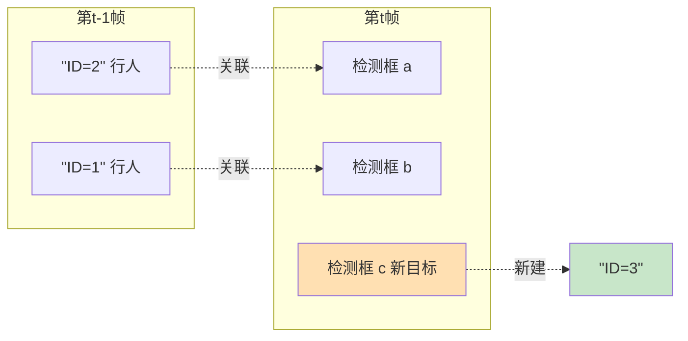
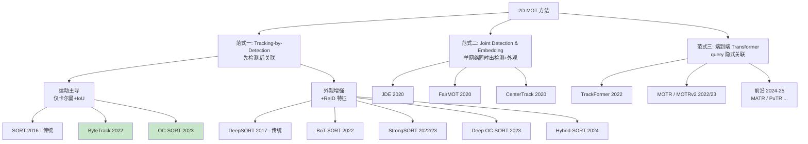
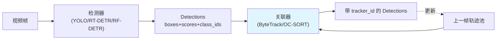
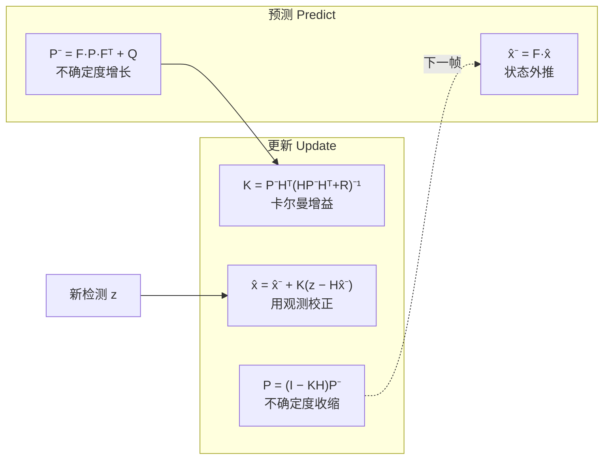
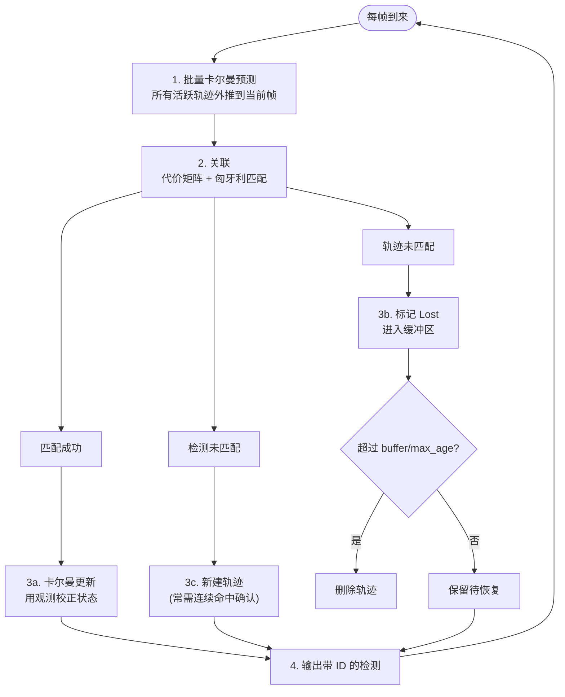
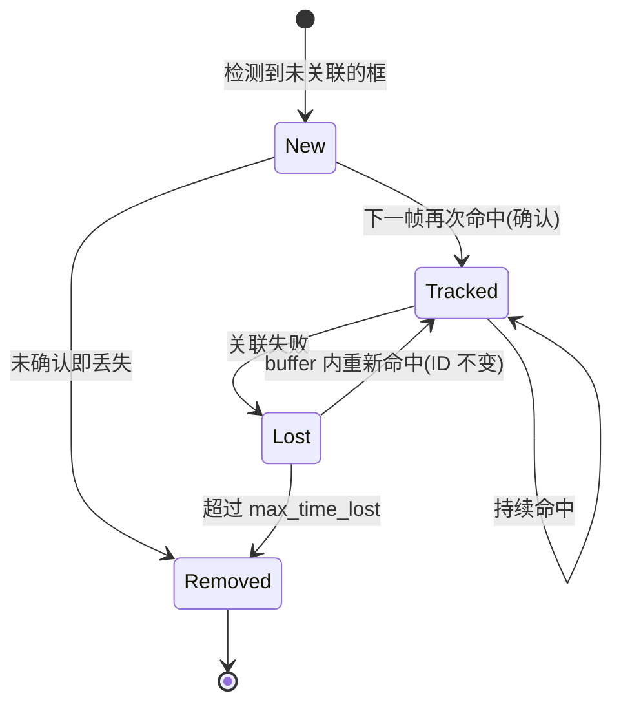
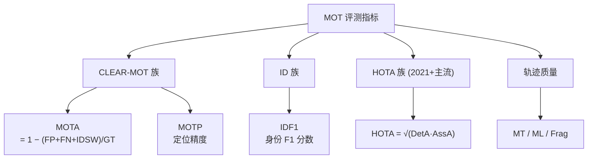
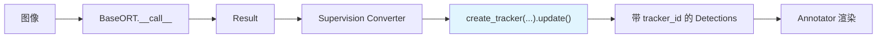

# 2D 多目标跟踪学习手册 · 概念总览

> 本系列文档系统梳理 **2D 多目标跟踪 (Multi-Object Tracking, MOT)** 的核心概念、传统方法与近五年的主流方法。每篇方法文档都尽量与本仓库 [`onnxtools/tracking/`](https://github.com/yyq19990828/onnxtools/tree/main/onnxtools/tracking) 的实际实现对照,便于"边读论文边读代码"。
>
> 这是**学习文档**,不是 API 参考。API 用法请看 [`docs/api/tracking.md`](../../api/tracking.md);工程实现约定请看 [`onnxtools/tracking/CLAUDE.md`](https://github.com/yyq19990828/onnxtools/blob/main/onnxtools/tracking/CLAUDE.md)。

## 阅读地图

| 文档 | 内容 | 与本仓库的关系 |
|------|------|----------------|
| **本篇 · 概念总览** | MOT 问题定义、范式分类、卡尔曼滤波、匈牙利匹配、评测指标、数据集 | 共享基元 [`kalman.py`](https://github.com/yyq19990828/onnxtools/blob/main/onnxtools/tracking/kalman.py) / [`matching.py`](https://github.com/yyq19990828/onnxtools/blob/main/onnxtools/tracking/matching.py) |
| [传统方法总结](traditional-methods.md) | IoU-Tracker、SORT、DeepSORT | 设计血统来源 |
| [ByteTrack](bytetrack.md) | 关联每一个检测框(高/低分双关联) | ✅ [`bytetrack.py`](https://github.com/yyq19990828/onnxtools/blob/main/onnxtools/tracking/bytetrack.py) 原生实现 |
| [OC-SORT](ocsort.md) | 观测中心化(OCM/OCR/ORU) | ✅ [`ocsort.py`](https://github.com/yyq19990828/onnxtools/blob/main/onnxtools/tracking/ocsort.py) 原生实现 |
| [BoT-SORT](botsort.md) | 相机运动补偿 + ReID 融合 | 进阶方向 |
| [StrongSORT](strongsort.md) | DeepSORT 现代化 + AFLink/GSI | 进阶方向 |
| [Deep OC-SORT](deep-ocsort.md) | 自适应外观增强的 OC-SORT | 进阶方向 |
| [Hybrid-SORT](hybrid-sort.md) | 弱线索(置信度/高度)关联 | 进阶方向 |
| [联合检测与嵌入(JDE 派)](jde-family.md) | JDE / FairMOT / CenterTrack | 单网络一阶段范式 |
| [端到端 Transformer(query 派)](transformer-mot.md) | TrackFormer / MOTR / MOTRv2 + 前沿 | 端到端范式 |
| [评测指标详解](metrics.md) | MOTA / MOTP / IDF1 / HOTA / MT-ML-Frag | 怎么评判跟踪器好坏 |

---

## 1. 什么是多目标跟踪

**单目标跟踪 (SOT)** 给定第一帧的一个框,后续逐帧定位同一目标。**多目标跟踪 (MOT)** 则要在视频流中**同时**维护**多个**目标的轨迹,核心产物是给每个目标分配一个**时间上一致的身份 ID (tracker_id)**:同一辆车/同一个行人在连续帧里必须是同一个 ID,新目标进入要发新 ID,目标离开要回收。

形式化:第 $t$ 帧给定检测集合 $D_t = \{d_1, \dots, d_n\}$(每个 $d_i$ 含 bbox、置信度、类别),跟踪器要输出轨迹集合 $T = \{\tau_1, \dots, \tau_m\}$,每条轨迹 $\tau_k$ 是跨帧的、带同一 ID 的框序列。



跟踪的本质难点不在"看到目标",而在**跨帧维持身份**。三大经典挑战:

| 挑战 | 描述 | 典型失败 |
|------|------|----------|
| **遮挡 (Occlusion)** | 目标被其他目标/场景物体短暂或长时间挡住 | 轨迹中断、重新出现时换了新 ID |
| **身份切换 (ID Switch)** | 两个相近目标的 ID 互换 | 两人交叉走过后 ID 对调 |
| **非线性运动 (Non-linear motion)** | 急转、加速、跳舞、运动赛事 | 恒速卡尔曼预测偏离,关联失败 |
| **外观相似 (Appearance ambiguity)** | 队列、舞蹈、同款球衣 | ReID 特征无法区分 |
| **拥挤 (Crowded)** | 高密度人群(MOT20 可达 ~246 人/帧) | 框重叠、IoU 矩阵歧义 |

---

## 2. 范式分类:本系列的"地图"

近十年的 MOT 方法可按"检测与关联如何耦合"分为四大范式。本系列文档即按此分类组织。



> 🟢 绿色为本仓库已原生实现的两个方法(ByteTrack、OC-SORT)。

### 范式一:Tracking-by-Detection(检测后关联)

最主流、最实用的范式。流程严格分两步:**(1) 用一个独立检测器逐帧出框 → (2) 用一个关联器把当前帧的框接到已有轨迹上**。本仓库 `bytetrack` / `ocsort` 即属此类——它们只吃 `supervision.Detections`,完全不关心检测器是 YOLO 还是 RT-DETR。



优点:检测与跟踪解耦,检测器可随意升级;跟踪器轻量(纯 numpy 即可 100+ FPS)。本仓库整条 `InferencePipeline` 正是这种解耦设计(`enable_tracking=True`)。

### 范式二:Joint Detection & Embedding(一阶段 / JDE)

把"出框"和"出外观特征"塞进**同一个网络**一次前向完成(JDE、FairMOT)。省掉独立 ReID 模型的延迟,但检测与 ReID 两个任务会在共享网络里"打架"。详见 [JDE 派文档](jde-family.md)。

### 范式三:端到端 Transformer(query 派)

用 DETR 式的 query 表示目标,"track query"跨帧自回归传递,关联在注意力里**隐式**完成,不再需要手写卡尔曼/匈牙利(TrackFormer、MOTR)。详见 [Transformer 文档](transformer-mot.md)。

---

## 3. 关联的两大数学基石

无论哪种 tracking-by-detection 方法,关联都建立在两个基石上:**用卡尔曼滤波预测目标下一帧在哪**,再**用匈牙利算法在"预测"和"新检测"之间做最优配对**。这两个基元在本仓库被向量化实现于 [`kalman.py`](https://github.com/yyq19990828/onnxtools/blob/main/onnxtools/tracking/kalman.py) 与 [`matching.py`](https://github.com/yyq19990828/onnxtools/blob/main/onnxtools/tracking/matching.py)。

### 3.1 卡尔曼滤波:恒速运动模型

跟踪里几乎都用**恒速 (constant-velocity) 线性模型**:假设帧间位移近似匀速。卡尔曼滤波交替执行**预测**和**更新**两步:



- **预测**:$\hat{x}^- = F\hat{x}$,$P^- = FPF^\top + Q$。$F$ 是状态转移矩阵(位置 += 速度·dt),$Q$ 是过程噪声。
- **更新**:用新观测 $z$ 校正,卡尔曼增益 $K$ 平衡"信预测"还是"信观测"。

**状态向量在 SORT 家族里有两种参数化**,本仓库两种都实现了:

| 类 | 状态向量 | 维度 | 用于 | 仓库类 |
|----|----------|------|------|--------|
| 面积-纵横比 | $[x, y, s, r, \dot x, \dot y, \dot s]$ ($s$=面积, $r$=纵横比恒定) | 7D | SORT / OC-SORT | [`KalmanFilterXYSR`](https://github.com/yyq19990828/onnxtools/blob/main/onnxtools/tracking/kalman.py) |
| 中心-纵横比-高 | $[c_x, c_y, a, h, \dot c_x, \dot c_y, \dot a, \dot h]$ | 8D | DeepSORT / ByteTrack | [`KalmanFilterXYAH`](https://github.com/yyq19990828/onnxtools/blob/main/onnxtools/tracking/kalman.py) |

!!! note "工程要点:批量预测 multi_predict"
    每帧要对池中 N 条轨迹各做一次预测。逐条 Python 循环会很慢。本仓库 `KalmanFilterXYAH.multi_predict(means, covs)` 用单条 `np.einsum("ij,njk,lk->nil", ...)` 一次性算完 N 个 $FPF^\top$,这是 100+ FPS 的关键热点优化。XYAH 的观测噪声随目标**高度**缩放(框越大,噪声容忍越大),沿用 SORT/DeepSORT 配方。

### 3.2 匈牙利算法:最优二分匹配

有了 N 条轨迹的预测框和 M 个新检测框,关联 = 在 N×M 的**代价矩阵**上求**最小代价二分匹配**。匈牙利算法 (Kuhn-Munkres) 在 $O(n^3)$ 内给出全局最优解。

```mermaid
graph TD
    subgraph 代价矩阵 N×M
        direction LR
        C["cost[i,j] = 轨迹i 与 检测j 的不相似度"]
    end
    C --> SOLVE["linear_assignment(cost, thresh)"]
    SOLVE --> M1["matches 匹配对 (i,j)"]
    SOLVE --> M2["unmatched_tracks 未匹配轨迹"]
    SOLVE --> M3["unmatched_dets 未匹配检测 → 可能新建"]
```

代价矩阵的"不相似度"用什么度量,正是各方法的分水岭:

| 代价类型 | 公式 | 谁在用 |
|----------|------|--------|
| **IoU 距离** | $1 - \text{IoU}$ | SORT / ByteTrack 一阶段 / OC-SORT |
| **马氏距离** | $(z-\hat z)^\top S^{-1}(z-\hat z)$ | DeepSORT 运动门控 |
| **余弦外观距离** | $1 - \cos(f_{\text{track}}, f_{\text{det}})$ | DeepSORT / BoT-SORT-ReID / StrongSORT |
| **分数融合 fuse_score** | $1 - (1-\text{cost})\cdot \text{score}$ | ByteTrack 一阶段 |
| **运动方向余弦 (OCM)** | $-\text{inertia}\cdot\cos(\vec v_{\text{track}}, \vec v_{\text{det}})$ | OC-SORT |

!!! tip "工程要点:lap vs scipy"
    本仓库 [`linear_assignment`](https://github.com/yyq19990828/onnxtools/blob/main/onnxtools/tracking/matching.py) 优先用 `lap.lapjv`(带 `cost_limit` 稀疏化,边缘设备上快 3-5×),未安装时透明回落到 `scipy.optimize.linear_sum_assignment`。`thresh` 之上的代价被视为"禁止匹配"。

---

## 4. 跟踪流程的通用骨架

几乎所有 tracking-by-detection 方法都可归纳为下面这个"预测 → 关联 → 更新 → 生命周期管理"的循环。理解了它,再读任何一篇方法论文都只是在某一步上做文章。



**轨迹生命周期状态机**(本仓库 [`base.py`](https://github.com/yyq19990828/onnxtools/blob/main/onnxtools/tracking/base.py) 的 `TrackState` 枚举):



!!! warning "为什么新轨迹要"双帧确认"?"
    如果每个未匹配的高分检测都立刻发 ID,检测器的偶发误检会制造大量"一帧就消失"的鬼影轨迹。ByteTrack 的做法是:新建的 `STrack` 初始 `is_activated=False`(`New` 态),**必须下一帧再被命中**才正式 emit(除了视频第一帧)。OC-SORT 用 `min_hits`(默认 3)达到同样目的。

---

## 5. 评测指标:怎么判断一个跟踪器好不好

跟踪指标比检测复杂,因为既要"框准"又要"ID 稳"。务必理解三大族:**MOTA 族(检测主导)**、**IDF1(身份主导)**、**HOTA(平衡且现已成主流)**。



### 5.1 CLEAR-MOT 族

- **MOTA (Multi-Object Tracking Accuracy)** $= 1 - \dfrac{\sum_t (\text{FN}_t + \text{FP}_t + \text{IDSW}_t)}{\sum_t \text{GT}_t}$。范围 $(-\infty, 1]$。**注意:由检测错误(FP/FN)主导**,ID 切换权重很小——所以 MOTA 高不代表 ID 稳。
- **MOTP (Precision)**:匹配上的真正例的平均定位重叠(IoU 平均),只衡量"框得准不准",不衡量"跟得对不对"。

### 5.2 IDF1 族(身份导向)

通过全局轨迹匹配统计 IDTP/IDFP/IDFN:

$$\text{IDF1} = \frac{2\,\text{IDTP}}{2\,\text{IDTP} + \text{IDFP} + \text{IDFN}}$$

即身份精确率 IDP 与召回率 IDR 的调和平均。**IDF1 更看重"全程是否保持同一个 ID"**,是衡量身份一致性的关键指标。

### 5.3 HOTA(高阶指标,当前事实标准)

> Luiten et al., *HOTA: A Higher Order Metric for Evaluating Multi-Object Tracking*, IJCV 2021. arXiv:[2009.07736](https://arxiv.org/abs/2009.07736) · 评测工具 [TrackEval](https://github.com/JonathonLuiten/TrackEval)

MOTA 偏检测、IDF1 偏身份,HOTA 把两者**显式拆开再几何平均**,并在多个定位阈值 $\alpha$ 上积分:

$$\text{HOTA}(\alpha) = \sqrt{\text{DetA}(\alpha)\cdot\text{AssA}(\alpha)}, \qquad \text{HOTA} = \int_0^1 \text{HOTA}(\alpha)\, d\alpha$$

- **DetA(检测准确度)** $= \dfrac{|\text{TP}|}{|\text{TP}|+|\text{FN}|+|\text{FP}|}$ —— 框检测得好不好。
- **AssA(关联准确度)** —— 匹配上的轨迹对的关联 IoU 平均,衡量 ID 跟得稳不稳。

**为什么现在论文都报 HOTA**:它能一眼看出一个跟踪器是"检测强但 ID 乱"(DetA 高 AssA 低)还是"ID 稳但漏检多"。DanceTrack 这类外观相似、运动剧烈的数据集,正是用 HOTA 拉开了 ByteTrack 与 OC-SORT 的差距。

### 5.4 轨迹质量

- **MT (Mostly Tracked)**:被覆盖 ≥80% 生命周期的 GT 轨迹数。
- **ML (Mostly Lost)**:被覆盖 ≤20% 的 GT 轨迹数。
- **Frag (Fragmentation)**:轨迹"跟丢→恢复"的断裂次数。

---

## 6. 标准数据集

| 数据集 | 场景特点 | 主流指标痛点 | 链接 |
|--------|----------|--------------|------|
| **MOTChallenge** (MOT15/16/17/20) | 行人,街景;MOT20 极拥挤(~246 人/帧) | 遮挡、拥挤 | [motchallenge.net](https://motchallenge.net) |
| **DanceTrack** | 舞者,**外观高度相似 + 非线性运动** | ReID 失效,考验运动建模 | [dancetrack.github.io](https://dancetrack.github.io) ·  arXiv:[2111.14690](https://arxiv.org/abs/2111.14690) |
| **SportsMOT** | 篮球/排球/足球,**快速变速运动** | 急停急转 | [SportsMOT](https://github.com/MCG-NJU/SportsMOT) · arXiv:[2304.05170](https://arxiv.org/abs/2304.05170) |
| **KITTI Tracking** | 自动驾驶,车/人 | 相机自运动 | [KITTI](https://www.cvlibs.net/datasets/kitti/eval_tracking.php) |

!!! info "DanceTrack 的意义"
    DanceTrack 故意让所有舞者**穿一样、长得像**,逼跟踪器**不能靠外观**只能靠运动建模。这就是为什么 OC-SORT(强运动建模)在 DanceTrack 上大幅超过 ByteTrack,也催生了 Deep OC-SORT、Hybrid-SORT 等一批新方法。

---

## 7. 在本仓库里跑起来

三种后端共用同一工厂,可即插即用到 `InferencePipeline`:

```python
from onnxtools.tracking import create_tracker

tracker = create_tracker("bytetrack")          # supervision 封装(默认,零依赖)
tracker = create_tracker("bytetrack_native")   # 原生向量化 ByteTrack(本系列重点)
tracker = create_tracker("ocsort")             # 原生 OC-SORT(本系列重点)

for frame, raw_dets in stream:
    tracked = tracker.update(raw_dets, frame)  # tracked.tracker_id 已就位
tracker.reset()                                # 换视频时重置,ID 从 1 重新发号
```



完整 API、kwargs 标准化映射、与 pipeline 的集成见 [API · Tracking](../../api/tracking.md)。

---

## 参考文献

- Luiten et al. *HOTA: A Higher Order Metric for Evaluating Multi-Object Tracking*. IJCV 2021. arXiv:[2009.07736](https://arxiv.org/abs/2009.07736)
- Bernardin & Stiefelhagen. *Evaluating Multiple Object Tracking Performance: The CLEAR MOT Metrics*. 2008.
- Ristani et al. *Performance Measures and a Data Set for Multi-Target, Multi-Camera Tracking* (IDF1). ECCV 2016.
- Dendorfer et al. *MOT20: A benchmark for multi object tracking in crowded scenes*. arXiv:[2003.09003](https://arxiv.org/abs/2003.09003)
- Sun et al. *DanceTrack*. CVPR 2022. arXiv:[2111.14690](https://arxiv.org/abs/2111.14690)

→ 下一篇:[传统方法总结(IoU-Tracker / SORT / DeepSORT)](traditional-methods.md)
