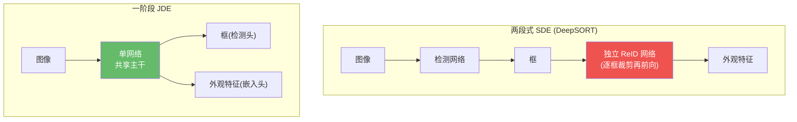
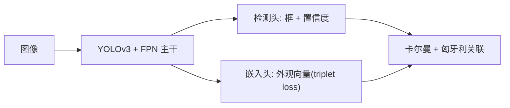
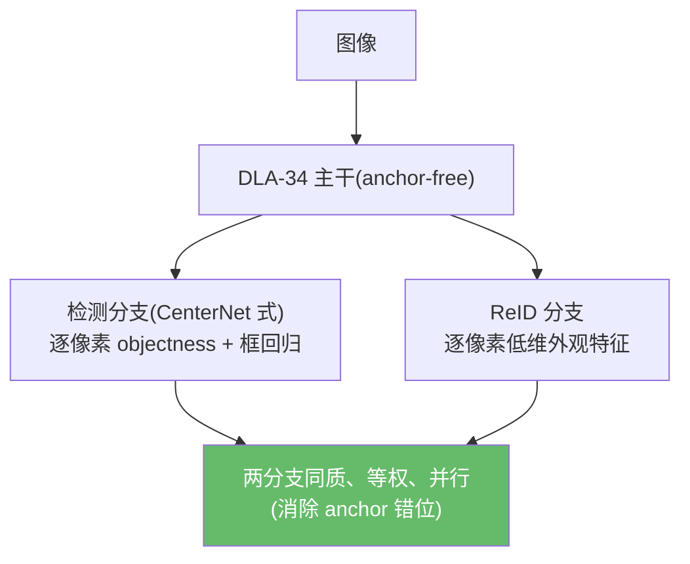
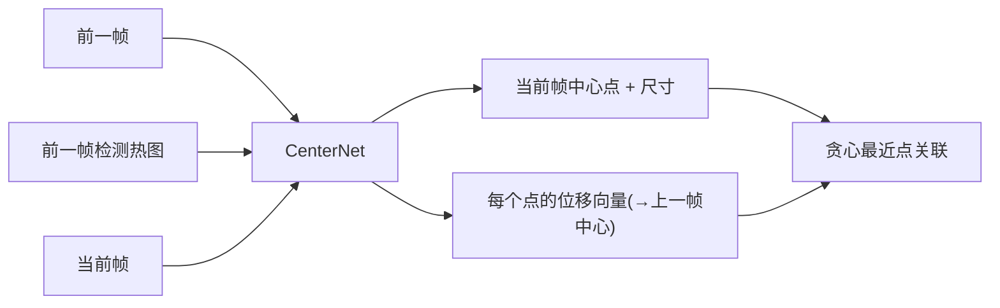
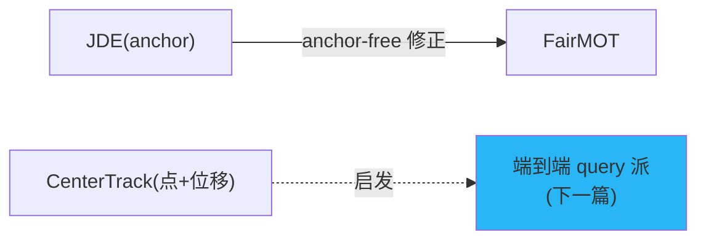

# 联合检测与嵌入(JDE 派):JDE / FairMOT / CenterTrack

> 本篇讲**范式二**:把检测和(外观/运动)关联线索塞进**同一个网络一次前向**完成,而不是"检测器 + 独立 ReID/关联器"两段式。代表作 JDE、FairMOT、CenterTrack(均为 2020 年)。
>
> 📚 这是与本仓库 tracking-by-detection(范式一)不同的范式,作为知识体系补全。

## 1. 动机:别让 ReID 模型拖慢推理

DeepSORT 式管线 = 检测器 + **独立** ReID 网络,延迟是两者之和。JDE 派的核心问题:

> 能不能让一个网络**一次前向同时**输出"框"和"每个框的外观嵌入"?

> SDE = Separate Detection and Embedding;JDE = Joint Detection and Embedding。

## 2. JDE:首个一阶段联合检测+嵌入

> 📖 详细解析见 [JDE 详解](jde.md)

> Wang et al. *Towards Real-Time Multi-Object Tracking*. ECCV 2020. arXiv:[1909.12605](https://arxiv.org/abs/1909.12605) · 代码 [Zhongdao/Towards-Realtime-MOT](https://github.com/Zhongdao/Towards-Realtime-MOT)

在单阶段检测器(YOLOv3 + FPN)上加一个 **triplet-loss 嵌入头**,每个 anchor 同时输出框和外观向量;关联仍用卡尔曼 + 匈牙利。把"检测+嵌入"做到几乎只花"检测"的时间(MOT16 约 64 MOTA,~18-22 FPS)。

**局限**:anchor-based 头导致 ReID 特征与目标**对不齐**(一个 anchor 可能覆盖多个目标);检测与 ReID 两任务在共享网络里**互相竞争**;遮挡下 ID 切换仍多——这正是 FairMOT 要解决的。

## 3. FairMOT:公平对待检测与 ReID

> 📖 详细解析见 [FairMOT 详解](fairmot.md)

> Zhang et al. *FairMOT: On the Fairness of Detection and Re-Identification in MOT*. IJCV 2021. arXiv:[2004.01888](https://arxiv.org/abs/2004.01888) · 代码 [ifzhang/FairMOT](https://github.com/ifzhang/FairMOT)

FairMOT 论点:JDE 把 ReID 当"附属任务",被检测任务带偏,**不公平**。改进:

- **Anchor-free**:用 CenterNet 式中心点检测,消除 anchor 与 ReID 的错位;
- **两分支同质等权**:检测与 ReID 平等,不再主次;
- **低维 ReID 特征** + 任务平衡,缓解过拟合。
- **指标**:MOT17 ~67.5 MOTA / 69.8 IDF1 @ ~26 FPS;发布时 MOT15/16/17/20 第一。
- **局限**:重度依赖大规模 ReID 预训练数据;同款外观/拥挤(DanceTrack)仍弱;关联后端仍是启发式。

## 4. CenterTrack:把目标当成点来跟

> 📖 详细解析见 [CenterTrack 详解](centertrack.md)

> Zhou et al. *Tracking Objects as Points*. ECCV 2020. arXiv:[2004.01177](https://arxiv.org/abs/2004.01177) · 代码 [xingyizhou/CenterTrack](https://github.com/xingyizhou/CenterTrack)

CenterTrack 不走外观路线,而是把每个目标表示为一个**中心点**。网络同时输入**当前帧 + 前一帧 + 前一帧检测热图**,直接回归每个目标相对上一帧中心的**位移向量**;关联只需按位移做**贪心最近点匹配**——无 ReID、无匈牙利。

- **范式**:点表示、帧间位移的局部关联(appearance-free)。
- **指标**:MOT17 67.3 MOTA @ 22 FPS;KITTI 89.4 MOTA;可扩展到单目 3D(nuScenes)。
- **局限**:只做**相邻帧**局部关联,无长期重识别,长遮挡后无法找回;拥挤下贪心匹配脆弱。

## 5. 三者对比

| 方法 | 主干 | 关联线索 | 范式特点 | 短板 |
|------|------|----------|----------|------|
| **JDE** | YOLOv3+FPN(anchor) | 外观嵌入 + 卡尔曼 | 首个一阶段 JDE | anchor 错位、任务竞争 |
| **FairMOT** | DLA-34(anchor-free) | 外观嵌入(等权) + 卡尔曼 | 公平的双分支 | 依赖 ReID 预训练数据 |
| **CenterTrack** | CenterNet | 帧间位移向量 | 点表示、局部关联 | 无长期重识别 |

!!! note "与本仓库的关系"
    JDE 派把外观编码进检测网络,而本仓库走的是**解耦的范式一**(检测器与 tracker 分离),这让 tracker 可与任意 ONNX 检测器(YOLO/RT-DETR/RF-DETR)自由组合,部署更灵活。两种范式各有取舍:JDE 省一次前向,解耦式换检测器零成本。

## 参考文献

- Wang et al. *Towards Real-Time MOT* (JDE). ECCV 2020. arXiv:[1909.12605](https://arxiv.org/abs/1909.12605) · [代码](https://github.com/Zhongdao/Towards-Realtime-MOT)
- Zhang et al. *FairMOT*. IJCV 2021. arXiv:[2004.01888](https://arxiv.org/abs/2004.01888) · [代码](https://github.com/ifzhang/FairMOT)
- Zhou et al. *Tracking Objects as Points* (CenterTrack). ECCV 2020. arXiv:[2004.01177](https://arxiv.org/abs/2004.01177) · [代码](https://github.com/xingyizhou/CenterTrack)

→ 上一篇:[Hybrid-SORT](hybrid-sort.md) · 下一篇:[JDE 详解](jde.md)
