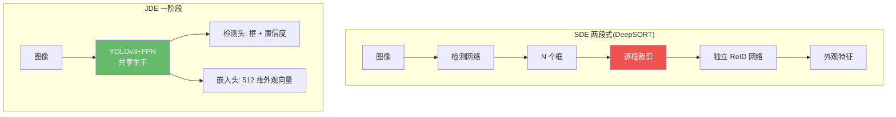
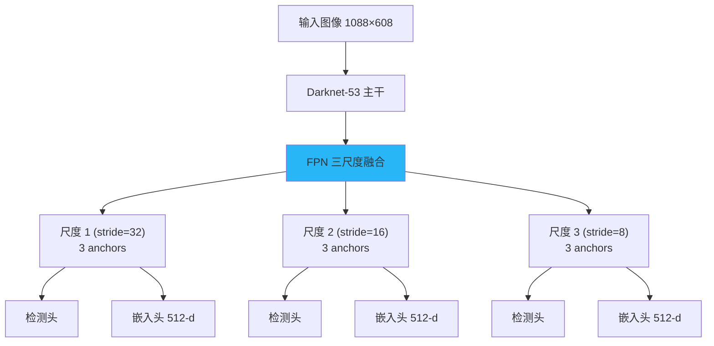
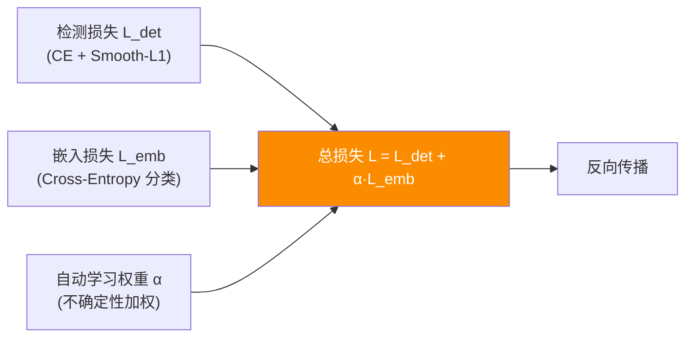

# JDE:首个一阶段联合检测与嵌入

> Wang et al. *Towards Real-Time Multi-Object Tracking*. ECCV 2020. arXiv:[1909.12605](https://arxiv.org/abs/1909.12605) · 代码 [Zhongdao/Towards-Realtime-MOT](https://github.com/Zhongdao/Towards-Realtime-MOT)
>
> 📚 本方法仓库未实现,属知识体系补全。本仓库走解耦的 tracking-by-detection 范式。

## 1. 一句话核心:检测与嵌入,一次前向全搞定

传统 SDE(Separate Detection and Embedding)管线需要先跑检测器、再对每个裁剪框跑 ReID 网络,推理时间是两者之**和**。JDE 的核心问题:能不能在一个网络里**同时**输出"框"和"每个框的外观向量"?答案:在 YOLOv3 + FPN 主干上加一条嵌入头,让每个 anchor 同时产出检测框和 512 维外观特征。

## 2. 网络架构:YOLOv3 + FPN + 嵌入头

### 2.1 主干与多尺度检测

JDE 采用 **Darknet-53** 作为主干网络,搭配 **FPN(特征金字塔)** 在 3 个尺度上做预测。每个尺度各设 3 组 anchor(共 9 组),覆盖从小到大的行人目标。输入分辨率默认 $1088 \times 608$,特征图步长分别为 32、16、8。

### 2.2 共享特征 + 双头输出

在 FPN 的每个尺度上,网络同时接两个头:

- **检测头**:标准 YOLOv3 输出——$(c_x, c_y, w, h, \text{obj}, \text{cls})$,负责框回归与分类。
- **嵌入头**:在同一层共享特征图上通过 **1×1 卷积** 回归出 $D=512$ 维的外观嵌入向量(L2 归一化后使用)。

## 3. 损失函数:多任务联合优化

总损失为检测损失与嵌入损失的加权和:

$$\mathcal{L} = \mathcal{L}_{\text{det}} + \alpha \cdot \mathcal{L}_{\text{emb}}$$

### 3.1 检测损失 $\mathcal{L}_{\text{det}}$

沿用 YOLOv3 标准:

- **分类**:交叉熵损失
- **框回归**:Smooth L1 损失
- **置信度**:二元交叉熵

### 3.2 嵌入损失 $\mathcal{L}_{\text{emb}}$

论文对比了三种嵌入损失:

| 损失类型 | 说明 | TAR@FAR=0.1 |
|----------|------|-------------|
| Triplet Loss | 三元组(anchor, positive, negative),margin 拉开正负对 | 基线 |
| Smooth Upper Bound | triplet 的光滑上界近似 | 略优于 triplet |
| **Cross-Entropy** | 把每个 ID 当类别做分类(softmax) | **最优**,+46.0 TAR |

最终论文采用**交叉熵分类损失**作为嵌入损失——每个行人 ID 视为一个类别,用 softmax 分类器学习,效果远优于 triplet loss。

### 3.3 多任务权重策略

论文比较了手动权重、不确定性加权(Kendall et al.)、MGDA-UB 等策略。实验发现**不确定性加权**(自动学习 $\alpha$)表现最好,无需手动调参。

## 4. 在线关联:卡尔曼 + 匈牙利

嵌入头输出的 512 维向量经 L2 归一化后,在线关联阶段与传统方法一致:

1. **卡尔曼滤波**预测每条轨迹在当前帧的位置;
2. 计算**余弦外观距离** $d_{\text{cos}} = 1 - \cos(\mathbf{f}_{\text{track}}, \mathbf{f}_{\text{det}})$;
3. 计算**马氏运动距离**(卡尔曼预测框 vs 检测框);
4. 融合为代价矩阵,**匈牙利算法**求最优匹配;
5. 未匹配检测初始化新轨迹,未匹配轨迹保留至 `max_age` 帧后删除。

!!! note "JDE 的关联后端并无创新"
    JDE 的贡献在**网络端**(联合前向),关联后端本质上仍是 DeepSORT 式的"外观+运动→匈牙利"。后续 FairMOT 继承了这一设计,CenterTrack 则走向了全新的位移回归路线。

## 5. 关键配置

| 参数 | 值 | 说明 |
|------|----|------|
| 主干 | Darknet-53 | YOLOv3 标准主干 |
| FPN 尺度 | 3 (stride 32/16/8) | 9 组 anchor |
| 嵌入维度 | 512 | L2 归一化 |
| 嵌入损失 | Cross-Entropy | 优于 triplet loss |
| 输入分辨率 | 1088×608 | 可缩小换速度 |
| 优化器 | SGD, lr=0.01 | 第 15/23 epoch ×0.1 |
| 训练 epoch | 30 | 混合数据集 |
| 多任务权重 | 不确定性自动学习 | Kendall et al. |

## 6. 性能与局限

**MOT16 测试集指标**(不同输入分辨率):

| 配置 | MOTA | IDF1 | FPS |
|------|------|------|-----|
| JDE-1088×608 | 64.4 | 55.8 | ~22 |
| JDE-864×480 | 62.1 | 53.2 | ~30 |
| JDE-576×320 | 58.0 | 48.6 | ~38 |

**局限**:

- **Anchor 错位**:anchor-based 检测头中,一个 anchor 可能覆盖多个目标,导致嵌入特征"混淆"——这是 FairMOT 提出 anchor-free 的直接动机。
- **任务竞争**:检测与 ReID 共享特征,存在梯度方向冲突,两个任务互相拖累。
- **ID 切换仍多**:遮挡/拥挤场景下嵌入特征区分度不足,ID Switch 偏高。
- **训练数据瓶颈**:交叉熵分类损失需要 ID 标注,限制了可用数据规模。

!!! tip "JDE 的历史意义"
    JDE 是第一个证明"一个网络同时出框和嵌入"可行的工作,开创了 Joint Detection and Embedding 范式。虽然后续 FairMOT 在各方面超越了它,但 JDE 定义了这个研究方向,后来的 CSTrack、TraDeS、RelationTrack 等都属 JDE 派系。

## 参考文献

- Wang et al. *Towards Real-Time Multi-Object Tracking*. ECCV 2020. arXiv:[1909.12605](https://arxiv.org/abs/1909.12605) · [代码](https://github.com/Zhongdao/Towards-Realtime-MOT)
- Redmon & Farhadi. *YOLOv3: An Incremental Improvement*. arXiv:[1804.02767](https://arxiv.org/abs/1804.02767)
- Kendall et al. *Multi-Task Learning Using Uncertainty to Weigh Losses*. CVPR 2018.

→ 上一篇:[JDE 派概览](jde-family.md) · 下一篇:[FairMOT](fairmot.md)
