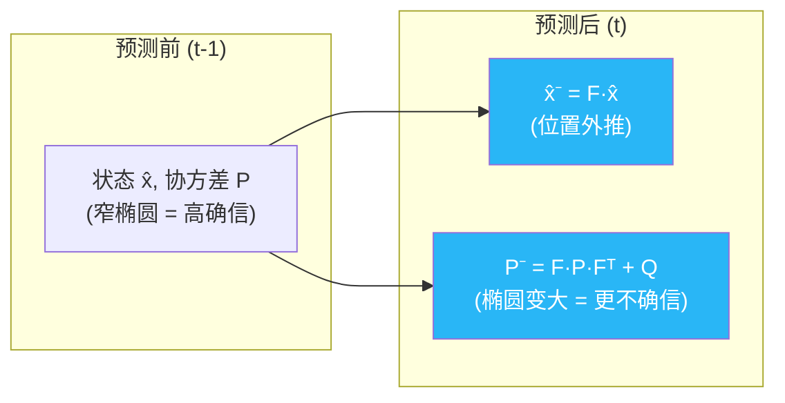
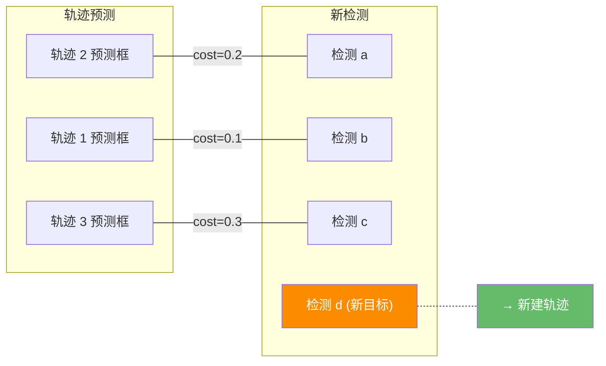
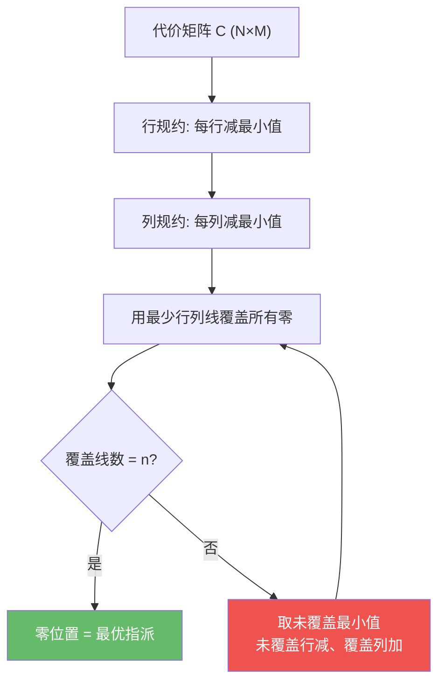
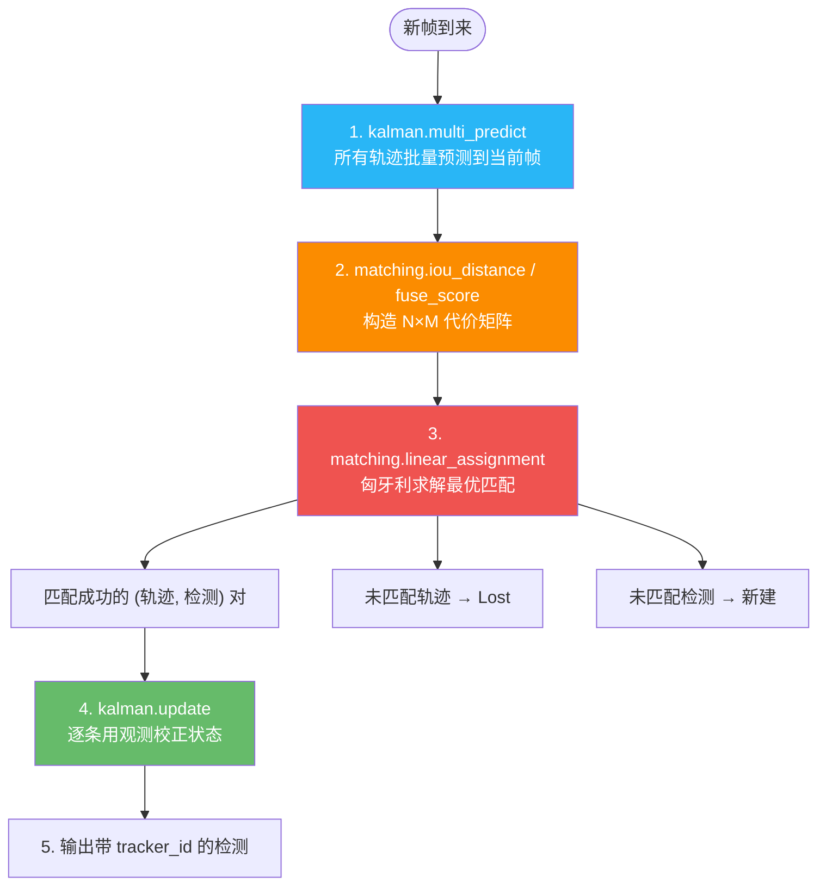

# 关联的两大数学基石:卡尔曼滤波与匈牙利算法

> 本篇深入讲解 tracking-by-detection 范式下**所有方法共享的两个数学基元**:用卡尔曼滤波预测目标下一帧在哪,用匈牙利算法在预测与新检测之间做最优配对。无论是 SORT、ByteTrack 还是 OC-SORT,底层都在反复调用这两个操作——理解它们,等于理解了整个家族的地基。
>
> 本仓库实现:  [`kalman.py`](https://github.com/yyq19990828/onnxtools/blob/main/onnxtools/tracking/kalman.py) / [`matching.py`](https://github.com/yyq19990828/onnxtools/blob/main/onnxtools/tracking/matching.py)

---

## 1. 卡尔曼滤波:预测目标下一帧在哪

### 1.1 直觉:为什么需要预测

检测器每帧独立出框——它只知道"这帧有个框在这里",不知道"这个框是上一帧的谁"。要做关联,我们需要一个**运动模型**:根据上一帧轨迹的位置和速度,**预测它在当前帧最可能出现的位置**,然后用预测框去和新检测框做匹配。

卡尔曼滤波正是这样一个递归估计器:它维护目标的**状态估计**(位置+速度)和**不确定度**(协方差矩阵),每帧交替执行两步——**预测**和**更新**:


### 1.2 状态空间模型

卡尔曼滤波建立在**线性高斯状态空间模型**上。定义:

- **状态向量** $x_k$:我们想估计但无法直接观测的完整状态(位置+速度)
- **观测向量** $z_k$:检测器给出的观测(只有位置,没有速度)
- **状态转移矩阵** $F$:描述状态如何从上一帧演化到当前帧
- **观测矩阵** $H$:描述状态如何映射到观测空间

完整的线性高斯模型:

$$x_k = F \cdot x_{k-1} + w, \quad w \sim \mathcal{N}(0, Q)$$

$$z_k = H \cdot x_k + v, \quad v \sim \mathcal{N}(0, R)$$

其中 $Q$ 是**过程噪声**协方差(建模运动的不确定性),$R$ 是**观测噪声**协方差(建模检测器出框的不确定性)。

!!! note "为什么是"线性"和"高斯""
    "线性"指状态转移和观测都用矩阵乘法描述(恒速假设下天然成立)。"高斯"指噪声服从正态分布。两个条件同时满足时,卡尔曼滤波是**理论最优**的递归估计器——这也是它在跟踪中经久不衰的根本原因。

**本仓库两种参数化的完整矩阵**:

| | XYAH (ByteTrack / DeepSORT) | XYSR (SORT / OC-SORT) |
|---|---|---|
| **状态 $x$** | $[c_x, c_y, a, h, \dot c_x, \dot c_y, \dot a, \dot h]^\top$ (8D) | $[c_x, c_y, s, r, \dot c_x, \dot c_y, \dot s]^\top$ (7D) |
| **观测 $z$** | $[c_x, c_y, a, h]^\top$ (4D) | $[c_x, c_y, s, r]^\top$ (4D) |
| **含义** | $a$=纵横比, $h$=高度 | $s$=面积, $r$=纵横比(恒定,无速度) |
| **$F$ 矩阵** | $8\times8$ 单位阵 + 上三角速度项 | $7\times7$ 仅 $x,y,s$ 有速度,$r$ 无 |
| **$H$ 矩阵** | $4\times8$ 取前 4 维 | $4\times7$ 取前 4 维 |
| **仓库类** | [`KalmanFilterXYAH`](https://github.com/yyq19990828/onnxtools/blob/main/onnxtools/tracking/kalman.py) | [`KalmanFilterXYSR`](https://github.com/yyq19990828/onnxtools/blob/main/onnxtools/tracking/kalman.py) |

!!! tip "XYSR 为什么 $r$ 没有速度?"
    SORT 原文假设目标的纵横比在短时间内基本不变(行人走路时身体比例不怎么变),所以状态只有 7 维而非 8 维。这降低了模型复杂度,对行人场景效果很好。

### 1.3 预测步 (Predict)

预测步做两件事:用运动模型外推状态,同时让不确定度增长(因为预测总比观测更不确定):

$$\hat{x}^- = F \cdot \hat{x}$$

$$P^- = F \cdot P \cdot F^\top + Q$$

**直觉**:$\hat{x}^-$ 就是"根据上一帧的速度,位置往前推一帧"(恒速假设)。$P^-$ 表示"我对这个预测有多不确信"——每做一次预测,不确定度都会因为 $Q$ 而膨胀。如果一个轨迹连续多帧没有被观测到(lost 状态),反复预测会让 $P$ 越来越大,意味着"我越来越不确定它在哪了"。



### 1.4 更新步 (Update)

当关联成功,轨迹 $i$ 配对到检测 $j$ 时,用检测的观测值 $z$ 来校正预测。核心是计算**卡尔曼增益** $K$:

$$S = H \cdot P^- \cdot H^\top + R \quad \text{(新息协方差)}$$

$$K = P^- \cdot H^\top \cdot S^{-1} \quad \text{(卡尔曼增益)}$$

$$\hat{x} = \hat{x}^- + K \cdot (z - H\hat{x}^-) \quad \text{(状态校正)}$$

$$P = (I - K \cdot H) \cdot P^- \quad \text{(协方差收缩)}$$

**$K$ 的直觉:平衡"信预测"还是"信观测"**:

- 当 $R$ 大(观测噪声大,检测器不靠谱) $\Rightarrow$ $S$ 大 $\Rightarrow$ $K$ 小 $\Rightarrow$ **更信预测**,观测只做微调
- 当 $P^-$ 大(预测不确定,已经 lost 好几帧) $\Rightarrow$ $K$ 大 $\Rightarrow$ **更信观测**,大幅校正预测

!!! warning "数值稳定性"
    计算 $K$ 需要对 $S$ 求逆。本仓库优先用 **Cholesky 分解** (`np.linalg.cholesky` + `np.linalg.solve`) 而非直接求逆,数值更稳定。当 $S$ 接近奇异时,加一个微小的 Tikhonov 阻尼项 $S + 10^{-6}I$ 回落到 `np.linalg.solve`,避免崩溃。详见 `KalmanFilterXYAH.update` 的 `try/except` 分支。

### 1.5 本仓库实现对照

两个卡尔曼类都提供相同的四个核心方法:

| 方法 | 作用 | 关键实现细节 |
|------|------|-------------|
| `initiate(measurement)` | 首次观测 → 初始化状态和协方差 | XYAH 的初始协方差随目标高度缩放;XYSR 的初始速度协方差设为 $10000\times$(高不确定) |
| `predict(mean, cov)` | 单条轨迹预测 | XYSR 额外检查面积 $s$ 是否预测为负,若是则归零速度 |
| `update(mean, cov, measurement)` | 用观测校正 | Cholesky 求解 + Tikhonov 阻尼回落 |
| `multi_predict(means, covs)` | **N 条轨迹批量预测(热点)** | 见下文 |

**工程优化:`multi_predict` 用 `np.einsum` 批量化**

每帧需要对池中所有活跃轨迹执行预测。逐条 Python `for` 循环在 200 条轨迹时就会成为瓶颈。本仓库用一条 `np.einsum` 一次性算完 N 个 $F P F^\top$:

```python
# kalman.py — KalmanFilterXYAH.multi_predict (核心行)
new_means = means @ F.T                                        # [N,8]·[8,8] → [N,8]
new_covs = np.einsum("ij,njk,lk->nil", F, covariances, F)     # 批量 F·P·Fᵀ
          + motion_cov                                          # + Q (每条轨迹各自的噪声)
```

!!! note "噪声随高度缩放 (XYAH)"
    `KalmanFilterXYAH` 的过程噪声和观测噪声都乘以目标的当前高度 $h$:框越大的目标,允许的位置波动越大。这是 SORT/DeepSORT 原文的经典做法。`KalmanFilterXYSR` 则使用固定噪声矩阵(更简洁)。

**马氏距离门控:`gating_distance` 方法**

DeepSORT 和 BoT-SORT 用马氏距离做运动门控——只有在卡尔曼预测的置信椭圆内的检测才被允许参与关联。本仓库 `gating_distance` 方法同时支持欧氏和马氏两种度量:

$$d_{\text{Maha}}^2 = (z - \hat{z})^\top S^{-1} (z - \hat{z})$$

门控阈值取自 $\chi^2$ 分布的 95% 分位数(4 自由度时为 $9.4877$),存储在模块顶部的 `chi2inv95` 字典中。

---

## 2. 匈牙利算法:最优二分匹配

### 2.1 关联问题的形式化

有了 N 条轨迹的预测框和 M 个新检测框,关联问题可以表述为:

> 在一个 $N \times M$ 的**代价矩阵** $C$ 上,找到一组**一对一**配对 $(i, j)$,使得总代价 $\sum C[i,j]$ 最小。

其中 $C[i,j]$ 表示"轨迹 $i$ 和检测 $j$ 有多不像"(代价越低越可能是同一目标)。这就是经典的**线性指派问题 (Linear Assignment Problem, LAP)**。



### 2.2 代价度量大全

代价矩阵的"不相似度"用什么度量,是各方法的核心分水岭:

**IoU 距离**(最常用):

$$\text{IoU}(a, b) = \frac{|a \cap b|}{|a \cup b|}, \quad \text{cost} = 1 - \text{IoU}$$

本仓库 `box_iou_batch(a, b)` 用纯 numpy 广播实现 `[N,4] × [M,4] → [N,M]`,零循环。

**马氏距离**(DeepSORT 运动门控):

$$d^2 = (z - \hat{z})^\top S^{-1} (z - \hat{z}), \quad \text{门控:} d^2 \leq \chi^2_{0.95}(\text{dim})$$

用卡尔曼预测的协方差 $S$ 做归一化,能自适应地反映"在当前不确定度下,这个检测离预测有多远"。

**余弦外观距离**(DeepSORT / BoT-SORT / StrongSORT):

$$d_{\cos} = 1 - \frac{f_{\text{track}} \cdot f_{\text{det}}}{|f_{\text{track}}| \cdot |f_{\text{det}}}|$$

用 ReID 网络提取的外观特征向量做余弦相似度。遮挡后仅靠运动模型难以恢复时,外观是关键线索。

**分数融合 fuse_score**(ByteTrack 一阶段):

$$\text{fused\_cost}[i,j] = 1 - (1 - \text{cost}[i,j]) \cdot \text{score}_j$$

高置信检测的 IoU 重叠被"放大",让高分检测更容易匹配上。

**运动方向余弦 OCM**(OC-SORT):

$$d_{\text{OCM}} = -\text{inertia} \cdot \cos(\vec{v}_{\text{track}}, \vec{v}_{\text{det}})$$

如果轨迹速度方向和"上次观测→当前检测"的方向一致,则代价更低。

| 代价类型 | 公式 | 适用方法 | 优势 | 劣势 |
|----------|------|----------|------|------|
| IoU 距离 | $1-\text{IoU}$ | SORT / ByteTrack / OC-SORT | 简单高效,无需额外模型 | 框不重叠即失效 |
| 马氏距离 | $d^2_{\text{Maha}}$ | DeepSORT 运动门控 | 自适应不确定度 | 依赖卡尔曼准确性 |
| 余弦外观 | $1-\cos$ | DeepSORT / BoT-SORT | 遮挡恢复强 | 需 ReID 模型,外观相似时失效 |
| fuse_score | $(1-\text{IoU})\cdot\text{score}$ | ByteTrack | 利用检测置信度 | 仅 IoU 可达时有效 |
| OCM 方向 | $-\cos(\vec v)$ | OC-SORT | 运动方向一致性 | 静止目标无效 |

### 2.3 匈牙利算法原理

匈牙利算法(Kuhn-Munkres, 1955/1957)在 $O(n^3)$ 时间内求解线性指派问题的全局最优解。其核心思路:

1. **行规约**:每行减去该行最小值 → 每行至少有一个零
2. **列规约**:每列减去该列最小值 → 每列至少有一个零
3. **零覆盖**:用最少的行/列线覆盖所有零。若线数 = $n$,则当前零位置给出最优指派
4. **调整**:若线数 < $n$,找未覆盖元素的最小值,从未覆盖行减去、给覆盖列加上,回到步 3



!!! note "阈值门控:禁止不合理的匹配"
    跟踪中不是所有配对都该被允许——代价超过阈值 `thresh` 的配对应被禁止。本仓库在 `linear_assignment(cost, thresh)` 中实现:对 `lap.lapjv` 使用 `cost_limit` 参数直接稀疏化;对 `scipy` 回落路径则将超阈值位置设为大值,求解后再过滤。

### 2.4 本仓库实现对照

`matching.py` 的 `linear_assignment` 是一个**双后端分发器**:

```python
# matching.py — 优先 lap,回落 scipy
if _HAS_LAP:
    _, x, y = lap.lapjv(_cost, extend_cost=True, cost_limit=float(thresh))
    # x[i] = 匹配到第 i 行的列号,未匹配为 -1
else:
    # scipy 不支持 cost_limit,手动将超阈值设为大值再过滤
    cost_padded = np.where(cost > thresh, big, cost)
    row_ind, col_ind = linear_sum_assignment(cost_padded)
```

返回统一的三元组 `(matches, unmatched_a, unmatched_b)`,下游 tracker 无需关心用了哪个后端。

**性能对比:lap vs scipy**

| 矩阵规模 | `lap.lapjv` | `scipy.linear_sum_assignment` | 加速比 |
|-----------|-------------|-------------------------------|--------|
| 50×50 | ~0.05 ms | ~0.15 ms | ~3× |
| 200×200 | ~0.8 ms | ~3.5 ms | ~4× |
| 500×500 | ~5 ms | ~25 ms | ~5× |

`lap.lapjv` 是 Jonker-Volgenant 算法的 C++ 实现,原生支持 `cost_limit` 稀疏化——在矩阵稀疏时跳过大量无效配对,实际加速比可远超上表。`scipy` 从 1.4 版起底层也换成了 C++,但缺乏稀疏化支持。边缘设备(Jetson)上建议安装 `lap`:

```bash
uv pip install -e ".[tracking-fast]"   # 安装 lap 可选依赖
```

### 2.5 级联匹配 vs 单级匹配

不同方法在"怎么构造代价矩阵"和"怎么分阶段匹配"上各有策略:


- **DeepSORT 级联匹配**:按轨迹丢失帧数分层,刚丢的轨迹优先匹配,长期丢失的后匹配。每层用外观+马氏距离联合代价。最后剩余的用纯 IoU 兜底。
- **ByteTrack 三阶段**:先用高分检测配全部轨迹(fuse_score 加权 IoU),再用低分检测配剩余 tracked 轨迹(纯 IoU),最后用未匹配的高分检测去确认新建的 unconfirmed 轨迹。
- **OC-SORT OCR 恢复**:一阶段用 IoU+OCM 方向余弦。失败的轨迹不用卡尔曼预测框,而是用**最后一次真实观测框** `last_observation` 再做一次 IoU 关联——这在目标被遮挡后卡尔曼预测偏移严重时特别有效。

---

## 3. 两个基石如何协作

每帧到来时,卡尔曼滤波和匈牙利算法按以下流程协作:



对应本仓库的调用链(以 `ByteTrackNative` 为例):

```
ByteTrackNative.update(detections)
    ├── kf.multi_predict(means, covs)        # 步骤 1: 批量卡尔曼预测
    ├── matching.iou_distance(pred, dets)     # 步骤 2: 构造 IoU 代价矩阵
    ├── matching.fuse_score(cost, scores)     # 步骤 2: ByteTrack 分数融合
    ├── matching.linear_assignment(cost, th)  # 步骤 3: 匈牙利求解
    └── kf.update(mean, cov, z)              # 步骤 4: 逐条卡尔曼更新
```

!!! tip "这就是为什么这两个基石如此重要"
    后续所有方法——ByteTrack 的高低分两级、OC-SORT 的方向代价、DeepSORT 的外观融合、BoT-SORT 的相机补偿——都只是在**步骤 2 构造什么样的代价矩阵**和**步骤 3 怎么分阶段匹配**上做文章。卡尔曼预测(步骤 1)和卡尔曼更新(步骤 4)几乎从未改变。掌握了本篇的数学原理,再读任何一篇方法论文都会非常自然。

---

## 参考文献

- Bewley et al. *Simple Online and Realtime Tracking*. ICIP 2016. arXiv:[1602.00763](https://arxiv.org/abs/1602.00763) — SORT 原文,确立了卡尔曼+匈牙利的跟踪骨架
- Kuhn, H. W. *The Hungarian Method for the Assignment Problem*. Naval Research Logistics, 1955 — 匈牙利算法原文
- Munkres, J. *Algorithms for the Assignment and Transportation Problems*. JSMAM, 1957 — 证明匈牙利算法是强多项式的
- Welch & Bishop. *An Introduction to the Kalman Filter*. UNC-Chapel Hill TR 95-041 — 卡尔曼滤波经典教程
- Jonker & Volgenant. *A shortest augmenting path algorithm for dense and sparse linear assignment problems*. Computing 38, 1987 — `lap.lapjv` 的算法基础

→ 上一篇:[概念总览](index.md) · 下一篇:[传统方法](traditional-methods.md)
