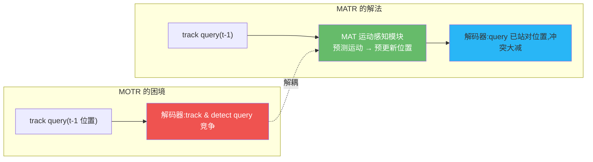
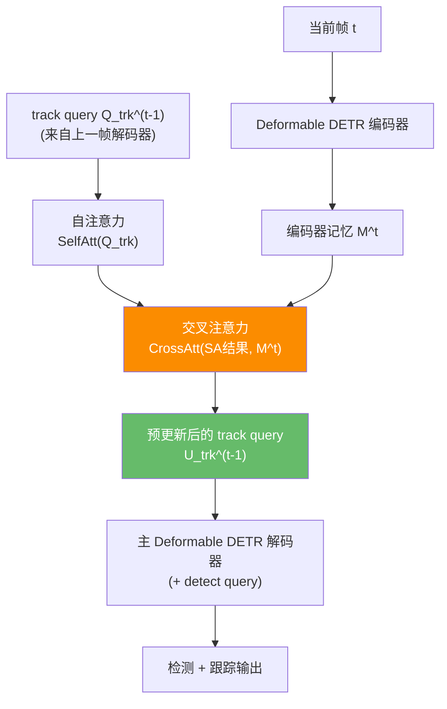

# MATR:运动感知 Transformer,用预测运动化解 query 冲突

> Yang & Agam. *Motion-Aware Transformer for Multi-Object Tracking*. 2025. arXiv:[2509.21715](https://arxiv.org/abs/2509.21715) · 代码:暂未公开
>
> 📚 本方法仓库未实现,属知识体系补全(2025 前沿)。

## 1. 一句话核心

**MOTR/MOTRv2 的 track query 与 detect query 在同一解码器层里竞争,导致关联漂移。MATR 在解码器前插入一个"运动感知模块"(MAT),显式预测目标运动并预更新 track query 的位置,让它在进入解码器时就已经"站对了位置"——DanceTrack HOTA 从 MOTR 的 ~62 跃升至 71.3,仅多 1M 参数。**

## 2. 核心问题:query 冲突从哪来?

DETR 式跟踪器把 detect query(发现新目标)和 track query(延续已有轨迹)同时送进解码器:

- track query 携带的是**上一帧**的位置编码,当目标移动较大时,它的位置先验已经**过时**
- 解码器的注意力不得不同时做"定位修正"和"身份关联",容易导致 track query 漂移到错误目标,或 detect query 与 track query 重复检出同一目标

MATR 的核心观察:**如果在进入解码器前,就把 track query 的位置"搬"到当前帧的正确位置附近,冲突自然消解。**

## 3. 架构:Motion-Aware Transformer (MAT) 模块

MAT 模块本质是一个独立的 Deformable Transformer 解码器层(仅 1 层),专门处理 track query:

$$U_{\text{trk}}^{t-1} = Q_{\text{trk}}^{t-1} + \text{CrossAtt}\bigl(\text{SelfAtt}(Q_{\text{trk}}^{t-1}),\; M^t\bigr)$$

- **自注意力**:让各 track query 之间交换信息(类似"互相对齐")
- **交叉注意力**:用当前帧的编码器特征 $M^t$ 驱动 track query 的位置更新——等价于在特征空间中"预测运动"
- 整个过程在主解码器**之前**完成,因此主解码器接收到的 track query 已经具有当前帧的位置先验

### 3.1 轨迹损失

为了监督 MAT 模块学到正确的运动预测,引入 L1 轨迹损失:

$$\mathcal{L}_{\text{traj}} = \frac{1}{N} \sum_{B} \sum_{S} \sum_{N_{\text{trk}}} L_1(\tilde{Y}_{\text{bbox}},\; Y_{\text{bbox}})$$

总损失:$\mathcal{L}_{\text{MATR}} = 5 \cdot \mathcal{L}_{\text{traj}} + \mathcal{L}_{\text{MOTR}}$

!!! note "为什么 L1 而非 GIoU?"
    论文指出 L1 损失直接惩罚位置和尺度偏差,对同步特征嵌入与位置编码更关键。消融实验验证 L1 优于 GIoU 在此模块中的效果。

### 3.2 与卡尔曼滤波的对比

一种自然的替代方案是用卡尔曼滤波器预测 track query 的位置。但论文实验表明,KF 会显著降低 DetA(检测准确度),因为 KF 是线性假设,无法与端到端梯度优化协同。MAT 的可学习运动预测在端到端框架中表现更优。

## 4. 关键配置

| 参数 | 值 | 说明 |
|------|-----|------|
| 骨干 | ResNet-50 + Swin-Tiny | 43M 参数(MOTRv2 的 94M 的一半) |
| MAT 层数 | 1 层 | 消融显示 3 层反而下降 |
| 检测置信阈值 $\tau_{\text{det}}$ | 0.7 | 新目标 query 进入阈值 |
| 跟踪置信阈值 $\tau_{\text{trk}}$ | 0.5 | track query 退场阈值 |
| 最大丢失帧数 $T_{\text{miss}}$ | 25 | 超过则终止轨迹 |
| query dropout | 0.1 | 模拟目标进出 |
| 序列长度 $S$ | 固定长度 | 不像 MOTR 那样逐步增长 |
| 训练硬件 | 8 x A5000 | 约 2.5 天 (含 CrowdHuman 预训练) |

## 5. 性能与局限

### 基准结果

| 数据集 | HOTA | AssA | IDF1 | 备注 |
|--------|------|------|------|------|
| DanceTrack test | **71.3** | 61.6 | 75.3 | +9.4 vs MOTR,SOTA |
| SportsMOT test | **72.7** | 62.0 | — | DetA 85.3,SOTA(无外部数据) |
| BDD100K val | 41.6 mHOTA | — | — | mTETA 54.7 |

### 与同期方法对比

| 方法 | DanceTrack HOTA | 参数量 | 端到端? |
|------|----------------|--------|---------|
| MOTR | ~62 | — | 完全 |
| MeMOTR | 68.5 | — | 完全(记忆增强) |
| MOTRv2 | 73.4(集成) | 94M | 半(需 YOLOX) |
| **MATR** | **71.3**(单模型) | **43M** | **完全** |

### 局限

- **论文极新**(2025.09),社区验证有限,无公开代码
- 仍需多 GPU + CrowdHuman 预训练,部署门槛高于 tracking-by-detection
- 未报告 MOT17/MOT20 数据,跨场景泛化待验证
- 端到端方案的通病:推理速度远不及 ByteTrack/OC-SORT 的 100+ FPS

!!! note "对本仓库用户的启示"
    MATR 证明了"显式运动建模"在端到端框架中的价值——运动预测不是 tracking-by-detection 的专利。但若追求工程落地,本仓库的 ByteTrack/OC-SORT 仍是更务实的选择;MATR 的思路更适合作为学术研究方向的参考。

## 参考文献

- Yang & Agam. *Motion-Aware Transformer for Multi-Object Tracking*. arXiv:[2509.21715](https://arxiv.org/abs/2509.21715)
- (基线) Zeng et al. *MOTR*. ECCV 2022. arXiv:[2105.03247](https://arxiv.org/abs/2105.03247)
- (对比) Zhang et al. *MOTRv2*. CVPR 2023. arXiv:[2211.09791](https://arxiv.org/abs/2211.09791)
- (对比) Cai et al. *MeMOTR*. ICCV 2023. arXiv:[2307.15700](https://arxiv.org/abs/2307.15700)

→ 上一篇:[MOTRv2](motrv2.md) · 下一篇:[MeMoSORT](memosort.md)
