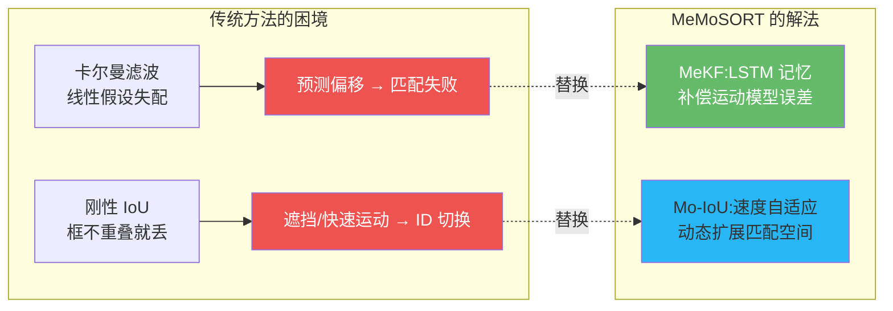
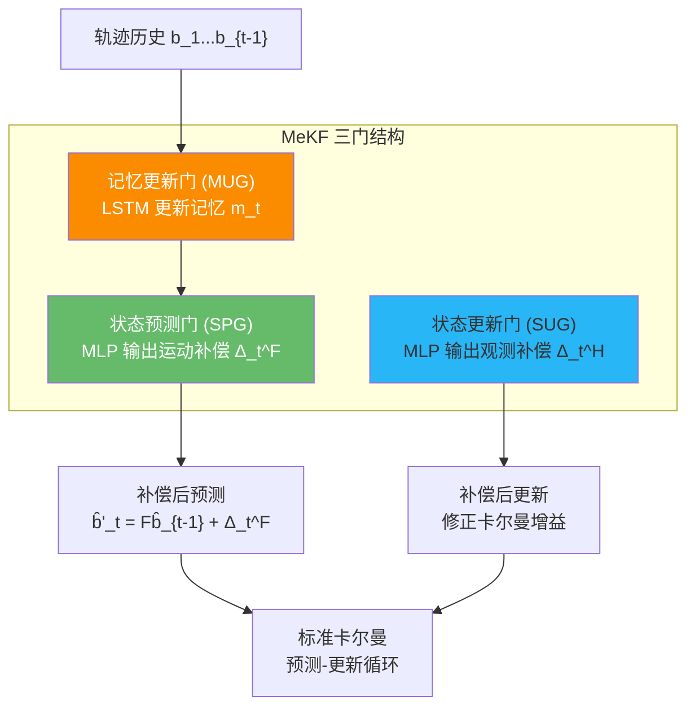

# MeMoSORT:记忆辅助滤波 + 运动自适应关联

> Wang et al. *MeMoSORT: Memory-Assisted Filtering and Motion-Adaptive Association Metric for Multi-Person Tracking*. 2025. arXiv:[2508.09796](https://arxiv.org/abs/2508.09796) · 代码:暂未公开
>
> 📚 本方法仓库未实现,属知识体系补全(2025 前沿)。属 tracking-by-detection 范式。

## 1. 一句话核心

**卡尔曼滤波假设匀速线性运动,IoU 匹配假设框重叠充分——这两个假设在舞蹈、运动等非线性场景全面崩溃。MeMoSORT 用 LSTM 记忆库补偿卡尔曼的运动误差(MeKF),用运动自适应 IoU(Mo-IoU)根据目标速度动态扩展匹配空间——在 DanceTrack 上 HOTA 67.9,SportsMOT 上 82.1,均为 tracking-by-detection 最强。**

## 2. 模块一:记忆辅助卡尔曼滤波 (MeKF)

传统卡尔曼滤波是马尔可夫的——只看上一帧。MeKF 引入 LSTM 记忆,让滤波器能回顾整条轨迹历史:

### 关键公式

记忆更新(LSTM 递归):

$$m_t = \mathcal{F}_{\text{LSTM}}(c_{t-1}, h_{t-1}, m_{t-1})$$

运动补偿预测(MLP 从记忆中预测偏差):

$$\hat{b}'_t = F\hat{b}_{t-1} + \Delta_t^F, \quad \Delta_t^F = \text{MLP}_1(m_t)$$

其中 $F$ 是标准卡尔曼状态转移矩阵。当 $\Delta_t^F = 0$ 时,MeKF 退化为标准卡尔曼滤波——设计上优雅地保持了向后兼容。

!!! note "非马尔可夫运动模型"
    MeKF 的本质是把马尔可夫运动模型 $b_t = Fb_{t-1} + w_t$ 推广为非马尔可夫: $b_t = f_t(b_{t-1}, b_{t-2}, \ldots, b_1) + w_t$。LSTM 的记忆机制天然适合编码这种长程依赖。

## 3. 模块二:运动自适应 IoU (Mo-IoU)

标准 IoU 在目标快速移动时容易归零(预测框与检测框不重叠)。Mo-IoU 包含两个组件:

### 3.1 扩展 IoU (EIoU)

按运动速度动态放大预测框:

$$\text{EIoU} = \text{IoU}\bigl(\text{Scale}(\hat{b}'_t,\; 2p_t+1),\; \tilde{b}_t\bigr)$$

当 $p_t = 0$ 时退化为标准 IoU。

### 3.2 高度相似度 (HIoU)

利用垂直方向的重叠抑制远处目标的误匹配:

$$\text{HIoU} = \left(\frac{l_t}{\hat{h}'_t + \tilde{h}_t - l_t}\right)^{q_t}$$

其中 $l_t$ 是垂直方向交集高度,$q_t$ 控制惩罚强度。

### 3.3 运动自适应技术 (MAT)

$p_t$ 和 $q_t$ 根据目标归一化速度自适应调整:

- 中心速度快($\dot{c}_{t-1} > \Theta_{\text{center}}$)→ $p_t$ 增大,扩展匹配空间
- 高度变化快($\dot{l}_{t-1} > \Theta_{\text{height}}$)→ $q_t$ 减小,放松高度约束

最终:$\text{Mo-IoU} = \text{EIoU} \times \text{HIoU}$

## 4. 关键配置

| 参数 | 值 | 说明 |
|------|-----|------|
| 检测器 | YOLOX (CrowdHuman 微调) | 继承 Deep OC-SORT 流水线 |
| 高分阈值 | 0.6 | 一阶段匹配 |
| 低分阈值 | 0.1 | 二阶段匹配 |
| 慢速扩展 $M_{\text{slow}}$ | 2 | EIoU 慢速目标参数 |
| 快速扩展 $M_{\text{fast}}$ | 1 | EIoU 快速目标参数 |
| HIoU 慢速指数 $N_{\text{slow}}$ | 0.5 | 高度惩罚强度 |
| HIoU 快速指数 $N_{\text{fast}}$ | 0.6 | 放松高度约束 |
| ReID | 可选集成 | 完整系统含外观特征 |

## 5. 性能与局限

### 基准结果

| 数据集 | HOTA | AssA | IDF1 | MOTA | FPS |
|--------|------|------|------|------|-----|
| DanceTrack test | **67.9** | 54.3 | 68.0 | 93.4 | 28.8 |
| SportsMOT test | **82.1** | 75.6 | 86.4 | 97.0 | — |

### 与同范式方法对比

| 方法 | DanceTrack HOTA | SportsMOT HOTA | 范式 |
|------|----------------|----------------|------|
| ByteTrack | 47.7 | — | TbD |
| OC-SORT | 55.1 | — | TbD |
| Deep OC-SORT | 61.3 | — | TbD |
| **MeMoSORT** | **67.9** | **82.1** | TbD |

### 局限

- MeKF 的 LSTM 引入约 50% 速度下降(基线 74.5 → 完整系统 28.8 FPS)
- 论文极新(2025.08),无公开代码,社区复现有限
- 仅评估 DanceTrack/SportsMOT,未覆盖 MOT17/MOT20
- LSTM 记忆需足够长的轨迹历史才能生效,对短轨迹帮助有限

!!! note "对本仓库用户的启示"
    MeMoSORT 证明 tracking-by-detection 范式远未到天花板——通过改进运动模型(MeKF)和匹配度量(Mo-IoU),可以在不引入端到端 Transformer 的前提下大幅提升性能。本仓库的 ByteTrack/OC-SORT 用户若需要提升非线性运动场景的表现,MeKF 的"记忆补偿"思路值得借鉴。

## 参考文献

- Wang et al. *MeMoSORT: Memory-Assisted Filtering and Motion-Adaptive Association Metric for Multi-Person Tracking*. arXiv:[2508.09796](https://arxiv.org/abs/2508.09796)
- (基线) Du et al. *StrongSORT / Deep OC-SORT*. arXiv:[2206.14589](https://arxiv.org/abs/2206.14589)
- (对比) Zhang et al. *ByteTrack*. arXiv:[2110.06864](https://arxiv.org/abs/2110.06864)
- (对比) Cao et al. *OC-SORT*. arXiv:[2203.14360](https://arxiv.org/abs/2203.14360)

→ 上一篇:[MATR](matr.md) · 下一篇:[PuTR](putr.md)
