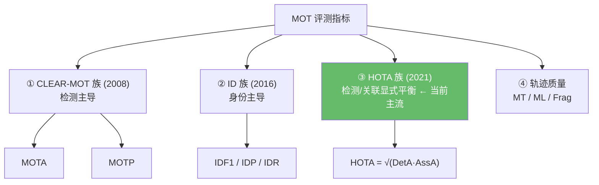
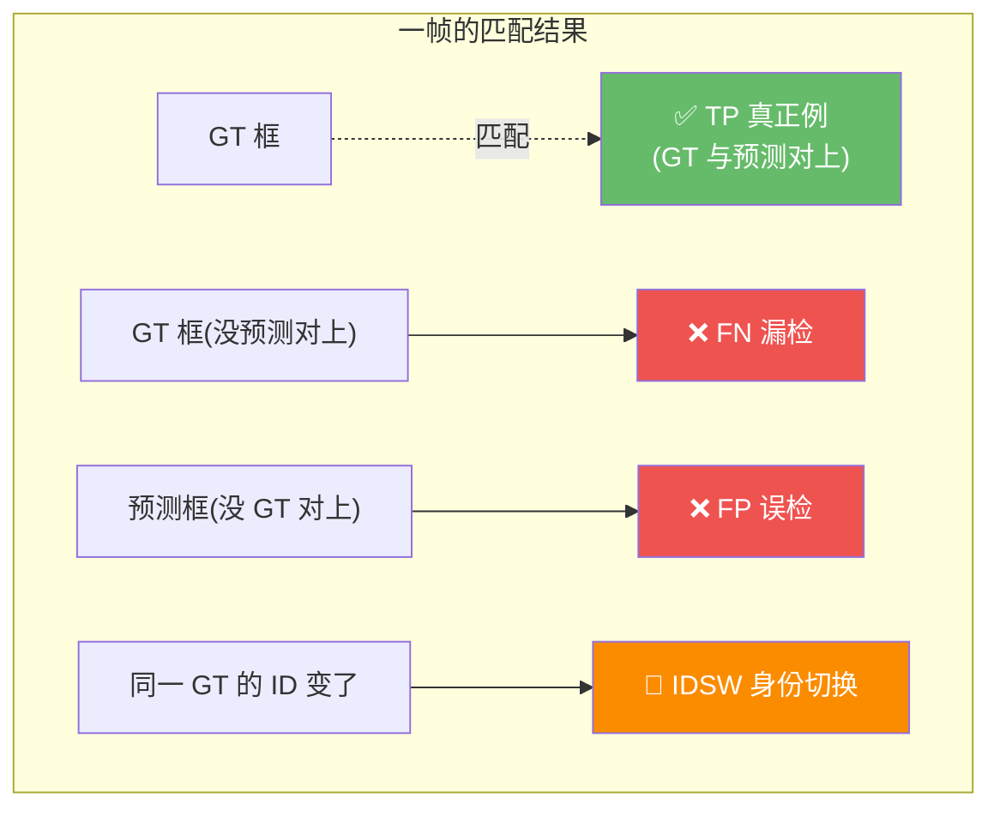
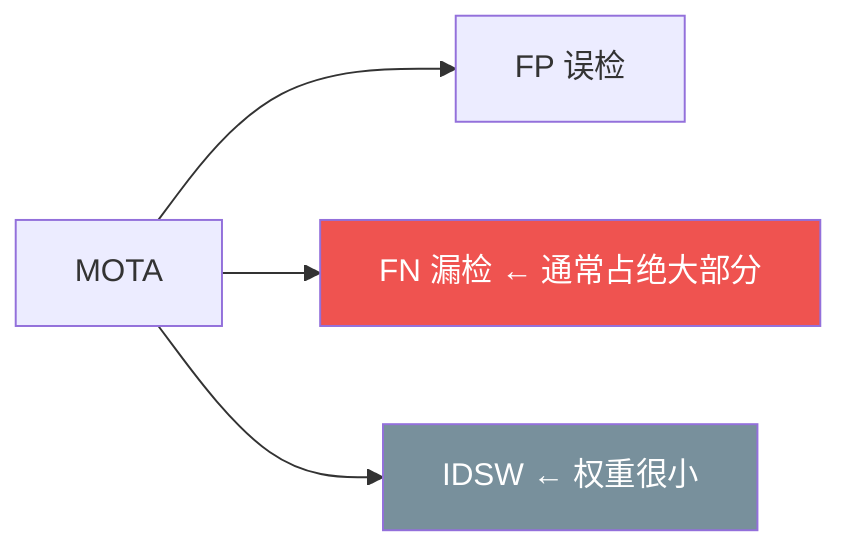
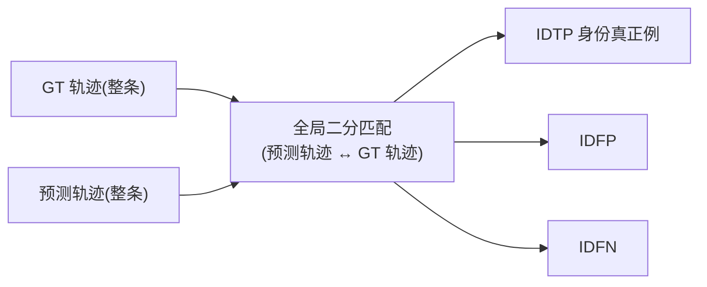
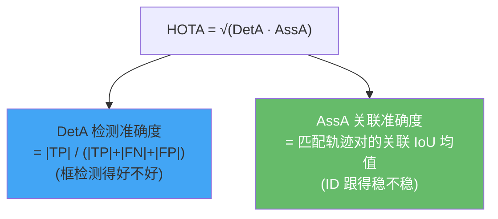
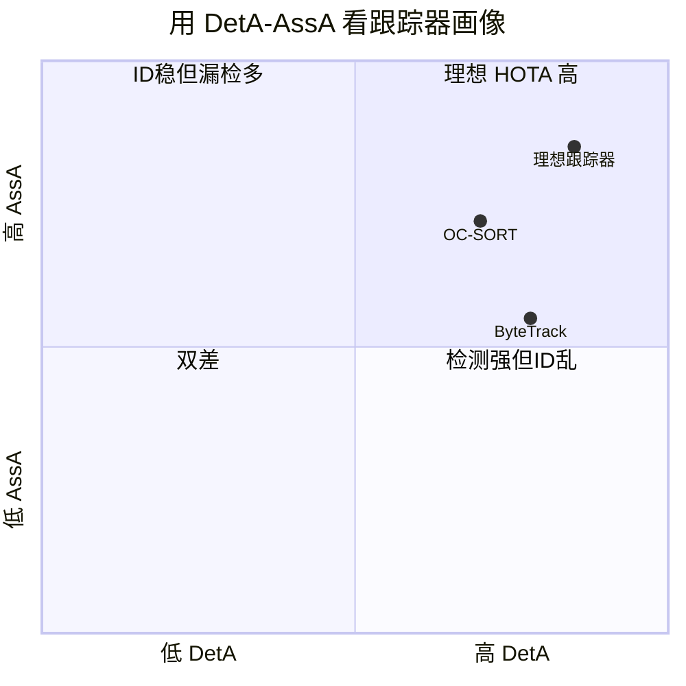
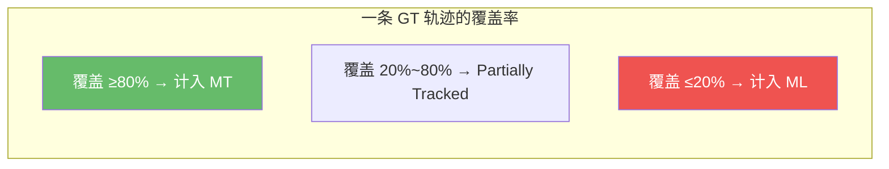
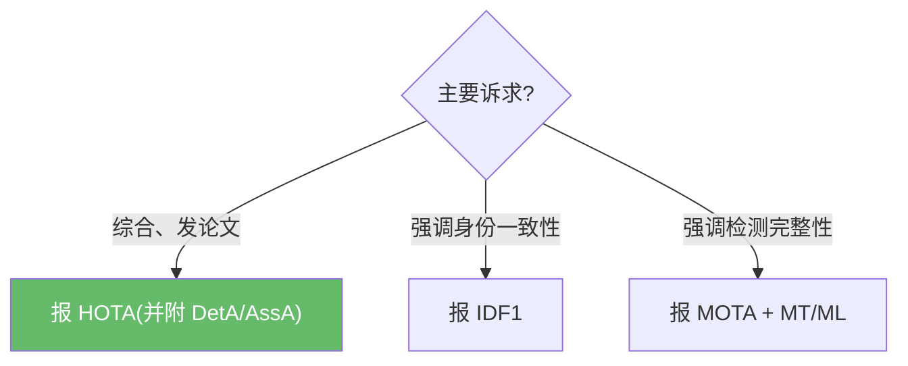

# 评测指标详解:从 CLEAR-MOT 到 HOTA

> 跟踪指标比检测复杂——既要"框得准"(检测),又要"跟得稳"(身份)。本篇系统梳理传统指标(MOTA/MOTP/IDF1)与近几年成为事实标准的新指标(HOTA),讲清每个指标度量**什么**、**怎么算**、以及它的**盲区**。
>
> 概念前置见 [概念总览](index.md)。

## 1. 指标全景:三族 + 轨迹质量

**演进逻辑**:MOTA 偏检测、对 ID 不敏感 → IDF1 补上身份视角但偏关联 → HOTA 把检测与关联**显式拆开再几何平均**,一个数兼顾两面,成为今日论文标配。

## 2. 三类基础错误

所有指标都建立在帧级匹配后的四类计数上。先用一帧理解它们:

- **TP**:预测框与 GT 框匹配成功(通常 IoU ≥ 0.5)。
- **FP(误检)**:预测了但没有对应 GT。
- **FN(漏检)**:有 GT 但没预测到。
- **IDSW(身份切换)**:同一条 GT 轨迹被分配的 tracker_id 发生了变化。

## 3. CLEAR-MOT 族(2008,传统)

> Bernardin & Stiefelhagen. *Evaluating Multiple Object Tracking Performance: The CLEAR MOT Metrics*. EURASIP 2008.

### 3.1 MOTA —— 最常被引用,也最容易误读

$$\text{MOTA} = 1 - \frac{\sum_t (\text{FN}_t + \text{FP}_t + \text{IDSW}_t)}{\sum_t \text{GT}_t}$$

- 范围 $(-\infty, 1]$,可为负(错误比 GT 还多时)。
- **盲区:由检测错误(FP+FN)主导**。在典型场景里 FP+FN 数量远大于 IDSW,所以 **MOTA 高几乎只说明"检测好",几乎不反映 ID 跟得稳不稳**。

!!! warning "经典陷阱"
    两个跟踪器 MOTA 都是 80,但 A 的 IDSW 是 B 的 10 倍——MOTA 几乎看不出差别。这正是 DanceTrack 不主推 MOTA、改用 HOTA 的原因。

### 3.2 MOTP —— 只管定位精度

$$\text{MOTP} = \frac{\sum_{t,i} \text{IoU}(\text{matched}_{t,i})}{\sum_t c_t}$$

匹配上的真正例的平均 IoU(重叠度),$c_t$ 为第 $t$ 帧匹配数。**只衡量"框得多准",完全不衡量"跟得对不对"**,因此很少单独作为主指标。

## 4. ID 族(2016,身份导向)

> Ristani et al. *Performance Measures and a Data Set for Multi-Target, Multi-Camera Tracking*. ECCV 2016.

CLEAR-MOT 的 IDSW 是**逐帧局部**统计;ID 族改为**全局轨迹匹配**:在 GT 轨迹与预测轨迹之间做一次全局二分匹配,再统计身份层面的真正例/误报/漏报(IDTP/IDFP/IDFN)。

$$\text{IDP} = \frac{\text{IDTP}}{\text{IDTP}+\text{IDFP}}, \quad \text{IDR} = \frac{\text{IDTP}}{\text{IDTP}+\text{IDFN}}, \quad \text{IDF1} = \frac{2\,\text{IDTP}}{2\,\text{IDTP}+\text{IDFP}+\text{IDFN}}$$

- **IDF1** = IDP 与 IDR 的调和平均,**衡量"全程是否一直保持同一个 ID"**。
- 与 MOTA 互补:MOTA 看检测,IDF1 看身份一致性。一个跟踪器可能 MOTA 高(检测好)但 IDF1 低(ID 乱跳)。

## 5. HOTA 族(2021,当前事实标准)

> Luiten et al. *HOTA: A Higher Order Metric for Evaluating Multi-Object Tracking*. IJCV 2021. arXiv:[2009.07736](https://arxiv.org/abs/2009.07736) · 官方评测工具 [TrackEval](https://github.com/JonathonLuiten/TrackEval)

HOTA 解决的痛点:MOTA 偏检测、IDF1 偏关联,且二者都把"定位阈值"写死。HOTA 把**检测准确度**与**关联准确度**显式拆开,几何平均,并在多个定位阈值 $\alpha$ 上积分:

$$\text{HOTA}(\alpha) = \sqrt{\text{DetA}(\alpha)\cdot\text{AssA}(\alpha)}, \qquad \text{HOTA} = \int_{0}^{1}\text{HOTA}(\alpha)\,d\alpha$$

(实际在 $\alpha \in \{0.05, 0.1, \dots, 0.95\}$ 上平均。)

- **DetA(Detection Accuracy)** $= \dfrac{|\text{TP}|}{|\text{TP}|+|\text{FN}|+|\text{FP}|}$ —— 检测层面的 Jaccard。
- **AssA(Association Accuracy)** —— 对每个 TP 计算其轨迹对的关联 IoU $\dfrac{|\text{TPA}|}{|\text{TPA}|+|\text{FNA}|+|\text{FPA}|}$,再平均。

**为什么 HOTA 取代了 MOTA**:几何平均使得**检测和关联任一坍塌都会拉低总分**——它一眼区分"检测强但 ID 乱"(DetA 高 AssA 低)与"ID 稳但漏检多"(反之)。DanceTrack、SportsMOT、KITTI 均已将 HOTA 列为主指标。

> 上图为示意性定位,非精确数值——意在说明 ByteTrack 偏"检测强",OC-SORT 偏"关联稳"。

## 6. 轨迹质量指标

| 指标 | 定义 | 含义 |
|------|------|------|
| **MT** (Mostly Tracked) | 被成功覆盖 **≥80%** 生命周期的 GT 轨迹数 | 越多越好 |
| **ML** (Mostly Lost) | 被覆盖 **≤20%** 的 GT 轨迹数 | 越少越好 |
| **Frag** (Fragmentation) | 轨迹"跟踪→丢失→恢复"的断裂次数 | 越少越好 |

## 7. 速查表:该看哪个指标

| 你关心的问题 | 看这个指标 | 别只看 |
|--------------|------------|--------|
| 检测漏不漏、误不误 | MOTA / DetA | — |
| 框定位准不准 | MOTP | — |
| ID 全程稳不稳 | **IDF1 / AssA** | MOTA(对 ID 不敏感) |
| 综合一句话评价 | **HOTA** | 单看 MOTA |
| 长轨迹覆盖完整度 | MT / ML / Frag | — |

## 8. 在本仓库里如何评测

本仓库 tracker 输出标准 `supervision.Detections`(含 `tracker_id`),与 GT 对齐后可直接喂给官方 [TrackEval](https://github.com/JonathonLuiten/TrackEval) 计算 HOTA/MOTA/IDF1。检测侧的 mAP 评测见 [模型评估指南](../evaluation_guide.md);跟踪指标目前依赖外部 TrackEval,本仓库不内置 MOT 指标实现。

!!! tip "评测时的常见坑"
    - **指标随检测器变**:同一 tracker 配不同检测器,MOTA/HOTA 差异巨大——比较 tracker 时务必固定检测器与置信度阈值。
    - **HOTA 需要完整轨迹**:确保输出的 `tracker_id` 在序列内全局唯一且连续,换序列要 `tracker.reset()`(本仓库新建实例即从 1 重新发号)。

## 参考文献

- Luiten et al. *HOTA: A Higher Order Metric for Evaluating Multi-Object Tracking*. IJCV 2021. arXiv:[2009.07736](https://arxiv.org/abs/2009.07736) · [TrackEval](https://github.com/JonathonLuiten/TrackEval)
- Bernardin & Stiefelhagen. *The CLEAR MOT Metrics*. EURASIP 2008.
- Ristani et al. *Performance Measures and a Data Set for Multi-Target, Multi-Camera Tracking* (IDF1). ECCV 2016.

→ 上一篇:[MOTRv2](motrv2.md) · 返回:[概念总览](index.md)
