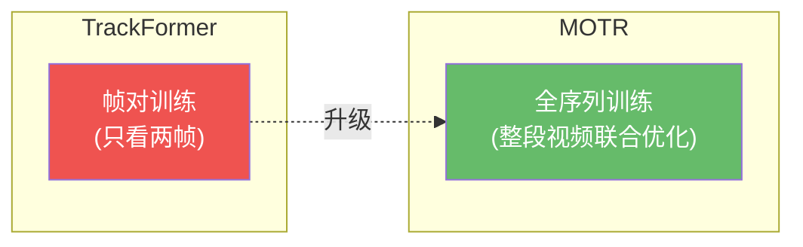
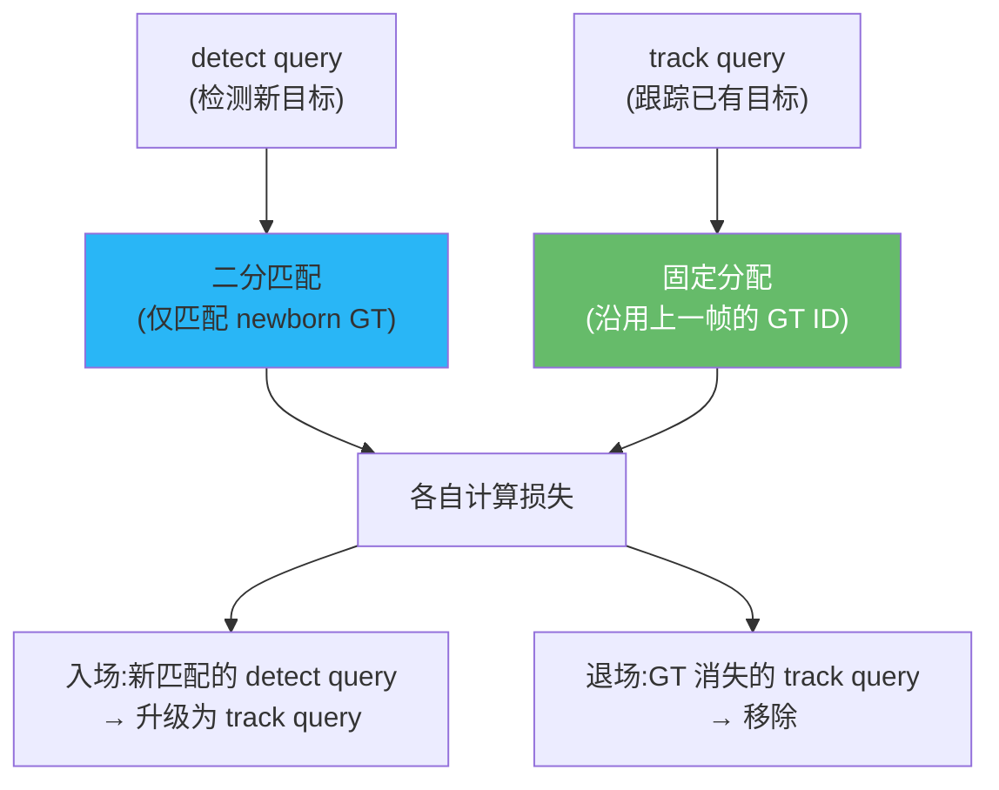
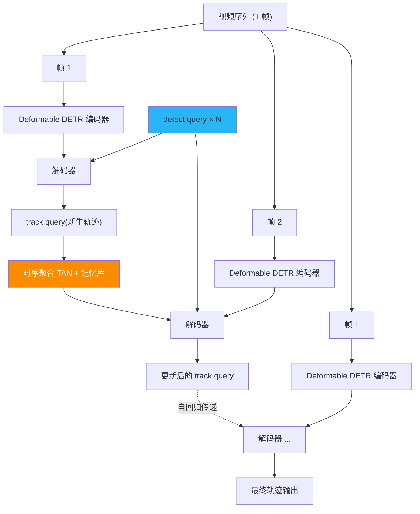

# MOTR:真正的端到端全序列跟踪

> Zeng et al. *MOTR: End-to-End Multiple-Object Tracking with Transformer*. ECCV 2022. arXiv:[2105.03247](https://arxiv.org/abs/2105.03247) · 代码 [megvii-research/MOTR](https://github.com/megvii-research/MOTR)
>
> 📚 本方法仓库未实现,属知识体系补全。代码参见官方仓库。

## 1. 一句话核心

**在 Deformable DETR 上引入跨整段视频建模的 track query,配合 TALA(轨迹感知标签分配)和集体平均损失,实现完全无后处理的端到端多目标跟踪——第一个对整个视频序列做联合训练的 Transformer 跟踪器。**

## 2. 为什么选 Deformable DETR 而非原始 DETR

MOTR 构建在 **Deformable DETR** 而非 vanilla DETR 上,原因:

| 维度 | DETR | Deformable DETR |
|------|------|-----------------|
| 注意力 | 全局密集 $O(H^2W^2)$ | 稀疏可变形 $O(HWK)$,$K \ll HW$ |
| 多尺度 | 单尺度 | 多尺度特征图 (FPN-like) |
| 收敛速度 | ~500 epoch | ~50 epoch |
| 小目标 | 弱 | 强(多尺度受益) |

全序列训练需要连续处理多帧,计算开销远超帧对训练,**Deformable DETR 的稀疏注意力和快速收敛是基础前提**。

## 3. 核心机制一:TALA——轨迹感知标签分配

TrackFormer 的帧对训练中,每帧的二分匹配**独立进行**,track query 可能在不同帧被分配到不同 GT——这违背"一个 query 跟踪一个目标"的初衷。MOTR 提出 **TALA** 彻底解决此问题:

TALA 的两个策略:

1. **Detect query → newborn-only 匹配**:二分匹配仅在 detect query 与**当前帧新出现**的 GT 之间进行,不与已被 track query 占有的 GT 竞争
2. **Track query → target-consistent 分配**:track query 始终对应上一帧分配的同一 GT 对象,**不参与匈牙利匹配**,直接用固定分配计算损失

### 入场与退场机制

- **入场**:detect query 在帧 $t$ 匹配到 newborn GT → 帧 $t{+}1$ 起升级为 track query
- **退场**:某 track query 对应的 GT 在帧 $t$ 消失 → 移除该 track query
- track query 集合的大小随时间**动态变化**

## 4. 核心机制二:时序聚合网络 (TAN)

为了让 track query 利用历史信息,MOTR 引入**时序聚合网络(Temporal Aggregation Network)**:

- 维护一个 **query 记忆库(memory bank)**,收集 track query 在历史帧中的 embedding
- 当前帧的 track query 与记忆库中对应历史 embedding 通过**多头注意力**交互
- 输出时序增强后的 track query,再送入解码器

这使得 track query 不仅携带上一帧信息,还能"回忆"更早的外观和运动模式。

## 5. 核心机制三:集体平均损失

TrackFormer 的帧对训练中,损失按帧独立计算。MOTR 提出**集体平均损失(Collective Average Loss)**,对一条轨迹在其**整个生命周期**内的所有帧求平均:

$$\mathcal{L}_{\text{track}} = \frac{1}{|\mathcal{T}|} \sum_{j \in \mathcal{T}} \frac{1}{T_j} \sum_{t=t_j^{\text{start}}}^{t_j^{\text{end}}} \mathcal{L}_t^{(j)}$$

其中 $\mathcal{T}$ 是所有轨迹的集合,$T_j$ 是轨迹 $j$ 的持续帧数,$\mathcal{L}_t^{(j)}$ 是轨迹 $j$ 在帧 $t$ 的预测损失(分类 + 框回归)。

这种平均方式避免长轨迹主导梯度,同时让短轨迹也有充分的监督信号。

## 6. 完整流程

## 7. 关键配置

| 参数 | 典型值 | 说明 |
|------|--------|------|
| 骨干 | ResNet-50 + Deformable DETR | 多尺度可变形注意力 |
| 编码器/解码器层数 | 各 6 层 | 标准 Deformable DETR |
| detect query 数 | 300 | 每帧最多检出 300 个新目标 |
| 训练序列长度 | 5 帧 (clip) | 全序列训练的采样片段长度 |
| track query 得分阈值 | 0.4 | 低于此分终止轨迹 |
| TAN 记忆库大小 | 最近 $K$ 帧 | 时序聚合回溯窗口 |
| 预训练 | COCO → CrowdHuman → MOT | 多阶段迁移学习 |
| 优化器 | AdamW, lr $2\times10^{-4}$ | Deformable DETR 标准设置 |

## 8. 性能与局限

### 基准结果

| 数据集 | MOTA | IDF1 | HOTA | 备注 |
|--------|------|------|------|------|
| MOT17 test | 73.4 | 68.6 | — | 端到端方法中领先 |
| DanceTrack test | 79.7 (MOTA) | 51.5 | 54.2 | AssA 40.2,关联能力突出 |

!!! note "DanceTrack 上的意义"
    在 DanceTrack 上,MOTR 的 HOTA(54.2)超越 ByteTrack(47.7)达 6.5%,其中关联指标 AssA 优势更明显(40.2 vs 32.1)。这说明端到端方法在**外观相似、运动复杂**场景下的关联能力确实优于手工匹配。

### 局限:检测-关联冲突

!!! warning "核心局限:检测与关联的联合学习冲突"
    MOTR 将检测和关联任务塞进同一个网络联合训练,但两者的梯度方向经常**互相矛盾**:

    - **检测**需要 query 对当前帧的目标位置敏感
    - **关联**需要 track query 对同一目标保持稳定的 embedding

    结果:MOTR 的**检测质量明显低于**同期 tracking-by-detection 方法(如 ByteTrack 用 YOLOX 检测 MOTA 80+)。这一冲突是 MOTRv2 的核心动机——用外部检测器解耦检测。

其他局限:

- **训练开销极大**:全序列训练的显存和时间成本远超帧对训练
- **推理速度慢**:Deformable DETR 本身已较重,加上 TAN 更慢
- **对检测器质量敏感**:端到端检测精度直接决定跟踪上限

## 参考文献

- Zeng et al. *MOTR: End-to-End Multiple-Object Tracking with Transformer*. ECCV 2022. arXiv:[2105.03247](https://arxiv.org/abs/2105.03247) · [代码](https://github.com/megvii-research/MOTR)
- Zhu et al. *Deformable DETR: Deformable Transformers for End-to-End Object Detection*. ICLR 2021. arXiv:[2010.04159](https://arxiv.org/abs/2010.04159)
- Meinhardt et al. *TrackFormer*. CVPR 2022. arXiv:[2101.02702](https://arxiv.org/abs/2101.02702)

→ 上一篇:[TrackFormer](trackformer.md) · 下一篇:[MOTRv2](motrv2.md)
