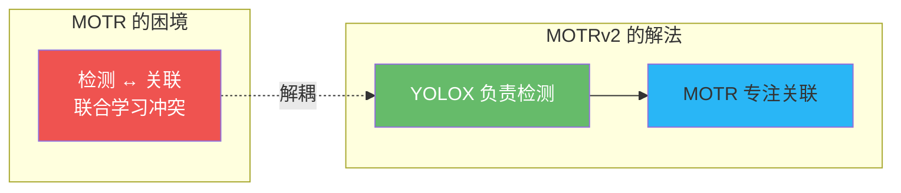
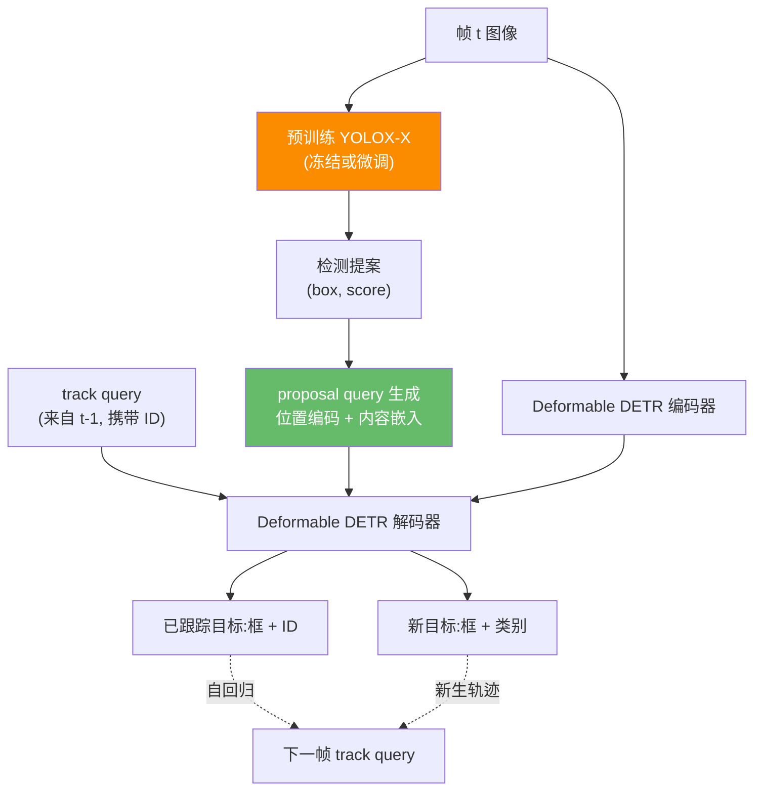
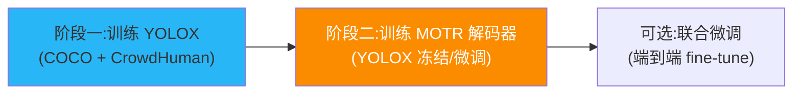
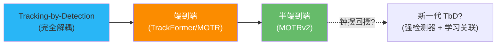

# MOTRv2:让预训练检测器为端到端跟踪"喂球"

> Zhang et al. *MOTRv2: Bootstrapping End-to-End Multi-Object Tracking by Pretrained Object Detectors*. CVPR 2023. arXiv:[2211.09791](https://arxiv.org/abs/2211.09791) · 代码 [megvii-research/MOTRv2](https://github.com/megvii-research/MOTRv2)
>
> 📚 本方法仓库未实现,属知识体系补全。代码参见官方仓库。

## 1. 一句话核心

**MOTR 的检测和关联联合学习互相冲突,导致检测偏弱。MOTRv2 用预训练 YOLOX 的高质量检测提案替代 detect query,把检测质量问题甩给专业检测器,让 MOTR 专注于关联——一个简单改动,DanceTrack HOTA 从 54.2 飙升至 73.4。**

## 2. 问题回顾:MOTR 的检测-关联冲突

MOTR 将检测和关联统一在一个网络中,但实验表明:

- MOTR 的 MOT17 检测 MOTA(73.4)远低于 ByteTrack(80.3),差距来自**检测精度**
- 联合训练时,关联梯度会"污染"检测学习,反之亦然
- 直觉:detect query 既要学"在哪"(检测),又要学"是谁"(为后续关联做准备),两个目标打架

MOTRv2 的核心思路:既然检测器已经有成熟的预训练方案(YOLOX-X 在 COCO 上 AP 51.1),**为什么不直接拿来用?**

## 3. 核心架构:YOLOX 提案 → anchor query → MOTR 解码器

### 3.1 Proposal Query 生成

YOLOX 输出的每个检测框 $(x, y, w, h, s)$ 被转换为 **proposal query**,替代 MOTR 原有的 detect query:

**位置编码(positional embedding)**:

$$\text{PE}_{\text{pos}} = \text{SinCos}(x, y, w, h)$$

采用 4D 正弦余弦位置编码,从框坐标直接生成,为解码器提供精确的空间先验。

**内容嵌入(content embedding)**:

$$\text{PE}_{\text{content}} = \text{Encode}(s) + \mathbf{e}_{\text{shared}}$$

其中 $\text{Encode}(s)$ 是对置信度分数 $s$ 的编码(线性投影),$\mathbf{e}_{\text{shared}}$ 是所有 proposal query 共享的可学习嵌入。

!!! note "anchor 框 vs 中心点"
    论文消融实验表明,使用 4D anchor 框(x, y, w, h)比仅用 2D 中心点(x, y)效果好得多——框的宽高信息为解码器提供了尺度先验,这对关联至关重要。

### 3.2 Track Query:延续 MOTR 的自回归机制

track query 的工作方式与 MOTR 完全一致:

1. 上一帧解码器输出的 embedding 作为 track query 注入当前帧
2. 通过 TALA 保持 GT 一致性分配
3. 得分低于阈值时退场

**关键区别**:新目标的"发现"不再依赖 detect query 的学习能力,而是由 YOLOX 的强检测保证——track query 只需专注于**保持已有轨迹的身份连续性**。

## 4. 训练策略

1. **阶段一**:在 COCO/CrowdHuman 上训练 YOLOX-X,获得强检测器
2. **阶段二**:冻结(或轻微微调)YOLOX,训练 MOTR 的编码器-解码器部分
   - YOLOX 提案作为 proposal query 输入
   - 全序列训练(继承 MOTR 的 TALA + 集体平均损失)
3. **可选阶段三**:小学习率联合微调

这种解耦训练策略极大缓解了检测-关联冲突:YOLOX 已经"学会"了检测,MOTR 只需学习如何利用提案做关联。

## 5. 关键配置

| 参数 | 典型值 | 说明 |
|------|--------|------|
| 外部检测器 | YOLOX-X | COCO AP 51.1,冻结或微调 |
| 提案得分阈值 | 保留全部(最大化召回) | 不做过滤,让解码器学习筛选 |
| 骨干 | ResNet-50 + Deformable DETR | 多尺度编码器 |
| 编码器/解码器层数 | 各 6 层 | 标准配置 |
| track query 得分阈值 | 0.5 | 低于此分终止轨迹 |
| 位置编码 | 4D SinCos (anchor box) | 从 YOLOX 框坐标生成 |
| 内容嵌入 | 线性投影(score) + 共享 query | 编码置信度信息 |
| 训练序列长度 | 5 帧 (clip) | 继承 MOTR 的全序列训练 |
| 优化器 | AdamW, lr $2\times10^{-4}$ | 标准设置 |

## 6. 性能:DanceTrack Challenge 冠军

### 基准结果

| 数据集 | HOTA | DetA | AssA | MOTA | IDF1 | 备注 |
|--------|------|------|------|------|------|------|
| DanceTrack test (单模型) | 69.9 | — | — | — | — | 单模型已大幅领先 |
| DanceTrack test (集成) | **73.4** | — | — | — | — | 4 模型集成,挑战赛冠军 |
| BDD100K val | — | — | — | 43.6 mMOTA | — | 超越 Unicorn 2.4% |
| MOT17 test | — | — | — | 78.6 | 75.0 | 接近 TbD 方法 |

### 三代方法对比

| 维度 | TrackFormer | MOTR | MOTRv2 |
|------|-------------|------|--------|
| 基础架构 | DETR / Deformable | Deformable DETR | Deformable DETR + YOLOX |
| 训练方式 | 帧对 | 全序列 | 全序列 |
| 检测来源 | detect query 学习 | detect query 学习 | **YOLOX 预训练提案** |
| 关联方式 | track query 注意力 | track query + TALA | track query + TALA |
| MOT17 MOTA | 65.0 | 73.4 | 78.6 |
| DanceTrack HOTA | — | 54.2 | **73.4** |
| 端到端程度 | 完全 | 完全 | **半端到端** |
| 关键贡献 | tracking-by-attention | TALA + 全序列训练 | 解耦检测与关联 |

## 7. 范式反思:"半端到端"与钟摆效应

MOTRv2 的成功揭示了一个有趣的范式演化:

- **TrackFormer/MOTR** 追求"纯端到端",把检测和关联全部塞进 Transformer,但检测质量受限
- **MOTRv2** 承认检测器需要独立优化,回到"检测-关联解耦"的思路——只是关联部分仍用 Transformer 自回归,而非手工匹配
- 这与本仓库的 **tracking-by-detection** 路线(ByteTrack/OC-SORT)殊途同归:都认为**好的检测是好的跟踪的前提**

!!! note "对本仓库用户的启示"
    MOTRv2 验证了一个朴素直觉:**强检测器 + 好关联 = 好跟踪**。本仓库的 ByteTrack/OC-SORT 正是这一思路的工程化实践——用 YOLO/RT-DETR/RF-DETR 做强检测,用卡尔曼 + 匈牙利做高效关联。两条路线在理念上并不矛盾,只是 MOTRv2 用 Transformer 替代了手工关联,换取了更强的长时序建模能力,但也付出了速度和部署复杂度的代价。

## 参考文献

- Zhang et al. *MOTRv2: Bootstrapping End-to-End Multi-Object Tracking by Pretrained Object Detectors*. CVPR 2023. arXiv:[2211.09791](https://arxiv.org/abs/2211.09791) · [代码](https://github.com/megvii-research/MOTRv2)
- Zeng et al. *MOTR: End-to-End Multiple-Object Tracking with Transformer*. ECCV 2022. arXiv:[2105.03247](https://arxiv.org/abs/2105.03247) · [代码](https://github.com/megvii-research/MOTR)
- Ge et al. *YOLOX: Exceeding YOLO Series in 2021*. arXiv:[2107.08430](https://arxiv.org/abs/2107.08430)
- Meinhardt et al. *TrackFormer*. CVPR 2022. arXiv:[2101.02702](https://arxiv.org/abs/2101.02702)

→ 上一篇:[MOTR](motr.md) · 下一篇:[MATR](matr.md)
