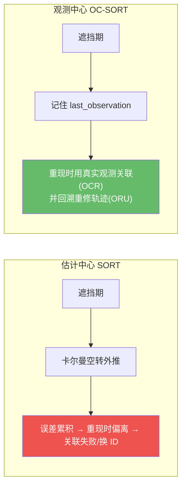
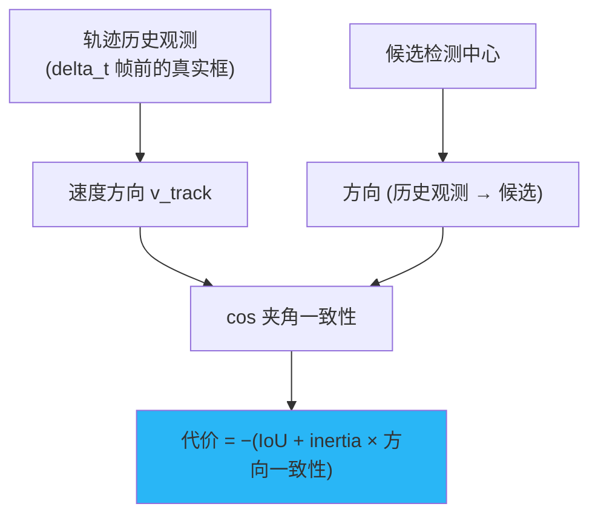
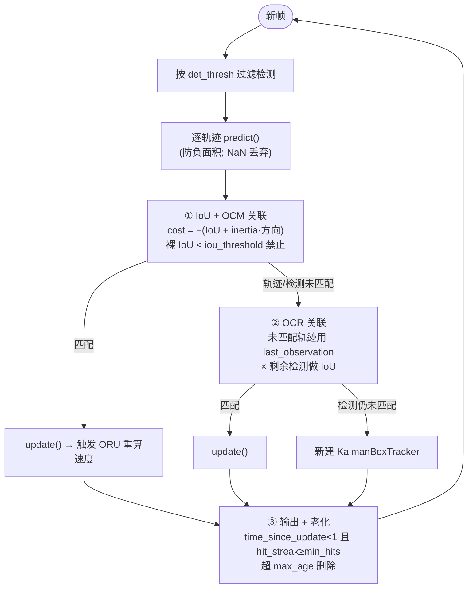
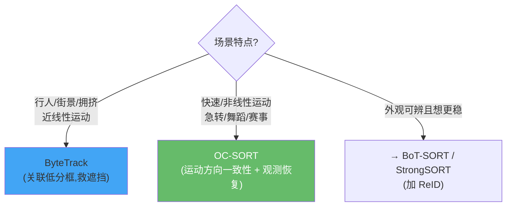

# OC-SORT:观测中心化的 SORT

> Cao et al. *Observation-Centric SORT: Rethinking SORT for Robust Multi-Object Tracking*. CVPR 2023. arXiv:[2203.14360](https://arxiv.org/abs/2203.14360) · 代码 [noahcao/OC_SORT](https://github.com/noahcao/OC_SORT)
>
> ✅ **本仓库原生实现**:[`onnxtools/tracking/ocsort.py`](https://github.com/yyq19990828/onnxtools/blob/main/onnxtools/tracking/ocsort.py) 的 `OCSORT` + `KalmanBoxTracker`,含 OCM/OCR/ORU 三件套。

## 1. 一句话核心:别太信卡尔曼,要回到观测

经典 SORT 是 **"估计中心 (estimation-centric)"** 的——它高度信任线性卡尔曼滤波的预测。问题有二:

1. **遮挡期误差累积**:目标被挡住、连续多帧无观测时,卡尔曼只能空转外推,误差越滚越大,等目标重现已经偏到别处。
2. **线性模型遇非线性运动崩溃**:舞蹈、急转、运动赛事中,恒速假设根本不成立。

OC-SORT 的对策是把跟踪改成 **"观测中心 (observation-centric)"** ——**更多地依赖真实检测来校正滤波器**,而不是盲信预测。仅用卡尔曼、**无任何 ReID**,却在 DanceTrack 这类非线性场景大幅超越 ByteTrack,CPU 上仍 700+ FPS。



## 2. 三件套:OCM / OCR / ORU

OC-SORT 在经典 SORT 之上加三个"观测中心"改进。下表给出**论文含义**与**仓库实现位置**:

| 缩写 | 全称 | 直觉 | 仓库实现 |
|------|------|------|----------|
| **OCM** | Observation-Centric **Momentum** | 关联代价加入"运动方向一致性",方向是从**历史观测**算的 | [`_angle_cost`](https://github.com/yyq19990828/onnxtools/blob/main/onnxtools/tracking/ocsort.py) |
| **OCR** | Observation-Centric **Recovery** | 一阶段没匹配上的轨迹,用它的 **last_observation**(非卡尔曼预测)再做一次 IoU 关联 | `OCSORT.update` 第二阶段 |
| **ORU** | Observation-Centric **Re-Update** | 轨迹重新被找回时,基于最近真实观测重算速度方向,清掉遮挡期累积的误差 | `KalmanBoxTracker.update` |

### 2.1 OCM:运动方向动量

只看 IoU 在拥挤/相似场景会歧义。OCM 额外比较**轨迹的运动方向**与**"轨迹历史观测→候选检测"方向**的夹角余弦——方向越一致,代价越低。关键是方向用**真实观测**估计(抗卡尔曼漂移)。



对应仓库 `_associate`:

```python
iou = box_iou_batch(detections, trackers).T          # [T, D]
angle_cost = _angle_cost(detections, trackers, velocities, previous_obs, vdc_weight=self.inertia)
cost = -(iou + angle_cost)                            # 越像越负(代价越低)
forbidden = iou < self.iou_threshold                 # 仍用裸 IoU 门控
cost = np.where(forbidden, 1e6, cost)
```

`velocities` 是每条轨迹的单位方向向量(由 ORU 维护),`previous_obs` 是 `delta_t`(默认 3)帧前的历史观测。

### 2.2 OCR:用"最后一次真实观测"做恢复

一阶段(IoU+OCM)没匹配上的轨迹,往往是刚遮挡完、卡尔曼预测已漂的目标。OCR 不信漂掉的预测,改用轨迹的 **`last_observation`(最后一次真实看到的框)** 和剩余检测再做一次 IoU 关联:

```python
# Stage 2: OCR —— 对未匹配轨迹改用 last_observation
last_boxes = np.stack([self.trackers[t].last_observation[:4] for t in u_trk])
left_dets  = xyxy[u_det]
iou_ocr = box_iou_batch(left_dets, last_boxes)
cost = 1.0 - iou_ocr
m2, u_t2, u_d2 = linear_assignment(cost.T, thresh=1.0 - self.iou_threshold)
```

### 2.3 ORU:重新找回时回溯重修速度

轨迹失踪一段时间后被重新匹配,这期间卡尔曼状态(尤其速度)已不可信。ORU 在 `update` 时**用历史观测重新计算速度方向**,而不是沿用遮挡期空转出来的速度:

```python
def update(self, bbox, score, class_id):
    if self.last_observation.sum() >= 0:
        previous_box = self._previous_obs(self.age)   # delta_t 帧内最近的真实观测
        self.velocity = _speed_direction(previous_box, bbox)   # 用真实观测对重算方向
    self.last_observation = np.array([*bbox, score])
    self.observations[self.age] = self.last_observation
    ...
    self.mean, self.covariance = self.kf.update(self.mean, self.covariance, _xyxy_to_z(bbox))
```

论文里 ORU 会沿"失踪前最后观测 ↔ 重现观测"构造虚拟轨迹并重跑卡尔曼更新,消解累积误差;消融实验显示 **ORU 贡献最大增益**。

## 3. 完整 update 流程(仓库实现)



### 状态参数化:7 维 XYSR(继承 SORT)

OC-SORT 用 [`KalmanFilterXYSR`](https://github.com/yyq19990828/onnxtools/blob/main/onnxtools/tracking/kalman.py),状态 $[c_x, c_y, s, r, \dot c_x, \dot c_y, \dot s]$($s$=面积,$r$=纵横比恒定),与 SORT 完全一致。`predict` 里有 SORT 经典的负面积保护:

```python
if self.mean[6] + self.mean[2] <= 0:   # 预测面积将 ≤0
    self.mean[6] = 0.0                  # 速度归零
```

### 输出与新轨迹确认

- 用 `min_hits`(默认 3)做延迟确认:`hit_streak >= min_hits` 或前 `min_hits` 帧内才 emit,抑制误检鬼影(等价 ByteTrack 的双帧确认)。
- 输出框优先用 `last_observation`(真实框)而非卡尔曼平滑值——便于 `InferencePipeline._align_tracker_ids` 通过 xyxy 精确回填。
- ID:内部 `KalmanBoxTracker.id` 从 0 计数,emit 时 `+1`,与 supervision 的 1-based 约定一致。

## 4. 关键超参数

| 标准参数 | supervision 别名 | 默认 | 含义 |
|----------|------------------|------|------|
| `det_thresh` | `track_activation_threshold` | 0.6 | 检测置信度下限 |
| `max_age` | `lost_track_buffer` | 30 | 轨迹失踪最大帧数 |
| `min_hits` | — | 3 | 连续命中数才确认 emit |
| `iou_threshold` | `minimum_matching_threshold`(转换 `1−x`) | 0.3 | 裸 IoU 关联门控 |
| `delta_t` | — | 3 | OCM/ORU 回溯历史观测的帧窗 |
| `inertia` | — | 0.2 | OCM 方向一致性权重 |

```python
from onnxtools.tracking import create_tracker
tracker = create_tracker("ocsort", min_hits=3, max_age=30, inertia=0.2, delta_t=3)
```

## 5. 性能与局限

- **指标**:MOT17 test HOTA 63.2 / MOTA 78.0 / IDF1 77.5;**DanceTrack HOTA 55.1**(线性插值后),在非线性运动上显著超过 ByteTrack。
- **本仓库性能**:200 目标 / 1080p,~8-10 ms/帧。
- **局限**:仍是纯运动、无外观——**密集且外观相似**的目标难区分;ORU 是**事后回溯**(重检测后才修正),遮挡期内不实时;依赖检测质量。这些正是 [Deep OC-SORT](deep-ocsort.md)、[Hybrid-SORT](hybrid-sort.md) 的改进切入点。

## ByteTrack vs OC-SORT 怎么选



## 参考文献

- Cao et al. *Observation-Centric SORT*. CVPR 2023. arXiv:[2203.14360](https://arxiv.org/abs/2203.14360) · [代码](https://github.com/noahcao/OC_SORT)

→ 上一篇:[ByteTrack](bytetrack.md) · 下一篇:[BoT-SORT:相机运动补偿 + ReID](botsort.md)
