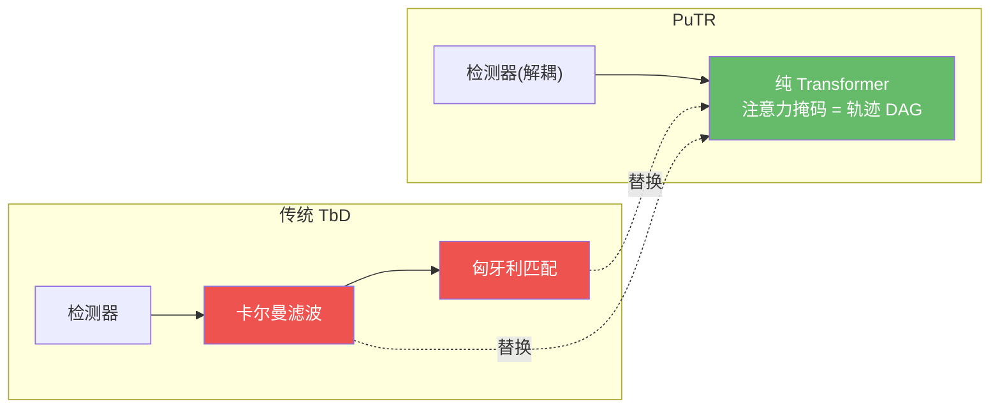
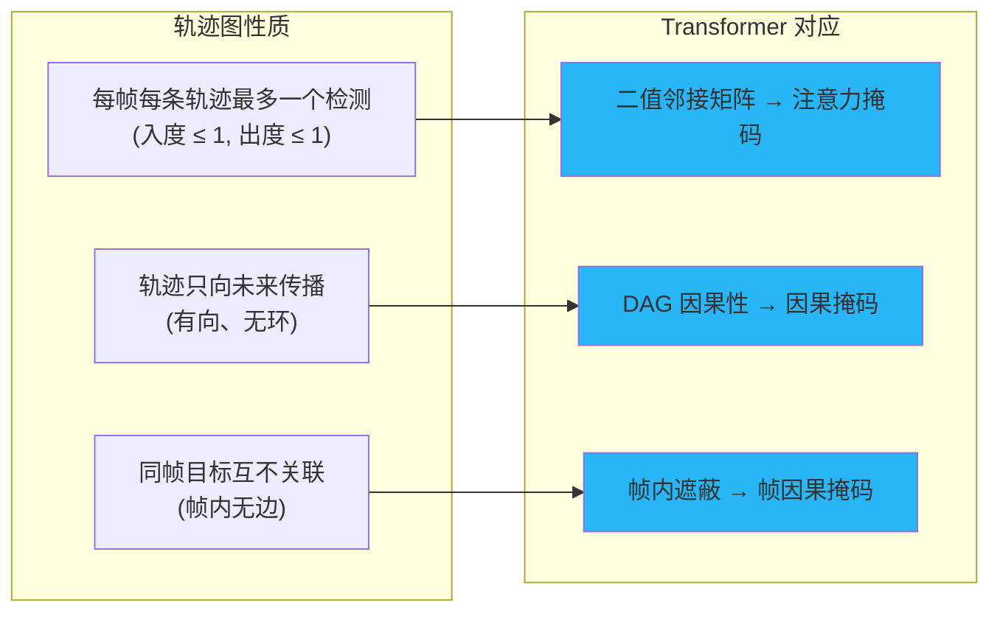
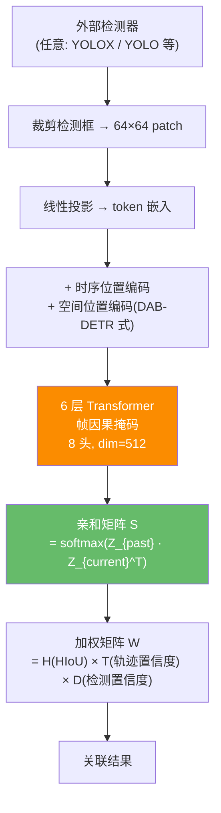

# PuTR:纯 Transformer 做在线关联,简洁即正义

> Liu et al. *PuTR: A Pure Transformer for Decoupled and Online Multi-Object Tracking*. 2024. arXiv:[2405.14119](https://arxiv.org/abs/2405.14119) · 代码 [chongweiliu/PuTR](https://github.com/chongweiliu/PuTR)
>
> 📚 本方法仓库未实现,属知识体系补全(2024 前沿)。

## 1. 一句话核心

**既然轨迹图天然是有向无环图(DAG),而 DAG 的邻接矩阵恰好可以用 Transformer 的因果注意力掩码表示——那么一个纯 Transformer(无 CNN、无卡尔曼、无匈牙利)就能同时做短程和长程关联。PuTR 用这个极简设计,在 SportsMOT 上达到 HOTA 76.8,且仅需单 GPU 训练 30-60 分钟。**

## 2. 核心洞见:轨迹图 = DAG = 因果注意力

PuTR 的出发点是一个优雅的结构对应关系:

**帧因果掩码(Frame Causal Mask)**:标准因果掩码允许同一"位置"的 token 互相看到,但轨迹图要求同一帧内的不同目标**不能互相注意**。PuTR 的掩码规则:

$$\text{mask}[i, j] = \begin{cases} 1 & \text{if } t_i > t_j \\ 0 & \text{if } t_i = t_j \text{ and } i \neq j \\ 1 & \text{if } i = j \end{cases}$$

这保证了:当前帧的每个目标只能看到**过去帧**的所有目标(潜在的关联候选),以及自己——但看不到同帧的其他目标。

## 3. 架构:极简的 Transformer 关联器

### 3.1 位置编码

- **时序编码**:标准正弦位置编码,按帧索引分配(同帧所有 token 共享)
- **空间编码**:继承 DAB-DETR 的框坐标编码,从 $(x, y, w, h)$ 生成,投影到 Key/Value

### 3.2 训练损失

训练目标是预测当前帧目标与过去帧目标的关联矩阵:

$$\mathcal{L} = \frac{1}{\text{bs} \times T} \sum \text{CE}\bigl(\text{softmax}_r(Z^{t-1} \cdot {Z^t}^\top),\; Y^t\bigr)$$

其中 $Y^t$ 是 ground truth 关联标签。简洁的交叉熵损失,无需复杂的匹配策略。

### 3.3 推理时加权

推理时融合外观亲和度与几何线索:

$$W_{i,j} = S_{i,j} \cdot H_{i,j} \cdot T_i \cdot D_j$$

- $S$:Transformer 输出的亲和矩阵(外观+时序特征)
- $H$:Height Modulated IoU(高度调制的 IoU)
- $T$:轨迹置信度(长轨迹优先)
- $D$:检测置信度

## 4. 关键配置

| 参数 | 值 | 说明 |
|------|-----|------|
| Transformer 层数 | 6 | 8 头注意力 |
| 模型维度 | 512 | 默认配置 |
| 输入序列 | T+1 帧 (T=30) | 最大可扩展至 120 帧 |
| patch 尺寸 | 64 x 64 | 检测框裁剪后缩放 |
| 训练时间 | 30-60 分钟 | **单 GPU** |
| 优化器 | AdamW, lr $2\times10^{-4}$ | 余弦退火 |
| 训练轮次 | 7 | 渐进式增加 clip 长度 |
| 检测器 | 解耦(任意) | 实验中用 YOLOX |

## 5. 性能与局限

### 基准结果

| 数据集 | HOTA | IDF1 | AssA | MOTA | FPS |
|--------|------|------|------|------|-----|
| SportsMOT test | **76.8** | 79.5 | 66.2 | 97.1 | 77 |
| DanceTrack test | 60.6 | 61.7 | 44.6 | 92.3 | 75 |
| MOT17 test | 62.1 | 75.6 | 60.5 | 78.8 | 62 |
| MOT20 test | 61.4 | 74.6 | 60.4 | 75.6 | 25 |

### 核心亮点:跨域泛化

PuTR 最令人印象深刻的特性是**跨数据集泛化能力**——不做任何微调,跨域 HOTA 最大差距仅 1.7%、IDF1 仅 2.3%,远优于对比方法(MOTIP 跨域下降 49%)。这在学习式 MOT 方法中前所未有。

### 局限

- DanceTrack 上 HOTA 60.6,低于端到端方法(MOTRv2 73.4)——解耦范式在强关联场景仍有差距
- 推理 FPS(62-77)虽快于端到端方法,但慢于纯手工关联(ByteTrack 200+ FPS)
- 密集场景(MOT20)FPS 降至 25,token 数量随目标数线性增长
- 仅关联模块用 Transformer,仍需外部检测器

!!! note "对本仓库用户的启示"
    PuTR 展示了一条有趣的中间路线:保持检测-关联解耦(与本仓库的 ByteTrack/OC-SORT 理念一致),但用 Transformer 替代卡尔曼+匈牙利做关联。它的跨域泛化能力尤其值得关注——传统方法换数据集往往需要重调参数,PuTR 几乎无需调整。若本仓库未来想引入学习式关联,PuTR 的"纯 Transformer 关联器"是一个简洁的起点。

## 参考文献

- Liu et al. *PuTR: A Pure Transformer for Decoupled and Online Multi-Object Tracking*. arXiv:[2405.14119](https://arxiv.org/abs/2405.14119) · [代码](https://github.com/chongweiliu/PuTR)
- (对比) Cao et al. *OC-SORT*. arXiv:[2203.14360](https://arxiv.org/abs/2203.14360)
- (架构参考) Liu et al. *DAB-DETR*. ICLR 2022. arXiv:[2201.12329](https://arxiv.org/abs/2201.12329)

→ 上一篇:[MeMoSORT](memosort.md) · 下一篇:[FastTrackTr](fasttracktr.md)
