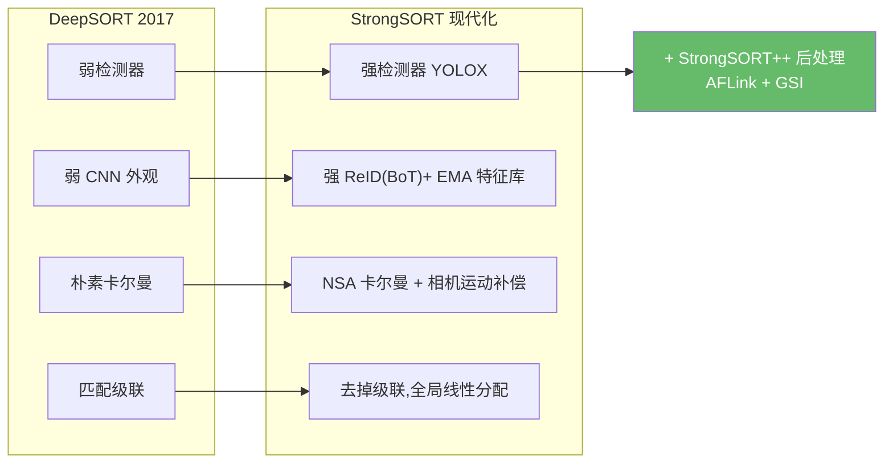
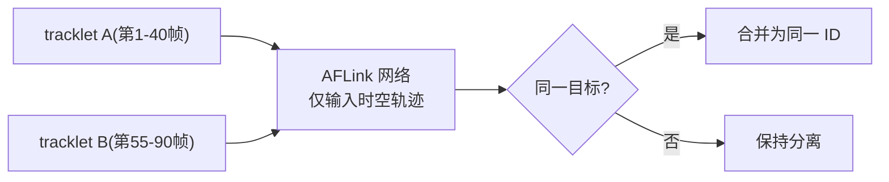
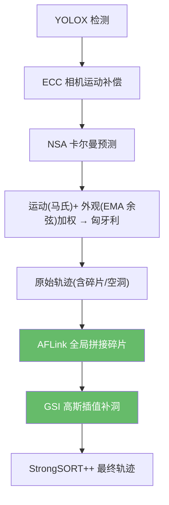

# StrongSORT:让 DeepSORT 再次伟大

> Du et al. *StrongSORT: Make DeepSORT Great Again*. IEEE TMM 2023(arXiv 2022). arXiv:[2202.13514](https://arxiv.org/abs/2202.13514) · 代码 [dyhBUPT/StrongSORT](https://github.com/dyhBUPT/StrongSORT)
>
> 📚 进阶方向,仓库未实现。其 AFLink/GSI 后处理可叠加到本仓库任意 tracker 输出之上。

## 1. 定位:把 DeepSORT 的每个零件都换成现代版

StrongSORT 的论点很直接:DeepSORT 的思路没错,只是**每个组件都老了**。于是它逐一升级,再加两个**即插即用的后处理模块**(AFLink、GSI),刷新当时 MOT17/MOT20 的 HOTA/IDF1 记录。

## 2. StrongSORT 的组件升级

| 组件 | DeepSORT | StrongSORT |
|------|----------|------------|
| 检测器 | Faster R-CNN 时代 | YOLOX |
| 外观特征 | 弱 CNN,瞬时特征 | 强 ReID(BoTNet),**EMA 指数滑动平均特征库** |
| 卡尔曼 | 朴素 | **NSA-Kalman**(用检测置信度自适应调测量噪声) |
| 相机运动 | 无 | **ECC 相机运动补偿** |
| 关联 | 匹配级联 | 去掉级联,直接全局匈牙利;运动+外观加权 |

!!! note "EMA 特征更新"
    每条轨迹的外观特征不取当前帧瞬时值,而是 $f_t = \alpha f_{t-1} + (1-\alpha) f_{\text{det}}$ 滑动平均,抗单帧噪声/模糊,显著降低 ID 切换。

!!! note "NSA-Kalman"
    检测置信度越低,测量噪声 $R$ 越大(越不信这次观测),让滤波器在低质量检测下更稳。

## 3. StrongSORT++ 的两个后处理模块(亮点)

这两个模块**与跟踪器解耦**,可作用在任何跟踪器的输出轨迹上——包括本仓库的 ByteTrack/OC-SORT 结果。

### 3.1 AFLink:无外观的轨迹全局拼接

跟踪难免把一条长轨迹断成几段短 tracklet。AFLink(Appearance-Free Link)**只用时空信息**(不用外观),用一个轻量网络预测两个 tracklet 是否属于同一目标,把碎片全局接起来。

### 3.2 GSI:高斯平滑插值

漏检会在轨迹中留下空洞。GSI(Gaussian-Smoothed Interpolation)用**高斯过程回归**填补缺失帧的框,比线性插值更平滑、更贴合真实运动。

## 4. 完整流程

## 5. 性能与局限

- **指标**:发布时刷新 MOT17、MOT20 的 HOTA/IDF1 记录;AFLink/GSI 开销极小(MOT17 上约 1.7 ms / 7.1 ms 每图)。
- **局限**:AFLink/GSI 偏离线后处理(非严格在线);组件堆叠复杂;在外观贫乏的 DanceTrack 上增益有限。

## 参考文献

- Du et al. *StrongSORT: Make DeepSORT Great Again*. IEEE TMM 2023. arXiv:[2202.13514](https://arxiv.org/abs/2202.13514) · [代码](https://github.com/dyhBUPT/StrongSORT)
- (基线)Wojke et al. *DeepSORT*. arXiv:[1703.07402](https://arxiv.org/abs/1703.07402)

→ 上一篇:[BoT-SORT](botsort.md) · 下一篇:[Deep OC-SORT:自适应外观增强](deep-ocsort.md)
