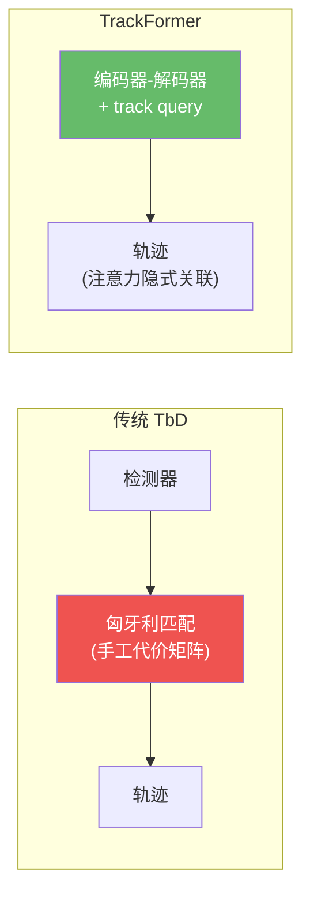
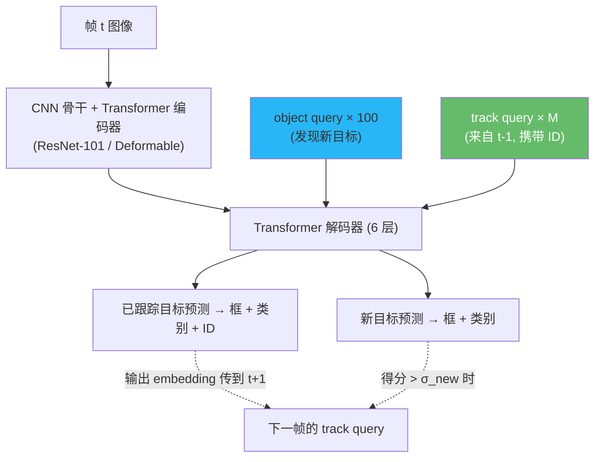
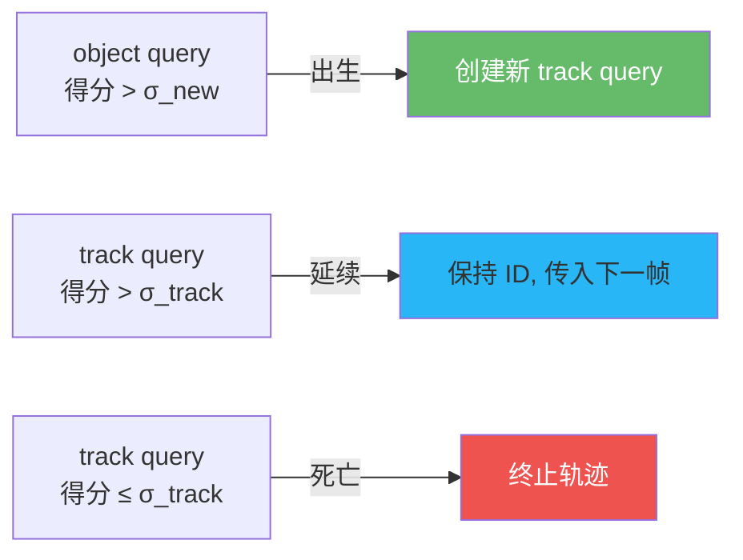
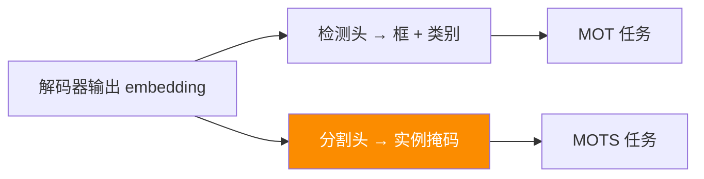

# TrackFormer:用注意力做关联的开创者

> Meinhardt et al. *TrackFormer: Multi-Object Tracking with Transformers*. CVPR 2022. arXiv:[2101.02702](https://arxiv.org/abs/2101.02702) · 代码 [timmeinhardt/trackformer](https://github.com/timmeinhardt/trackformer)
>
> 📚 本方法仓库未实现,属知识体系补全。代码参见官方仓库。

## 1. 一句话核心

**把多目标跟踪建模为逐帧集合预测:上一帧的输出 embedding 作为 track query 注入下一帧解码器,身份通过 query 的"延续"天然保持——关联隐式发生在注意力中。**

## 2. 前置知识:DETR 集合预测

TrackFormer 建立在 DETR 的检测范式之上。DETR 用 $N$ 个可学习的 **object query** 与编码器特征做交叉注意力,输出 $N$ 个预测;训练时用**匈牙利二分匹配**将预测与 GT 一一配对,损失为:

$$\mathcal{L}_{\text{DETR}} = \sum_{i=1}^{N} \bigl[\lambda_{\text{cls}} \mathcal{L}_{\text{cls}}(\hat{y}_i, y_{\sigma(i)}) + \lambda_{\text{box}} \mathcal{L}_{\text{box}}(\hat{b}_i, b_{\sigma(i)})\bigr]$$

其中 $\sigma$ 是最优匹配排列,$\mathcal{L}_{\text{box}}$ 包含 L1 与 GIoU 两项。

## 3. 核心机制:双类型 query 并行解码

TrackFormer 的关键洞见:把 DETR 的 object query 拆成两类,送入**同一个**解码器:

| query 类型 | 来源 | 职责 |
|------------|------|------|
| **object query**(静态) | 可学习参数,每帧固定 $N_{\text{det}}=100$ 个 | 检测**新出现**的目标 |
| **track query**(动态) | 上一帧匹配成功的输出 embedding | **跟踪已有**目标,携带身份 |

解码器内部,两类 query 通过**自注意力**相互交互——这意味着 track query 和 object query 会"知道"对方的存在,从而**抑制重复检出同一目标**。这就是论文所称的 **tracking-by-attention** 范式。

### 3.1 注意力如何实现关联

传统方法的关联是**显式**的:计算 IoU/外观代价矩阵 → 匈牙利匹配。TrackFormer 的关联是**隐式**的,发生在解码器的两种注意力中:

- **自注意力(self-attention)**:所有 query(object + track)相互看到对方。track query 已"占位"的目标,object query 学会不去重复检出——这等价于**去重/NMS 的隐式版本**
- **交叉注意力(cross-attention)**:每个 query 关注编码器输出的全局特征图。track query 会自然关注其对应目标在当前帧的新位置——这等价于**运动预测的隐式版本**

!!! note "为什么叫 tracking-by-attention"
    传统 MOT 的三大模块(检测、运动预测、数据关联)被统一到 Transformer 的注意力机制中:交叉注意力做检测和定位,自注意力做去重和关联,全部端到端可微。

### 3.2 推理时的生命周期

1. **出生**:object query 预测得分 $> \sigma_{\text{new}}$ 且与已有 track query 无重叠 → 创建新 track query
2. **延续**:track query 预测得分 $> \sigma_{\text{track}}$ → 继续传入下一帧
3. **死亡**:track query 预测得分 $\leq \sigma_{\text{track}}$ → 终止轨迹(可选 $T_{\text{patience}}$ 帧缓冲)

## 4. 训练策略

TrackFormer 采用**帧对(frame-pair)训练**而非全序列训练:

- 随机采样相邻帧 $(t{-}\delta, t)$,其中 $\delta \in [1, T_{\text{gap}}]$,模拟低帧率场景
- 对帧 $t{-}\delta$ 做一次前向,将匹配成功的输出 embedding 作为 track query 送入帧 $t$
- 两帧各自计算集合预测损失,合并反传

### 4.1 Track Query Dropout:模拟遮挡与漏检

为增强鲁棒性,训练时对 track query 做两类扰动:

- **假阴性(FN)dropout**:以概率 $p_{\text{FN}}$ 随机丢弃部分 track query → 模拟目标被遮挡/漏检
- **假阳性(FP)注入**:以概率 $p_{\text{FP}}$ 注入随机 embedding 作为伪 track query → 模拟误检

这迫使模型学会:即使 track query 丢失,也能用 object query 重新捕获;即使存在噪声 query,也不会干扰正常跟踪。

### 4.2 扩展:MOTS 分割跟踪

在解码器输出后接一个**分割头(mask head)**,即可同时输出实例掩码,扩展到 MOTS(Multi-Object Tracking and Segmentation)任务。

## 5. 关键配置

| 参数 | 典型值 | 说明 |
|------|--------|------|
| 骨干 | ResNet-101 / Deformable DETR | Deformable 版多尺度更快收敛 |
| 编码器/解码器层数 | 各 6 层 | 标准 DETR 设置 |
| object query 数 | 100 | 每帧最多检出 100 个新目标 |
| $\sigma_{\text{new}}$(新目标阈值) | 0.7 | object query 高于此分创建 track query |
| $\sigma_{\text{track}}$(跟踪阈值) | 0.5 | track query 低于此分判定死亡 |
| $p_{\text{FN}}$(FN dropout) | 0.1 | 训练时随机丢弃 track query 的概率 |
| $p_{\text{FP}}$(FP 注入) | 0.1 | 训练时注入假阳性 query 的概率 |
| 训练帧间隔 $T_{\text{gap}}$ | [1, 5] | 帧对采样的最大间隔 |
| 预训练 | COCO → CrowdHuman → MOT | 三阶段迁移 |

## 6. 性能与局限

### 基准结果

| 数据集 | MOTA | IDF1 | 备注 |
|--------|------|------|------|
| MOT17 test | 65.0 | 63.9 | 私有检测协议 |
| MOTS20 test | — | — | 同时输出实例掩码,支持分割跟踪 |

作为 tracking-by-attention 的开创者,TrackFormer 证明了**纯注意力机制可以替代手工关联**。虽然绝对指标不及同期的 ByteTrack(MOTA 80.3),但它开辟了一条全新的研究范式,后续 MOTR/MOTRv2 均沿此路线发展。

### 局限

- **速度慢**:Transformer 编码-解码开销大,远不及 ByteTrack 的 100+ FPS
- **query 竞争**:object query 与 track query 可能对同一目标重复检出,需要自注意力抑制,但不完美
- **训练成本高**:需 COCO 预训练 + CrowdHuman 微调 + MOT 微调,三阶段流程
- **运动主导场景偏弱**:在 DanceTrack 等高运动/外观相似基准上,不如后续 MOTR/MOTRv2

!!! warning "query 竞争问题"
    当目标密集时,同一行人可能同时被 object query 和 track query 检出,导致 ID switch。这一缺陷在 MOTR 中通过 TALA 机制部分缓解,在 MOTRv2 中通过外部检测器彻底解耦。

## 参考文献

- Meinhardt et al. *TrackFormer: Multi-Object Tracking with Transformers*. CVPR 2022. arXiv:[2101.02702](https://arxiv.org/abs/2101.02702) · [代码](https://github.com/timmeinhardt/trackformer)
- Carion et al. *End-to-End Object Detection with Transformers (DETR)*. ECCV 2020. arXiv:[2005.12872](https://arxiv.org/abs/2005.12872)
- Zhu et al. *Deformable DETR*. ICLR 2021. arXiv:[2010.04159](https://arxiv.org/abs/2010.04159)

→ 上一篇:[端到端 Transformer 概览](transformer-mot.md) · 下一篇:[MOTR](motr.md)
