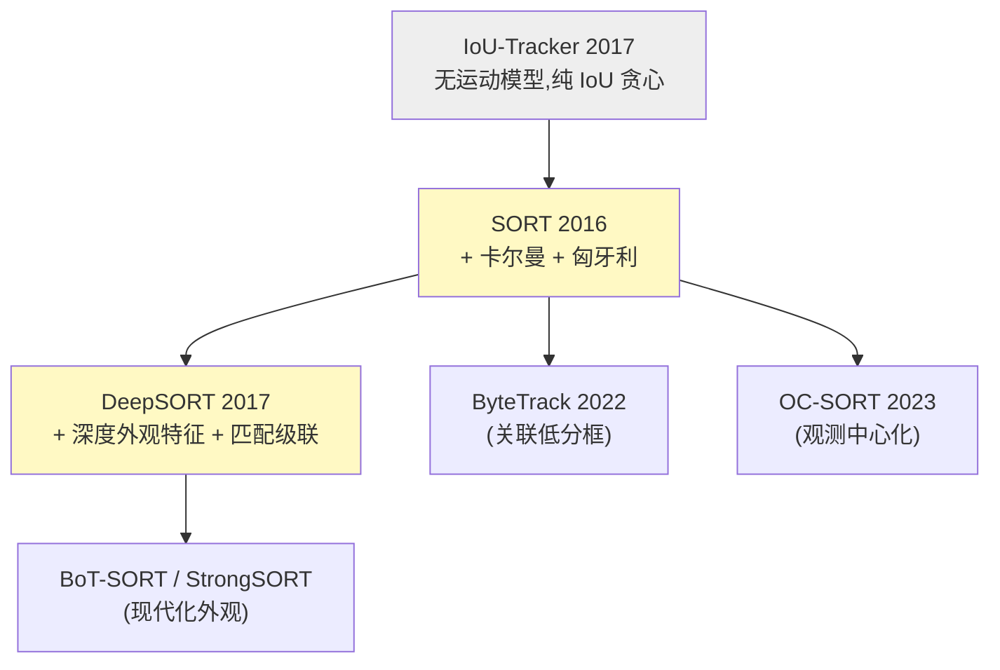
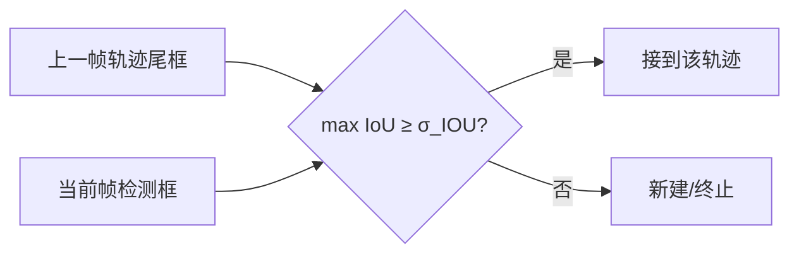
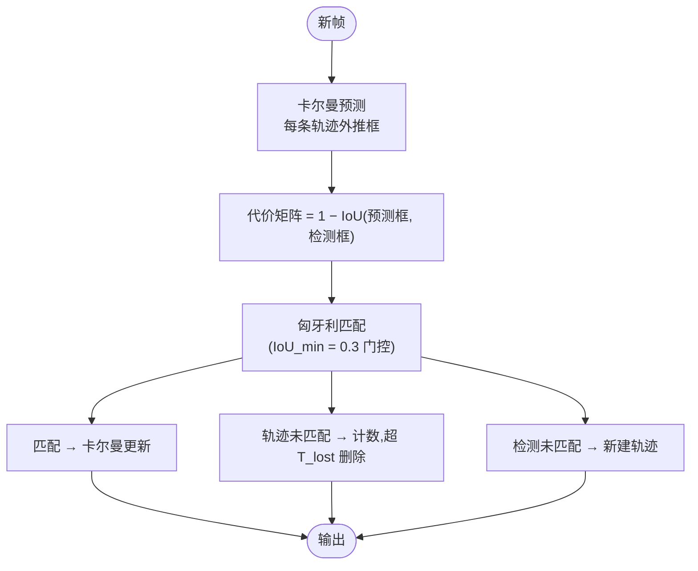
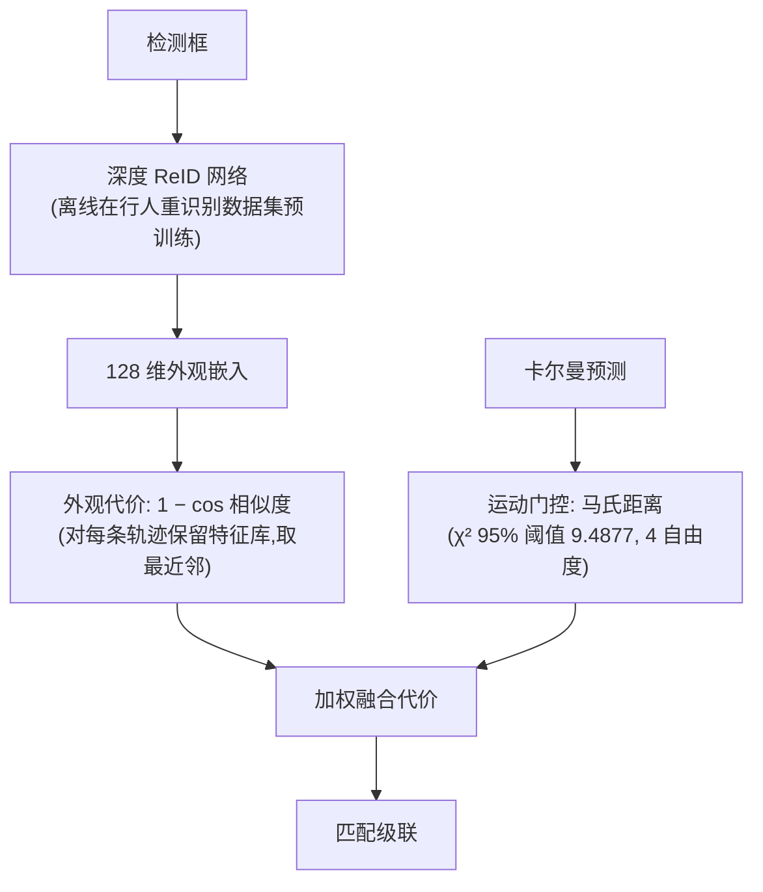
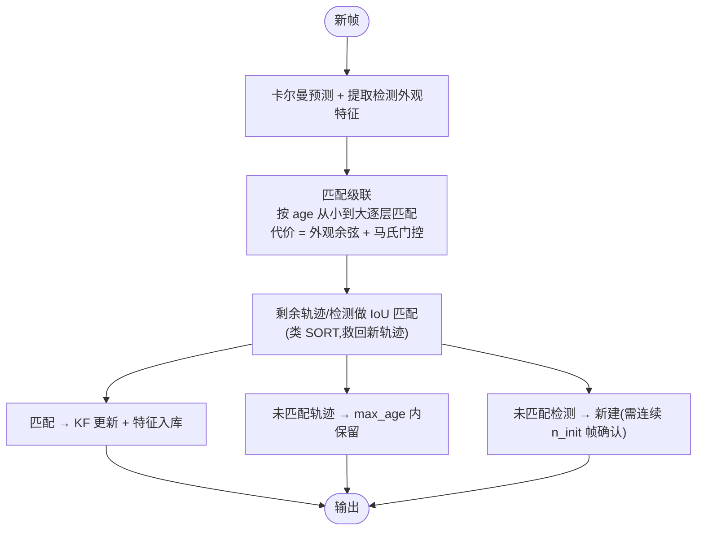
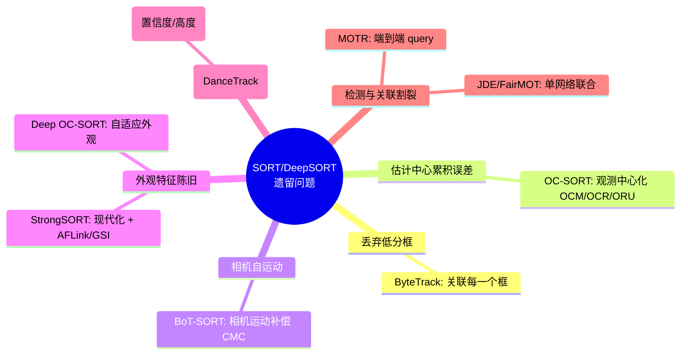

# 传统方法总结:IoU-Tracker / SORT / DeepSORT

> 本篇把 **2016–2017 年奠基性的三个 tracking-by-detection 方法**放在一起讲。它们确立了"卡尔曼预测 + 匈牙利匹配 + 生命周期管理"的经典骨架,是后续 ByteTrack、OC-SORT、BoT-SORT 等全部方法的共同祖先。读懂这一篇,后面每篇"近几年方法"都只是在这个骨架的某一处做改进。
>
> 概念前置(卡尔曼/匈牙利/指标)见 [概念总览](index.md)。

## 一张图看清血统

---

## 1. IoU-Tracker:最朴素的基线

> Bochinski et al. *High-Speed Tracking-by-Detection Without Using Image Information*. AVSS 2017.

**核心思想**:连相机/运动模型都不要。假设帧率足够高时,同一目标在相邻两帧的框**高度重叠**。于是关联规则极简——把上一帧每条轨迹的最后一个框,和当前帧 IoU 最大且 ≥ 阈值的检测框接上。

- **优点**:无需任何视觉特征,几千 FPS,代码几十行。
- **致命缺陷**:目标静止重叠歧义、漏检一帧就断、完全无法处理遮挡。它更多作为"下限基线"存在。

---

## 2. SORT:现代跟踪的奠基石

> Bewley et al. *Simple Online and Realtime Tracking*. ICIP 2016. arXiv:[1602.00763](https://arxiv.org/abs/1602.00763) · 代码 [abewley/sort](https://github.com/abewley/sort)

SORT 第一次把**卡尔曼滤波(运动预测)**和**匈牙利算法(最优匹配)**组合成在线实时跟踪管线,确立了沿用至今的范式。它**不使用任何外观信息**,只靠框的几何运动。

### 2.1 状态表示

SORT 用 7 维状态向量(本仓库 [`KalmanFilterXYSR`](https://github.com/yyq19990828/onnxtools/blob/main/onnxtools/tracking/kalman.py) 即此参数化,OC-SORT 沿用):

$$x = [u, v, s, r, \dot u, \dot v, \dot s]^\top$$

其中 $u,v$ 为框中心像素坐标,$s$ 为框面积(scale),$r$ 为纵横比(**假设恒定,无 $\dot r$**)。恒速模型:位置/面积按速度外推,纵横比不变。

### 2.2 流程

### 2.3 局限

| 局限 | 后果 | 谁来修 |
|------|------|--------|
| 无外观特征 | 遮挡后无法重识别,ID 切换多 | DeepSORT |
| 丢弃低分检测 | 遮挡/模糊目标直接漏掉 | ByteTrack |
| 纯信卡尔曼预测("估计中心") | 遮挡期误差累积、非线性运动失配 | OC-SORT |
| 短生命周期(默认丢一帧就可能删) | 长遮挡恢复差 | 缓冲区机制 |

!!! note "SORT 的代码仍活在本仓库里"
    本仓库 OC-SORT 的 [`KalmanFilterXYSR`](https://github.com/yyq19990828/onnxtools/blob/main/onnxtools/tracking/kalman.py) 与 [`KalmanBoxTracker`](https://github.com/yyq19990828/onnxtools/blob/main/onnxtools/tracking/ocsort.py) 正是 SORT 的状态参数化与"逐轨迹 KF + 预测防止负面积"的直接继承(`if self.mean[6] + self.mean[2] <= 0: self.mean[6] = 0.0`)。

---

## 3. DeepSORT:给 SORT 装上"外观记忆"

> Wojke et al. *Simple Online and Realtime Tracking with a Deep Association Metric*. ICIP 2017. arXiv:[1703.07402](https://arxiv.org/abs/1703.07402) · 代码 [nwojke/deep_sort](https://github.com/nwojke/deep_sort)

SORT 一遮挡就换 ID,根因是"只看运动不看长相"。DeepSORT 加了三样东西:**深度外观嵌入 + 马氏运动门控 + 匹配级联**,把 ID 切换降低约 45%。

### 3.1 状态表示升级为 8 维

DeepSORT 改用中心-纵横比-高的 8 维状态(本仓库 [`KalmanFilterXYAH`](https://github.com/yyq19990828/onnxtools/blob/main/onnxtools/tracking/kalman.py),ByteTrack 沿用):

$$x = [c_x, c_y, a, h, \dot c_x, \dot c_y, \dot a, \dot h]^\top$$

### 3.2 三个关键组件

1. **深度外观嵌入**:一个 CNN 在大规模行人 ReID 数据上离线训练,把每个框编码成 128 维特征向量。代价用**余弦距离**,且对每条轨迹维护一个**特征库**(最近若干帧),按最近邻匹配——这赋予轨迹跨遮挡的"记忆"。
2. **马氏距离运动门控**:在卡尔曼测量空间用马氏距离过滤几何上不可能的匹配($\chi^2$ 95% 阈值)。
3. **匹配级联 (Matching Cascade)**:**优先匹配最近被更新过的轨迹**(消失越久的轨迹优先级越低),缓解长期遮挡轨迹"抢匹配"。

### 3.3 局限与历史地位

- CNN 嵌入较弱、无相机运动补偿、恒速卡尔曼对非线性运动差、匹配级联在现代看来并非最优。
- 但 DeepSORT 确立了**"运动 + 外观双线索关联"**这一主线,直接催生了 [BoT-SORT](botsort.md)、[StrongSORT](strongsort.md)("Make DeepSORT Great Again")乃至 [Deep OC-SORT](deep-ocsort.md)。

---

## 4. 三者对比与"待解决问题"清单

| 维度 | IoU-Tracker | SORT | DeepSORT |
|------|-------------|------|----------|
| 年份/出处 | AVSS 2017 | ICIP 2016 | ICIP 2017 |
| 运动模型 | ❌ 无 | ✅ 卡尔曼(7D) | ✅ 卡尔曼(8D) |
| 外观特征 | ❌ | ❌ | ✅ CNN 128D |
| 关联 | IoU 贪心 | IoU + 匈牙利 | 外观+马氏 + 匹配级联 + IoU |
| 速度 | 数千 FPS | ~260 FPS | 实时(+ReID 前向开销) |
| 长遮挡 | ❌ | ❌ | ⚠️ 一般 |
| 非线性运动 | ❌ | ❌ | ❌ |

这三者留下的"待办清单",正好对应近几年方法的发力点:

---

## 参考文献

- Bewley et al. *Simple Online and Realtime Tracking* (SORT). ICIP 2016. arXiv:[1602.00763](https://arxiv.org/abs/1602.00763) · [代码](https://github.com/abewley/sort)
- Wojke et al. *Simple Online and Realtime Tracking with a Deep Association Metric* (DeepSORT). ICIP 2017. arXiv:[1703.07402](https://arxiv.org/abs/1703.07402) · [代码](https://github.com/nwojke/deep_sort)
- Bochinski et al. *High-Speed Tracking-by-Detection Without Using Image Information* (IoU-Tracker). AVSS 2017.

→ 下一篇:[ByteTrack:关联每一个检测框](bytetrack.md)
