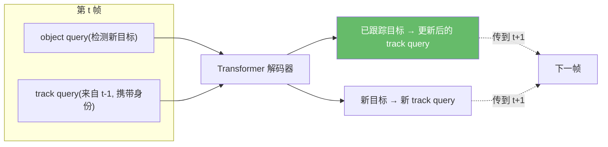
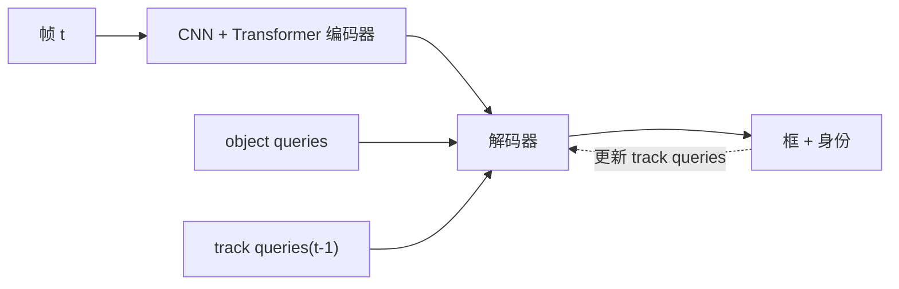
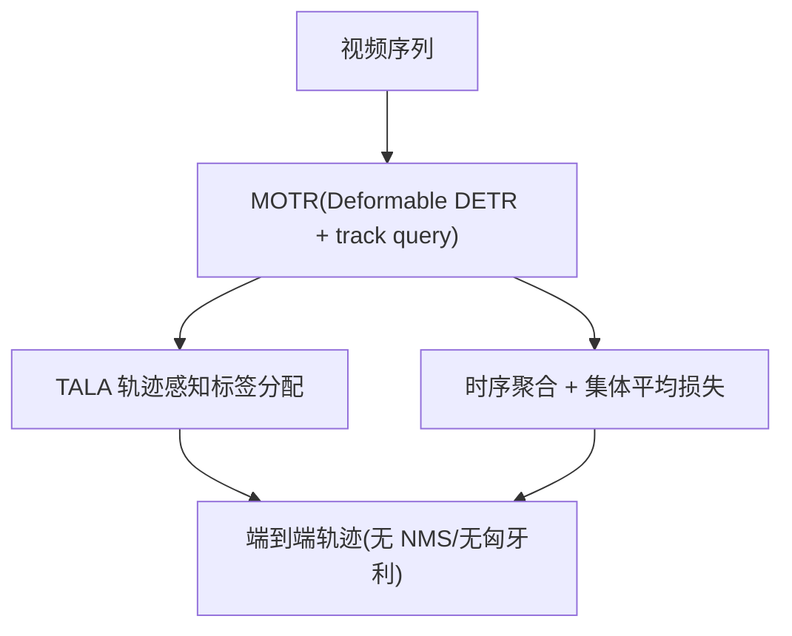
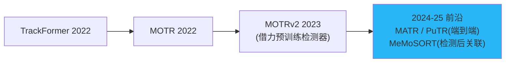

# 端到端 Transformer(query 派):TrackFormer / MOTR / MOTRv2 与前沿

> 本篇讲**范式三**:用 DETR 式 Transformer 把检测与跟踪**端到端**统一,关联在注意力里**隐式**完成,不再手写卡尔曼/匈牙利。代表作 TrackFormer、MOTR、MOTRv2,并梳理 2024–2025 前沿。
>
> 📚 知识体系补全。端到端方法计算量大,目前工业实时部署仍以范式一(本仓库的 ByteTrack/OC-SORT)为主。

## 1. 核心思想:用 "track query" 携带身份穿越时间

DETR 用一组 **object query** 做集合预测检测。query 派的洞见:

> 让一部分 query 变成 **track query**,**跨帧自回归传递**——同一个 track query 始终解码同一个目标。身份由 query 的"延续"天然保证,关联**隐式**发生在注意力中。

- **新目标**:由静态 object query 检出 → 派生新 track query;
- **已有目标**:由上一帧延续来的 track query 解码 → 位置更新、ID 不变;
- **目标消失**:对应 track query 不再匹配到目标 → 自然退场。

这被称为 **"tracking-by-attention"**(注意力即关联),彻底告别手写运动模型与匈牙利匹配。

## 2. TrackFormer:tracking-by-attention 的开创者

> Meinhardt et al. *TrackFormer: Multi-Object Tracking with Transformers*. CVPR 2022. arXiv:[2101.02702](https://arxiv.org/abs/2101.02702) · 代码 [timmeinhardt/trackformer](https://github.com/timmeinhardt/trackformer)

DETR 式编码器-解码器把跟踪建模为**逐帧集合预测**。静态 object query 负责"发现"新目标,身份保持的 track query 自回归携带已有目标;关联通过解码器的自/交叉注意力隐式完成。同时支持 MOTS(分割跟踪)。

**局限**:计算重、速度慢;**新 query 与 track query 竞争**(同一目标可能被两者重复检出);训练数据需求大;运动主导基准(DanceTrack)上偏弱。

## 3. MOTR 与 MOTRv2

### 3.1 MOTR:全端到端时序建模

> Zeng et al. *MOTR: End-to-End Multiple-Object Tracking with Transformer*. ECCV 2022. arXiv:[2105.03247](https://arxiv.org/abs/2105.03247) · 代码 [megvii-research/MOTR](https://github.com/megvii-research/MOTR)

在 Deformable DETR 上引入跨**整段视频**建模的 track query,配合:

- **TALA(Tracklet-Aware Label Assignment)**:轨迹感知的标签分配,让 track query 持续对应同一目标;
- **时序聚合网络 + 集体平均损失**:跨帧时序建模,完全无后处理关联。

**局限**:检测与关联在一个网络里**严重互相牵制**,导致检测偏弱,原始 MOTA 落后于"强检测器 + tracker"方案。

### 3.2 MOTRv2:用预训练检测器"喂"提案

> Zhang et al. *MOTRv2: Bootstrapping End-to-End MOT by Pretrained Object Detectors*. CVPR 2023. arXiv:[2211.09791](https://arxiv.org/abs/2211.09791) · 代码 [megvii-research/MOTRv2](https://github.com/megvii-research/MOTRv2)

针对 MOTR 的检测-关联冲突,MOTRv2 把**预训练 YOLOX 的提案**作为 anchor 喂给 MOTR,**解耦检测质量与 query 关联学习**:

- **指标**:DanceTrack Group Dance Challenge 第一,**DanceTrack HOTA 73.4**;BDD100K SOTA。
- **局限**:已非"纯端到端"(依赖外部检测器);速度/算力仍重。

## 4. 2024–2025 前沿一瞥

| 方法 | 年份 | 亮点 | 代表成绩 |
|------|------|------|----------|
| **MATR**(Motion-Aware Transformer) | 2025 | 显式预测运动以预更新 track query,减少 query 冲突 | DanceTrack HOTA 71.3 / SportsMOT 72.2 |
| **MeMoSORT** | 2025 | 记忆辅助滤波 + 运动自适应关联(tracking-by-detection 前沿) | DanceTrack 67.9 / SportsMOT 82.1 HOTA |
| **PuTR**(Pure Transformer) | 2024 | 解耦的在线 Transformer 关联,设计简洁 | DanceTrack/SportsMOT 领先 IDF1/HOTA |
| **FastTrackTr** | 2024 | 面向实时部署的 Transformer 跟踪器 | 效率前沿 |

> 引用:MATR arXiv:[2509.21715](https://arxiv.org/abs/2509.21715) · MeMoSORT arXiv:[2508.09796](https://arxiv.org/abs/2508.09796) · PuTR arXiv:[2405.14119](https://arxiv.org/abs/2405.14119) · FastTrackTr arXiv:[2411.15811](https://arxiv.org/abs/2411.15811)

## 5. 范式三 vs 范式一:何时用哪个

| 维度 | 端到端 Transformer | Tracking-by-Detection(本仓库) |
|------|--------------------|-------------------------------|
| 关联 | 注意力隐式 | 卡尔曼 + 匈牙利显式 |
| 手工启发式 | 几乎无 | 需调阈值/buffer |
| 算力/速度 | 重、慢 | 轻、100+ FPS |
| 检测器解耦 | 一体(MOTRv2 才半解耦) | 完全解耦,换检测器零成本 |
| 部署成熟度 | 研究为主 | 工业实时主流 |
| 长时序建模 | 强(全序列 query) | 靠 buffer/ReID |

!!! note "对本仓库用户的建议"
    端到端方法在 DanceTrack/SportsMOT 等学术榜单亮眼,但**实时、可换检测器、易部署**仍是 tracking-by-detection 的天下。本仓库的 [ByteTrack](bytetrack.md) / [OC-SORT](ocsort.md) 正是为这种工程落地而设计——若未来需要更强的长时序/外观能力,可循 [BoT-SORT](botsort.md)/[Deep OC-SORT](deep-ocsort.md) 路线增量扩展,而非直接上端到端。

## 参考文献

- Meinhardt et al. *TrackFormer*. CVPR 2022. arXiv:[2101.02702](https://arxiv.org/abs/2101.02702) · [代码](https://github.com/timmeinhardt/trackformer)
- Zeng et al. *MOTR*. ECCV 2022. arXiv:[2105.03247](https://arxiv.org/abs/2105.03247) · [代码](https://github.com/megvii-research/MOTR)
- Zhang et al. *MOTRv2*. CVPR 2023. arXiv:[2211.09791](https://arxiv.org/abs/2211.09791) · [代码](https://github.com/megvii-research/MOTRv2)
- MATR arXiv:[2509.21715](https://arxiv.org/abs/2509.21715) · MeMoSORT arXiv:[2508.09796](https://arxiv.org/abs/2508.09796) · PuTR arXiv:[2405.14119](https://arxiv.org/abs/2405.14119) · FastTrackTr arXiv:[2411.15811](https://arxiv.org/abs/2411.15811)

→ 上一篇:[联合检测与嵌入(JDE 派)](jde-family.md) · 下一篇:[评测指标详解](metrics.md)
