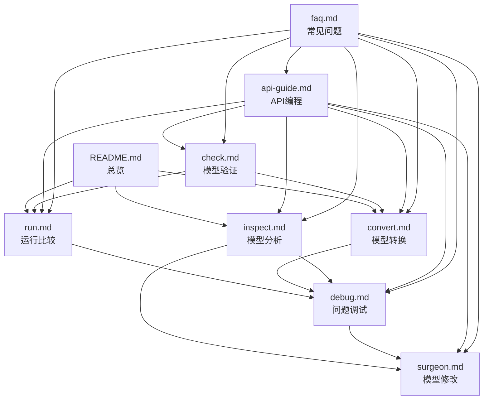

# Polygraphy 使用指南 - 文档目录索引

欢迎使用 Polygraphy 使用指南！本指南提供了全面的 Polygraphy 工具使用说明和最佳实践。

## 📚 文档结构

### 🏠 总览文档
- **[README.md](./README.md)** - 快速开始指南和核心概念介绍

### 🛠️ 核心工具命令
1. **[run.md](./run.md)** - 跨框架推理比较
   - 基本用法和参数说明
   - 自定义数据加载和结果分析
   - 动态形状和精度配置
   - 实用示例和故障排除

2. **[convert.md](./convert.md)** - 模型格式转换
   - ONNX 转 TensorRT 引擎
   - FP16/INT8 量化配置
   - 动态形状优化
   - 校准数据管理

3. **[inspect.md](./inspect.md)** - 模型结构分析
   - 模型信息查看和验证
   - 数据文件检查
   - 模型差异对比
   - 设备能力检查

4. **[surgeon.md](./surgeon.md)** - ONNX 模型修改
   - 模型清理和优化
   - 子图提取和节点操作
   - 常量折叠和结构简化
   - 调试辅助功能

5. **[debug.md](./debug.md)** - 调试工具集
   - 自动模型减少
   - TensorRT 策略调试
   - 精度问题定位
   - 自动化调试流程

6. **[check.md](./check.md)** - 模型验证工具
   - ONNX 语法检查
   - 兼容性验证
   - 性能分析
   - 质量门禁

<!-- ### 📖 高级主题
7. **[api-guide.md](./api-guide.md)** - Python API 编程指南
   - 核心 API 概念和用法
   - 自定义工作流开发
   - 批量处理和自动化
   - 错误处理和日志配置

8. **[faq.md](./faq.md)** - 常见问题解答
   - 安装和环境配置
   - 模型转换常见问题
   - 精度和推理问题
   - 性能优化建议 -->

## 🎯 快速导航

### 按使用场景导航

#### 🆕 初次使用
1. 阅读 [README.md](./README.md) 了解基本概念
2. 参考 [run.md](./run.md) 进行第一次跨框架比较
3. 查看 [faq.md](./faq.md) 解决常见问题

#### 🔄 模型转换
1. [convert.md](./convert.md) - 学习转换基础
2. [inspect.md](./inspect.md) - 分析模型结构
3. [debug.md](./debug.md) - 处理转换问题

#### 🐛 问题调试
1. [debug.md](./debug.md) - 系统性调试方法
2. [inspect.md](./inspect.md) - 详细问题分析
3. [surgeon.md](./surgeon.md) - 模型修复和优化
4. [faq.md](./faq.md) - 常见问题快速解决

#### 🚀 性能优化
1. [convert.md](./convert.md) - 转换优化配置
2. [run.md](./run.md) - 性能基准测试
3. [api-guide.md](./api-guide.md) - 自动化性能测试

#### 🔍 模型验证
1. [check.md](./check.md) - 全面模型验证
2. [inspect.md](./inspect.md) - 详细模型分析
3. [run.md](./run.md) - 精度验证

#### 💻 编程集成
1. [api-guide.md](./api-guide.md) - Python API 详解
2. [README.md](./README.md) - 环境配置
3. 各工具文档中的 API 示例

### 按复杂度导航

#### 🟢 基础用法
- [README.md](./README.md) - 快速开始
- [run.md](./run.md) - 基本比较
- [convert.md](./convert.md) - 简单转换

#### 🟡 进阶用法
- [inspect.md](./inspect.md) - 深入分析
- [surgeon.md](./surgeon.md) - 模型修改
- [check.md](./check.md) - 全面验证

#### 🔴 高级用法
- [debug.md](./debug.md) - 复杂问题调试
- [api用法](./examples/api/) - 编程式处理
- [CLI用法](./examples/cli/) -
- 各文档中的自动化脚本

## 🔗 文档间的关联

## 📋 使用建议

### 📖 学习路径
1. **新手**: README → run → convert → faq
2. **开发者**: api-guide → 具体工具文档 → debug
3. **运维**: check → inspect → debug → faq

### 🔍 问题解决路径
1. 先查看对应工具文档的"常见问题"部分
2. 参考 [faq.md](./faq.md) 寻找解决方案
3. 使用 [debug.md](./debug.md) 进行系统性调试
4. 通过 [api-guide.md](./api-guide.md) 实现自动化解决方案

### ⭐ 最佳实践
- 每个文档都包含实用示例，建议动手实践
- 关注文档中的"注意事项"和"最佳实践"章节
- 结合实际项目需求选择合适的工具和配置
- 建议建立自己的工具脚本库，参考各文档的自动化示例

## 📞 获取帮助

如果在使用过程中遇到问题：
1. 首先查看 [faq.md](./faq.md)
2. 参考相关工具文档的故障排除部分
3. 使用 `--verbose` 和 `--extra-verbose` 获取详细日志
4. 查阅官方文档和社区资源

---

*本文档索引最后更新：2024年8月*

## 📝 文档贡献

欢迎对本使用指南进行改进和补充：
- 报告文档错误或不清晰的地方
- 补充实用的使用案例
- 分享最佳实践和技巧
- 提供更多的自动化脚本示例