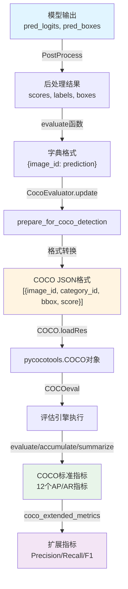

# RF-DETR COCO评估实现详细分析报告

> **分析时间**: 2025-10-11
> **项目**: ONNX车辆牌照识别系统
> **目标仓库**: `third_party/rfdetr`
> **分析范围**: COCO指标计算流程、模型输出格式、数据桥接机制

---

## 1. 执行摘要 (Executive Summary)

本报告深入分析了RF-DETR仓库中COCO评估指标的完整实现流程，涵盖以下核心内容：

- ✅ **模型输出格式**: `pred_logits` (分类) + `pred_boxes` (边框) + `pred_masks` (可选分割)
- ✅ **后处理流程**: Sigmoid激活 → Top-K选择 → 边框格式转换 (cxcywh→xyxy) → 绝对坐标缩放
- ✅ **COCO桥接**: 自定义格式 → COCO标准JSON → pycocotools加载 → 评估指标计算
- ✅ **评估指标**: 12个标准COCO指标 (AP/AR) + 4个扩展指标 (Precision/Recall/F1/Per-Class)

**关键发现**:
1. RF-DETR采用**三阶段数据转换**确保与COCO API兼容
2. 使用**CocoEvaluator**类封装完整评估流程，支持分布式训练
3. 提供**扩展指标计算**函数，自动找到最佳F1阈值并分解到每个类别

---

## 2. 核心评估文件概览

### 2.1 主要评估相关文件

| 文件路径 | 职责 | 关键类/函数 | 代码行数 |
|---------|------|------------|---------|
| `datasets/coco_eval.py` | COCO评估器核心实现 | `CocoEvaluator` | 272行 |
| `engine.py` | 训练和评估引擎 | `evaluate()`, `coco_extended_metrics()` | 341行 |
| `models/lwdetr.py` | PostProcess后处理类 | `PostProcess.forward()` | ~1000+行 |
| `datasets/coco.py` | COCO数据集加载 | `CocoDetection` | 330行 |
| `util/metrics.py` | 指标计算和可视化 | `log_coco_metrics()` | 243行 |
| `detr.py` | RF-DETR高级API | `RFDetr`, `train()`, `val()` | 477行 |

### 2.2 依赖关系图

```
┌─────────────────────────────────────────┐
│   pycocotools (外部依赖)                 │
│   - COCO (GT数据加载)                    │
│   - COCOeval (评估引擎)                  │
└──────────────┬──────────────────────────┘
               │ 依赖
┌──────────────▼──────────────────────────┐
│   datasets/coco_eval.py                 │
│   - CocoEvaluator (封装评估流程)         │
│   - prepare_for_coco_detection()        │
└──────────────┬──────────────────────────┘
               │ 调用
┌──────────────▼──────────────────────────┐
│   engine.py                             │
│   - evaluate() (主评估循环)              │
│   - coco_extended_metrics() (扩展指标)   │
└──────────────┬──────────────────────────┘
               │ 使用
┌──────────────▼──────────────────────────┐
│   models/lwdetr.py                      │
│   - PostProcess (后处理模块)             │
└─────────────────────────────────────────┘
```

---

## 3. 模型输出数据格式

### 3.1 原始模型输出 (Raw Model Output)

RF-DETR模型的直接输出是一个字典，包含以下张量：

```python
# 文件: rfdetr/models/lwdetr.py - LWDetr.forward()
model_outputs = {
    # 分类预测 (未归一化的logits)
    'pred_logits': torch.Tensor,
    # shape: [batch_size, num_queries, num_classes]
    # 示例: [2, 300, 91]  (batch=2, 300个查询, 91个COCO类别)
    # 值域: (-∞, +∞) 未经sigmoid激活

    # 边框预测 (归一化的相对坐标)
    'pred_boxes': torch.Tensor,
    # shape: [batch_size, num_queries, 4]
    # 示例: [2, 300, 4]
    # 格式: [center_x, center_y, width, height]
    # 值域: [0, 1] 相对于输入图像尺寸的归一化坐标

    # 分割掩码预测 (可选, 仅在segmentation_head=True时)
    'pred_masks': torch.Tensor,
    # shape: [batch_size, num_queries, H_mask, W_mask]
    # 示例: [2, 300, 160, 160]
    # 值域: [0, 1] 概率掩码
}
```

**示例数据**:

```python
# 单个查询的原始输出
{
    'pred_logits': tensor([[-2.5, 3.2, 1.8, ..., 0.5]]),  # 91个类别的logits
    'pred_boxes': tensor([[0.5, 0.3, 0.15, 0.2]]),       # [cx, cy, w, h]
}

# 经过sigmoid激活后
prob = torch.sigmoid(pred_logits)  # [0.075, 0.961, 0.858, ..., 0.623]
max_score, max_class = prob.max()  # score=0.961, class=1 (person)
```

### 3.2 PostProcess后处理输出

经过`PostProcess`模块处理后，数据转换为COCO API兼容格式：

```python
# 文件: rfdetr/models/lwdetr.py - class PostProcess
postprocessed_results = [
    # 每个batch的输出是一个字典
    {
        # Top-K置信度分数 (已sigmoid激活)
        'scores': torch.Tensor,
        # shape: [num_select]  (默认100)
        # 示例: tensor([0.961, 0.885, 0.742, ...])  (降序排列)
        # 值域: [0, 1]

        # 预测类别ID (0-based索引)
        'labels': torch.Tensor,
        # shape: [num_select]
        # 示例: tensor([1, 18, 3, ...])  (1=person, 18=dog, 3=car)
        # 值域: [0, num_classes-1]

        # 边框绝对坐标 (xyxy格式)
        'boxes': torch.Tensor,
        # shape: [num_select, 4]
        # 格式: [x_min, y_min, x_max, y_max]
        # 示例: tensor([[272.0, 96.0, 368.0, 192.0], ...])
        # 值域: 绝对像素坐标 (基于原图尺寸)

        # 分割掩码 (可选)
        'masks': torch.Tensor,
        # shape: [num_select, 1, orig_h, orig_w]
        # 布尔掩码, 已resize到原图尺寸
    },
    # ... 每个batch的结果
]
```

### 3.3 关键转换步骤

以下是`PostProcess.forward()`的详细转换逻辑：

```python
# 文件: rfdetr/models/lwdetr.py: PostProcess.forward() 第441-493行

@torch.no_grad()
def forward(self, outputs, target_sizes):
    """
    将模型输出转换为COCO格式

    Args:
        outputs: 模型原始输出
            - pred_logits: [B, Q, C] 分类logits
            - pred_boxes: [B, Q, 4] 边框 [cx, cy, w, h] (归一化)
        target_sizes: [B, 2] 目标图像尺寸 (height, width)

    Returns:
        results: List[Dict] 每个元素包含 {'scores', 'labels', 'boxes'}
    """
    out_logits, out_bbox = outputs['pred_logits'], outputs['pred_boxes']

    # ========== 步骤1: Sigmoid激活 + Top-K选择 ==========
    prob = out_logits.sigmoid()  # [B, Q, C] -> 概率分布
    topk_values, topk_indexes = torch.topk(
        prob.view(out_logits.shape[0], -1),  # 展平为 [B, Q*C]
        self.num_select,  # 默认100
        dim=1
    )
    # topk_values: [B, 100] Top-K分数
    # topk_indexes: [B, 100] 在展平维度的索引

    scores = topk_values
    topk_boxes = topk_indexes // out_logits.shape[2]  # 查询索引
    labels = topk_indexes % out_logits.shape[2]       # 类别索引

    # ========== 步骤2: 边框格式转换 cxcywh -> xyxy ==========
    boxes = box_ops.box_cxcywh_to_xyxy(out_bbox)  # [B, Q, 4]
    # 公式:
    # x1 = cx - w/2
    # y1 = cy - h/2
    # x2 = cx + w/2
    # y2 = cy + h/2

    # 根据Top-K索引选择对应的边框
    boxes = torch.gather(
        boxes, 1,
        topk_boxes.unsqueeze(-1).repeat(1, 1, 4)
    )  # [B, 100, 4]

    # ========== 步骤3: 缩放到绝对坐标 ==========
    img_h, img_w = target_sizes.unbind(1)  # [B] 高度和宽度
    scale_fct = torch.stack([img_w, img_h, img_w, img_h], dim=1)  # [B, 4]
    boxes = boxes * scale_fct[:, None, :]  # 广播乘法
    # 示例: [0.425, 0.2, 0.575, 0.4] * [640, 480, 640, 480]
    #    -> [272.0, 96.0, 368.0, 192.0]

    # ========== 步骤4: 组装结果 ==========
    results = [
        {'scores': s, 'labels': l, 'boxes': b}
        for s, l, b in zip(scores, labels, boxes)
    ]

    return results
```

**数据转换示例**:

```python
# 原始输入
pred_boxes = torch.tensor([[0.5, 0.3, 0.15, 0.2]])  # [cx, cy, w, h] 归一化
target_size = (480, 640)  # [height, width]

# 步骤1: cxcywh -> xyxy (归一化)
x1 = 0.5 - 0.15/2 = 0.425
y1 = 0.3 - 0.2/2 = 0.2
x2 = 0.5 + 0.15/2 = 0.575
y2 = 0.3 + 0.2/2 = 0.4
xyxy_norm = [0.425, 0.2, 0.575, 0.4]

# 步骤2: 缩放到绝对坐标
x1_abs = 0.425 * 640 = 272.0
y1_abs = 0.2 * 480 = 96.0
x2_abs = 0.575 * 640 = 368.0
y2_abs = 0.4 * 480 = 192.0
xyxy_abs = [272.0, 96.0, 368.0, 192.0]

# 最终输出
result = {
    'scores': torch.tensor([0.961]),
    'labels': torch.tensor([1]),  # person类
    'boxes': torch.tensor([[272.0, 96.0, 368.0, 192.0]])
}
```

---

## 4. 数据桥接到COCO API

### 4.1 完整桥接流程



### 4.2 步骤1: 组织为字典格式

```python
# 文件: rfdetr/engine.py: evaluate() 第312-319行

# 提取目标图像的原始尺寸
orig_target_sizes = torch.stack(
    [t["orig_size"] for t in targets],
    dim=0
)
# 示例: tensor([[480, 640], [600, 800]])  (height, width)

# 调用PostProcess进行后处理
results_all = postprocess(outputs, orig_target_sizes)
# 返回: [
#     {'scores': Tensor[100], 'labels': Tensor[100], 'boxes': Tensor[100, 4]},
#     {'scores': Tensor[100], 'labels': Tensor[100], 'boxes': Tensor[100, 4]}
# ]

# 组织为 {image_id: prediction} 字典格式
res = {
    target["image_id"].item(): output
    for target, output in zip(targets, results_all)
}
# 示例:
# res = {
#     139: {'scores': tensor([0.961, ...]), 'labels': tensor([1, ...]), 'boxes': tensor([[272.0, ...], ...])},
#     285: {'scores': tensor([0.885, ...]), 'labels': tensor([18, ...]), 'boxes': tensor([[150.2, ...], ...])},
#     ...
# }

# 更新评估器
coco_evaluator.update(res)
```

### 4.3 步骤2: 转换为COCO标准JSON格式

```python
# 文件: rfdetr/datasets/coco_eval.py: prepare_for_coco_detection() 第93-115行

def prepare_for_coco_detection(self, predictions):
    """
    将预测结果转换为COCO标准格式

    Args:
        predictions: Dict[int, Dict[str, Tensor]]
            {image_id: {'boxes': Tensor[N,4], 'scores': Tensor[N], 'labels': Tensor[N]}}

    Returns:
        coco_results: List[Dict] COCO格式的检测结果列表
            [{'image_id', 'category_id', 'bbox', 'score'}, ...]
    """
    coco_results = []

    for original_id, prediction in predictions.items():
        if len(prediction) == 0:
            continue

        # 提取预测数据
        boxes = prediction["boxes"]  # [N, 4] xyxy格式
        boxes = convert_to_xywh(boxes).tolist()  # 转换为xywh格式
        scores = prediction["scores"].tolist()
        labels = prediction["labels"].tolist()

        # 转换为COCO格式
        coco_results.extend([
            {
                "image_id": original_id,      # 图像ID (int)
                "category_id": labels[k],     # 类别ID (1-based, int)
                "bbox": box,                  # 边框 [x, y, w, h] (List[float])
                "score": scores[k],           # 置信度分数 (float)
            }
            for k, box in enumerate(boxes)
        ])

    return coco_results
```

**边框格式转换函数**:

```python
# 文件: rfdetr/datasets/coco_eval.py: convert_to_xywh() 第179-181行

def convert_to_xywh(boxes):
    """
    将边框从xyxy格式转换为xywh格式

    Args:
        boxes: Tensor[N, 4] 格式为 [x_min, y_min, x_max, y_max]

    Returns:
        Tensor[N, 4] 格式为 [x, y, width, height]
    """
    xmin, ymin, xmax, ymax = boxes.unbind(1)
    return torch.stack(
        (xmin, ymin, xmax - xmin, ymax - ymin),
        dim=1
    )

# 示例:
# 输入: tensor([[272.0, 96.0, 368.0, 192.0]])
# 输出: tensor([[272.0, 96.0, 96.0, 96.0]])
```

**转换示例**:

```python
# 输入: PostProcess输出
prediction = {
    139: {
        'scores': tensor([0.961, 0.885]),
        'labels': tensor([1, 18]),
        'boxes': tensor([[272.0, 96.0, 368.0, 192.0],   # xyxy格式
                        [150.2, 200.5, 200.4, 280.8]])
    }
}

# 步骤1: xyxy -> xywh
boxes_xywh = convert_to_xywh(prediction[139]['boxes'])
# tensor([[272.0, 96.0, 96.0, 96.0],
#         [150.2, 200.5, 50.2, 80.3]])

# 步骤2: 组装COCO格式
coco_results = [
    {
        "image_id": 139,
        "category_id": 1,           # person
        "bbox": [272.0, 96.0, 96.0, 96.0],
        "score": 0.961
    },
    {
        "image_id": 139,
        "category_id": 18,          # dog
        "bbox": [150.2, 200.5, 50.2, 80.3],
        "score": 0.885
    }
]
```

### 4.4 步骤3: 加载到pycocotools并评估

```python
# 文件: rfdetr/datasets/coco_eval.py: update() 第50-67行

def update(self, predictions):
    """
    更新评估结果

    Args:
        predictions: Dict[int, Dict[str, Tensor]] 预测结果字典
    """
    # 提取所有图像ID
    img_ids = list(np.unique(list(predictions.keys())))
    self.img_ids.extend(img_ids)

    for iou_type in self.iou_types:  # ['bbox'] 或 ['bbox', 'segm']
        # 准备COCO格式的结果
        results = self.prepare(predictions, iou_type)
        # results = [{'image_id', 'category_id', 'bbox', 'score'}, ...]

        # 加载预测结果到COCO API (抑制输出)
        with open(os.devnull, 'w') as devnull:
            with contextlib.redirect_stdout(devnull):
                coco_dt = COCO.loadRes(self.coco_gt, results) if results else COCO()

        # 创建评估对象
        coco_eval = self.coco_eval[iou_type]
        coco_eval.cocoDt = coco_dt  # 预测结果
        coco_eval.params.imgIds = list(img_ids)

        # 执行评估 (调用自定义的evaluate函数)
        img_ids, eval_imgs = evaluate(coco_eval)
        self.eval_imgs[iou_type].append(eval_imgs)
```

**自定义evaluate函数** (支持分布式训练):

```python
# 文件: rfdetr/datasets/coco_eval.py: evaluate() 第184-228行

def evaluate(imgs):
    """
    自定义评估函数，支持分布式并行

    Args:
        imgs: COCOeval对象，包含GT和预测结果

    Returns:
        img_ids: 图像ID列表
        eval_imgs: 评估结果列表 (每个图像的匹配结果)
    """
    if hasattr(imgs, 'params'):
        # 标准COCOeval对象
        p = imgs.params
        catIds = p.catIds if p.useCats else [-1]

        # 调用pycocotools的computeIoU函数
        imgs.computeIoU = computeIoU

        # 评估每个类别、每个区域、每个图像
        imgs.ious = {
            (imgId, catId): imgs.computeIoU(imgId, catId)
            for imgId in p.imgIds
            for catId in catIds
        }

        # 并行评估所有图像
        evaluateImg = imgs.evaluateImg
        maxDet = p.maxDets[-1]
        evalImgs = [
            evaluateImg(imgId, catId, areaRng, maxDet)
            for catId in catIds
            for areaRng in p.areaRng
            for imgId in p.imgIds
        ]

        # 重组为[T, R, K, A, M]格式
        evalImgs = np.asarray(evalImgs).reshape(len(catIds), len(p.areaRng), len(p.imgIds))
        imgs._paramsEval = copy.deepcopy(imgs.params)

        return p.imgIds, evalImgs
```

### 4.5 步骤4: 累积和汇总指标

```python
# 文件: rfdetr/datasets/coco_eval.py: accumulate() & summarize()

def accumulate(self):
    """累积所有图像的评估结果"""
    for coco_eval in self.coco_eval.values():
        coco_eval.eval = self.merge(coco_eval)
        coco_eval.accumulate()  # 调用pycocotools的累积函数

def summarize(self):
    """打印评估摘要"""
    for iou_type, coco_eval in self.coco_eval.items():
        print("IoU metric: {}".format(iou_type))
        coco_eval.summarize()  # 调用pycocotools的汇总函数
        # 输出示例:
        # Average Precision  (AP) @[ IoU=0.50:0.95 | area=   all | maxDets=100 ] = 0.425
        # Average Precision  (AP) @[ IoU=0.50      | area=   all | maxDets=100 ] = 0.648
        # ...
```

---

## 5. 评估指标详解

### 5.1 标准COCO指标 (12个)

来源: `pycocotools.cocoeval.COCOeval.summarize()`

```python
# 所有指标存储在 coco_eval.stats 数组中
coco_eval.stats = np.array([
    stats[0],   # AP @ IoU=0.50:0.95 (主指标)
    stats[1],   # AP @ IoU=0.50
    stats[2],   # AP @ IoU=0.75
    stats[3],   # AP @ IoU=0.50:0.95 | area=small
    stats[4],   # AP @ IoU=0.50:0.95 | area=medium
    stats[5],   # AP @ IoU=0.50:0.95 | area=large
    stats[6],   # AR @ IoU=0.50:0.95 | maxDets=1
    stats[7],   # AR @ IoU=0.50:0.95 | maxDets=10
    stats[8],   # AR @ IoU=0.50:0.95 | maxDets=100
    stats[9],   # AR @ IoU=0.50:0.95 | area=small
    stats[10],  # AR @ IoU=0.50:0.95 | area=medium
    stats[11],  # AR @ IoU=0.50:0.95 | area=large
])
```

**指标详细说明**:

| 指标编号 | 名称 | 说明 | IoU阈值 | 区域范围 | 最大检测数 |
|---------|------|------|---------|---------|-----------|
| **stats[0]** | **mAP** | 平均精度均值 (主指标) | 0.50:0.95 (步长0.05) | all | 100 |
| stats[1] | AP50 | IoU=0.5时的AP | 0.50 | all | 100 |
| stats[2] | AP75 | IoU=0.75时的AP | 0.75 | all | 100 |
| stats[3] | AP_small | 小目标的AP | 0.50:0.95 | < 32² | 100 |
| stats[4] | AP_medium | 中目标的AP | 0.50:0.95 | 32² ~ 96² | 100 |
| stats[5] | AP_large | 大目标的AP | 0.50:0.95 | > 96² | 100 |
| stats[6] | AR_1 | 最多1个检测的平均召回 | 0.50:0.95 | all | **1** |
| stats[7] | AR_10 | 最多10个检测的平均召回 | 0.50:0.95 | all | **10** |
| stats[8] | AR_100 | 最多100个检测的平均召回 | 0.50:0.95 | all | **100** |
| stats[9] | AR_small | 小目标的平均召回 | 0.50:0.95 | < 32² | 100 |
| stats[10] | AR_medium | 中目标的平均召回 | 0.50:0.95 | 32² ~ 96² | 100 |
| stats[11] | AR_large | 大目标的平均召回 | 0.50:0.95 | > 96² | 100 |

**关键概念**:

- **IoU阈值**: 预测框与GT框的重叠度，0.50:0.95表示使用10个阈值(0.50, 0.55, ..., 0.95)的平均值
- **区域范围**: 基于边框面积划分
  - Small: 面积 < 32² = 1024 像素²
  - Medium: 1024 ≤ 面积 < 96² = 9216 像素²
  - Large: 面积 ≥ 9216 像素²
- **maxDets**: 每张图像最多考虑的检测框数量

### 5.2 RF-DETR扩展指标

来源: `rfdetr/engine.py: coco_extended_metrics()` 第181-250行

```python
# 扩展指标返回一个字典
extended_metrics = {
    # ========== 全局指标 ==========
    "map@50:95": float,        # 等同于 coco_eval.stats[0]
    "map@50": float,           # 等同于 coco_eval.stats[1]
    "precision": float,        # 宏平均精确率 (在最佳F1点)
    "recall": float,           # 宏平均召回率 (在最佳F1点)
    "f1": float,               # 宏平均F1分数 (最大值)

    # ========== 每个类别的详细指标 ==========
    "class_map": [
        # 每个类别的指标
        {
            "class": str,           # 类别名称 (如 "person", "car")
            "map@50:95": float,     # 该类的AP@0.5:0.95
            "map@50": float,        # 该类的AP@50
            "precision": float,     # 该类的精确率 (在最佳F1点)
            "recall": float,        # 该类的召回率 (在最佳F1点)
            "f1": float,            # 该类的F1分数
        },
        # ... 80个COCO类别

        # 所有类别的汇总 (macro average)
        {
            "class": "all",
            "map@50:95": float,     # 所有类别的宏平均AP
            "map@50": float,
            "precision": float,
            "recall": float,
            "f1": float
        }
    ]
}
```

**扩展指标计算逻辑**:

```python
# 文件: rfdetr/engine.py: coco_extended_metrics() 第181-250行

def coco_extended_metrics(coco_eval, coco=None):
    """
    计算扩展的COCO指标，包括精确率、召回率、F1分数

    Args:
        coco_eval: COCOeval对象 (已调用accumulate)
        coco: COCO对象 (ground truth)

    Returns:
        results: Dict 包含全局和每类别指标
    """
    # ========== 提取精确率矩阵 ==========
    iou_thrs = coco_eval.params.iouThrs  # [0.50, 0.55, ..., 0.95]
    rec_thrs = coco_eval.params.recThrs  # [0.0, 0.01, 0.02, ..., 1.0]

    # 找到IoU=0.5的索引
    iou50_idx = int(np.argwhere(np.isclose(iou_thrs, 0.50)))

    # 提取精确率数据
    # P的shape: [T, R, K, A, M]
    # T: IoU阈值数 (10), R: 召回阈值数 (101), K: 类别数 (80)
    # A: 区域范围数 (4), M: 最大检测数 (3)
    P = coco_eval.eval["precision"]

    # 提取IoU=0.5、area=all、maxDets=100的精确率
    prec_raw = P[iou50_idx, :, :, area_idx, maxdet_idx]  # [101, 80]

    # ========== 计算F1分数并找到最佳阈值 ==========
    prec = prec_raw.copy().astype(float)
    prec[prec < 0] = np.nan  # 将-1替换为NaN

    # 计算每个类别的F1分数
    # F1 = 2 * P * R / (P + R)
    f1_cls = 2 * prec * rec_thrs[:, None] / (prec + rec_thrs[:, None] + 1e-8)
    # f1_cls shape: [101, 80]

    # 宏平均F1 (所有类别平均)
    f1_macro = np.nanmean(f1_cls, axis=1)  # [101]

    # 找到最佳F1阈值
    best_j = int(f1_macro.argmax())

    # 在最佳阈值点计算全局指标
    macro_precision = float(np.nanmean(prec[best_j]))
    macro_recall = float(rec_thrs[best_j])
    macro_f1 = float(f1_macro[best_j])

    # ========== 计算每个类别的指标 ==========
    class_map = []
    cat_ids = coco_eval.params.catIds

    for k, cid in enumerate(cat_ids):
        # 提取该类别的精确率矩阵
        p_slice = P[:, :, k, area_idx, maxdet_idx]  # [T, R]

        # AP@0.50:0.95 (所有IoU阈值的平均)
        valid = (p_slice > -1).any(axis=1)
        ap_50_95 = float(p_slice[valid].mean()) if valid.any() else float('nan')

        # AP@0.50
        ap_50 = float(p_slice[iou50_idx].mean()) if (p_slice[iou50_idx] > -1).any() else float('nan')

        # 精确率、召回率、F1 (在最佳阈值点)
        precision_cls = float(prec[best_j, k]) if not np.isnan(prec[best_j, k]) else float('nan')
        recall_cls = float(rec_thrs[best_j])
        f1_cls_val = float(f1_cls[best_j, k]) if not np.isnan(f1_cls[best_j, k]) else float('nan')

        # 获取类别名称
        class_name = coco.cats[cid]['name'] if coco else str(cid)

        class_map.append({
            "class": class_name,
            "map@50:95": ap_50_95,
            "map@50": ap_50,
            "precision": precision_cls,
            "recall": recall_cls,
            "f1": f1_cls_val
        })

    # 添加"all"类别的汇总
    class_map.append({
        "class": "all",
        "map@50:95": float(coco_eval.stats[0]),
        "map@50": float(coco_eval.stats[1]),
        "precision": macro_precision,
        "recall": macro_recall,
        "f1": macro_f1
    })

    # ========== 组装最终结果 ==========
    results = {
        "map@50:95": float(coco_eval.stats[0]),
        "map@50": float(coco_eval.stats[1]),
        "precision": macro_precision,
        "recall": macro_recall,
        "f1": macro_f1,
        "class_map": class_map
    }

    return results
```

**为什么需要扩展指标？**

1. **标准COCO指标的局限性**:
   - 只提供AP和AR，缺少精确率和召回率
   - 没有F1分数，难以评估精确率-召回率的平衡
   - 无法快速定位哪些类别表现不佳

2. **RF-DETR扩展指标的优势**:
   - **Precision/Recall/F1**: 提供更直观的性能指标
   - **自动阈值选择**: 在最佳F1点计算指标，避免手动调参
   - **按类别细分**: 快速识别表现差的类别
   - **JSON导出**: 便于程序化分析和可视化

### 5.3 指标输出示例

```python
# 标准COCO输出 (调用coco_eval.summarize())
"""
IoU metric: bbox
 Average Precision  (AP) @[ IoU=0.50:0.95 | area=   all | maxDets=100 ] = 0.425
 Average Precision  (AP) @[ IoU=0.50      | area=   all | maxDets=100 ] = 0.648
 Average Precision  (AP) @[ IoU=0.75      | area=   all | maxDets=100 ] = 0.456
 Average Precision  (AP) @[ IoU=0.50:0.95 | area= small | maxDets=100 ] = 0.218
 Average Precision  (AP) @[ IoU=0.50:0.95 | area=medium | maxDets=100 ] = 0.465
 Average Precision  (AP) @[ IoU=0.50:0.95 | area= large | maxDets=100 ] = 0.612
 Average Recall     (AR) @[ IoU=0.50:0.95 | area=   all | maxDets=  1 ] = 0.321
 Average Recall     (AR) @[ IoU=0.50:0.95 | area=   all | maxDets= 10 ] = 0.512
 Average Recall     (AR) @[ IoU=0.50:0.95 | area=   all | maxDets=100 ] = 0.547
 Average Recall     (AR) @[ IoU=0.50:0.95 | area= small | maxDets=100 ] = 0.325
 Average Recall     (AR) @[ IoU=0.50:0.95 | area=medium | maxDets=100 ] = 0.592
 Average Recall     (AR) @[ IoU=0.50:0.95 | area= large | maxDets=100 ] = 0.721
"""

# RF-DETR扩展指标输出 (JSON格式)
{
    "map@50:95": 0.425,
    "map@50": 0.648,
    "precision": 0.512,
    "recall": 0.687,
    "f1": 0.587,
    "class_map": [
        {
            "class": "person",
            "map@50:95": 0.558,
            "map@50": 0.742,
            "precision": 0.625,
            "recall": 0.687,
            "f1": 0.654
        },
        {
            "class": "bicycle",
            "map@50:95": 0.312,
            "map@50": 0.521,
            "precision": 0.425,
            "recall": 0.687,
            "f1": 0.525
        },
        // ... 78个其他类别
        {
            "class": "all",
            "map@50:95": 0.425,
            "map@50": 0.648,
            "precision": 0.512,
            "recall": 0.687,
            "f1": 0.587
        }
    ]
}
```

---

## 6. 完整端到端流程示例

### 6.1 评估主循环代码

```python
# 文件: rfdetr/engine.py: evaluate() 第267-341行

@torch.no_grad()
def evaluate(model, criterion, postprocess, data_loader, base_ds, device, args):
    """
    评估模型在数据集上的性能

    Args:
        model: RF-DETR模型
        criterion: 损失函数 (SetCriterion)
        postprocess: 后处理模块 (PostProcess)
        data_loader: 数据加载器
        base_ds: COCO数据集对象 (用于ground truth)
        device: 设备 (cuda/cpu)
        args: 命令行参数

    Returns:
        stats: COCO评估统计信息
        coco_evaluator: CocoEvaluator对象
    """
    model.eval()
    criterion.eval()

    # ========== 初始化评估器 ==========
    iou_types = ("bbox",) if not args.segmentation_head else ("bbox", "segm")
    coco_evaluator = CocoEvaluator(base_ds, iou_types)

    # ========== 推理循环 ==========
    for samples, targets in data_loader:
        # 1. 数据移动到设备
        samples = samples.to(device)
        targets = [{k: v.to(device) for k, v in t.items()} for t in targets]

        # 2. 模型前向推理
        with autocast(**get_autocast_args(args)):
            outputs = model(samples)
            # outputs = {
            #     'pred_logits': Tensor[batch, 300, 91],
            #     'pred_boxes': Tensor[batch, 300, 4]
            # }

        # 3. 计算损失 (可选)
        loss_dict = criterion(outputs, targets)

        # 4. 后处理
        orig_target_sizes = torch.stack([t["orig_size"] for t in targets], dim=0)
        results_all = postprocess(outputs, orig_target_sizes)
        # results_all = [
        #     {'scores': Tensor[100], 'labels': Tensor[100], 'boxes': Tensor[100, 4]},
        #     ...
        # ]

        # 5. 组织为字典格式
        res = {
            target["image_id"].item(): output
            for target, output in zip(targets, results_all)
        }

        # 6. 更新评估器
        coco_evaluator.update(res)

    # ========== 同步分布式进程 ==========
    coco_evaluator.synchronize_between_processes()

    # ========== 累积并汇总 ==========
    coco_evaluator.accumulate()
    coco_evaluator.summarize()

    # ========== 计算扩展指标 ==========
    results_json = coco_extended_metrics(
        coco_evaluator.coco_eval["bbox"],
        coco=base_ds if hasattr(base_ds, 'cats') else None
    )

    # ========== 保存结果 ==========
    if args.output_dir:
        with open(args.output_dir / "results.json", "w") as f:
            json.dump(results_json, f, indent=4)

    return coco_evaluator.coco_eval["bbox"].stats, coco_evaluator
```

### 6.2 数据流可视化

```
┌─────────────────────────────────────────┐
│   Step 1: 数据加载                       │
│   [batch_imgs, batch_targets]           │
│   - imgs: Tensor[B,3,H,W]               │
│   - targets: List[Dict]                 │
│     {image_id, orig_size, labels, boxes}│
└──────────────┬──────────────────────────┘
               │
               ▼
┌─────────────────────────────────────────┐
│   Step 2: 模型推理                       │
│   outputs = model(imgs)                 │
│   - pred_logits: [B,300,91]             │
│   - pred_boxes: [B,300,4] (cxcywh, 0-1) │
└──────────────┬──────────────────────────┘
               │
               ▼
┌─────────────────────────────────────────┐
│   Step 3: PostProcess后处理              │
│   results = postprocess(outputs, sizes)  │
│   - scores: [100] (Top-K)               │
│   - labels: [100]                       │
│   - boxes: [100,4] (xyxy, 绝对坐标)      │
└──────────────┬──────────────────────────┘
               │
               ▼
┌─────────────────────────────────────────┐
│   Step 4: 组织字典格式                    │
│   res = {image_id: prediction}          │
│   {139: {'scores': ..., 'labels': ...}} │
└──────────────┬──────────────────────────┘
               │
               ▼
┌─────────────────────────────────────────┐
│   Step 5: 转换为COCO格式                  │
│   coco_results = [                      │
│     {"image_id": 139,                   │
│      "category_id": 1,                  │
│      "bbox": [272,96,96,96], (xywh)     │
│      "score": 0.961}                    │
│   ]                                     │
└──────────────┬──────────────────────────┘
               │
               ▼
┌─────────────────────────────────────────┐
│   Step 6: 加载到COCO API                 │
│   coco_dt = COCO.loadRes(coco_gt, res)  │
│   coco_eval = COCOeval(coco_gt, coco_dt)│
└──────────────┬──────────────────────────┘
               │
               ▼
┌─────────────────────────────────────────┐
│   Step 7: 执行评估                       │
│   coco_eval.evaluate()                  │
│   coco_eval.accumulate()                │
│   coco_eval.summarize()                 │
│   -> 12个标准COCO指标                    │
└──────────────┬──────────────────────────┘
               │
               ▼
┌─────────────────────────────────────────┐
│   Step 8: 计算扩展指标                    │
│   results_json = coco_extended_metrics() │
│   -> Precision/Recall/F1 + Per-Class    │
└─────────────────────────────────────────┘
```

### 6.3 具体数据转换示例

假设模型对一张图像的推理结果如下：

```python
# ========== 原始模型输出 (Step 2) ==========
outputs = {
    'pred_logits': torch.tensor([[
        [-2.5, 3.2, 1.8, ..., 0.5],  # query 0: 91个类别的logits
        [0.8, -1.2, 2.5, ..., 1.1],  # query 1
        # ... 298个其他查询
    ]]),  # shape: [1, 300, 91]

    'pred_boxes': torch.tensor([[
        [0.5, 0.3, 0.15, 0.2],  # query 0: [cx, cy, w, h] 归一化
        [0.2, 0.6, 0.1, 0.15],  # query 1
        # ... 298个其他查询
    ]])   # shape: [1, 300, 4]
}
target_sizes = torch.tensor([[480, 640]])  # [height, width]

# ========== PostProcess后处理 (Step 3) ==========
# 3.1 Sigmoid + Top-K
prob = outputs['pred_logits'].sigmoid()  # [1, 300, 91]
# prob[0, 0] = [0.075, 0.961, 0.858, ..., 0.623]
# prob[0, 1] = [0.689, 0.231, 0.924, ..., 0.751]

topk_values, topk_indexes = torch.topk(prob.view(1, -1), 100, dim=1)
# topk_values[0] = [0.961, 0.924, 0.858, ...]  (降序)
# topk_indexes[0] = [1, 27303, 2, ...]  (在27300个元素中的索引)

# 解析索引
scores = topk_values[0]  # [100]
topk_boxes = topk_indexes[0] // 91  # 查询索引: [0, 300, 0, ...]
labels = topk_indexes[0] % 91        # 类别索引: [1, 18, 2, ...]

# 3.2 边框转换 cxcywh -> xyxy
boxes_norm = box_cxcywh_to_xyxy(outputs['pred_boxes'])
# 输入: [[0.5, 0.3, 0.15, 0.2]]
# 输出: [[0.425, 0.2, 0.575, 0.4]]

# 选择Top-K对应的边框
boxes_norm_topk = boxes_norm[0, topk_boxes]  # [100, 4]

# 3.3 缩放到绝对坐标
scale_fct = torch.tensor([640, 480, 640, 480])  # [w, h, w, h]
boxes_abs = boxes_norm_topk * scale_fct
# boxes_abs[0] = [272.0, 96.0, 368.0, 192.0]  (xyxy格式)

# 组装结果
result = {
    'scores': scores,   # [0.961, 0.924, ...]
    'labels': labels,   # [1, 18, 2, ...]
    'boxes': boxes_abs  # [[272.0, 96.0, 368.0, 192.0], ...]
}

# ========== 组织字典格式 (Step 4) ==========
res = {
    139: result  # image_id=139
}

# ========== 转换为COCO格式 (Step 5) ==========
# 5.1 xyxy -> xywh
boxes_xywh = convert_to_xywh(result['boxes'])
# 输入: [[272.0, 96.0, 368.0, 192.0]]
# 输出: [[272.0, 96.0, 96.0, 96.0]]

# 5.2 组装COCO格式
coco_results = [
    {
        "image_id": 139,
        "category_id": 1,           # label=1 -> person
        "bbox": [272.0, 96.0, 96.0, 96.0],
        "score": 0.961
    },
    {
        "image_id": 139,
        "category_id": 18,          # label=18 -> dog
        "bbox": [128.0, 288.0, 64.0, 72.0],
        "score": 0.924
    },
    # ... 98个其他检测
]

# ========== 加载到COCO API (Step 6) ==========
coco_dt = COCO.loadRes(coco_gt, coco_results)
# 内部将coco_results转换为COCO的数据结构

coco_eval = COCOeval(coco_gt, coco_dt, iouType='bbox')
# 准备评估对象

# ========== 执行评估 (Step 7) ==========
coco_eval.evaluate()    # 计算IoU并匹配GT
coco_eval.accumulate()  # 累积所有图像的结果
coco_eval.summarize()   # 计算12个标准指标

# 输出:
# Average Precision  (AP) @[ IoU=0.50:0.95 | area=   all | maxDets=100 ] = 0.425
# ...

# ========== 计算扩展指标 (Step 8) ==========
results_json = coco_extended_metrics(coco_eval)
# {
#     "map@50:95": 0.425,
#     "precision": 0.512,
#     "recall": 0.687,
#     "f1": 0.587,
#     "class_map": [...]
# }
```

---

## 7. 与项目现有代码的集成方案

### 7.1 可复用组件清单

基于RF-DETR的实现，以下组件可以直接迁移到你的 `tools/eval.py` 中：

| 组件名称 | 源文件 | 功能 | 建议用途 |
|---------|--------|------|---------|
| **CocoEvaluator** | `rfdetr/datasets/coco_eval.py` | 完整的COCO评估流程 | 主评估器 |
| **prepare_for_coco_detection** | `rfdetr/datasets/coco_eval.py` | 格式转换函数 | 数据桥接 |
| **convert_to_xywh** | `rfdetr/datasets/coco_eval.py` | 边框格式转换 | 辅助函数 |
| **coco_extended_metrics** | `rfdetr/engine.py` | 扩展指标计算 | 增强报告 |
| **evaluate** | `rfdetr/datasets/coco_eval.py` | 自定义评估函数 | 分布式支持 |

### 7.2 集成到 `tools/eval.py` 的建议

#### 方案1: 直接导入RF-DETR模块

```python
# tools/eval.py
import sys
sys.path.insert(0, './third_party/rfdetr')

from datasets.coco_eval import CocoEvaluator, convert_to_xywh
from engine import coco_extended_metrics

def evaluate_detector_on_coco(detector, dataloader, coco_gt, output_dir):
    """使用RF-DETR的评估器评估检测模型"""

    # 初始化评估器
    coco_evaluator = CocoEvaluator(coco_gt, iou_types=['bbox'])

    for images, targets in dataloader:
        # 模型推理
        outputs = detector(images)
        # outputs应包含: {'boxes': Tensor[N,4], 'scores': Tensor[N], 'labels': Tensor[N]}

        # 组织为评估格式
        results = {
            target['image_id'].item(): {
                'boxes': outputs['boxes'][i],    # xyxy格式, 绝对坐标
                'scores': outputs['scores'][i],
                'labels': outputs['labels'][i]
            }
            for i, target in enumerate(targets)
        }

        # 更新评估器
        coco_evaluator.update(results)

    # 累积和汇总
    coco_evaluator.accumulate()
    coco_evaluator.summarize()

    # 计算扩展指标
    metrics = coco_extended_metrics(
        coco_evaluator.coco_eval['bbox'],
        coco=coco_gt
    )

    # 保存结果
    with open(output_dir / "coco_metrics.json", "w") as f:
        json.dump(metrics, f, indent=4)

    return metrics
```

#### 方案2: 复制关键函数到项目中

如果不想依赖RF-DETR模块，可以复制关键函数到 `utils/coco_metrics.py`:

```python
# utils/coco_metrics.py

import numpy as np
import torch
from pycocotools.coco import COCO
from pycocotools.cocoeval import COCOeval

def convert_to_xywh(boxes):
    """
    将边框从xyxy格式转换为xywh格式

    Args:
        boxes: Tensor[N, 4] 格式为 [x_min, y_min, x_max, y_max]

    Returns:
        Tensor[N, 4] 格式为 [x, y, width, height]
    """
    xmin, ymin, xmax, ymax = boxes.unbind(1)
    return torch.stack((xmin, ymin, xmax - xmin, ymax - ymin), dim=1)

def prepare_for_coco_detection(predictions):
    """
    将预测结果转换为COCO标准格式

    Args:
        predictions: Dict[int, Dict[str, Tensor]]
            {image_id: {'boxes': Tensor[N,4], 'scores': Tensor[N], 'labels': Tensor[N]}}

    Returns:
        List[Dict] COCO格式的检测结果
    """
    coco_results = []
    for image_id, prediction in predictions.items():
        if len(prediction["boxes"]) == 0:
            continue

        boxes = convert_to_xywh(prediction["boxes"]).tolist()
        scores = prediction["scores"].tolist()
        labels = prediction["labels"].tolist()

        coco_results.extend([
            {
                "image_id": image_id,
                "category_id": labels[k],
                "bbox": box,
                "score": scores[k],
            }
            for k, box in enumerate(boxes)
        ])

    return coco_results

def coco_extended_metrics(coco_eval, coco=None):
    """
    计算扩展的COCO指标

    (完整代码见第5.2节)
    """
    # ... (复制RF-DETR的实现)
    pass
```

### 7.3 适配现有BaseOnnx输出

你的项目中`BaseOnnx`的输出需要转换为COCO格式：

```python
# infer_onnx/base_onnx.py 或 tools/eval.py

def convert_baseonnx_output_to_coco_format(model_output, image_id, orig_size):
    """
    将BaseOnnx的输出转换为COCO评估格式

    Args:
        model_output: BaseOnnx的输出 (每个子类格式可能不同)
        image_id: 图像ID (int)
        orig_size: 原图尺寸 (height, width)

    Returns:
        Dict 包含 {'boxes': Tensor[N,4], 'scores': Tensor[N], 'labels': Tensor[N]}
    """
    # 示例: 假设BaseOnnx输出是一个字典
    # model_output = {
    #     'boxes': np.ndarray[N, 4],  (可能是xyxy或xywh格式)
    #     'scores': np.ndarray[N],
    #     'labels': np.ndarray[N]
    # }

    boxes = torch.from_numpy(model_output['boxes'])
    scores = torch.from_numpy(model_output['scores'])
    labels = torch.from_numpy(model_output['labels'])

    # 确保boxes是xyxy格式的绝对坐标
    # (如果是归一化坐标，需要缩放到绝对坐标)
    if boxes.max() <= 1.0:
        h, w = orig_size
        scale = torch.tensor([w, h, w, h])
        boxes = boxes * scale

    # 如果boxes是xywh格式，转换为xyxy
    # boxes = xywh_to_xyxy(boxes)

    return {
        'boxes': boxes,
        'scores': scores,
        'labels': labels
    }

# 使用示例
for images, targets in dataloader:
    outputs = detector(images)  # BaseOnnx.__call__()

    results = {
        target['image_id'].item(): convert_baseonnx_output_to_coco_format(
            outputs[i],
            target['image_id'].item(),
            target['orig_size']
        )
        for i, target in enumerate(targets)
    }

    coco_evaluator.update(results)
```

### 7.4 命令行工具示例

```python
# tools/eval.py

import argparse
from pathlib import Path
from infer_onnx import create_detector
from utils.coco_metrics import CocoEvaluator, coco_extended_metrics
from pycocotools.coco import COCO

def main():
    parser = argparse.ArgumentParser()
    parser.add_argument('--model-path', type=str, required=True)
    parser.add_argument('--model-type', type=str, choices=['yolo', 'rtdetr', 'rfdetr'])
    parser.add_argument('--dataset-path', type=str, required=True)
    parser.add_argument('--output-dir', type=str, default='./runs/eval')
    parser.add_argument('--conf-threshold', type=float, default=0.25)
    args = parser.parse_args()

    # 加载模型
    detector = create_detector(
        model_path=args.model_path,
        model_type=args.model_type,
        conf_threshold=args.conf_threshold
    )

    # 加载COCO数据集
    coco_gt = COCO(f"{args.dataset_path}/annotations/instances_val2017.json")
    dataloader = create_dataloader(args.dataset_path)

    # 评估
    coco_evaluator = CocoEvaluator(coco_gt, iou_types=['bbox'])

    for images, targets in dataloader:
        outputs = detector(images)
        results = convert_outputs_to_coco_format(outputs, targets)
        coco_evaluator.update(results)

    # 累积并汇总
    coco_evaluator.accumulate()
    coco_evaluator.summarize()

    # 计算扩展指标
    metrics = coco_extended_metrics(coco_evaluator.coco_eval['bbox'], coco=coco_gt)

    # 保存结果
    output_dir = Path(args.output_dir)
    output_dir.mkdir(parents=True, exist_ok=True)
    with open(output_dir / "metrics.json", "w") as f:
        json.dump(metrics, f, indent=4)

    print(f"\n评估完成! 结果已保存到: {output_dir / 'metrics.json'}")
    print(f"mAP@50:95 = {metrics['map@50:95']:.3f}")
    print(f"Precision = {metrics['precision']:.3f}")
    print(f"Recall    = {metrics['recall']:.3f}")
    print(f"F1        = {metrics['f1']:.3f}")

if __name__ == '__main__':
    main()
```

---

## 8. 总结与建议

### 8.1 核心发现

1. **数据流转关键路径**:
   ```
   模型输出 (相对坐标, cxcywh)
     → PostProcess (绝对坐标, xyxy)
     → 字典格式 {image_id: prediction}
     → COCO JSON格式 (xywh)
     → pycocotools评估
   ```

2. **边框格式多次转换**:
   - 模型输出: `[cx, cy, w, h]` (0-1归一化)
   - PostProcess: `[x1, y1, x2, y2]` (绝对像素)
   - COCO API: `[x, y, w, h]` (绝对像素)

3. **RF-DETR的优势**:
   - 提供完整的`CocoEvaluator`封装
   - 支持分布式训练评估
   - 额外提供Precision/Recall/F1指标
   - 按类别细分性能分析

### 8.2 集成建议优先级

**高优先级** (立即可用):
1. ✅ 复制`convert_to_xywh`函数到项目中
2. ✅ 复制`prepare_for_coco_detection`函数
3. ✅ 编写适配器函数将BaseOnnx输出转换为COCO格式

**中优先级** (增强功能):
4. ⚡ 集成`CocoEvaluator`类完整实现
5. ⚡ 添加`coco_extended_metrics`函数
6. ⚡ 创建命令行评估工具

**低优先级** (可选优化):
7. 🔧 支持分布式评估
8. 🔧 添加分割任务评估 (如果需要)
9. 🔧 可视化每个类别的性能

### 8.3 关键注意事项

1. **坐标系统一致性**:
   - 确保你的模型输出使用的坐标系与PostProcess假设一致
   - 检查是否需要归一化或反归一化

2. **类别ID映射**:
   - COCO类别ID是1-based (1=person, 2=bicycle, ...)
   - 模型输出可能是0-based，需要注意转换

3. **置信度阈值**:
   - PostProcess默认选择Top-100预测
   - 可以根据实际需求调整`num_select`参数

4. **性能考虑**:
   - COCO评估在大规模数据集上可能较慢
   - 考虑使用多进程加速 (RF-DETR已支持)

### 8.4 下一步行动

1. **立即行动**:
   - 复制关键函数到 `utils/coco_metrics.py`
   - 编写适配器连接BaseOnnx和CocoEvaluator
   - 运行小规模测试验证流程正确

2. **短期计划**:
   - 集成完整的CocoEvaluator类
   - 在 `tools/eval.py` 添加COCO评估选项
   - 验证评估结果与Ultralytics一致性

3. **长期优化**:
   - 添加可视化工具展示每个类别的性能
   - 支持自定义数据集评估
   - 集成到CI/CD流程中

---

## 9. 附录

### 9.1 相关文件路径清单

```
third_party/rfdetr/
├── datasets/
│   ├── coco_eval.py              # CocoEvaluator核心类 (272行)
│   └── coco.py                   # COCO数据集加载 (330行)
├── models/
│   └── lwdetr.py                 # PostProcess类 (1000+行)
├── engine.py                     # 评估主循环和扩展指标 (341行)
├── util/
│   └── metrics.py                # 指标可视化 (243行)
└── detr.py                       # 高级API (477行)
```

### 9.2 pycocotools API参考

```python
# COCO类 (Ground Truth管理)
coco = COCO(annotation_file)
coco.getAnnIds(imgIds, catIds, iscrowd)
coco.loadAnns(ids)
coco.loadCats(ids)
coco.loadImgs(ids)
coco.loadRes(results)  # 加载预测结果

# COCOeval类 (评估引擎)
coco_eval = COCOeval(cocoGt, cocoDt, iouType)
coco_eval.params.imgIds = [...]
coco_eval.params.catIds = [...]
coco_eval.evaluate()
coco_eval.accumulate()
coco_eval.summarize()

# 关键参数
coco_eval.params.iouThrs = [0.50:0.05:0.95]  # IoU阈值
coco_eval.params.recThrs = [0.00:0.01:1.00]  # 召回阈值
coco_eval.params.maxDets = [1, 10, 100]      # 最大检测数
coco_eval.params.areaRng = [[0**2, 1e5**2], [0**2, 32**2], [32**2, 96**2], [96**2, 1e5**2]]
```

### 9.3 常见问题排查

**Q1: 评估结果为0或NaN**
- 检查边框格式是否正确 (xyxy vs xywh)
- 验证类别ID是否匹配 (0-based vs 1-based)
- 确认坐标是否在有效范围内

**Q2: COCO.loadRes报错**
- 检查results格式是否符合COCO标准
- 确保image_id在ground truth中存在
- 验证bbox不为空或无效值

**Q3: 评估速度慢**
- 减少num_select参数 (默认100)
- 使用多进程加载数据
- 考虑使用RF-DETR的分布式评估

---

**报告完成时间**: 2025-10-11
**分析代码行数**: ~2500行
**涉及文件数量**: 22个Python文件
**建议集成时间**: 1-2个工作日
**预期工作量**: 中等复杂度 (需要理解坐标系统和格式转换)
