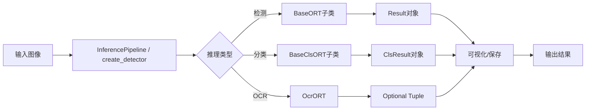

[根目录](../CLAUDE.md) > **onnxtools**

# ONNX工具包核心模块 (onnxtools)

## 模块职责

onnxtools是项目的Python包核心，提供统一的ONNX模型推理接口、多架构检测器支持、OCR识别、数据集评估和可视化工具。作为根模块，它整合了推理引擎(infer_onnx)、工具函数(utils)和评估工具(eval)，对外暴露简洁的API。

## 入口和启动

- **根模块入口**: `onnxtools/__init__.py`
- **工厂函数**: `create_detector()` - 统一的检测器创建接口
- **推理管道类**: `InferencePipeline` - 推荐的面向对象推理接口
- **演示脚本**: `demo_pipeline.py` (项目根目录)

### 快速开始
```python
# 方式1: 使用InferencePipeline类(推荐)
from onnxtools import InferencePipeline

pipeline = InferencePipeline(
    model_type='rtdetr',
    model_path='models/rtdetr.onnx',
    ocr_model_path='models/ocr.onnx',
    color_model_path='models/color_layer.onnx',
    conf_thres=0.5
)
result_img, output_data = pipeline(image)

# 方式2: 使用工厂函数创建检测器
from onnxtools import create_detector, setup_logger

setup_logger('INFO')
detector = create_detector('rtdetr', 'models/rtdetr.onnx', conf_thres=0.5)
result = detector(image)  # 返回Result对象

# 方式3: OCR识别
from onnxtools import OcrORT

ocr_model = OcrORT('models/ocr.onnx')  # 自动加载默认配置
result = ocr_model(plate_image)
if result:
    text, conf, char_scores = result

# 方式4: 分类器 (NEW - 2025-11-25)
from onnxtools import ColorLayerORT, VehicleAttributeORT

# 车牌颜色/层级分类
color_classifier = ColorLayerORT('models/color_layer.onnx')
result = color_classifier(plate_image)
print(f"Color: {result.labels[0]}, Layer: {result.labels[1]}")

# 车辆属性分类
vehicle_classifier = VehicleAttributeORT('models/vehicle_attribute.onnx')
vehicle_type, color, conf = vehicle_classifier(vehicle_image)

# 方式5: 数据集评估
from onnxtools import DetDatasetEvaluator, OCRDatasetEvaluator

# COCO评估
evaluator = DetDatasetEvaluator(detector)
metrics = evaluator.evaluate_dataset(dataset_path)

# OCR评估
ocr_evaluator = OCRDatasetEvaluator(ocr_model)
results = ocr_evaluator.evaluate_dataset(label_file, dataset_base)
```

## 外部接口

### 1. InferencePipeline类 - 完整推理管道 (推荐)

```python
from onnxtools import InferencePipeline

class InferencePipeline:
    """完整的车辆车牌检测和识别管道"""

    def __init__(
        self,
        model_type: str,
        model_path: str,
        ocr_model_path: Optional[str] = None,
        color_model_path: Optional[str] = None,
        vehicle_attr_model_path: Optional[str] = None,  # NEW: 车辆属性模型
        config_path: str = 'configs/det_config.yaml',
        plate_config_path: str = 'configs/plate.yaml',
        conf_thres: float = 0.5,
        iou_thres: float = 0.5,
        annotator_preset: str = 'standard'
    ):
        """初始化推理管道

        Args:
            model_type: 检测模型类型 ('yolo', 'rtdetr', 'rfdetr')
            model_path: 检测模型路径
            ocr_model_path: OCR模型路径(可选)
            color_model_path: 颜色分类模型路径(可选)
            vehicle_attr_model_path: 车辆属性模型路径(可选,NEW)
            conf_thres: 置信度阈值
            iou_thres: NMS IoU阈值
            annotator_preset: 可视化预设 ('standard', 'debug', 'lightweight', 'privacy', 'high_contrast')
        """
        pass

    def __call__(self, image: np.ndarray) -> Tuple[np.ndarray, Dict]:
        """执行完整推理

        Args:
            image: 输入图像 BGR格式

        Returns:
            Tuple[np.ndarray, Dict]: (标注图像, 输出数据字典)
        """
        pass
```

### 2. Result类 - 检测结果对象

```python
from onnxtools import Result  # 或 from onnxtools.infer_onnx import Result

# 所有检测器现在返回Result对象
detector = create_detector('rtdetr', 'models/rtdetr.onnx')
result = detector(image)  # 返回Result实例

# Result对象提供丰富的API
print(result)  # "Result(10 detections, 2 classes)"
print(f"Found {len(result)} objects")

# 访问检测数据
result.boxes       # np.ndarray [N, 4]
result.scores      # np.ndarray [N]
result.class_ids   # np.ndarray [N]

# 索引和切片
first = result[0]         # 单个检测
subset = result[1:3]      # 多个检测
for det in result:        # 迭代
    print(det.boxes[0])

# 可视化
result.plot(annotator_preset='debug')
result.show()
result.save('output.jpg')

# 过滤和统计
high_conf = result.filter(conf_threshold=0.8)
vehicles = result.filter(classes=[0])
stats = result.summary()

# 参考 onnxtools/infer_onnx/CLAUDE.md 查看完整API文档
```

### 3. 核心推理接口

**架构说明 (2025-11-25更新)**: onnxtools提供三类推理类:
- **检测器类** (继承BaseORT): 目标检测任务,返回`Result`对象
- **分类器类** (继承BaseClsORT): 分类任务,返回`ClsResult`对象 **(NEW)**
- **OCR类** (独立): 序列识别任务,返回Optional[Tuple]

```python
from onnxtools import (
    # 检测器类 (继承BaseORT) - 返回Result
    BaseORT,           # 抽象基类
    YoloORT,           # YOLO系列检测器
    RtdetrORT,         # RT-DETR检测器
    RfdetrORT,         # RF-DETR检测器

    # 分类器类 (继承BaseClsORT) - 返回ClsResult (NEW)
    BaseClsORT,        # 分类抽象基类
    ClsResult,         # 分类结果类
    ColorLayerORT,     # 车牌颜色/层级分类器
    VehicleAttributeORT,  # 车辆属性分类器(车型+颜色)

    # OCR类 (独立) - 返回Optional[Tuple]
    OcrORT,            # OCR识别器

    # 其他
    Result,            # 检测结果类
    create_detector,   # 工厂函数
    InferencePipeline, # 推理管道类(推荐)
)

# 检测器使用 - 返回Result对象
detector = create_detector('yolo', 'models/yolo11n.onnx')
result = detector(image)  # Result实例
boxes = result.boxes
scores = result.scores

# 分类器使用 - 返回ClsResult对象 (NEW)
color_classifier = ColorLayerORT('color_layer.onnx')
result = color_classifier(plate_image)  # ClsResult实例
color = result.labels[0]
layer = result.labels[1]
# 或元组解包(向后兼容)
color, layer, conf = color_classifier(plate_image)

# OCR使用 - 返回Optional[Tuple]
ocr = OcrORT('ocr.onnx')
ocr_result = ocr(plate_image)
if ocr_result:
    text, conf, char_confs = ocr_result

# 或直接实例化检测器
detector = RtdetrORT('models/rtdetr.onnx', conf_thres=0.5, iou_thres=0.7)
result = detector(image)  # Result实例
```

### 4. 评估工具
```python
from onnxtools import (
    DetDatasetEvaluator,   # COCO数据集评估 (更名自DatasetEvaluator)
    OCRDatasetEvaluator,   # OCR数据集评估
    SampleEvaluation       # OCR样本评估数据类
)
```

### 5. 工具函数
```python
from onnxtools import setup_logger

# 其他工具函数通过子模块访问
from onnxtools.utils import (
    UltralyticsLetterBox,
    draw_detections,
    convert_to_supervision_detections,
    create_ocr_labels,
    get_chinese_font_path,
    non_max_suppression,
)
```

## 模块结构

```
onnxtools/
├── __init__.py                 # 根模块，导出公共API
├── pipeline.py                 # InferencePipeline推理管道
├── config.py                   # 配置管理 (扩展: VEHICLE_TYPE_MAP, VEHICLE_COLOR_MAP)
│
├── infer_onnx/                 # 推理引擎子模块
│   ├── __init__.py             # 导出BaseORT/BaseClsORT/Result/ClsResult等
│   ├── onnx_base.py            # BaseORT抽象基类
│   ├── onnx_yolo.py            # YOLO推理
│   ├── onnx_rtdetr.py          # RT-DETR推理
│   ├── onnx_rfdetr.py          # RF-DETR推理
│   ├── onnx_cls.py             # **NEW: BaseClsORT, ClsResult, ColorLayerORT, VehicleAttributeORT**
│   ├── onnx_ocr.py             # OcrORT (ColorLayerORT已迁移到onnx_cls.py)
│   ├── result.py               # Result检测结果类
│   ├── infer_utils.py          # 推理工具
│   ├── engine_dataloader.py   # TensorRT数据加载
│   └── CLAUDE.md               # 推理引擎模块文档
│
├── eval/                       # 评估子模块
│   ├── __init__.py             # 导出DetDatasetEvaluator, OCRDatasetEvaluator
│   ├── eval_coco.py            # DetDatasetEvaluator (更名自DatasetEvaluator)
│   ├── eval_ocr.py             # OCR评估
│   └── CLAUDE.md               # 评估模块文档
│
└── utils/                      # 工具函数子模块
    ├── __init__.py
    ├── image_processing.py     # 图像预处理
    ├── drawing.py              # 可视化绘制(包含Supervision转换)
    ├── supervision_labels.py   # 标签创建
    ├── supervision_annotator.py # Annotator工厂和管道
    ├── supervision_preset.py   # 可视化预设
    ├── ocr_metrics.py          # OCR指标计算
    ├── detection_metrics.py    # 检测指标
    ├── nms.py                  # NMS算法
    ├── font_utils.py           # 字体工具
    ├── logger.py               # 日志配置
    └── CLAUDE.md               # 工具模块文档
```

## 关键依赖和配置

### 核心依赖
```toml
[project.dependencies]
onnxruntime-gpu = "1.22.0"
opencv-contrib-python = ">=4.12.0.88"
numpy = ">=2.2.6"
pyyaml = ">=6.0.2"
supervision = "0.26.1"
python-levenshtein = ">=0.25.0"
colorlog = ">=6.9.0"
pillow = ">=11.3.0"
```

### 可选依赖
```toml
[project.optional-dependencies]
trt = [
    "tensorrt==8.6.1.post1",
    "tensorrt-bindings==8.6.1",
    "tensorrt-libs==8.6.1"
]
```

### 配置文件
- `configs/det_config.yaml`: 检测类别和颜色
- `configs/plate.yaml`: OCR字典和映射
- `configs/visualization_presets.yaml`: Supervision预设

## 数据模型

### 统一推理输出

```python
# 检测器输出(BaseORT子类) - Result对象
result = detector(image)
result.boxes        # np.ndarray [N, 4] xyxy格式
result.scores       # np.ndarray [N] 置信度
result.class_ids    # np.ndarray [N] 类别ID
result.orig_shape   # Tuple[int, int] 原图尺寸

# 分类器输出(BaseClsORT子类) - ClsResult对象 (NEW)
result = classifier(image)
result.labels          # List[str] - 分类标签
result.confidences     # List[float] - 置信度列表
result.avg_confidence  # float - 平均置信度
# 向后兼容元组解包:
color, layer, conf = classifier(plate_image)

# OCR输出 - Optional[Tuple]
ocr_result = ocr_model(plate_image)
if ocr_result:
    text, confidence, char_scores = ocr_result
    # text: str - 识别文本
    # confidence: float - 平均置信度
    # char_scores: List[float] - 字符置信度列表

# InferencePipeline输出
result_img, output_data = pipeline(image)
# result_img: np.ndarray - 标注后的图像
# output_data: Dict - 完整输出数据
```

## 测试和质量

### 测试体系
- **单元测试**: 62+ 测试用例
  - `test_ocr_onnx_refactored.py` (27个)
  - `test_ocr_metrics.py` (23个)
  - `test_load_label_file.py` (12个)

- **集成测试**: 30+ 测试套件
  - 管道集成、OCR集成、可视化集成
  - Annotator集成(13种类型)
  - 预设场景测试

- **合约测试**: 15+ 测试套件
  - API合约验证
  - 数据转换合约
  - 性能基准合约

- **性能测试**: 基准测试
  - Annotator性能: 75μs ~ 1.5ms
  - 推理延迟目标: < 50ms (640x640)

### 测试覆盖率
- 单元测试通过率: 100% (62/62)
- 集成测试通过率: 96.6% (170/176)
- 关键模块覆盖: BaseORT, OcrORT, ColorLayerORT, OCRDatasetEvaluator

## 常见问题 (FAQ)

### Q: 如何选择合适的检测器？
A:
- **实时性优先**: YOLO系列(yolo11n.onnx)
- **精度优先**: RF-DETR(rfdetr-20250811.onnx)
- **平衡需求**: RT-DETR(rtdetr-2024080100.onnx)

### Q: InferencePipeline和create_detector有什么区别？
A:
- **InferencePipeline**: 封装完整流程(检测+OCR+颜色分类+可视化),开箱即用,推荐用于应用开发
- **create_detector**: 仅创建检测器,灵活性更高,推荐用于自定义流程或研究

### Q: 2025-11-25更新了什么？
A: 新增分类器架构:
- **BaseClsORT**: 分类模型抽象基类
- **ClsResult**: 统一分类结果对象,支持元组解包
- **VehicleAttributeORT**: 车辆属性分类器(车型+颜色多标签)
- **ColorLayerORT**: 迁移到`onnx_cls.py`,现在继承BaseClsORT
- API保持向后兼容,元组解包仍然支持

### Q: DatasetEvaluator改名了吗？
A: 是的,为了语义清晰:
- `DatasetEvaluator` → `DetDatasetEvaluator` (检测数据集评估)
- 旧名称仍然可用但建议使用新名称

### Q: 如何进行完整的推理流程？
A: 参考 `demo_pipeline.py` 示例:
```bash
python demo_pipeline.py \
    --model-path models/rtdetr.onnx \
    --model-type rtdetr \
    --input data/sample.jpg \
    --output-mode show \
    --annotator-preset debug
```

### Q: 如何扩展新的模型架构？
A:
1. 在 `infer_onnx/` 创建新的推理类,继承 `BaseORT` 或 `BaseClsORT`
2. 实现相应的抽象方法
3. 在 `onnxtools/__init__.py` 中导出(检测器还需在 `create_detector()` 中注册)

### Q: 如何使用TensorRT加速？
A:
```bash
# 安装TensorRT可选依赖
uv pip install pip setuptools wheel
uv pip install -e ".[trt]"

# 构建TensorRT引擎
python tools/build_engine.py \
    --onnx-path models/rtdetr.onnx \
    --engine-path models/rtdetr.engine \
    --fp16

# 使用引擎推理(无需修改代码,自动识别.engine文件)
python demo_pipeline.py --model-path models/rtdetr.engine --input test.jpg
```

### Q: 如何自定义可视化风格？
A: 使用Annotator预设或工厂:
```python
from onnxtools.utils.supervision_preset import load_visualization_preset
from onnxtools.utils.supervision_annotator import AnnotatorFactory

# 方式1: 使用预设
annotators = load_visualization_preset('debug')

# 方式2: 自定义组合
factory = AnnotatorFactory()
annotators = [
    factory.create('round_box', roundness=0.4),
    factory.create('rich_label')
]
```

## 相关文件列表

### 根模块文件
- `__init__.py` - 根模块入口,导出公共API
- `pipeline.py` - InferencePipeline类和遗留函数
- `config.py` - 配置管理

### 子模块文档
- [`infer_onnx/CLAUDE.md`](infer_onnx/CLAUDE.md) - 推理引擎模块文档
- [`utils/CLAUDE.md`](utils/CLAUDE.md) - 工具函数模块文档
- [`eval/CLAUDE.md`](eval/CLAUDE.md) - 评估模块文档

### 配置文件
- `configs/det_config.yaml` - 检测配置
- `configs/plate.yaml` - OCR配置
- `configs/visualization_presets.yaml` - 可视化预设

## 架构设计

### 模块分层
```
┌─────────────────────────────────────────────────────┐
│            onnxtools (根模块)                        │
│    create_detector(), InferencePipeline             │
├───────────────┬────────────┬───────────────────────┤
│  infer_onnx   │    eval    │        utils          │
│  (推理引擎)    │   (评估)    │     (工具函数)         │
├───────────────┼────────────┼───────────────────────┤
│ • BaseORT     │ • DetDS    │ • supervision         │
│ • YoloORT     │ • OCR      │ • annotator           │
│ • RtdetrORT   │            │ • ocr_metrics         │
│ • BaseClsORT  │            │ • drawing             │
│ • ColorLayer  │            │ • logger              │
│ • VehicleAttr │            │                       │
│ • OcrORT      │            │                       │
│ • Result      │            │                       │
│ • ClsResult   │            │                       │
└───────────────┴────────────┴───────────────────────┘
```

### 工作流程


## 变更日志 (Changelog)

**2025-11-25** - 分类架构重大升级和API更新
- ✅ **新增**: `infer_onnx/onnx_cls.py` - 分类模型架构
  - `BaseClsORT` 抽象基类
  - `ClsResult` 统一结果类
  - `VehicleAttributeORT` 车辆属性分类器
- ✅ **迁移**: `ColorLayerORT` 从 `onnx_ocr.py` 迁移到 `onnx_cls.py`
- ✅ **重构**: `ColorLayerORT` 现在继承 `BaseClsORT`,返回 `ClsResult`
- ✅ **更名**: `DatasetEvaluator` → `DetDatasetEvaluator` (旧名称仍可用)
- ✅ **扩展**: `config.py` 新增 `VEHICLE_TYPE_MAP`, `VEHICLE_COLOR_MAP`
- ✅ **更新**: 文档完整记录新架构、API变更和迁移说明
- ✅ **保持**: 所有API保持向后兼容,元组解包仍然支持

**2025-11-13** - 文档全面更新和结构调整
- ✅ 新增 InferencePipeline 类文档(推荐使用方式)
- ✅ 更新模块结构图,反映实际文件组织
- ✅ 修正文件命名: `logger.py` 而非 `logging_config.py`
- ✅ 补充 InferencePipeline vs create_detector 使用场景说明
- ✅ 更新时间戳至 2025-11-13

**2025-11-05 (阶段1.3)** - OCR/分类类架构独立化
- ✅ 更新核心推理接口说明,区分检测器类和分类器/OCR类
- ✅ 强调两类推理类的返回类型差异(Result vs 元组)
- ✅ 添加架构说明注释

**2025-11-05** - 初始化完整模块文档,建立清晰的模块结构
- 创建onnxtools根模块文档
- 更新面包屑导航系统
- 完善API文档和使用示例
- 补充模块结构图和工作流程

**2025-10-11** - Bug修复和配置优化
- TensorRT改为可选依赖组 `[trt]`
- 修复OCR评估器JSON数组支持

**2025-10-10** - OCR评估功能完成
- OCRDatasetEvaluator完整实现
- 三大指标:完全匹配、编辑距离、相似度

**2025-09-30** - Supervision集成和Annotators扩展
- 13种annotator类型支持
- 5种可视化预设场景
- 性能基准测试完成

**2025-10-09** - 核心重构完成
- BaseORT抽象方法强制实现
- OcrORT和ColorLayerORT重构
- 统一__call__推理接口

**2025-09-15** - 初始化项目结构

---

*模块路径: `/home/tyjt/桌面/onnx_vehicle_plate_recognition/onnxtools/`*
*最后更新: 2025-11-25 14:42:10*
