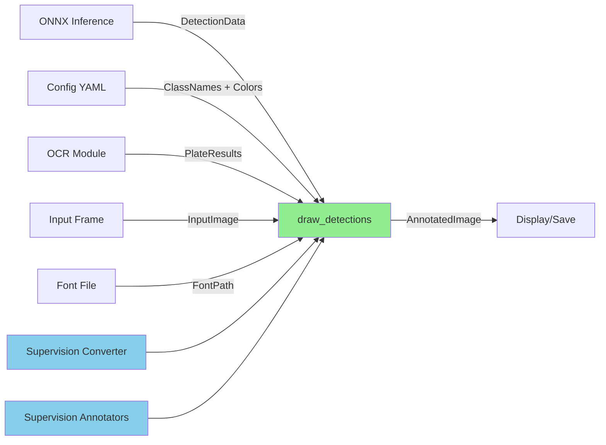

# Data Model: Drawing Module

**Feature**: 002-delete-old-draw
**Date**: 2025-09-30
**Status**: Complete

## Overview

This document defines the data structures used in the drawing module for visualizing detection results. The data model remains unchanged from the current implementation - this refactoring only removes the PIL rendering path while preserving all data contracts.

## Core Entities

### 1. DetectionData

**Purpose**: Represents raw detection output from ONNX inference models (YOLO, RT-DETR, RF-DETR).

**Format**:
```python
List[List[List[float]]]
# Structure: [batch][detection][attributes]
# Attributes: [x1, y1, x2, y2, confidence, class_id]
```

**Attributes**:
- **Batch dimension** (outer list): Multiple images in a batch (usually 1 for visualization)
- **Detection dimension** (middle list): Multiple detections per image
- **Attribute dimension** (inner list): 6 floats per detection
  - `x1, y1`: Top-left corner coordinates (pixels)
  - `x2, y2`: Bottom-right corner coordinates (pixels)
  - `confidence`: Detection confidence score [0.0, 1.0]
  - `class_id`: Integer class identifier (maps to class_names)

**Validation Rules**:
- `x2 > x1` (valid bounding box width)
- `y2 > y1` (valid bounding box height)
- `0.0 <= confidence <= 1.0` (valid probability)
- `class_id >= 0` (valid class index)
- Coordinates within image bounds (enforced by inference models)

**Example**:
```python
detections = [
    [  # Batch 0 (first image)
        [100.0, 200.0, 300.0, 400.0, 0.95, 0],  # Vehicle detection
        [420.0, 529.0, 509.0, 562.0, 0.93, 1],  # Plate detection
    ]
]
```

**Source**: Output from `infer_onnx/yolo_onnx.py`, `rtdetr_onnx.py`, or `rfdetr_onnx.py`

**Relationships**:
- Maps to `ClassNames` via `class_id` index
- Maps to `Colors` via `class_id % len(colors)`
- References `PlateResults` by detection index (for plate class)

### 2. ClassNames

**Purpose**: Maps class IDs to human-readable names for labeling.

**Format**:
```python
Union[Dict[int, str], List[str]]
```

**Variants**:
1. **Dictionary mapping**: `{class_id: "class_name"}`
   - Sparse mapping (not all IDs need entries)
   - Explicit class_id → name association

2. **List mapping**: `["class_name_0", "class_name_1", ...]`
   - Dense mapping (class_id is list index)
   - Simpler but requires contiguous IDs

**Validation Rules**:
- Dictionary keys must be non-negative integers
- List must not be empty
- Names should be valid UTF-8 strings (supports Chinese)

**Example**:
```python
# Dictionary variant
class_names = {0: "vehicle", 1: "plate"}

# List variant
class_names = ["vehicle", "plate"]
```

**Source**: Loaded from `configs/det_config.yaml`

### 3. Colors

**Purpose**: RGB color tuples for rendering bounding boxes per class.

**Format**:
```python
List[Tuple[int, int, int]]
# Structure: [(R, G, B), (R, G, B), ...]
```

**Attributes**:
- **RGB values**: Each component in range [0, 255]
- **List index**: Maps to class_id via modulo operation
  - `box_color = colors[class_id % len(colors)]`

**Validation Rules**:
- List must not be empty
- Each RGB component: `0 <= value <= 255`

**Example**:
```python
colors = [
    (255, 0, 0),    # Red for class 0
    (0, 255, 0),    # Green for class 1
    (0, 0, 255),    # Blue for class 2
]
```

**Source**: Configured in `configs/det_config.yaml` as `visual_colors`

### 4. PlateResults

**Purpose**: OCR metadata for detected license plates (optional per detection).

**Format**:
```python
List[Optional[Dict[str, Any]]]
# Structure: [metadata_dict | None, metadata_dict | None, ...]
# Length matches detection count
```

**Metadata Schema**:
```python
{
    "plate_text": str,           # Recognized text (e.g., "苏A88888")
    "plate_conf": float,         # OCR confidence [0.0, 1.0]
    "color": str,                # Plate color (e.g., "blue", "yellow")
    "layer": str,                # Layer type ("single", "double")
    "should_display_ocr": bool   # Whether to render OCR info
}
```

**Validation Rules**:
- Length must match detection count in `DetectionData`
- Index `i` corresponds to detection `i` (aligned arrays)
- `None` entries for non-plate detections
- `plate_conf`: `0.0 <= value <= 1.0`
- `should_display_ocr`: Determines if OCR text is rendered

**Example**:
```python
plate_results = [
    None,  # Detection 0 is vehicle (no plate info)
    {
        "plate_text": "苏A88888",
        "plate_conf": 0.95,
        "color": "blue",
        "layer": "single",
        "should_display_ocr": True
    }  # Detection 1 is plate
]
```

**Source**: Output from `infer_onnx/ocr_onnx.py` via `utils/pipeline.py`

### 5. InputImage

**Purpose**: Raw input image for annotation.

**Format**:
```python
np.ndarray  # Shape: (H, W, 3), dtype: uint8, color space: BGR
```

**Attributes**:
- **Shape**: `(height, width, 3)` - height x width x 3 color channels
- **Dtype**: `uint8` - unsigned 8-bit integers [0, 255]
- **Color space**: BGR (OpenCV convention)

**Validation Rules**:
- Must be 3-channel image (no grayscale or RGBA)
- Valid numpy array with contiguous memory
- Non-zero dimensions

**Example**:
```python
image = cv2.imread("input.jpg")  # Loads as BGR
assert image.shape == (1080, 1920, 3)
assert image.dtype == np.uint8
```

**Source**: Loaded by `main.py` or `utils/pipeline.py`

### 6. AnnotatedImage

**Purpose**: Output image with rendered bounding boxes and labels.

**Format**:
```python
np.ndarray  # Shape: (H, W, 3), dtype: uint8, color space: BGR
```

**Attributes**:
- Same shape and dtype as `InputImage`
- Contains drawn bounding boxes, labels, and OCR text
- Color space: BGR (matches OpenCV/supervision convention)

**Rendering Elements**:
- Bounding boxes: Colored rectangles around detections
- Class labels: Text with confidence scores above boxes
- OCR text: Plate numbers and attributes (if applicable)
- Background fills: White/semi-transparent backgrounds for text readability

**Example**:
```python
annotated = draw_detections(image, detections, class_names, colors, plate_results)
assert annotated.shape == image.shape  # Same dimensions
assert annotated.dtype == np.uint8
cv2.imshow("Result", annotated)
```

**Destination**: Saved by `main.py` or displayed via `cv2.imshow()`

### 7. FontPath

**Purpose**: Path to TrueType font file for text rendering (especially Chinese characters).

**Format**:
```python
str  # File system path to .ttf font file
```

**Validation Rules**:
- Must be valid file path (checked at runtime)
- Font file must support required character sets (Latin, Chinese)
- If file not found, supervision uses default fallback font

**Example**:
```python
font_path = "SourceHanSans-VF.ttf"  # Variable font with Chinese support
```

**Source**: Configured in function call, defaults to `"SourceHanSans-VF.ttf"`

## Data Flow



## State Transitions

**No state management required** - drawing functions are stateless:
- Input: Image + detection data + configuration
- Output: Annotated image
- No side effects (pure function aside from logging)

## Validation Rules Summary

| Entity | Critical Validations |
|--------|---------------------|
| DetectionData | Valid bounding boxes (x2>x1, y2>y1), confidence ∈ [0,1] |
| ClassNames | Non-empty, valid UTF-8 strings |
| Colors | RGB components ∈ [0,255], non-empty list |
| PlateResults | Length matches detections, valid confidence scores |
| InputImage | Shape (H,W,3), dtype uint8, BGR color space |
| FontPath | File exists (runtime check), supports Chinese |

## Backward Compatibility

**No data model changes in this refactoring**:
- All entity formats remain identical
- Validation rules unchanged
- Data flow preserved
- Only implementation detail (PIL → supervision) changes

**Migration Impact**: Zero - existing data preparation code continues to work without modification.

---
*Data model specification completed: 2025-09-30*