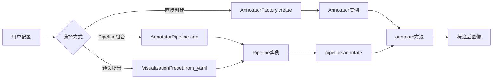
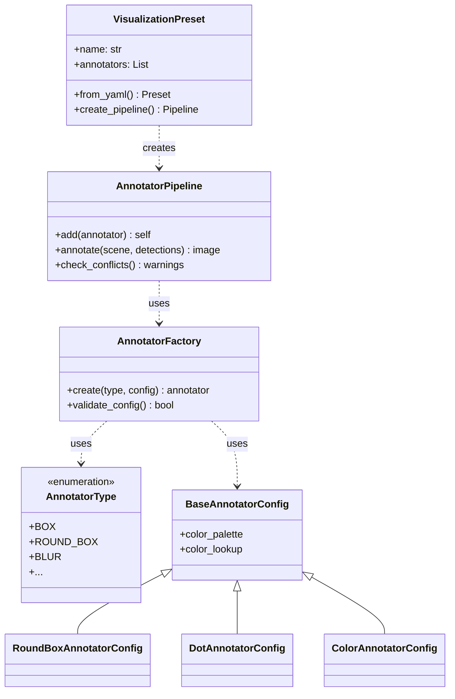

# Data Model: Supervision Annotators扩展

**Date**: 2025-09-30
**Phase**: Phase 1 - Design
**Feature**: 添加更多Supervision Annotators类型

## 核心数据模型

### 1. AnnotatorType (枚举)

```python
from enum import Enum

class AnnotatorType(Enum):
    """13种支持的annotator类型枚举"""
    # 现有类型
    BOX = "box"
    RICH_LABEL = "rich_label"

    # 新增边框类
    ROUND_BOX = "round_box"              # 圆角边框
    BOX_CORNER = "box_corner"            # 角点标注

    # 新增几何标记类
    CIRCLE = "circle"                    # 圆形标注
    TRIANGLE = "triangle"                # 三角形标注
    ELLIPSE = "ellipse"                  # 椭圆标注
    DOT = "dot"                          # 点标注

    # 新增填充类
    COLOR = "color"                      # 区域填充
    BACKGROUND_OVERLAY = "background_overlay"  # 背景叠加

    # 新增特效类
    HALO = "halo"                        # 光晕效果
    PERCENTAGE_BAR = "percentage_bar"    # 置信度条形图

    # 新增隐私保护类
    BLUR = "blur"                        # 模糊处理
    PIXELATE = "pixelate"                # 像素化处理
```

### 2. BaseAnnotatorConfig (配置基类)

```python
from dataclasses import dataclass
from typing import Optional
import supervision as sv

@dataclass
class BaseAnnotatorConfig:
    """Annotator配置基类"""
    color_palette: Optional[sv.ColorPalette] = None
    color_lookup: sv.ColorLookup = sv.ColorLookup.CLASS

    def __post_init__(self):
        if self.color_palette is None:
            self.color_palette = sv.ColorPalette.DEFAULT
```

### 3. 配置类(13种)

```python
@dataclass
class RoundBoxAnnotatorConfig(BaseAnnotatorConfig):
    thickness: int = 2
    roundness: float = 0.3  # 0-1.0

@dataclass
class BoxCornerAnnotatorConfig(BaseAnnotatorConfig):
    thickness: int = 2
    corner_length: int = 20  # 像素

@dataclass
class CircleAnnotatorConfig(BaseAnnotatorConfig):
    thickness: int = 2

@dataclass
class TriangleAnnotatorConfig(BaseAnnotatorConfig):
    base: int = 20
    height: int = 20
    position: sv.Position = sv.Position.TOP_CENTER
    outline_thickness: int = 0
    outline_color: sv.Color = sv.Color.BLACK

@dataclass
class EllipseAnnotatorConfig(BaseAnnotatorConfig):
    thickness: int = 2
    start_angle: int = 0
    end_angle: int = 360

@dataclass
class DotAnnotatorConfig(BaseAnnotatorConfig):
    radius: int = 5
    position: sv.Position = sv.Position.CENTER
    outline_thickness: int = 0
    outline_color: sv.Color = sv.Color.BLACK

@dataclass
class ColorAnnotatorConfig(BaseAnnotatorConfig):
    opacity: float = 0.3  # 0-1.0

@dataclass
class BackgroundOverlayAnnotatorConfig:
    color: sv.Color = sv.Color.BLACK
    opacity: float = 0.5
    force_box: bool = True

@dataclass
class HaloAnnotatorConfig(BaseAnnotatorConfig):
    opacity: float = 0.3
    kernel_size: int = 40

@dataclass
class PercentageBarAnnotatorConfig(BaseAnnotatorConfig):
    height: int = 16
    width: int = 80
    border_color: sv.Color = sv.Color.BLACK
    position: sv.Position = sv.Position.TOP_LEFT
    border_thickness: int = 1

@dataclass
class BlurAnnotatorConfig:
    kernel_size: int = 15

@dataclass
class PixelateAnnotatorConfig:
    pixel_size: int = 20
```

### 4. AnnotatorFactory (工厂类)

```python
from typing import Union, Dict, Any

class AnnotatorFactory:
    """统一的Annotator创建工厂"""

    @staticmethod
    def create(
        annotator_type: AnnotatorType,
        config: Union[BaseAnnotatorConfig, Dict[str, Any]]
    ) -> sv.BaseAnnotator:
        """
        根据类型和配置创建annotator实例

        Args:
            annotator_type: AnnotatorType枚举
            config: 配置对象或字典

        Returns:
            supervision annotator实例

        Raises:
            ValueError: 未知的annotator类型
            TypeError: 配置参数类型错误
        """
        pass  # 实现将在Phase 2

    @staticmethod
    def validate_config(
        annotator_type: AnnotatorType,
        config: Dict[str, Any]
    ) -> bool:
        """验证配置参数有效性"""
        pass
```

### 5. AnnotatorPipeline (管道类)

```python
from typing import List, Tuple, Optional
import numpy as np

class AnnotatorPipeline:
    """Annotator组合管道，支持多个annotator顺序执行"""

    def __init__(self):
        self.annotators: List[sv.BaseAnnotator] = []
        self.configs: List[Dict[str, Any]] = []

    def add(
        self,
        annotator: Union[sv.BaseAnnotator, AnnotatorType],
        config: Optional[Dict[str, Any]] = None
    ) -> 'AnnotatorPipeline':
        """
        添加annotator到管道(Builder模式)

        Args:
            annotator: annotator实例或类型枚举
            config: 配置字典(当annotator为类型时)

        Returns:
            self (支持链式调用)
        """
        pass

    def annotate(
        self,
        scene: np.ndarray,
        detections: sv.Detections
    ) -> np.ndarray:
        """
        按顺序应用所有annotator

        Args:
            scene: 输入图像
            detections: 检测结果

        Returns:
            标注后的图像
        """
        pass

    def check_conflicts(self) -> List[str]:
        """检查annotator组合冲突，返回警告列表"""
        pass
```

### 6. VisualizationPreset (预设场景)

```python
@dataclass
class VisualizationPreset:
    """可视化预设场景配置"""
    name: str
    description: str
    annotators: List[Tuple[AnnotatorType, Dict[str, Any]]]

    @classmethod
    def from_yaml(cls, preset_name: str, preset_file: str = "configs/visualization_presets.yaml"):
        """从YAML文件加载预设"""
        pass

    def create_pipeline(self) -> AnnotatorPipeline:
        """创建对应的AnnotatorPipeline"""
        pass


# 5种预定义场景
class Presets:
    STANDARD = "standard"              # 标准检测模式
    LIGHTWEIGHT = "lightweight"        # 简洁轻量模式
    PRIVACY = "privacy"                # 隐私保护模式
    DEBUG = "debug"                    # 调试分析模式
    HIGH_CONTRAST = "high_contrast"    # 高对比展示模式
```

## 数据流图



## 类型关系图



---

**Phase 1 Status**: Data model defined, ready for contracts