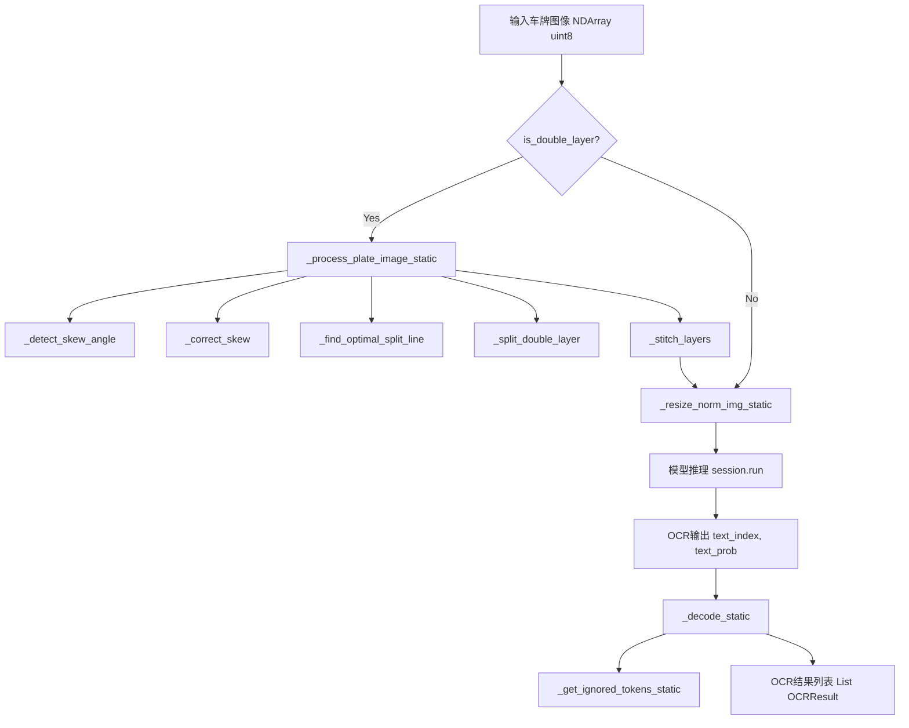
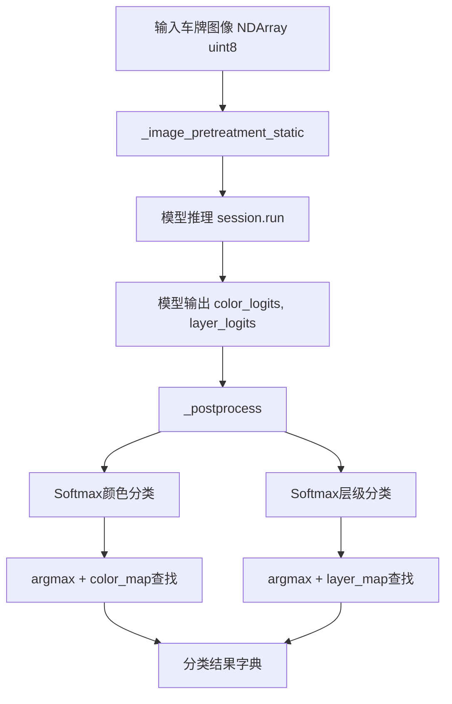
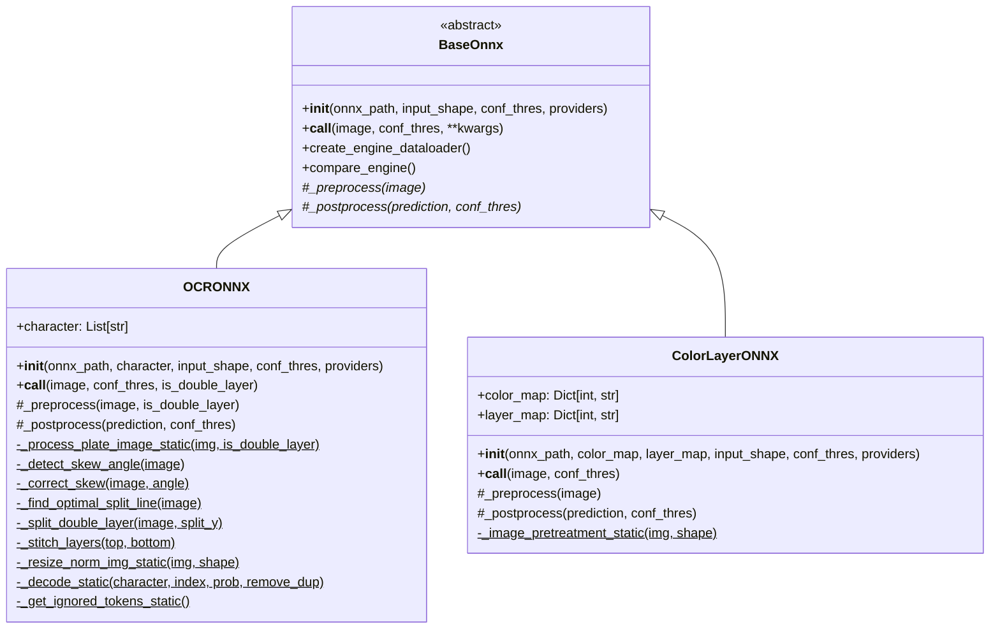

# Data Model: ColorLayerONNX和OCRONNX重构

**Feature Branch**: `004-refactor-colorlayeronnx-ocronnx`
**Created**: 2025-10-09
**Updated**: 2025-10-09

## Overview

本文档定义重构后的ColorLayerONNX和OCRONNX类的完整数据模型,包括类结构、方法签名、类型提示、输入输出格式和内部数据流。

## Type Aliases

```python
from typing import List, Tuple, Optional, Dict, TypeAlias
from numpy.typing import NDArray
import numpy as np

# OCR结果类型: (文本, 平均置信度, 字符置信度列表)
OCRResult: TypeAlias = Tuple[str, float, List[float]]

# 颜色分类logits: (颜色logits数组, 置信度)
ColorLogits: TypeAlias = Tuple[NDArray[np.float32], float]

# 层级分类logits: (层级logits数组, 置信度)
LayerLogits: TypeAlias = Tuple[NDArray[np.float32], float]

# 预处理结果: (input_tensor, scale, original_shape, ratio_pad)
PreprocessResult: TypeAlias = Tuple[
    NDArray[np.float32],           # input_tensor
    float,                          # scale
    Tuple[int, int],               # original_shape (H, W)
    Optional[Tuple[Tuple[float, float], Tuple[float, float]]]  # ratio_pad
]

# OCR输出格式: 字符索引和概率
OCROutput: TypeAlias = Tuple[
    NDArray[np.int_],              # text_index [B, seq_len]
    Optional[NDArray[np.float32]]   # text_prob [B, seq_len, num_classes]
]
```

## Entity 1: OCRONNX

### 类定义

```python
class OCRONNX(BaseOnnx):
    """
    车牌OCR识别推理器,继承自BaseOnnx

    支持双层车牌倾斜校正、图像预处理、字符识别和解码后处理
    """
```

### 类属性

| 属性名 | 类型 | 默认值 | 描述 | 来源 |
|--------|------|--------|------|------|
| `character` | `List[str]` | 从plate.yaml加载 | OCR字符字典 | 构造参数 |
| `input_shape` | `Tuple[int, int]` | `(48, 320)` | 模型输入尺寸 | 继承自BaseOnnx |
| `conf_thres` | `float` | `0.5` | OCR置信度阈值 | 继承自BaseOnnx |
| `session` | `InferenceSession` | 懒加载 | Polygraphy管理的会话 | 继承自BaseOnnx |
| `providers` | `List[str]` | 自动检测 | ONNX Runtime提供程序 | 继承自BaseOnnx |

### 公共方法

#### `__init__()`

```python
def __init__(
    self,
    onnx_path: str,
    character: List[str],
    input_shape: Tuple[int, int] = (48, 320),
    conf_thres: float = 0.5,
    providers: Optional[List[str]] = None
) -> None:
    """
    初始化OCR推理器

    Args:
        onnx_path: ONNX模型文件路径
        character: OCR字符字典列表
        input_shape: 输入图像尺寸,默认(48, 320)
        conf_thres: 置信度阈值,默认0.5
        providers: ONNX Runtime执行提供程序

    Raises:
        FileNotFoundError: 模型文件不存在
        ValueError: 字符字典为空
    """
```

#### `__call__()`

```python
def __call__(
    self,
    image: NDArray[np.uint8],
    conf_thres: Optional[float] = None,
    is_double_layer: bool = False
) -> Tuple[List[OCRResult], Tuple[int, int]]:
    """
    执行OCR推理

    Args:
        image: 输入车牌图像,BGR格式 [H, W, 3]
        conf_thres: 可选的置信度阈值覆盖
        is_double_layer: 是否为双层车牌,需要特殊处理

    Returns:
        Tuple[List[OCRResult], Tuple[int, int]]:
            - OCR结果列表: [(文本, 置信度, 字符置信度列表), ...]
            - 原始图像形状: (height, width)

    Example:
        >>> ocr_model = OCRONNX('models/ocr.onnx', character_dict)
        >>> results, orig_shape = ocr_model(plate_image, is_double_layer=True)
        >>> print(results[0])  # ('京A12345', 0.95, [0.98, 0.92, ...])
    """
```

### 私有实例方法

#### `_preprocess()`

```python
def _preprocess(
    self,
    image: NDArray[np.uint8],
    is_double_layer: bool = False
) -> PreprocessResult:
    """
    OCR预处理实例方法(向后兼容BaseOnnx接口)

    Args:
        image: 输入车牌图像,BGR格式
        is_double_layer: 是否为双层车牌

    Returns:
        PreprocessResult: (input_tensor, scale, original_shape, ratio_pad)

    Implementation:
        调用静态方法_preprocess_static()和_process_plate_image_static()
    """
```

#### `_postprocess()`

```python
def _postprocess(
    self,
    prediction: NDArray[np.float32],
    conf_thres: float,
    **kwargs
) -> List[OCRResult]:
    """
    OCR后处理:将模型输出解码为文本和置信度

    Args:
        prediction: 模型原始输出 [B, seq_len, num_classes]
        conf_thres: 置信度阈值
        **kwargs: 额外参数(保留兼容性)

    Returns:
        List[OCRResult]: OCR结果列表

    Implementation:
        1. 提取字符索引和概率: text_index, text_prob
        2. 调用_decode_static()解码
        3. 过滤低置信度结果
    """
```

### 私有静态方法 (预处理)

#### `_process_plate_image_static()`

```python
@staticmethod
def _process_plate_image_static(
    img: NDArray[np.uint8],
    is_double_layer: bool = False
) -> NDArray[np.uint8]:
    """
    车牌图像预处理主方法:倾斜校正、双层拆分和拼接

    Args:
        img: 输入车牌图像,BGR格式 [H, W, 3]
        is_double_layer: 是否为双层车牌

    Returns:
        NDArray[np.uint8]: 处理后的图像,BGR格式

    Processing Pipeline:
        1. 灰度转换
        2. 调用_detect_skew_angle()检测倾斜角度
        3. 调用_correct_skew()校正倾斜
        4. 如果is_double_layer=True:
           a. 调用_find_optimal_split_line()找到分割线
           b. 调用_split_double_layer()拆分上下层
           c. 调用_stitch_layers()拼接为单行
        5. 返回处理后图像

    Source:
        原utils/ocr_image_processing.py::process_plate_image()
    """
```

#### `_detect_skew_angle()`

```python
@staticmethod
def _detect_skew_angle(image: NDArray[np.uint8]) -> float:
    """
    检测图像倾斜角度(辅助方法)

    Args:
        image: 灰度图像 [H, W]

    Returns:
        float: 倾斜角度(度),范围[-45, 45]

    Algorithm:
        1. Canny边缘检测
        2. 霍夫直线变换
        3. 计算主导直线角度

    Source:
        原utils/ocr_image_processing.py中的内部逻辑
    """
```

#### `_correct_skew()`

```python
@staticmethod
def _correct_skew(
    image: NDArray[np.uint8],
    angle: float
) -> NDArray[np.uint8]:
    """
    校正图像倾斜(辅助方法)

    Args:
        image: 输入图像,灰度或彩色 [H, W] 或 [H, W, 3]
        angle: 倾斜角度(度)

    Returns:
        NDArray[np.uint8]: 校正后图像,保持原始通道数

    Algorithm:
        使用cv2.getRotationMatrix2D和cv2.warpAffine进行旋转

    Source:
        原utils/ocr_image_processing.py中的内部逻辑
    """
```

#### `_find_optimal_split_line()`

```python
@staticmethod
def _find_optimal_split_line(image: NDArray[np.uint8]) -> int:
    """
    找到双层车牌的最佳分割水平线(辅助方法)

    Args:
        image: 灰度图像 [H, W]

    Returns:
        int: 最佳分割线y坐标

    Algorithm:
        1. 计算水平投影直方图
        2. 找到最小值点作为分割线
        3. 应用高斯平滑避免噪声

    Source:
        原utils/ocr_image_processing.py中的内部逻辑
    """
```

#### `_split_double_layer()`

```python
@staticmethod
def _split_double_layer(
    image: NDArray[np.uint8],
    split_y: int
) -> Tuple[NDArray[np.uint8], NDArray[np.uint8]]:
    """
    拆分双层车牌为上下两层(辅助方法)

    Args:
        image: 输入图像 [H, W, 3]
        split_y: 分割线y坐标

    Returns:
        Tuple[NDArray, NDArray]: (上层图像, 下层图像)

    Source:
        原utils/ocr_image_processing.py中的内部逻辑
    """
```

#### `_stitch_layers()`

```python
@staticmethod
def _stitch_layers(
    top_layer: NDArray[np.uint8],
    bottom_layer: NDArray[np.uint8]
) -> NDArray[np.uint8]:
    """
    水平拼接上下两层车牌为单行(辅助方法)

    Args:
        top_layer: 上层图像 [H1, W1, 3]
        bottom_layer: 下层图像 [H2, W2, 3]

    Returns:
        NDArray[np.uint8]: 拼接后图像 [max(H1, H2), W1+W2, 3]

    Algorithm:
        1. 对齐两层高度(padding)
        2. 水平拼接: np.hstack()

    Source:
        原utils/ocr_image_processing.py中的内部逻辑
    """
```

#### `_resize_norm_img_static()`

```python
@staticmethod
def _resize_norm_img_static(
    img: NDArray[np.uint8],
    image_shape: Tuple[int, int]
) -> NDArray[np.float32]:
    """
    图像resize和归一化(静态方法)

    Args:
        img: 输入图像,BGR格式 [H, W, 3]
        image_shape: 目标尺寸 (height, width)

    Returns:
        NDArray[np.float32]: 归一化后的张量 [1, 3, H, W]

    Processing:
        1. Resize到目标尺寸
        2. BGR转RGB
        3. 归一化: (img / 255.0 - mean) / std
        4. HWC转CHW并添加batch维度

    Source:
        原utils/ocr_image_processing.py::resize_norm_img()
    """
```

### 私有静态方法 (后处理)

#### `_decode_static()`

```python
@staticmethod
def _decode_static(
    character: List[str],
    text_index: NDArray[np.int_],
    text_prob: Optional[NDArray[np.float32]] = None,
    is_remove_duplicate: bool = False
) -> List[OCRResult]:
    """
    将OCR输出解码为文本和置信度(静态方法)

    Args:
        character: 字符字典列表
        text_index: 字符索引数组 [B, seq_len]
        text_prob: 字符概率数组 [B, seq_len, num_classes],可选
        is_remove_duplicate: 是否移除连续重复字符

    Returns:
        List[OCRResult]: [(文本, 平均置信度, 字符置信度列表), ...]

    Algorithm:
        1. 获取忽略token集合: _get_ignored_tokens()
        2. 遍历batch中每个样本:
           a. 过滤掉ignored tokens
           b. 可选移除重复字符
           c. 拼接字符为文本
           d. 计算平均置信度
        3. 应用后处理规则(如'苏'->'京')

    Source:
        原utils/ocr_post_processing.py::decode()
    """
```

#### `_get_ignored_tokens_static()`

```python
@staticmethod
def _get_ignored_tokens_static() -> List[int]:
    """
    获取OCR解码时需要忽略的特殊token索引(静态方法)

    Returns:
        List[int]: 忽略的token索引列表(如blank token)

    Source:
        原utils/ocr_post_processing.py::get_ignored_tokens()
    """
```

### 数据流图



### 验证规则

| 规则 | 检查点 | 失败行为 |
|------|--------|----------|
| `character非空` | `__init__()` | 抛出ValueError |
| `模型文件存在` | `__init__()` | 抛出FileNotFoundError |
| `输入图像形状有效` | `__call__()` | 抛出ValueError |
| `置信度阈值范围[0,1]` | `__call__()` | 抛出ValueError |
| `OCR输出维度匹配` | `_postprocess()` | 抛出RuntimeError |

---

## Entity 2: ColorLayerONNX

### 类定义

```python
class ColorLayerONNX(BaseOnnx):
    """
    车牌颜色和层级分类推理器,继承自BaseOnnx

    支持5种颜色分类(蓝、黄、白、黑、绿)和单/双层分类
    """
```

### 类属性

| 属性名 | 类型 | 默认值 | 描述 | 来源 |
|--------|------|--------|------|------|
| `color_map` | `Dict[int, str]` | 从plate.yaml加载 | 颜色索引到名称映射 | 构造参数 |
| `layer_map` | `Dict[int, str]` | 从plate.yaml加载 | 层级索引到名称映射 | 构造参数 |
| `input_shape` | `Tuple[int, int]` | `(224, 224)` | 模型输入尺寸 | 继承自BaseOnnx |
| `conf_thres` | `float` | `0.5` | 分类置信度阈值 | 继承自BaseOnnx |
| `session` | `InferenceSession` | 懒加载 | Polygraphy管理的会话 | 继承自BaseOnnx |
| `providers` | `List[str]` | 自动检测 | ONNX Runtime提供程序 | 继承自BaseOnnx |

### 公共方法

#### `__init__()`

```python
def __init__(
    self,
    onnx_path: str,
    color_map: Dict[int, str],
    layer_map: Dict[int, str],
    input_shape: Tuple[int, int] = (224, 224),
    conf_thres: float = 0.5,
    providers: Optional[List[str]] = None
) -> None:
    """
    初始化颜色和层级分类器

    Args:
        onnx_path: ONNX模型文件路径
        color_map: 颜色索引到名称映射,如{0: 'blue', 1: 'yellow', ...}
        layer_map: 层级索引到名称映射,如{0: 'single', 1: 'double'}
        input_shape: 输入图像尺寸,默认(224, 224)
        conf_thres: 置信度阈值,默认0.5
        providers: ONNX Runtime执行提供程序

    Raises:
        FileNotFoundError: 模型文件不存在
        ValueError: color_map或layer_map为空
    """
```

#### `__call__()`

```python
def __call__(
    self,
    image: NDArray[np.uint8],
    conf_thres: Optional[float] = None
) -> Tuple[Dict[str, any], Tuple[int, int]]:
    """
    执行颜色和层级分类推理

    Args:
        image: 输入车牌图像,BGR格式 [H, W, 3]
        conf_thres: 可选的置信度阈值覆盖

    Returns:
        Tuple[Dict[str, any], Tuple[int, int]]:
            - 分类结果字典: {
                'color': str,        # 颜色名称
                'layer': str,        # 层级名称
                'color_conf': float, # 颜色置信度
                'layer_conf': float  # 层级置信度
              }
            - 原始图像形状: (height, width)

    Example:
        >>> classifier = ColorLayerONNX('models/color_layer.onnx', color_map, layer_map)
        >>> result, orig_shape = classifier(plate_image)
        >>> print(result)  # {'color': 'blue', 'layer': 'single', 'color_conf': 0.98, 'layer_conf': 0.95}
    """
```

### 私有实例方法

#### `_preprocess()`

```python
def _preprocess(
    self,
    image: NDArray[np.uint8]
) -> PreprocessResult:
    """
    颜色分类预处理实例方法(向后兼容BaseOnnx接口)

    Args:
        image: 输入车牌图像,BGR格式

    Returns:
        PreprocessResult: (input_tensor, scale, original_shape, ratio_pad)

    Implementation:
        调用静态方法_image_pretreatment_static()
    """
```

#### `_postprocess()`

```python
def _postprocess(
    self,
    prediction: NDArray[np.float32],
    conf_thres: float,
    **kwargs
) -> Dict[str, any]:
    """
    颜色和层级分类后处理:提取类别和置信度

    Args:
        prediction: 模型原始输出,包含两个logits:
                   [color_logits, layer_logits]
                   color_logits: [B, num_colors]
                   layer_logits: [B, num_layers]
        conf_thres: 置信度阈值
        **kwargs: 额外参数(保留兼容性)

    Returns:
        Dict[str, any]: {
            'color': str,
            'layer': str,
            'color_conf': float,
            'layer_conf': float
        }

    Implementation:
        1. 分离color_logits和layer_logits
        2. 应用softmax: color_probs, layer_probs
        3. 取argmax: color_idx, layer_idx
        4. 从映射表获取名称
        5. 过滤低置信度结果
    """
```

### 私有静态方法 (预处理)

#### `_image_pretreatment_static()`

```python
@staticmethod
def _image_pretreatment_static(
    img: NDArray[np.uint8],
    image_shape: Tuple[int, int]
) -> NDArray[np.float32]:
    """
    车牌图像分类预处理(静态方法)

    Args:
        img: 输入车牌图像,BGR格式 [H, W, 3]
        image_shape: 目标尺寸 (height, width)

    Returns:
        NDArray[np.float32]: 归一化后的张量 [1, 3, H, W]

    Processing:
        1. Resize到目标尺寸
        2. BGR转RGB
        3. 归一化: (img / 255.0 - mean) / std
        4. HWC转CHW并添加batch维度

    Source:
        原utils/ocr_image_processing.py::image_pretreatment()
    """
```

### 数据流图



### 验证规则

| 规则 | 检查点 | 失败行为 |
|------|--------|----------|
| `color_map非空` | `__init__()` | 抛出ValueError |
| `layer_map非空` | `__init__()` | 抛出ValueError |
| `模型文件存在` | `__init__()` | 抛出FileNotFoundError |
| `输入图像形状有效` | `__call__()` | 抛出ValueError |
| `置信度阈值范围[0,1]` | `__call__()` | 抛出ValueError |
| `模型输出维度匹配` | `_postprocess()` | 抛出RuntimeError |

---

## Entity 3: PipelineRefactorAdapter (临时迁移适配器)

### 类定义

```python
class PipelineRefactorAdapter:
    """
    临时适配器:桥接旧版utils调用和新版类方法

    用于utils/pipeline.py在删除utils/ocr_*.py后继续工作
    """
```

### 静态方法

#### `process_plate_image()`

```python
@staticmethod
def process_plate_image(
    img: NDArray[np.uint8],
    is_double_layer: bool = False
) -> NDArray[np.uint8]:
    """
    适配旧版process_plate_image()调用

    Implementation:
        直接委托给OCRONNX._process_plate_image_static()
    """
    return OCRONNX._process_plate_image_static(img, is_double_layer)
```

#### `resize_norm_img()`

```python
@staticmethod
def resize_norm_img(
    img: NDArray[np.uint8],
    image_shape: Tuple[int, int]
) -> NDArray[np.float32]:
    """
    适配旧版resize_norm_img()调用

    Implementation:
        直接委托给OCRONNX._resize_norm_img_static()
    """
    return OCRONNX._resize_norm_img_static(img, image_shape)
```

#### `image_pretreatment()`

```python
@staticmethod
def image_pretreatment(
    img: NDArray[np.uint8],
    image_shape: Tuple[int, int]
) -> NDArray[np.float32]:
    """
    适配旧版image_pretreatment()调用

    Implementation:
        直接委托给ColorLayerONNX._image_pretreatment_static()
    """
    return ColorLayerONNX._image_pretreatment_static(img, image_shape)
```

#### `decode()`

```python
@staticmethod
def decode(
    character: List[str],
    text_index: NDArray[np.int_],
    text_prob: Optional[NDArray[np.float32]] = None,
    is_remove_duplicate: bool = False
) -> List[OCRResult]:
    """
    适配旧版decode()调用

    Implementation:
        直接委托给OCRONNX._decode_static()
    """
    return OCRONNX._decode_static(character, text_index, text_prob, is_remove_duplicate)
```

### 使用示例

```python
# utils/pipeline.py修改前
from utils.ocr_image_processing import process_plate_image
processed = process_plate_image(plate_img, is_double_layer=True)

# utils/pipeline.py修改后
from infer_onnx.ocr_onnx import OCRONNX
processed = OCRONNX._process_plate_image_static(plate_img, is_double_layer=True)

# 或使用适配器(临时方案)
from utils.pipeline_adapter import PipelineRefactorAdapter
processed = PipelineRefactorAdapter.process_plate_image(plate_img, is_double_layer=True)
```

---

## 配置文件格式

### plate.yaml扩展

```yaml
# OCR字符字典
plate_dict:
  character: ['京', 'A', 'B', 'C', ..., '0', '1', '2', ...]

# 颜色映射
color_map:
  0: 'blue'
  1: 'yellow'
  2: 'white'
  3: 'black'
  4: 'green'

# 层级映射
layer_map:
  0: 'single'
  1: 'double'

# OCR预处理配置
ocr_preprocessing:
  target_shape: [48, 320]
  normalization:
    mean: [0.5, 0.5, 0.5]
    std: [0.5, 0.5, 0.5]

# 颜色分类预处理配置
color_preprocessing:
  target_shape: [224, 224]
  normalization:
    mean: [0.485, 0.456, 0.406]
    std: [0.229, 0.224, 0.225]
```

---

## 与BaseOnnx的关系

### 继承关系图



### 方法覆盖矩阵

| 方法 | BaseOnnx | OCRONNX | ColorLayerONNX | 说明 |
|------|----------|---------|----------------|------|
| `__init__()` | ✅ 定义 | ✅ 覆盖 | ✅ 覆盖 | 子类添加特定参数 |
| `__call__()` | ✅ 实现 | ✅ 覆盖 | ✅ 覆盖 | 子类添加特定参数 |
| `_preprocess()` | ⚠️ 抽象 | ✅ 实现 | ✅ 实现 | 必须实现 |
| `_postprocess()` | ⚠️ 抽象 | ✅ 实现 | ✅ 实现 | 必须实现 |
| `create_engine_dataloader()` | ✅ 实现 | ✅ 继承 | ✅ 继承 | 子类直接使用 |
| `compare_engine()` | ✅ 实现 | ✅ 继承 | ✅ 继承 | 子类直接使用 |

---

## 性能和内存考虑

### 内存占用估算

| 组件 | 估算大小 | 备注 |
|------|---------|------|
| OCRONNX模型权重 | ~50MB | FP32精度 |
| ColorLayerONNX模型权重 | ~30MB | FP32精度 |
| OCR字符字典 | ~50KB | ~5000个字符 |
| 单次推理GPU内存 | ~100MB | batch_size=1 |
| 预处理临时缓冲区 | ~10MB | 中间图像存储 |

### 性能目标

| 操作 | 目标时间 | 测量方法 |
|------|---------|---------|
| OCRONNX预处理 | < 5ms | 包含双层拆分 |
| OCRONNX推理 | < 20ms | GPU模式 |
| OCRONNX后处理 | < 2ms | 解码和置信度计算 |
| ColorLayerONNX预处理 | < 2ms | Resize和归一化 |
| ColorLayerONNX推理 | < 10ms | GPU模式 |
| ColorLayerONNX后处理 | < 1ms | Softmax和argmax |

---

## 版本和兼容性

### API版本

- **当前版本**: 2.0.0 (重构后)
- **上一版本**: 1.0.0 (重构前独立实现)

### 破坏性变更

| 变更 | 影响 | 迁移路径 |
|------|------|---------|
| `infer()` → `__call__()` | 所有调用者 | 使用`model(image)`替代`model.infer(image)` |
| 移除`utils/ocr_image_processing.py` | utils/pipeline.py | 改用`OCRONNX._process_plate_image_static()` |
| 移除`utils/ocr_post_processing.py` | utils/pipeline.py | 改用`OCRONNX._decode_static()` |
| `providers`参数变为可选 | 外部调用 | 删除显式providers参数,使用默认自动检测 |

### 向后兼容性保证

- ✅ 输入输出格式100%兼容
- ✅ OCR识别准确性不变
- ✅ 颜色和层级分类准确性不变
- ⚠️ 方法名变更(infer → __call__)
- ⚠️ 导入路径变更(utils → infer_onnx)

---

*最后更新: 2025-10-09*
*对应spec: specs/004-refactor-colorlayeronnx-ocronnx/spec.md*
*对应plan: specs/004-refactor-colorlayeronnx-ocronnx/plan.md*
*对应research: specs/004-refactor-colorlayeronnx-ocronnx/research.md*
