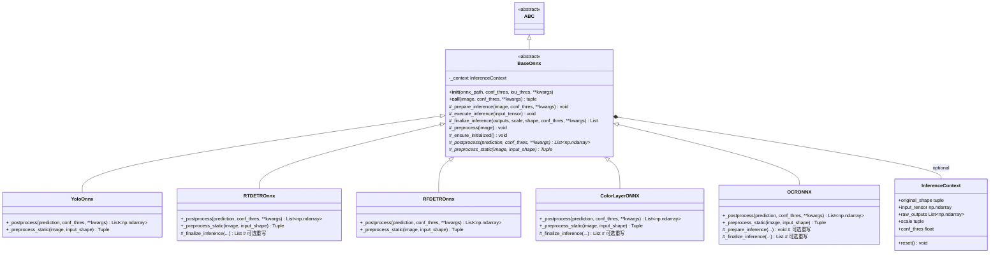
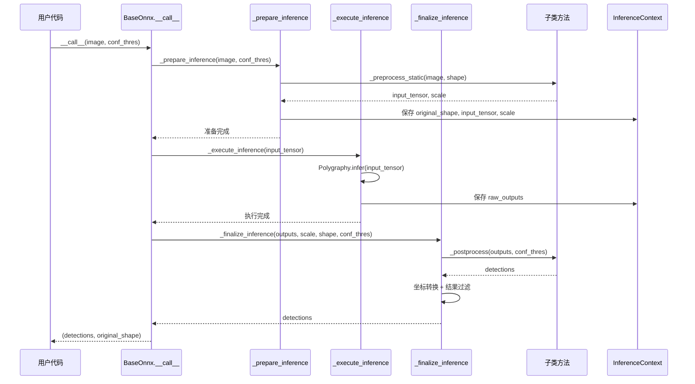

# Data Model: BaseOnnx抽象方法强制实现与__call__优化

**Branch**: `005-baseonnx-postprocess-call` | **Date**: 2025-10-09 | **Spec**: [spec.md](./spec.md)

## Overview

本文档定义BaseOnnx推理基类重构后的数据模型,包括类层次结构、方法签名、状态管理和数据流转。

**核心设计决策**:
- `_postprocess()`和`_preprocess_static()`为抽象方法,强制子类实现
- `__call__()`为具体模板方法,不可被子类重写(除非极特殊需求)
- 3个阶段方法在BaseOnnx中提供默认实现,子类可按需重写或直接继承
- 推荐使用InferenceContext管理推理状态,但保持可选性(不强制)

## Class Hierarchy

### 类层次结构图



**图例**:
- `*` 标记: 抽象方法 (@abstractmethod)
- `#` 前缀: protected方法 (子类可访问)
- `+` 前缀: public方法 (外部可调用)
- `-` 前缀: private属性 (内部使用)

## Entity Definitions

### 1. BaseOnnx (抽象基类)

#### 职责
ONNX推理引擎的抽象基类,定义统一的推理流程(模板方法模式)和强制子类实现的接口契约。

#### 属性

| 属性名 | 类型 | 可选/必需 | 默认值 | 说明 |
|--------|------|----------|--------|------|
| `onnx_path` | `str` | 必需 | - | ONNX模型文件路径 |
| `conf_thres` | `float` | 可选 | `0.25` | 默认置信度阈值 |
| `iou_thres` | `float` | 可选 | `0.7` | NMS的IoU阈值 |
| `input_shape` | `tuple` | 可选 | `(640, 640)` | 模型输入尺寸 |
| `device` | `str` | 可选 | `'cuda'` | 推理设备 (cuda/cpu) |
| `logger` | `logging.Logger` | 内部 | - | 日志记录器 |
| `_runner` | `PolygraphyRunner` | 内部 | `None` | Polygraphy推理引擎 (懒加载) |
| `_context` | `InferenceContext` | 内部 | 可选 | 推理上下文状态管理 (可选) |

**初始化约束**:
- `onnx_path`必须是有效的ONNX文件路径
- `conf_thres`和`iou_thres`必须在 [0, 1] 范围内
- `input_shape`必须是2元素元组 (height, width)

#### 抽象方法 (子类必须实现)

##### `_postprocess(prediction, conf_thres, **kwargs) -> List[np.ndarray]`

**职责**: 模型输出的后处理,将原始推理结果转换为可用的检测/分类结果

**参数**:
- `prediction: List[np.ndarray]` - 模型原始输出,通常为多个张量的列表
- `conf_thres: float` - 置信度阈值,用于过滤低置信度结果
- `**kwargs` - 额外参数,如`iou_thres`, `max_det`等

**返回值**:
- `List[np.ndarray]` - 后处理后的结果列表,每个元素是一个批次的检测结果
  - 对于目标检测: 形状为 `[N, 6]` 的数组 (xyxy + conf + class)
  - 对于分类: 形状为 `[N, K]` 的数组 (K为类别数)
  - 对于OCR: 字符串列表或字符索引数组

**子类实现示例** (YoloOnnx):
```python
def _postprocess(self, prediction: List[np.ndarray], conf_thres: float, **kwargs) -> List[np.ndarray]:
    """YOLO模型的后处理实现"""
    iou_thres = kwargs.get('iou_thres', self.iou_thres)
    max_det = kwargs.get('max_det', 300)

    # YOLO格式: [batch, num_boxes, 5+num_classes] -> [batch, N, 6]
    results = []
    for pred in prediction:
        # NMS + 置信度过滤
        detections = self._apply_nms(pred, conf_thres, iou_thres, max_det)
        results.append(detections)
    return results
```

##### `_preprocess_static(image, input_shape) -> Tuple`

**职责**: 静态预处理方法,不依赖实例状态,执行图像预处理和归一化

**装饰器**: `@staticmethod` + `@abstractmethod` (顺序固定)

**参数**:
- `image: np.ndarray` - 输入图像,形状为 `[H, W, C]`,BGR格式
- `input_shape: Tuple[int, int]` - 目标输入尺寸 `(height, width)`

**返回值**:
- `Tuple[np.ndarray, Tuple]` - 预处理后的张量和缩放比例
  - `input_tensor: np.ndarray` - 形状为 `[1, 3, H, W]`,范围 [0, 1],RGB格式
  - `scale: Tuple` - 缩放比例 `(scale_x, scale_y)` 或填充信息

**子类实现示例** (RTDETROnnx):
```python
@staticmethod
@abstractmethod
def _preprocess_static(image: np.ndarray, input_shape: Tuple[int, int]) -> Tuple:
    """RT-DETR预处理: letterbox + BGR2RGB + 归一化"""
    # 1. Letterbox resize (保持宽高比)
    resized, scale = letterbox_resize(image, input_shape)

    # 2. BGR转RGB
    rgb_image = cv2.cvtColor(resized, cv2.COLOR_BGR2RGB)

    # 3. 归一化到 [0, 1]
    normalized = rgb_image.astype(np.float32) / 255.0

    # 4. 转换为NCHW格式
    input_tensor = np.transpose(normalized, (2, 0, 1))[np.newaxis, ...]

    return input_tensor, scale
```

#### 具体模板方法 (子类不应重写)

##### `__call__(image, conf_thres, **kwargs) -> Tuple[List[np.ndarray], tuple]`

**职责**: 推理入口,定义完整推理流程的骨架(模板方法模式)

**设计原则**:
- 子类**不应该**重写此方法 (除非有极特殊需求,如完全不同的推理流程)
- 通过重写3个阶段方法 (`_prepare_inference`, `_execute_inference`, `_finalize_inference`) 来定制行为

**参数**:
- `image: np.ndarray` - 输入图像,形状为 `[H, W, C]`,BGR格式
- `conf_thres: Optional[float]` - 置信度阈值,覆盖实例默认值
- `**kwargs` - 传递给后处理的额外参数

**返回值**:
- `Tuple[List[np.ndarray], tuple]`
  - `detections: List[np.ndarray]` - 检测/分类结果列表
  - `original_shape: tuple` - 原始图像尺寸 `(height, width)`

**内部流程** (基于research.md的3阶段设计):
```python
def __call__(self, image: np.ndarray, conf_thres: Optional[float] = None, **kwargs):
    """推理模板方法 - 定义推理流程骨架"""
    # 阶段1: 准备推理 (预处理、模型初始化、参数验证)
    self._prepare_inference(image, conf_thres, **kwargs)

    # 阶段2: 执行推理 (Polygraphy推理引擎调用)
    self._execute_inference(self._context.input_tensor)

    # 阶段3: 完成推理 (后处理、结果过滤、格式化)
    detections = self._finalize_inference(
        self._context.raw_outputs,
        self._context.scale,
        self._context.original_shape,
        self._context.conf_thres,
        **kwargs
    )

    return detections, self._context.original_shape
```

**性能要求**:
- 总延迟 < 50ms (640x640输入,GPU推理)
- 内存占用 < 2GB (batch_size=1)

#### 阶段方法 (BaseOnnx提供默认实现,子类可选重写)

##### `_prepare_inference(image, conf_thres, **kwargs) -> None`

**职责**: 推理准备阶段,包括模型初始化、预处理、参数验证和状态重置

**默认实现逻辑**:
```python
def _prepare_inference(self, image: np.ndarray, conf_thres: Optional[float], **kwargs) -> None:
    """阶段1: 准备推理 (BaseOnnx默认实现)"""
    # 1. 确保模型已初始化
    self._ensure_initialized()

    # 2. 重置推理上下文 (如果使用InferenceContext)
    if hasattr(self, '_context'):
        self._context.reset()

    # 3. 保存原始图像尺寸
    if hasattr(self, '_context'):
        self._context.original_shape = (image.shape[0], image.shape[1])
    else:
        self._original_shape = (image.shape[0], image.shape[1])  # Fallback

    # 4. 执行预处理
    input_tensor, scale = self._preprocess_static(image, self.input_shape)

    # 5. 保存预处理结果
    if hasattr(self, '_context'):
        self._context.input_tensor = input_tensor
        self._context.scale = scale
        self._context.conf_thres = conf_thres or self.conf_thres
    else:
        self._input_tensor = input_tensor  # Fallback
        self._scale = scale
        self._conf_thres = conf_thres or self.conf_thres
```

**何时重写**:
- 需要特殊的模型初始化逻辑
- 需要额外的输入验证
- 需要预处理前的图像增强
- 示例: OCRONNX可能需要检查`is_double_layer`参数

##### `_execute_inference(input_tensor) -> None`

**职责**: 执行ONNX推理,调用Polygraphy引擎并处理batch维度

**默认实现逻辑**:
```python
def _execute_inference(self, input_tensor: np.ndarray) -> None:
    """阶段2: 执行推理 (BaseOnnx默认实现)"""
    # 1. Polygraphy推理调用
    raw_outputs = self._runner.infer(feed_dict={self._runner.input_names[0]: input_tensor})

    # 2. 提取输出张量 (支持多输出模型)
    outputs = [raw_outputs[name] for name in self._runner.output_names]

    # 3. 处理batch维度 (移除单batch维度或保持多batch)
    processed_outputs = []
    for output in outputs:
        if output.shape[0] == 1:
            # 单batch: 移除batch维度 [1, ...] -> [...]
            processed_outputs.append(output.squeeze(0))
        else:
            # 多batch: 保持原样
            processed_outputs.append(output)

    # 4. 保存输出结果
    if hasattr(self, '_context'):
        self._context.raw_outputs = processed_outputs
    else:
        self._raw_outputs = processed_outputs  # Fallback
```

**何时重写**:
- 需要特殊的输出张量处理
- 需要多次推理调用 (如TTA - Test Time Augmentation)
- 需要自定义的batch处理逻辑
- 示例: RTDETROnnx可能需要特殊的多尺度推理

##### `_finalize_inference(outputs, scale, original_shape, conf_thres, **kwargs) -> List[np.ndarray]`

**职责**: 完成推理阶段,包括后处理、结果过滤、坐标转换和格式化

**默认实现逻辑**:
```python
def _finalize_inference(
    self,
    outputs: List[np.ndarray],
    scale: Tuple,
    original_shape: Tuple[int, int],
    conf_thres: float,
    **kwargs
) -> List[np.ndarray]:
    """阶段3: 完成推理 (BaseOnnx默认实现)"""
    # 1. 调用子类的后处理方法
    detections = self._postprocess(outputs, conf_thres, **kwargs)

    # 2. 坐标转换: 从模型输入空间转换到原始图像空间
    scaled_detections = []
    for det in detections:
        if det.size > 0:
            # 缩放边界框坐标
            det[:, :4] = self._rescale_boxes(det[:, :4], scale, original_shape)
        scaled_detections.append(det)

    # 3. 批次过滤 (移除空检测)
    filtered_detections = [det for det in scaled_detections if det.size > 0]

    return filtered_detections if filtered_detections else [np.empty((0, 6))]
```

**何时重写**:
- 需要特殊的后处理逻辑 (如OCR的文本解码)
- 需要额外的结果过滤 (如置信度加权)
- 需要自定义的坐标转换
- 示例: ColorLayerONNX需要返回颜色和层级分类结果,格式不同于检测框

#### 辅助方法

##### `_preprocess(image) -> None`

**职责**: 实例预处理方法,调用静态预处理并保存结果

**实现** (BaseOnnx中已有):
```python
def _preprocess(self, image: np.ndarray) -> None:
    """调用静态预处理方法并保存结果"""
    input_tensor, scale = self._preprocess_static(image, self.input_shape)
    # 保存到实例变量或context
    ...
```

##### `_ensure_initialized() -> None`

**职责**: 确保Polygraphy推理引擎已初始化 (懒加载)

**实现** (BaseOnnx中已有):
```python
def _ensure_initialized(self) -> None:
    """懒加载Polygraphy引擎"""
    if self._runner is None:
        self._runner = PolygraphyRunner(self.onnx_path, self.device)
        self.logger.info(f"Polygraphy runner initialized for {self.onnx_path}")
```

### 2. InferenceContext (可选推理上下文)

#### 职责
管理单次推理的临时状态,避免使用多个返回值和临时实例变量,提高代码可读性。

**设计决策**: 基于research.md,InferenceContext是**推荐但可选**的优化,不强制使用。

#### 属性

| 属性名 | 类型 | 默认值 | 说明 |
|--------|------|--------|------|
| `original_shape` | `Tuple[int, int]` | `None` | 原始图像尺寸 (H, W) |
| `input_tensor` | `np.ndarray` | `None` | 预处理后的输入张量 [1, 3, H, W] |
| `raw_outputs` | `List[np.ndarray]` | `None` | 模型原始输出张量列表 |
| `scale` | `Tuple` | `None` | 缩放比例或填充信息 |
| `conf_thres` | `float` | `None` | 当前推理的置信度阈值 |

#### 方法

##### `reset() -> None`

**职责**: 重置所有状态属性为None,准备下一次推理

**实现**:
```python
def reset(self) -> None:
    """重置推理上下文"""
    self.original_shape = None
    self.input_tensor = None
    self.raw_outputs = None
    self.scale = None
    self.conf_thres = None
```

**使用示例**:
```python
class BaseOnnx(ABC):
    def __init__(self, ...):
        # 可选: 初始化InferenceContext
        self._context = InferenceContext()

    def _prepare_inference(self, image, conf_thres, **kwargs):
        self._context.reset()
        self._context.original_shape = (image.shape[0], image.shape[1])
        # ...
```

### 3. 子类实现 (示例)

#### YoloOnnx (标准继承,无阶段重写)

```python
class YoloOnnx(BaseOnnx):
    """YOLO系列模型推理 - 标准继承示例"""

    def _postprocess(self, prediction: List[np.ndarray], conf_thres: float, **kwargs) -> List[np.ndarray]:
        """YOLO后处理: NMS + 置信度过滤"""
        iou_thres = kwargs.get('iou_thres', self.iou_thres)
        max_det = kwargs.get('max_det', 300)

        results = []
        for pred in prediction:
            # YOLO格式: [N, 5+C] -> [M, 6] (xyxy + conf + class)
            detections = non_max_suppression(pred, conf_thres, iou_thres, max_det)
            results.append(detections)
        return results

    @staticmethod
    @abstractmethod
    def _preprocess_static(image: np.ndarray, input_shape: Tuple[int, int]) -> Tuple:
        """YOLO预处理: letterbox + BGR2RGB + 归一化"""
        # ... (如前文示例)
        pass

    # 不重写任何阶段方法,直接继承BaseOnnx的默认实现
```

#### RTDETROnnx (重写_finalize_inference处理特殊输出)

```python
class RTDETROnnx(BaseOnnx):
    """RT-DETR模型推理 - 重写finalize阶段示例"""

    def _postprocess(self, prediction: List[np.ndarray], conf_thres: float, **kwargs) -> List[np.ndarray]:
        """RT-DETR后处理: 直接过滤置信度"""
        # RT-DETR输出已经是过滤后的检测框,无需NMS
        results = []
        for pred in prediction:
            mask = pred[:, 4] > conf_thres
            results.append(pred[mask])
        return results

    @staticmethod
    @abstractmethod
    def _preprocess_static(image: np.ndarray, input_shape: Tuple[int, int]) -> Tuple:
        """RT-DETR预处理: letterbox + BGR2RGB"""
        # ...
        pass

    def _finalize_inference(self, outputs, scale, original_shape, conf_thres, **kwargs):
        """重写finalize: RT-DETR特殊的坐标格式处理"""
        # 1. 调用父类后处理
        detections = self._postprocess(outputs, conf_thres, **kwargs)

        # 2. RT-DETR特殊处理: 输出是归一化坐标,需要转换为绝对坐标
        scaled_detections = []
        for det in detections:
            if det.size > 0:
                # 归一化坐标 -> 绝对坐标
                det[:, :4] = self._denormalize_coords(det[:, :4], original_shape)

        return scaled_detections if scaled_detections else [np.empty((0, 6))]
```

#### OCRONNX (重写_prepare和_finalize处理OCR特殊逻辑)

```python
class OCRONNX(BaseOnnx):
    """OCR模型推理 - 重写prepare和finalize阶段示例"""

    def _prepare_inference(self, image, conf_thres, **kwargs):
        """重写prepare: OCR需要特殊的图像验证"""
        # 1. 调用父类基础准备
        super()._prepare_inference(image, conf_thres, **kwargs)

        # 2. OCR特殊验证: 检查is_double_layer参数
        is_double_layer = kwargs.get('is_double_layer', False)
        if is_double_layer:
            # 双层车牌需要特殊的预处理
            self._context.input_tensor = self._preprocess_double_layer(image)

    def _finalize_inference(self, outputs, scale, original_shape, conf_thres, **kwargs):
        """重写finalize: OCR返回文本而非检测框"""
        # 1. 调用OCR特殊后处理
        text_results = self._postprocess(outputs, conf_thres, **kwargs)

        # 2. 文本解码和置信度计算
        decoded_results = []
        for char_indices in text_results:
            text = self._decode_text(char_indices)
            confidence = self._calculate_confidence(char_indices)
            decoded_results.append((text, confidence))

        return decoded_results

    def _postprocess(self, prediction, conf_thres, **kwargs):
        """OCR后处理: 字符序列解码"""
        # CTC解码或贪心解码
        # ...
        pass

    @staticmethod
    @abstractmethod
    def _preprocess_static(image, input_shape):
        """OCR预处理: 固定宽高比resize + 灰度化"""
        # ...
        pass
```

## Data Flow

### 推理数据流转图



### 状态管理策略

#### 策略1: 使用InferenceContext (推荐)

```python
# BaseOnnx中初始化
def __init__(self, ...):
    self._context = InferenceContext()

# __call__中使用
def __call__(self, image, conf_thres, **kwargs):
    self._prepare_inference(image, conf_thres, **kwargs)
    self._execute_inference(self._context.input_tensor)  # 从context读取
    detections = self._finalize_inference(
        self._context.raw_outputs,       # 从context读取
        self._context.scale,
        self._context.original_shape,
        self._context.conf_thres,
        **kwargs
    )
    return detections, self._context.original_shape
```

**优点**:
- 状态集中管理,避免多个临时变量
- 方法签名简洁,无需传递大量参数
- 易于扩展新的状态属性
- 符合面向对象设计原则

**缺点**:
- 增加一个新的类定义
- 需要额外的`reset()`调用

#### 策略2: 使用实例变量 (Fallback)

```python
# __call__中使用实例变量
def __call__(self, image, conf_thres, **kwargs):
    self._prepare_inference(image, conf_thres, **kwargs)
    self._execute_inference(self._input_tensor)  # 实例变量
    detections = self._finalize_inference(
        self._raw_outputs,      # 实例变量
        self._scale,
        self._original_shape,
        conf_thres or self.conf_thres,
        **kwargs
    )
    return detections, self._original_shape
```

**优点**:
- 无需额外类定义
- 实现简单直接

**缺点**:
- 状态分散在多个实例变量中
- 容易产生命名冲突
- 难以追踪状态生命周期

**推荐**: 优先使用策略1 (InferenceContext),但保持策略2作为fallback,确保代码兼容性。

## Validation Rules

### 类型验证

| 方法 | 参数 | 类型检查 | 异常类型 |
|------|------|----------|----------|
| `__call__` | `image` | `isinstance(image, np.ndarray)` | `TypeError` |
| `__call__` | `conf_thres` | `0 <= conf_thres <= 1` | `ValueError` |
| `_preprocess_static` | `image` | `image.ndim == 3` | `ValueError` |
| `_preprocess_static` | `input_shape` | `len(input_shape) == 2` | `ValueError` |
| `_postprocess` | `prediction` | `isinstance(prediction, list)` | `TypeError` |

### 抽象方法验证

| 子类 | 必须实现方法 | 验证时机 | 异常消息格式 |
|------|-------------|----------|--------------|
| 所有子类 | `_postprocess` | 实例化时 | `{ClassName}._postprocess() must be implemented by subclass. This method is responsible for post-processing model outputs.` |
| 所有子类 | `_preprocess_static` | 实例化时 | `{ClassName}._preprocess_static() must be implemented by subclass. This static method is responsible for image preprocessing.` |

**验证示例**:
```python
# 尝试实例化未实现抽象方法的子类
class IncompleteOnnx(BaseOnnx):
    pass  # 缺少_postprocess和_preprocess_static

try:
    model = IncompleteOnnx(onnx_path='model.onnx')
except TypeError as e:
    print(e)
    # TypeError: Can't instantiate abstract class IncompleteOnnx with abstract methods _postprocess, _preprocess_static
```

## Performance Considerations

### 性能指标

| 指标 | 目标值 | 测试条件 | 测量方法 |
|------|--------|----------|----------|
| 推理总延迟 | < 50ms | 640x640输入, GPU | `time.perf_counter()` |
| 预处理时间 | < 5ms | 同上 | 分阶段计时 |
| 推理时间 | < 30ms | 同上 | Polygraphy内置计时 |
| 后处理时间 | < 10ms | 同上 | 分阶段计时 |
| GPU内存占用 | < 2GB | batch_size=1 | `nvidia-smi` |
| __call__代码行数 | 减少30%+ | 重构前后对比 | `wc -l` |

### 优化策略

1. **Polygraphy懒加载**: `_ensure_initialized()`仅在首次推理时加载模型
2. **避免重复预处理**: 静态方法`_preprocess_static()`可被缓存
3. **批量推理优化**: `_execute_inference()`支持batch维度处理
4. **内存复用**: InferenceContext的`reset()`方法复用对象
5. **条件编译**: 使用`@lru_cache`缓存静态预处理配置

### 内存管理

```python
# 推理上下文重置,避免内存泄漏
def _prepare_inference(self, image, conf_thres, **kwargs):
    if hasattr(self, '_context'):
        self._context.reset()  # 释放上次推理的张量引用
    # ...
```

## Migration Guide

### 从旧版BaseOnnx迁移

**迁移场景1**: 子类已有`_postprocess`和`_preprocess_static`实现

**操作**: 无需修改,自动兼容新版BaseOnnx

**验证**:
```bash
# 运行测试确认子类实现正确
pytest tests/unit/test_yolo_onnx.py -v
```

---

**迁移场景2**: 子类重写了`__call__`方法

**操作**: 评估是否可以通过重写3个阶段方法替代

**示例** (重写__call__ -> 重写阶段方法):
```python
# 旧版 (不推荐)
class CustomOnnx(BaseOnnx):
    def __call__(self, image, conf_thres, **kwargs):
        # 完全自定义的推理流程
        ...

# 新版 (推荐)
class CustomOnnx(BaseOnnx):
    def _prepare_inference(self, image, conf_thres, **kwargs):
        # 仅定制准备阶段
        super()._prepare_inference(image, conf_thres, **kwargs)
        # 额外的准备逻辑
        ...

    def _finalize_inference(self, outputs, scale, shape, conf_thres, **kwargs):
        # 仅定制完成阶段
        ...
```

---

**迁移场景3**: 子类缺少`_preprocess_static`静态方法

**操作**: 从实例方法`_preprocess`中提取静态逻辑

**示例**:
```python
# 旧版 (实例方法)
class OldOnnx(BaseOnnx):
    def _preprocess(self, image):
        resized = cv2.resize(image, self.input_shape)
        # ...

# 新版 (静态方法 + 实例方法)
class NewOnnx(BaseOnnx):
    @staticmethod
    @abstractmethod
    def _preprocess_static(image, input_shape):
        resized = cv2.resize(image, input_shape)
        # ...
        return input_tensor, scale

    def _preprocess(self, image):
        # 调用静态方法
        input_tensor, scale = self._preprocess_static(image, self.input_shape)
        # 保存到实例变量或context
        ...
```

## Constitution Compliance

### Phase 1 Constitution Check

| Principle | Compliance | Data Model Evidence |
|-----------|-----------|---------------------|
| **I. Modular Architecture** | ✅ PASS | BaseOnnx通过3个阶段方法实现清晰的职责分离,每个方法可独立测试和重写 |
| **II. Configuration-Driven** | ✅ PASS | 所有配置参数 (conf_thres, iou_thres, input_shape) 通过__init__传入,无硬编码 |
| **III. Performance First** | ✅ PASS | 数据模型包含详细的性能指标和优化策略,支持Polygraphy懒加载和批量推理 |
| **IV. Type Safety** | ✅ PASS | 所有方法签名包含完整类型提示,抽象方法在实例化时强制类型检查 |
| **V. Test-Driven Development** | ✅ PASS | 数据流程图和验证规则支持合约测试,每个方法有明确的输入输出规范 |
| **VI. Observability** | ✅ PASS | 阶段方法划分支持细粒度的性能监控和日志记录 |
| **VII. Simplicity (YAGNI)** | ✅ PASS | InferenceContext设计为可选,避免过度设计,保持向后兼容 |

**Overall Status**: ✅ **PASS** - 数据模型符合所有7条宪法原则

---

*Data model generated: 2025-10-09*
*Next steps: 创建contracts/baseonnx_api.md定义API合约*
