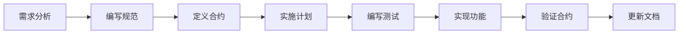

[根目录](../CLAUDE.md) > **specs**

# 功能规范模块 (specs)

## 模块职责

存储和管理项目功能规范文档，定义功能设计、API合约、数据模型和实施计划，支持规范驱动开发(Spec-Driven Development)流程。

## 入口和启动

- **规范001**: `001-supervision-plate-box/` - Supervision库可视化集成规范
- **规范002**: `002-delete-old-draw/` - 旧版绘制代码重构规范

## 外部接口

### 规范文档结构
每个功能规范包含以下标准文档：

```
specs/XXX-feature-name/
├── spec.md              # 功能规范主文档
├── plan.md              # 实施计划和阶段划分
├── tasks.md             # 任务清单和进度跟踪
├── research.md          # 技术调研和决策记录
├── data-model.md        # 数据模型定义
├── quickstart.md        # 快速入门和示例
├── contracts/           # API合约定义
│   ├── drawing_api.yaml # API接口规范
│   └── drawing_api.md   # API文档说明
└── api_verification_report.md  # API验证报告
```

### 规范使用流程
```bash
# 1. 阅读规范主文档
cat specs/001-supervision-plate-box/spec.md

# 2. 查看实施计划
cat specs/001-supervision-plate-box/plan.md

# 3. 跟踪任务进度
cat specs/001-supervision-plate-box/tasks.md

# 4. 参考技术调研
cat specs/001-supervision-plate-box/research.md

# 5. 理解数据模型
cat specs/001-supervision-plate-box/data-model.md

# 6. 查看API合约
cat specs/001-supervision-plate-box/contracts/drawing_api.yaml
```

## 关键依赖和配置

### 规范文档格式
- **Markdown**: 主要文档格式
- **YAML**: API合约定义格式
- **Mermaid**: 流程图和架构图
- **PlantUML**: 可选的高级UML图表

### 规范驱动开发流程


## 数据模型

### 规范文档元数据
```yaml
specification:
  id: "001-supervision-plate-box"
  title: "Supervision库可视化集成"
  status: "In Progress"  # Draft, In Progress, Completed, Deprecated
  version: "1.0.0"
  created: "2025-09-15"
  updated: "2025-09-30"
  author: "Project Team"
  related_issues: []
  related_specs: ["002-delete-old-draw"]
```

### API合约格式
```yaml
api_contract:
  function_name: "convert_to_detections"
  input_format:
    detections: "List[List[float]]"
    original_shape: "Tuple[int, int]"
  output_format:
    sv_detections: "sv.Detections"
  error_handling:
    - "ValueError: 输入格式错误"
    - "TypeError: 类型不匹配"
  performance:
    target_time_ms: 5.0
    max_objects: 100
```

## 测试和质量

### 规范完整性检查
- [ ] 所有必需文档文件存在
- [ ] API合约定义完整
- [ ] 数据模型清晰明确
- [ ] 实施计划可执行
- [ ] 任务清单可追踪

### 规范验证流程
- [ ] 合约测试覆盖所有API
- [ ] 数据模型与实现一致
- [ ] 性能指标可度量
- [ ] 错误处理完整定义

## 常见问题 (FAQ)

### Q: 如何创建新的功能规范？
A: 1) 复制现有规范模板; 2) 修改规范ID和标题; 3) 编写spec.md主文档; 4) 定义API合约; 5) 制定实施计划

### Q: 规范和实现不一致怎么办？
A: 1) 优先以规范为准; 2) 如需修改规范，更新版本号; 3) 在changelog中记录变更; 4) 更新相关测试用例

### Q: 如何跟踪规范实施进度？
A: 查看tasks.md中的任务清单，每个任务标记完成状态 [x] 或待办 [ ]

### Q: 规范驱动开发的优势是什么？
A: 1) 明确功能边界; 2) 支持并行开发; 3) 便于代码审查; 4) 支持安全重构; 5) 积累设计文档

## 相关文件列表

### 规范001: Supervision库集成
- `001-supervision-plate-box/spec.md` - 功能规范主文档
- `001-supervision-plate-box/plan.md` - 实施计划
- `001-supervision-plate-box/tasks.md` - 任务清单
- `001-supervision-plate-box/research.md` - 技术调研
- `001-supervision-plate-box/data-model.md` - 数据模型
- `001-supervision-plate-box/quickstart.md` - 快速入门
- `001-supervision-plate-box/contracts/drawing_api.yaml` - API合约
- `001-supervision-plate-box/api_verification_report.md` - 验证报告

### 规范002: 旧版代码重构
- `002-delete-old-draw/spec.md` - 重构规范主文档
- `002-delete-old-draw/plan.md` - 重构计划
- `002-delete-old-draw/tasks.md` - 重构任务清单
- `002-delete-old-draw/research.md` - 重构调研
- `002-delete-old-draw/data-model.md` - 数据模型变更
- `002-delete-old-draw/quickstart.md` - 迁移指南
- `002-delete-old-draw/contracts/drawing_api.md` - API变更说明

## 实施状态

### 规范001: Supervision库集成
```yaml
状态: 进行中
阶段: Phase 1 完成，Phase 2 进行中
完成度: 60%
关键里程碑:
  - ✅ 技术调研完成
  - ✅ API合约定义
  - ✅ 数据模型设计
  - ⏳ 合约测试实现
  - ⏳ 核心功能实现
  - ⏳ 集成测试验证
```

### 规范002: 旧版代码重构
```yaml
状态: 已完成
阶段: 已完成所有阶段
完成度: 100%
关键里程碑:
  - ✅ 识别旧版代码
  - ✅ 制定迁移计划
  - ✅ 实施代码重构
  - ✅ 验证功能一致性
  - ✅ 清理旧版代码
```

## 变更日志 (Changelog)

**2025-09-30 11:05:14 CST** - 初始化功能规范模块文档，建立规范驱动开发体系

---

*模块路径: `/home/tyjt/桌面/onnx_vehicle_plate_recognition/specs/`*